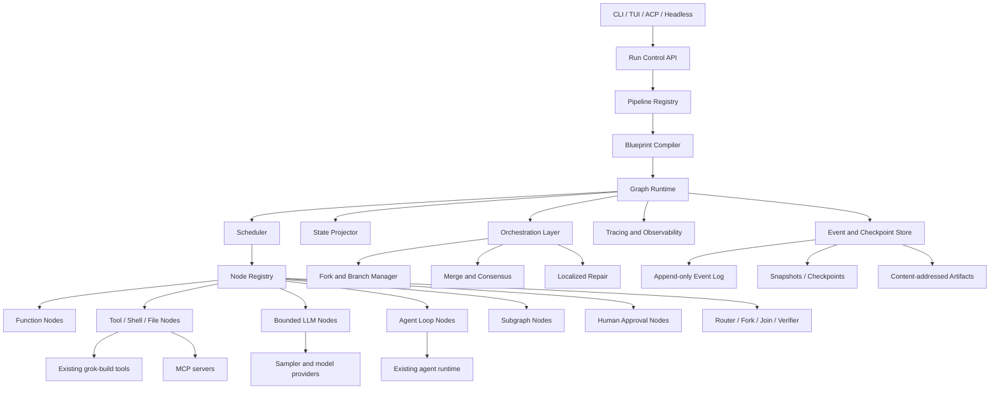
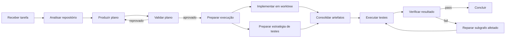

# Arquitetura sintetizada — Goblin Graph Runtime para o fork grok-build

## 1. Resumo executivo

A recomendação é evoluir o fork para um **runtime de workflows baseado em grafos**, mantendo o loop conversacional atual como um tipo de nó compatível, e não como o controlador principal do sistema.

A arquitetura deve ter:

1. **Core de produção em Rust**, integrado ao runtime Tokio e aos recursos existentes do grok-build.
2. **Representação canônica e versionada de pipelines**, independente da linguagem.
3. **Execução orientada a eventos**, com checkpoints, retomada, auditoria e forks.
4. **Nós LLM delimitados**, com entradas, saídas, permissões e orçamento explícitos.
5. **Prototipagem em TypeScript**, usando exatamente os mesmos schemas e casos de conformidade do runtime Rust.
6. **Orquestração multiagente como camada superior**, adicionada depois que o executor básico estiver estável.

## Essa direção consolida as propostas recorrentes dos documentos: grafos explícitos, execução paralela controlada, reparo localizado, event sourcing, prototipagem TS seguida de port para Rust e integração com TUI, ACP, tools, MCP e subagentes.

## 2. Princípios arquiteturais

### 2.1 Graph-first, não graph-only

O grafo passa a controlar o fluxo principal, mas preserva o agente conversacional existente como um `AgentLoopNode`.

Isso permite executar:

* funções determinísticas;
* ferramentas;
* chamadas LLM delimitadas;
* loops agentic completos;
* subgrafos;
* gates humanos;
* branches paralelos;
* validadores e reparadores.

A evolução conceitual fica organizada em três níveis:

| Nível                   | Responsabilidade                                                                 |
| ----------------------- | -------------------------------------------------------------------------------- |
| **Loop Layer**          | Executa um agente conversacional ou ReAct dentro de limites definidos.           |
| **Graph Layer**         | Controla dependências, estado, condicionais, ciclos, paralelismo e persistência. |
| **Orchestration Layer** | Coordena múltiplos agentes, forks, votação, confiança, síntese e quality gates.  |

Essa divisão incorpora a ideia de “graph of loops”: loops especializados permanecem úteis, mas passam a ser compostos por um grafo superior observável e controlável.

### 2.2 Explicit over implicit

Dependências, efeitos, permissões, critérios de conclusão e políticas de erro devem ser declarados no blueprint.

O modelo não deve decidir livremente:

* quais ferramentas pode usar;
* quando uma tarefa terminou;
* quantas vezes pode repetir uma ação;
* quais branches pode criar;
* quais arquivos ou sistemas pode alterar;
* como uma falha deve ser recuperada.

### 2.3 Determinismo seletivo

O objetivo não é tornar modelos probabilísticos determinísticos. O objetivo é tornar determinísticos:

* o controle de fluxo;
* a passagem de dados;
* a política de retry;
* os limites de custo;
* a aplicação de permissões;
* o armazenamento dos resultados;
* a reconstrução do estado;
* a invalidação causada por uma falha.

Resultados de LLMs e ferramentas externas devem ser registrados como artefatos. Um replay reconstrói a execução usando os resultados registrados; uma nova chamada ao modelo é uma **nova tentativa ou novo branch**, e não o mesmo replay.

### 2.4 Estado explícito e escopado

O sistema não deve usar um grande objeto JSON compartilhado por todos os nós. O estado deve ser dividido em:

* **Run input:** entrada imutável da execução.
* **Run state:** valores compartilhados e controlados por reducers.
* **Branch state:** alterações específicas de um fork.
* **Node state:** dados temporários de uma tentativa.
* **Artifact store:** arquivos, patches, respostas, planos e resultados maiores.
* **Secret context:** credenciais e tokens nunca serializados no estado comum.

### 2.5 Runtime estável, inteligência plugável

ATG, GATS, Tree of Thoughts, Graph of Thoughts, AFlow e outros métodos devem ser implementados como **planners, compiladores ou estratégias plugáveis**, não embutidos no núcleo do executor.

O runtime deve saber executar um grafo. Um planner opcional deve saber produzir ou alterar um grafo. A taxonomia de métodos pesquisada serve como catálogo de estratégias, não como dependência obrigatória do MVP.

---

## 3. Visão geral da arquitetura



---

## 4. Modelo canônico de grafos

O sistema deve possuir uma **Graph Intermediate Representation — Graph IR**. Ela será o contrato compartilhado por Rust, TypeScript, CLI, TUI, ACP e arquivos declarativos.

### 4.1 Entidades principais

```rust
pub struct GraphBlueprint {
    pub schema_version: String,
    pub graph_id: GraphId,
    pub graph_version: String,
    pub input_schema: JsonSchema,
    pub state_schema: JsonSchema,
    pub nodes: Vec<NodeSpec>,
    pub edges: Vec<EdgeSpec>,
    pub policies: GraphPolicies,
    pub metadata: GraphMetadata,
}

pub struct NodeSpec {
    pub id: NodeId,
    pub kind: NodeKind,
    pub action_class: Option<ActionClass>,
    pub executor_ref: ExecutorRef,
    pub inputs: Vec<InputBinding>,
    pub outputs: Vec<OutputSpec>,
    pub capabilities: CapabilitySet,
    pub effects: EffectDeclaration,
    pub isolation: IsolationPolicy,
    pub timeout: Option<Duration>,
    pub retry: RetryPolicy,
    pub budget: NodeBudget,
}

pub struct EdgeSpec {
    pub from: NodePort,
    pub to: NodePort,
    pub kind: EdgeKind,
    pub guard: Option<GuardExpression>,
    pub mapping: Option<DataMapping>,
}
```

### 4.2 Separar `NodeKind` de `ActionClass`

Essa separação evita acoplar a taxonomia semântica ao runtime.

**`NodeKind`** descreve como algo executa:

* `Function`
* `Tool`
* `Llm`
* `AgentLoop`
* `Subgraph`
* `Router`
* `Fork`
* `Join`
* `Verifier`
* `HumanGate`
* `Checkpoint`

**`ActionClass`** descreve o propósito da ação:

* grounding;
* planning;
* decomposition;
* execution;
* tool use;
* evaluation;
* reflection;
* synthesis;
* routing;
* boundary checking.

A taxonomia pode evoluir e ganhar dezenas de categorias sem alterar o executor. Os documentos sugerem Act·ONOMY e taxonomias específicas de coding agents como fontes para essa classificação.

### 4.3 Tipos de arestas

| Aresta         | Semântica                                                               |
| -------------- | ----------------------------------------------------------------------- |
| `Data`         | Transfere um output tipado para a entrada de outro nó.                  |
| `Dependency`   | Exige a conclusão do nó anterior, sem necessariamente transferir dados. |
| `Conditional`  | Executa o destino quando uma expressão sobre o estado for verdadeira.   |
| `Event`        | Ativa um nó em resposta a um evento específico.                         |
| `Error`        | Direciona falhas para fallback, reparo ou compensação.                  |
| `LoopBack`     | Retorna a um estado anterior, sempre com condição e limite explícitos.  |
| `Compensation` | Executa uma ação compensatória para efeitos já aplicados.               |

### 4.4 Imutabilidade e versionamento

Um `GraphBlueprint` publicado deve ser imutável. Alterações criam uma nova versão.

Grafos dinâmicos não devem editar silenciosamente a definição ativa. Uma expansão ou reparo estrutural deve produzir:

1. um evento `GraphRevisionProposed`;
2. uma nova versão derivada;
3. validação pelo compilador;
4. aprovação automática ou humana conforme a política;
5. continuação da execução na nova versão.

---

## 5. Compilação de blueprints

O pipeline declarativo não deve ser executado diretamente. Ele passa por um compilador:

```text
Blueprint → Parse → Schema Validation → Semantic Validation
          → Capability Validation → Dependency Analysis
          → Execution Plan → Registered Graph Version
```

### 5.1 Validações obrigatórias

O compilador deve rejeitar:

* entradas obrigatórias sem produtor;
* tipos incompatíveis entre portas;
* ciclos sem condição de saída e limite;
* múltiplas escritas concorrentes no mesmo recurso;
* nós sem executor registrado;
* ferramentas sem capabilities autorizadas;
* branches sem estratégia de merge;
* retries de operações irreversíveis sem chave de idempotência;
* custos ou paralelismo acima dos limites do grafo.

### 5.2 Formato de autoria

Recomendação:

* **YAML** para autoria humana.
* **JSON Schema** como contrato.
* **JSON canônico** para hashing, persistência e comunicação.
* Builder Rust e TypeScript como interfaces adicionais.

TOML pode continuar disponível para configurações, mas YAML é mais adequado para grafos aninhados e bindings.

---

## 6. Runtime e máquina de execução

### 6.1 Estado dos nós

```text
Pending
  ↓
Ready
  ↓
Running
  ├── Succeeded
  ├── Failed
  ├── WaitingHuman
  ├── Cancelled
  ├── Skipped
  └── Compensated
```

Cada execução de um nó cria um `NodeAttempt`. Retries nunca sobrescrevem tentativas anteriores.

### 6.2 Scheduler

O scheduler inicial deve combinar:

* resolução de dependências;
* fila de nós prontos;
* prioridade;
* limites por provider, ferramenta e workspace;
* semáforos Tokio;
* cancelamento cooperativo;
* timeout;
* backpressure;
* fairness entre execuções.

Para DAGs, usa-se ordenação topológica incremental. Para StateGraphs, o scheduler processa transições habilitadas. Subgrafos são executados como runs filhos, preservando lineage.

### 6.3 Modos de execução

| Modo                | Características                                                             |
| ------------------- | --------------------------------------------------------------------------- |
| **Strict**          | Grafo fixo, routing determinístico e nenhuma expansão por LLM.              |
| **Bounded agentic** | Nós LLM e loops permitidos, mas com schemas, budgets e rotas predefinidas.  |
| **Exploratory**     | Forks, geração de candidatos e alterações de grafo sob limites e validação. |

O modo recomendado como padrão é **bounded agentic**.

---

## 7. Event sourcing, checkpoints e replay

### 7.1 Event log como fonte de verdade

Eventos mínimos:

* `RunCreated`
* `GraphVersionSelected`
* `NodeBecameReady`
* `NodeStarted`
* `ToolRequested`
* `ModelRequested`
* `ArtifactProduced`
* `NodeSucceeded`
* `NodeFailed`
* `RetryScheduled`
* `BranchForked`
* `MergeStarted`
* `ApprovalRequested`
* `CheckpointCreated`
* `RunPaused`
* `RunCompleted`

Cada evento deve carregar:

```text
run_id
graph_id
graph_version
branch_id
node_id
attempt_id
event_id
parent_event_id
timestamp
payload_schema_version
```

### 7.2 Três operações distintas

* **Replay:** reconstrói o que aconteceu sem repetir efeitos.
* **Resume:** continua do último estado confirmado.
* **Re-execute:** cria uma nova tentativa ou branch e pode chamar novamente modelos e ferramentas.

Essa distinção evita a promessa incorreta de replay determinístico de chamadas LLM ou APIs externas.

### 7.3 Persistência recomendada

Para a primeira versão:

* **SQLite com WAL** para runs, eventos, tentativas, versões e checkpoints.
* Artefatos grandes armazenados por hash em `.goblin/artifacts/`.
* JSONL como formato de exportação e diagnóstico.
* Snapshots periódicos da projeção para evitar reconstruir logs muito grandes.

PostgreSQL e object storage podem ser adicionados quando houver execução distribuída.

---

## 8. Artefatos e efeitos colaterais

### 8.1 Artifact layer

Planos, patches, logs, relatórios, resultados de testes e respostas de modelos devem ser tratados como artefatos endereçados por conteúdo.

```rust
pub struct ArtifactRef {
    pub digest: Sha256Digest,
    pub media_type: String,
    pub size: u64,
    pub logical_name: Option<String>,
    pub producer: NodeAttemptId,
}
```

### 8.2 Declaração de efeitos

Cada nó declara seu perfil:

* leitura de workspace;
* escrita de workspace;
* execução de shell;
* acesso de rede;
* chamada de provider;
* alteração de Git;
* chamada de sistema externo;
* operação irreversível.

Isso permite aplicar least privilege, detectar conflitos entre branches e decidir o isolamento necessário.

---

## 9. Fork, merge e reparo localizado

### 9.1 Fork lógico

Um fork deve compartilhar:

* prefixo do event log;
* artefatos imutáveis;
* definição do grafo;
* snapshot do estado no ponto de origem.

Após o fork, cada branch possui estado e tentativas próprios.

### 9.2 Isolamento

| Cenário                            | Isolamento                                |
| ---------------------------------- | ----------------------------------------- |
| Planejamento, pesquisa e avaliação | Tokio tasks no mesmo processo.            |
| Chamadas a modelos independentes   | Mesmo processo, com limites por provider. |
| Alterações concorrentes de código  | Git worktrees separados.                  |
| Ferramentas não confiáveis         | Processo ou container isolado.            |
| Operações externas irreversíveis   | Gate humano ou política de aprovação.     |

### 9.3 Estratégias de merge

* reducer determinístico;
* união de resultados;
* votação;
* seleção por score;
* síntese por LLM seguida de verifier;
* merge de patches Git com detecção de conflitos;
* escolha humana.

Um merge baseado exclusivamente em LLM não deve ser aceito para mudanças de código sem validação posterior.

### 9.4 Localized repair

O mecanismo de reparo deve usar:

* dependências de dados;
* artefatos produzidos;
* recursos lidos e escritos;
* nós downstream;
* histórico das tentativas.

Fluxo:

```text
Falha
  → classificar falha
  → determinar região afetada
  → preservar resultados ainda válidos
  → escolher retry, fallback, compensation ou branch
  → reexecutar apenas o subgrafo invalidado
  → executar validadores novamente
```

## Reparo localizado, decomposição em tarefas e execução paralela são temas centrais nas propostas consolidadas.

## 10. Integração com o fork grok-build

O fork já é descrito nos documentos como um harness Rust com TUI, shell, tools, workspace, sandbox, ACP, headless, skills, hooks, plugins e MCP. A nova arquitetura deve envolver essas capacidades por adapters, sem reimplementá-las.

### 10.1 Adapters principais

| Componente atual                  | Integração proposta                                        |
| --------------------------------- | ---------------------------------------------------------- |
| Sampler e providers               | Executor de `LlmNode` e `AgentLoopNode`.                   |
| Tools, shell e edição de arquivos | Executors de `ToolNode`.                                   |
| MCP                               | Registro dinâmico de executors com schemas e capabilities. |
| Skills                            | Subgrafos, templates de nós ou executors especializados.   |
| Workspace                         | Contexto de execução e artifact resolver.                  |
| Sandbox                           | Aplicação da política de isolamento do nó.                 |
| Subagentes                        | `AgentLoopNode` ou run filho de um subgrafo.               |
| ACP/headless                      | API de criação, observação e controle de runs.             |
| TUI/pager                         | Visualização do grafo, timeline, artefatos e controles.    |

### 10.2 CLI proposta

```bash
goblin graph validate pipelines/implement-feature.yaml
goblin graph run pipelines/implement-feature.yaml --input task.json
goblin graph inspect <run-id>
goblin graph resume <run-id>
goblin graph fork <run-id> --at <event-id>
goblin graph cancel <run-id>
goblin graph export <run-id> --format mermaid
```

### 10.3 TUI

A interface deve possuir quatro visões:

1. **Graph:** nós, estados e branches.
2. **Timeline:** eventos ordenados e lineage.
3. **Inspector:** inputs, outputs, capabilities, custos e erros do nó.
4. **Artifacts:** patches, arquivos, planos, testes e diffs.

Ações interativas:

* pause/resume;
* retry;
* skip autorizado;
* criar fork;
* aprovar gate;
* selecionar branch;
* inspecionar prompt e tool call;
* abrir diff produzido.

---

## 11. Organização recomendada no repositório

Para evitar fragmentação prematura, começar com três crates:

```text
crates/
  xai-grok-graph/
    src/
      model/
      compiler/
      runtime/
      scheduler/
      state/
      events/
      validation/

  xai-grok-graph-store/
    src/
      sqlite/
      artifacts/
      checkpoints/
      projections/

  xai-grok-orchestrator/
    src/
      fork/
      merge/
      repair/
      consensus/
      planners/

prototypes/
  graph-lab-ts/
    src/
    fixtures/
    conformance-tests/

pipelines/
  implement-feature.yaml
  investigate-bug.yaml
  review-patch.yaml

docs/
  architecture/
  adr/
  pipeline-schema/
```

As integrações de CLI e TUI permanecem nos crates existentes do binário, consumindo APIs desses novos componentes.

---

## 12. Estratégia TypeScript → Rust

O protótipo TypeScript não deve se transformar em um segundo runtime de produção independente.

Ele deve funcionar como laboratório para:

* testar semântica de grafos;
* comparar schedulers;
* validar routing;
* visualizar execuções;
* experimentar planners;
* criar fixtures;
* validar ergonomia do blueprint.

Rust e TypeScript devem compartilhar:

* JSON Schema;
* blueprints de teste;
* sequência esperada de eventos;
* testes de invalidação;
* resultados esperados do scheduler.

Quando um comportamento for validado, ele é implementado no runtime Rust e submetido aos mesmos testes de conformidade.

Hot reload inicial deve ocorrer no laboratório TS e em executors externos. Carregamento de `cdylib` Rust com estado compartilhado não deve fazer parte do MVP devido à complexidade de ABI e segurança. WASM pode ser avaliado posteriormente para nós scriptáveis.

---

## 13. Pipeline vertical inicial

O primeiro pipeline deve resolver um caso real e exercitar o núcleo:



### Blueprint conceitual

```yaml
schema_version: goblin.graph/v1
id: implement-feature
version: 0.1.0
mode: bounded-agentic

policies:
  max_parallel_nodes: 4
  max_total_model_calls: 20
  max_repair_cycles: 3

nodes:
  - id: analyze
    kind: tool
    action_class: grounding
    executor: workspace.analyze
    capabilities: [workspace.read]

  - id: plan
    kind: llm
    action_class: planning
    executor: model.structured
    input_schema: schemas/implementation-plan.json
    output_schema: schemas/implementation-plan.json

  - id: approve_plan
    kind: verifier
    action_class: evaluation
    executor: verifier.plan

  - id: implement
    kind: agent_loop
    action_class: execution
    executor: agent.coder
    isolation: git_worktree
    capabilities:
      - workspace.read
      - workspace.write
      - shell.execute
    budget:
      max_turns: 12

  - id: tests
    kind: tool
    action_class: evaluation
    executor: shell.test
    retry:
      max_attempts: 1

  - id: repair
    kind: subgraph
    action_class: reflection
    executor: graphs.localized-repair
    budget:
      max_invocations: 3

edges:
  - from: analyze.output
    to: plan.context
    kind: data

  - from: plan.output
    to: approve_plan.plan
    kind: data

  - from: approve_plan.approved
    to: implement.input
    kind: conditional
    guard: value == true

  - from: implement.patch
    to: tests.workspace_patch
    kind: data

  - from: tests.result
    to: repair.failure
    kind: error
```

---

## 14. Roadmap recomendado

### Fase 0 — Contratos e ADRs

Entregas:

* Graph IR v1;
* schemas de eventos;
* semântica de replay, resume e re-execute;
* modelo de capabilities e efeitos;
* ADR sobre SQLite, YAML e artifacts;
* fixtures compartilhadas entre Rust e TS.

### Fase 1 — Executor determinístico mínimo

Entregas:

* parser e compilador;
* DAG scheduler;
* `FunctionNode`, `ToolNode`, `LlmNode`, `RouterNode` e `VerifierNode`;
* event log SQLite;
* CLI `validate`, `run` e `inspect`;
* limites de timeout, retry e paralelismo.

Critério de conclusão: executar um pipeline após reinício do processo, reconstruindo seu estado somente a partir do storage.

### Fase 2 — Integração com o harness

Entregas:

* adapters para sampler, tools, shell, workspace e MCP;
* `AgentLoopNode`;
* checkpoints;
* pause/resume;
* visualização básica na TUI;
* streaming de eventos via ACP/headless.

### Fase 3 — Fork, merge e repair

Entregas:

* branch manager;
* copy-on-write lógico;
* worktrees;
* reducers;
* merge de patches;
* localized repair;
* visualização de lineage.

### Fase 4 — Graph of Loops e multiagente

Entregas:

* subgrafos;
* supervisor-worker;
* voting e confidence scoring;
* quality gates;
* budgets por agente;
* execução hierárquica.

### Fase 5 — Planners experimentais

Entregas:

* planner de decomposição inspirado em ATG;
* busca e exploração inspiradas em GATS/ToT/GoT;
* geração guardada de grafos;
* destilação de execuções em blueprints reutilizáveis;
* análise histórica para sugerir otimizações.

---

## 15. Decisões que devem ser fixadas agora

| Decisão                            | Recomendação                                                     |
| ---------------------------------- | ---------------------------------------------------------------- |
| Controlador principal              | Grafo explícito.                                                 |
| Compatibilidade com o agente atual | Encapsulá-lo como `AgentLoopNode`.                               |
| Runtime de produção                | Rust + Tokio.                                                    |
| Prototipagem                       | TypeScript com IR e testes compartilhados.                       |
| Persistência inicial               | SQLite WAL + artifact store local.                               |
| Autoria                            | YAML validado por JSON Schema.                                   |
| Estado                             | Escopado, tipado e projetado de eventos.                         |
| Replay                             | Reutiliza outputs registrados; não repete efeitos.               |
| Grafos dinâmicos                   | Somente por revisão versionada e validada.                       |
| Segurança                          | Capabilities e efeitos declarados por nó.                        |
| Concorrência de código             | Git worktrees.                                                   |
| Taxonomia                          | Metadado semântico separado do tipo executável.                  |
| Hot reload Rust                    | Fora do MVP; avaliar WASM posteriormente.                        |
| Self-evolving workflows            | Somente depois de runtime, observabilidade e avaliação estáveis. |

---

## 16. O que não implementar no MVP

Para evitar que o projeto vire uma plataforma abstrata antes de executar um caso real, a primeira versão não deve incluir:

* editor visual completo;
* knowledge graph geral;
* execução distribuída;
* PostgreSQL obrigatório;
* geração irrestrita de grafos por LLM;
* 120 categorias de ações codificadas no runtime;
* consenso multiagente complexo;
* hot swap de bibliotecas Rust;
* otimização autônoma de workflows;
* compatibilidade com todos os formatos declarativos;
* rollback automático de efeitos externos irreversíveis.

---

## 17. Critérios arquiteturais de sucesso

A arquitetura estará validada quando conseguir:

1. Executar o mesmo blueprint em CLI, TUI e headless.
2. Retomar uma execução após o processo ser encerrado.
3. Mostrar a origem de cada artefato até a chamada de modelo ou ferramenta que o produziu.
4. Executar branches independentes em paralelo sem corrupção do workspace.
5. Criar um fork a partir de um checkpoint sem reexecutar o prefixo.
6. Invalidar e reparar somente a região afetada por uma falha.
7. Restringir ferramentas e efeitos por nó.
8. Executar o agente conversacional atual como nó de um pipeline maior.
9. Reproduzir a timeline sem repetir efeitos externos.
10. Comparar custos, tempo, falhas e qualidade entre o loop atual e o pipeline estruturado.

---

## 18. Observação sobre as referências de pesquisa

ATG, GATS, Act·ONOMY, ActiveGraph, AFlow, Parallax e métodos semelhantes devem ser tratados inicialmente como **fontes de padrões arquiteturais e hipóteses experimentais**. As alegações de benchmarks, datas e resultados presentes nos brainstorms precisam ser verificadas nas fontes primárias antes de entrar em documentação pública ou justificar decisões de produção.
