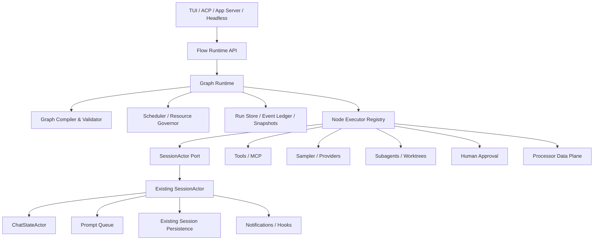
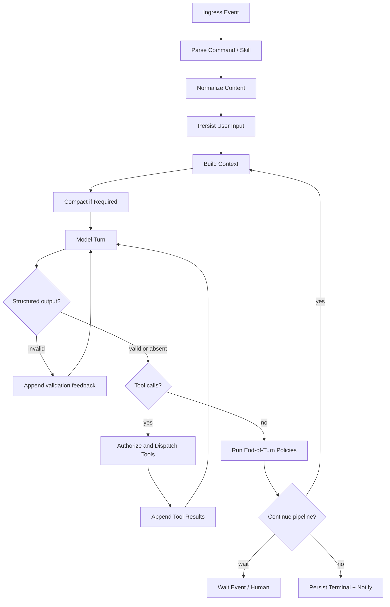

# Síntese técnica: motor de pipelines e grafos para o Goblin

## Conclusão executiva

A melhor direção **não é portar `genai-processors` linha por linha para Rust**. A biblioteca da Google deve servir como referência para uma camada de composição assíncrona baseada em streams, enquanto o Goblin precisa acrescentar uma segunda camada, mais forte: um runtime de grafos durável, versionado, auditável e responsável pelo controle da execução.

A arquitetura recomendada possui três níveis:

1. **Content/stream data plane**: representação uniforme de mensagens, artefatos, eventos e conteúdo multimodal.
2. **Processor algebra**: composição linear, paralela, condicional e streaming de operações.
3. **Graph runtime/control plane**: estado, scheduling, persistência, retries, budgets, checkpoints, forks, aprovação humana e recuperação.

O `SessionActor` não deve ser substituído. Ele já é o proprietário de prompts, inferência, cancelamento, fila, ferramentas, chat state, hooks e notificações. O novo runtime deve operar por uma porta explícita sobre ele, decidindo **o que deve acontecer em seguida**, enquanto o ator continua responsável por **como executar uma operação de sessão**. Essa separação já aparece no desenho futuro do Goal Runtime v2 da própria branch.

---

## 1. O que o `genai-processors` realmente oferece

`genai-processors` é uma biblioteca de blocos assíncronos e combináveis para aplicações de IA. Seu núcleo possui:

| Elemento                   | Função                                                                  |
| -------------------------- | ----------------------------------------------------------------------- |
| `ProcessorPart`            | Unidade de conteúdo com payload, MIME type, role, substream e metadata  |
| `ProcessorContent`         | Coleção normalizada de partes                                           |
| `ProcessorStream`          | Stream assíncrono de partes com tracing associado                       |
| `Processor`                | Transformação de um stream em outro stream                              |
| `PartProcessor`            | Transformação concorrente de uma única parte                            |
| `chain` / `+`              | Composição sequencial                                                   |
| `parallel` / `//`          | Fan-out de processadores                                                |
| `Switch`                   | Routing para o primeiro caso compatível                                 |
| `split`, `merge`, `concat` | Primitivas de distribuição e agregação de streams                       |
| substreams reservados      | Canais laterais para status, debug e UI                                 |
| tracing                    | Instrumentação transparente entre a interface pública e a implementação |

O design adota uma interface assimétrica: o consumidor recebe uma API permissiva e conveniente, enquanto o autor do processor implementa um método assíncrono sobre uma representação normalizada. A camada intermediária adiciona tracing, normalização e gerenciamento de tarefas.

O modelo de conteúdo é uma das partes mais valiosas. Uma parte pode representar texto, bytes, imagem, arquivo, chamada ou resposta de ferramenta, código executável e estruturas serializadas. Role, MIME type, metadata e substream tornam cada fragmento autocontido.

A biblioteca também implementa:

* fan-out copiando um stream para múltiplos consumidores;
* merge concorrente, preservando a ordem interna de cada origem, mas não uma ordem global;
* propagação de cancelamento por task groups;
* routing por predicados;
* canais laterais que não passam pelos processors seguintes.

### O que ela não é

`genai-processors` **não é um runtime durável de grafos**. Sua própria documentação recomenda usar o controle de fluxo nativo do Python para loops e estruturas mais complexas. Um critic/reviser, por exemplo, é implementado como um `for` comum dentro de um Processor.

Não existem como primitivas centrais:

* definição versionada de grafo;
* lifecycle persistente de runs e nodes;
* scheduler durável;
* leases e fencing;
* checkpoints transacionais;
* recuperação após crash;
* budgets por node ou branch;
* invalidation de dependentes;
* fork persistente;
* compensação de efeitos;
* aprovação humana como estado durável;
* replay do controle de fluxo.

Portanto, ele oferece uma excelente **álgebra do data plane**, mas não o **control plane** necessário ao Goblin.

---

## 2. O que deve ser portado para Rust

### Portar como conceito

1. **Modelo uniforme de conteúdo**

Uma representação neutra em relação a Gemini, OpenAI ou xAI:

```rust
pub struct FlowPart {
    pub id: PartId,
    pub payload: Payload,
    pub mime_type: MimeType,
    pub role: Option<Role>,
    pub channel: Channel,
    pub metadata: Metadata,
    pub provenance: Provenance,
}
```

`Payload` deve suportar pelo menos:

```rust
pub enum Payload {
    Text(String),
    Json(serde_json::Value),
    Bytes(bytes::Bytes),
    Image(ArtifactRef),
    Audio(ArtifactRef),
    File(ArtifactRef),
    ToolCall(ToolCall),
    ToolResult(ToolResult),
    Control(ControlMessage),
    Error(StructuredError),
}
```

Arquivos grandes não devem circular duplicados dentro dos streams. O stream transporta `ArtifactRef`, e o conteúdo fica em um artifact store.

2. **Streams como interface padrão**

Processors devem aceitar e produzir streams mesmo quando a operação internamente trabalha em batch. Isso evita criar APIs separadas para síncrono, streaming e realtime.

3. **Interface assimétrica**

A API pública normaliza inputs, cria contexto, tracing e cancelamento. A implementação do processor recebe uma forma estrita.

4. **Combinadores**

* `then`;
* `fan_out`;
* `merge`;
* `concat`;
* `switch`;
* `filter`;
* `map`;
* `buffer`;
* `tap`;
* `timeout`;
* `retry`.

5. **Canais laterais tipados**

Em vez de misturar tudo ao output principal:

```rust
pub enum Channel {
    Main,
    Status,
    Debug,
    Ui,
    Audit,
    Metric,
}
```

Status e UI devem ser observáveis, mas não devem voltar acidentalmente ao prompt do modelo. Essa separação é equivalente aos reserved substreams do projeto original.

### Não portar literalmente

* tipos centrais acoplados ao Gemini SDK;
* Python control flow como scheduler implícito;
* filas sem limites claros;
* ordem de merge indefinida sem contrato explícito;
* metadata arbitrária como substituto de tipos do domínio;
* composição apenas em memória como fonte de verdade;
* retries escondidos dentro de processors sem registro no run ledger.

---

## 3. Arquitetura proposta



### Separação essencial

#### Processor data plane

Transforma dados dentro de um node ou subgraph:

```text
input stream → normalize → extract → model/tool → transform → output stream
```

É efêmero, reativo e otimizado para streaming.

#### Graph control plane

Controla lifecycle:

```text
node ready → reserve budget → persist intent → execute
→ validate result → commit event → release dependents
```

É durável, versionado e responsável por decisões.

Essa separação impede que regras de negócio sejam escondidas em loops assíncronos difíceis de observar.

---

## 4. Organização de crates

Para evitar aumentar ainda mais o tempo de compilação do workspace, eu começaria com apenas dois novos crates.

### `xai-grok-flow`

Responsável por:

* `FlowPart`, artifacts e schemas;
* `Processor` e combinadores;
* `GraphSpec`;
* compilação e validação;
* runtime in-memory;
* scheduler;
* executor registry;
* eventos e projeções in-memory.

### `xai-grok-flow-store`

Introduzido apenas na fase de durabilidade:

* SQLite;
* migrations;
* event ledger;
* snapshots;
* CAS;
* leases;
* idempotency;
* intent/effect/ack;
* recuperação.

O adapter do `SessionActor` deve começar dentro de `xai-grok-shell`, para evitar criar uma abstração prematuramente genérica. Depois que a interface estabilizar, ele poderá ser extraído.

A branch já possui `petgraph`, Tokio, Serde, JSON Schema, telemetry, Mermaid, worktrees, sandbox, MCP, tool runtime e um crate para seleção segura do journal SQLite. Isso reduz bastante o volume de infraestrutura nova.

---

## 5. Modelo de grafo

### Dois tipos, não apenas um

#### Workflow graph

Pode conter ciclos controlados:

* model/tool loops;
* evaluator/optimizer;
* retry;
* approval;
* wait-for-event;
* continuation;
* recovery.

Todo ciclo deve possuir:

* condição explícita;
* limite de iterações ou budget;
* política de progresso;
* estado de saída.

#### Task DAG

Deve ser acíclico:

* decomposição do objetivo;
* dependências entre tarefas;
* fan-out de subtarefas;
* integração;
* acceptance;
* invalidation de descendentes.

A branch já prevê um planner JSON versionado, validação de ciclos e órfãos, readiness, scheduler, concurrency limits, worktrees e acceptance para o Goal Runtime v2.

### Tipos de nodes iniciais

```rust
pub enum NodeKind {
    Processor,
    ModelTurn,
    ToolCall,
    Router,
    Join,
    Subgraph,
    Verifier,
    HumanGate,
    WaitEvent,
    Subagent,
    Worktree,
    Persist,
    Terminal,
}
```

Não começaria com dezenas de tipos. Skills, MCP tools e implementações específicas devem ser registradas como executors desses tipos básicos.

### Edge

```rust
pub struct EdgeSpec {
    pub from: NodeId,
    pub to: NodeId,
    pub kind: EdgeKind,
    pub guard: Option<GuardExpr>,
    pub mapping: Option<DataMapping>,
}

pub enum EdgeKind {
    Data,
    Control,
    Error,
    Compensation,
}
```

### Resultado de um node

```rust
pub struct NodeResult {
    pub outputs: Vec<FlowPart>,
    pub artifacts: Vec<ArtifactRef>,
    pub facts: Vec<StateMutation>,
    pub effects: Vec<EffectReceipt>,
    pub routing: RoutingDecision,
    pub usage: Usage,
}
```

O executor nunca deve alterar diretamente todo o estado compartilhado. Ele retorna facts/mutations, e o runtime os aplica em uma transação ou CAS.

---

## 6. Reescrita do loop de conversação

Hoje, `handle_prompt` realiza parsing, normalização, persistência, inserção no chat, hooks e então entra em um loop que chama `process_conversation_turn_with_recovery`. Quando Goal Mode está ativo, o fim de cada round decide se deve injetar outra mensagem sintética e continuar.

Esse comportamento deve ser expresso inicialmente como um grafo:



### Mudança de autoridade

Atualmente, o código do Goal Mode declara que o modelo dirige a orquestração por meio do tool `update_goal`.

No novo desenho:

* o modelo **propõe intent**;
* o runtime valida autoridade, revision, budget e estado;
* o runtime executa a transição;
* verifiers produzem evidence;
* apenas o runtime pode marcar o run como completo.

Isso já está alinhado ao contrato Goal Domain v2: model tools podem reportar progresso, solicitar completion e reportar blockers, mas não administrar o lifecycle. Resultados stale ficam disponíveis para auditoria, sem alterar o estado materializado.

### Eventos sintéticos

`TaskCompleted`, `SubagentCompleted`, `NotificationDrain`, `GoalSummary` e outros são atualmente convertidos em origens especiais de prompt.

No runtime novo, eles devem entrar como eventos tipados:

```rust
pub enum IngressEvent {
    UserPrompt(UserPrompt),
    ToolCompleted(ToolCompletion),
    SubagentCompleted(SubagentCompletion),
    TimerFired(TimerEvent),
    Notification(NotificationEvent),
    HumanDecision(HumanDecision),
    RecoveryRequested(RecoveryRequest),
}
```

Somente um `ModelTurnNode` decide como transformar um evento em conteúdo para o modelo. Isso elimina a necessidade de representar toda coordenação interna como “falsas mensagens de usuário”.

---

## 7. Porta sobre o `SessionActor`

O `SessionActor` continua proprietário de:

* fila de prompts;
* exclusão mútua de turns;
* sampler;
* provider/auth;
* tool context;
* MCP;
* cancelamento;
* compaction;
* chat history;
* notificações;
* hooks;
* compatibilidade ACP.

O runtime recebe uma porta restrita:

```rust
#[async_trait]
pub trait SessionExecutionPort {
    async fn sample(&self, request: ModelTurnRequest) -> Result<ModelTurnResult>;
    async fn execute_tools(
        &self,
        calls: Vec<AuthorizedToolCall>,
    ) -> Result<Vec<ToolExecutionResult>>;

    async fn append_conversation(
        &self,
        items: Vec<ConversationItem>,
    ) -> Result<()>;

    async fn emit_projection(&self, event: ClientProjection) -> Result<()>;
    async fn wait_for_human(&self, request: HumanRequest) -> Result<HumanDecision>;
    async fn cancel_scope(&self, scope: CancellationScope) -> Result<()>;
}
```

O runtime nunca acessa locks internos do ator. O ator nunca altera diretamente o lifecycle do graph run.

Esse desenho é coerente com o plano existente de introduzir um `GoalSessionPort` e manter prompt, inference, cancellation e compaction no `SessionActor`.

---

## 8. Persistência e replay

Os documentos enviados acertam ao defender event log e grafo projetado, mas “replay determinístico” precisa ser definido cuidadosamente.   

### O que pode ser determinístico

Com os outputs registrados, o runtime pode reproduzir:

* transições;
* routing;
* readiness;
* budgets;
* state mutations;
* acceptance;
* projeções;
* invalidation;
* causalidade.

### O que não é reexecutável deterministicamente

Uma nova chamada ao mesmo modelo ou serviço externo pode retornar outra coisa. Portanto, replay deve reutilizar o resultado registrado, não repetir a chamada.

Para efeitos externos, “exactly once” não pode ser garantido genericamente. O protocolo deve ser:

```text
persist effect intent
→ executar com idempotency key
→ persist effect receipt ou ambiguous outcome
→ somente então liberar dependentes
```

Quando o resultado é ambíguo, o run entra em recuperação não-dirigente. Essa mesma postura já aparece nos contratos de leases e recovery do Goal Runtime v2.

### Fork

Um fork barato deve armazenar:

* `parent_run_id`;
* `fork_event_seq`;
* snapshot base;
* overlay de novos eventos;
* novas revisions;
* referências aos mesmos artifacts imutáveis.

Não é necessário copiar todo o histórico nem reexecutar o prefixo.

---

## 9. Localized repair

O reparo localizado defendido nos brainstorms é uma boa meta, mas depende de pré-requisitos que ainda não existem integralmente.  

Para reexecutar apenas uma região do grafo, o runtime precisa conhecer:

1. dependências de dados;
2. artifacts consumidos e produzidos;
3. revisions observadas pelo node;
4. side effects;
5. idempotency ou compensation;
6. conjunto de descendentes causalmente afetados;
7. acceptance anterior.

O algoritmo realista é:

```text
falha ou alteração
→ localizar outputs invalidados
→ marcar descendants que consumiram esses outputs como stale
→ preservar nodes independentes e seus artifacts
→ criar nova attempt para a região mínima
→ executar verifiers
→ reintegrar apenas após acceptance atual
```

Isso deve entrar depois da persistência, revisions e effect receipts — não no primeiro MVP.

---

## 10. TypeScript e hot reload

Os documentos propõem prototipar em TypeScript e depois portar para Rust. A motivação é válida, especialmente porque o binário Rust precisa ser recompilado para refletir alterações no TUI. 

Entretanto, não recomendo manter dois runtimes semanticamente independentes.

A estratégia mais segura é:

* runtime autoritativo em Rust;
* definição declarativa de pipelines em YAML/TOML/JSON;
* SDK TypeScript que cria, valida e submete `GraphSpec`;
* app-server executando o grafo Rust;
* TypeScript usado para graph builders, visualização e testes de produto;
* futuramente, nodes WASM para lógica hot-reloadável e isolada.

Assim, TypeScript acelera a experimentação sem criar divergência entre “protótipo” e “produção”.

---

## 11. Roadmap recomendado

### Fase 0 — Caracterização

* Registrar ADR da separação processor/runtime/session.
* Criar fixtures do loop atual.
* Caracterizar tool loop, structured output, cancellation, compaction, Goal Mode e synthetic prompts.
* Definir contratos de compatibilidade ACP e notificações.
* Adicionar feature flag:

```toml
conversation_runtime = "legacy" # ou "flow_v1"
```

### Fase 1 — Processor algebra em Rust

Implementar:

* `FlowPart`;
* `PartStream`;
* `Processor`;
* `then`;
* `fan_out`;
* `merge`;
* `switch`;
* canais laterais;
* bounded queues;
* cancellation token;
* tracing.

Criar testes de paridade conceitual com os exemplos de `genai-processors`.

### Fase 2 — Graph runtime in-memory

Implementar:

* `GraphSpec`;
* compiler;
* validação;
* executor registry;
* routing;
* DAG readiness;
* loops controlados;
* joins;
* retries;
* concurrency governor;
* budgets in-memory;
* Mermaid projection.

Primeiro pipeline: conversa normal sem Goal Mode.

### Fase 3 — Migração do loop conversacional

* Adapter do `SessionActor`;
* model node;
* tool dispatch node;
* structured output verifier;
* turn policies;
* hooks e notificações;
* shadow projection;
* rollout opt-in.

O comportamento externo deve permanecer igual antes de qualquer mudança de produto.

### Fase 4 — Runtime durável

* SQLite;
* migrations;
* run/event/node/effect ledgers;
* snapshots;
* CAS;
* leases;
* idempotency;
* crash recovery;
* wait states;
* human gates.

### Fase 5 — Goal Runtime v2 como pipeline

* Goal lifecycle fora do modelo;
* evidence/verifier nodes;
* planner produzindo Task DAG;
* subagents;
* worktrees;
* acceptance e integração;
* budgets por task e branch.

A documentação existente da branch já fornece uma base forte para essa etapa.

### Fase 6 — Recursos avançados

* fork persistente;
* invalidation;
* localized repair;
* graph-of-loops;
* consensus/voting;
* pipeline optimization;
* dynamic graph proposals;
* WASM nodes;
* multi-goal scheduling.

ATG, GATS, self-evolving graphs e “Parallax-style consensus” devem ser tratados como backlog de pesquisa, não como dependências do core inicial. Os documentos enviados são úteis para organizar esse espaço, mas algumas referências precisam ser verificadas individualmente antes de virarem decisões normativas.  

---

## 12. Primeira fatia implementável

A primeira entrega deve provar a arquitetura sem tentar migrar o produto inteiro:

```text
UserInput
  → NormalizeProcessor
  → ModelNode
  → ToolRouter
      ├─ no tools → Terminal
      └─ tools → ParallelToolNode
                   → AppendResults
                   → ModelNode
```

Escopo:

* runtime somente em memória;
* um grafo compilado em Rust;
* loops com `max_iterations`;
* tool calls paralelos;
* cancelamento;
* status/debug/UI side channels;
* tracing por node;
* sem SQLite;
* sem Goal Mode;
* sem fork;
* sem localized repair;
* executor de modelo e tools usando as APIs atuais do `SessionActor`.

Critérios de saída:

* mesmo output e mesmas notificações do loop legado para fixtures gravadas;
* cancelamento não deixa tasks órfãs;
* fan-out respeita limite de concorrência;
* tool results preservam causalidade e ordem declarada;
* nenhum node pode rodar após o run atingir estado terminal;
* graph compile rejeita referências inválidas, joins impossíveis e ciclos sem limite.

---

## Decisão central

O Goblin deve evoluir para:

> **Um runtime Rust de execução de grafos, com streams multimodais e processors combináveis no data plane, estado/eventos duráveis no control plane e o `SessionActor` como adapter de inferência e ferramentas.**

Isso aproveita o melhor do `genai-processors` sem herdar sua limitação principal: controle de fluxo complexo escondido dentro da linguagem hospedeira. Também consolida, em uma única arquitetura, o Goal Runtime v2, subagentes, worktrees, MCP, conversation loop, automações e futuros pipelines especializados.
