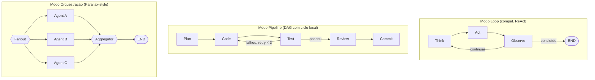
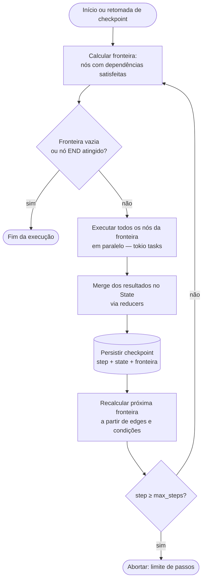
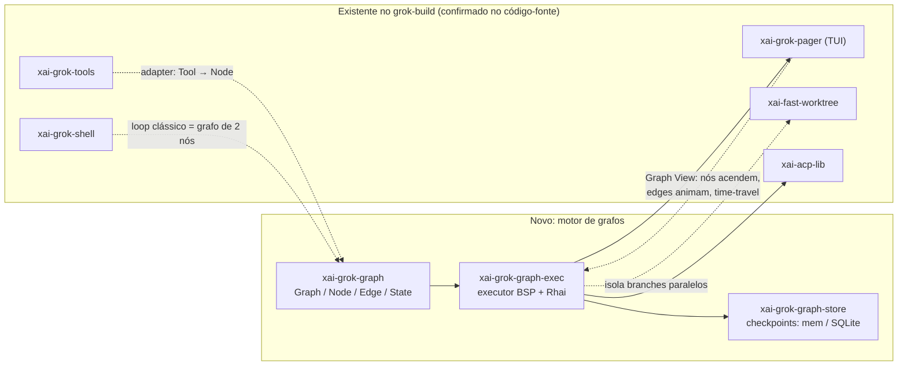

# Arquitetura do Motor de Grafos — grok-oss (fork "Goblin" do grok-build)

> Documento de arquitetura v1.0 — síntese de 8 documentos de brainstorm (3 chats com Grok + análise da thread do @steipete + os dois meta-prompts de handoff) em uma proposta técnica única, concreta e implementável.
> Destino sugerido no repositório: `docs/GRAPH_ENGINE_ARCHITECTURE.md`, na branch `goblin` (não em `main`, que espelha o upstream `xai-org/grok-build`).

---

## Resumo Executivo

Os documentos analisados chegam a uma proposta de **três camadas separadas**: Loop Layer, Graph Layer e Orchestration Layer. A recomendação central deste documento é diferente e mais enxuta: **construir um único motor de grafos**, e tratar loop clássico (ReAct) e orquestração multi-agente (estilo Parallax) como **casos particulares de topologia** sobre esse mesmo motor — não como três sistemas a manter.

Concretamente, isso significa: um executor único no estilo *superstep* (Pregel/BSP), primitivas `Graph`/`Node`/`Edge`/`State` com reducers tipados (mesmo modelo que o LangGraph consolidou), checkpoint a cada superstep (o que dá replay, resume e fork "de graça"), grafos definidos como dados (YAML) para não exigir recompilação a cada iteração de pipeline, e um scripting embutido (Rhai) para a lógica que muda com frequência. Orquestração estilo Parallax (consenso, votação, confidence scoring) não é um quarto sistema — é um `Fanout` seguido de um `Aggregator` rodando através do mesmo executor.

Isso resolve, na ordem em que apareceram nos documentos: (1) a questão de rodar múltiplos agentes no mesmo processo sem peso — sim, é viável, e explico por quê na Seção 7; (2) a frustração com tempo de compilação/hot reload — Seção 8 propõe uma alternativa concreta a reescrever em JS/TS; (3) a ideia de "criar forks e rodar em paralelo" — vira uma consequência direta do checkpoint por superstep (Seção 6); (4) a vontade de sair do "vibe coding" para pipelines determinísticos — Seção 2 propõe um *dial* de controlabilidade em vez de escolher um único ponto fixo no espectro.

---

## 0. Fontes e Verificação

Antes de propor arquitetura, verifiquei o que dava para verificar — vale a pena registrar, porque parte do material citado nos documentos originais tem nomes que soam a alucinação de LLM (papers com títulos muito específicos, datas muito recentes) e eu não queria herdar isso sem checar.

**Confirmado, real:**
- **grok-build existe e é exatamente o que os documentos descrevem.** É um projeto real da xAI/SpaceXAI, open-sourced sob Apache 2.0, código em `github.com/xai-org/grok-build`. O anúncio inicial (beta) foi em 14–15 de maio de 2026; a abertura do código-fonte foi por volta de 15–16 de julho de 2026 — ou seja, há poucos dias. O `README` do próprio repositório confirma os crates citados nos documentos (`xai-grok-pager`, `xai-grok-tools`, `xai-grok-shell`, `xai-grok-config`) e mais alguns que uso adiante (`xai-acp-lib`, `xai-grok-sampler`, `xai-grok-multi-auth`, `xai-fast-worktree`). O `CONTRIBUTING.md` deixa explícito que **contribuições externas não são aceitas** — o que confirma que forkar é o caminho certo, não uma alternativa a abrir PR upstream.
- **O fork de vocês já tem nome.** Fui ver o PR #2 que vocês linkaram em `inputs.md`. A branch de integração chama-se `goblin`, e o projeto está sendo publicado como **`grok-oss`** (pacote npm `@brasalabs/grok-oss`, binário `grok-oss` com alias legado `goblin`, `GROK_OSS_HOME` como variável de ambiente). Uso `grok-oss` como nome do projeto neste documento em vez de inventar um novo — a pergunta "qual é o nome do nosso fork?" do `inputs.md` já está respondida pelo próprio histórico de commits.
- **O tweet do @steipete é real.** "Are we still talking loops or did we shift to graphs yet?", postado 18 de julho de 2026, bate com a data e o texto registrados em `peter_tweet_analisys.md`.
- **Os papers citados em `lista_algo1.md` são reais**, com descrições fiéis ao conteúdo: Act·onomy (arXiv:2605.13625), Atomic Task Graph / ATG (arXiv:2607.01942), GATS (arXiv:2607.08894), AFlow (arXiv:2410.10762), e "The Log is the Agent" / ActiveGraph, de Yohei Nakajima, criador do BabyAGI (arXiv:2605.21997). Isso é um sinal bom sobre a qualidade da pesquisa que alimentou os brainstorms.
- **parallaxai.dev existe** e é exatamente o produto de orquestração/consenso descrito em `peter_tweet_analisys.md` (há também um paper de segurança homônimo, sobre separação cognitivo-executiva, que o próprio documento original já identificou corretamente como um projeto diferente).

**Não verificável / parcialmente verificável:**
- Não consigo confirmar as réplicas específicas atribuídas a @jasonzhou1993 ("Graph of Loops") e @marinusklasen ("Parallax") dentro da thread — o X não expõe replies para acesso sem login. O tweet-raiz é real; o conteúdo da thread em si não pôde ser auditado de forma independente, então trato essas atribuições como prováveis, não confirmadas.

**Achado extra, não estava nos documentos originais:**
- Encontrei um paper que formaliza quase exatamente a tese central deste documento — que um loop de agente é um caso degenerado de execução em grafo. É "From Agent Loops to Structured Graphs: A Scheduler-Theoretic Framework for LLM Agent Execution" (Hu Wei, arXiv:2604.11378, abril de 2026). É importante ser honesto sobre o que é: um paper de design/posição de autor único, **sem validação empírica** (o próprio autor é explícito sobre isso), não um sistema em produção. Mas o vocabulário formal que ele propõe é útil e uso bastante nas próximas seções — em particular a ideia de "cardinalidade do conjunto de nós prontos" e o protocolo de recuperação em três níveis.

---

## 1. A Decisão Arquitetural Central: Um Motor, Não Três Camadas

`peter_tweet_analisys.md` propõe três camadas de execução: Loop Layer (compatibilidade), Graph Layer (produção) e Orchestration Layer (Parallax-style). Isso parece razoável à primeira vista, mas tem um custo: três sistemas para manter, três lugares onde bugs podem divergir, e comportamento potencialmente inconsistente entre eles.

A alternativa que proponho: **um motor de grafos único**, onde:

- **Loop clássico (ReAct) é um grafo de 1–2 nós com uma aresta cíclica e uma condição de saída.** Não é preciso um "Loop Layer" separado — é o template mais simples possível do mesmo motor.
- **Orquestração multi-agente (Parallax-style) é um nó `Fanout` seguido de um nó `Aggregator`**, rodando através do mesmo executor que roda qualquer outro grafo. Não é uma "Orchestration Layer" — é uma composição.

Isso não é uma ideia arriscada ou original demais — é para onde o campo já convergiu. O Google ADK documenta explicitamente essa transição: a partir do ADK 2.0, os workflows baseados em template (incluindo `LoopAgent`, que implementa exatamente o padrão ReAct) foram superados por workflows baseados em grafo, unificando o modelo mental<cite index="19-1,20-1">onde a execução de sub-agentes dentro de um loop é determinística e gerenciada pelo mesmo objeto de workflow, e onde grafos combinam raciocínio de agentes com ferramentas determinísticas e humanos no loop como nós de um mesmo grafo</cite>. O LangGraph — hoje o framework de orquestração baseada em grafos mais adotado, com mais de 126 mil estrelas no GitHub até abril de 2026 — já implementa `create_react_agent` como um grafo cíclico de 2 nós por baixo dos panos; não existe, na prática, um "motor de loop" separado do "motor de grafo" nos frameworks que venceram essa disputa de design.



Os três blocos do diagrama acima **não são três sistemas** — são três instâncias de `Graph { nodes, edges, state_schema }` com topologias diferentes, executadas pelo mesmo `run_graph()`. Isso é o que permite, por exemplo, que um nó dentro do pipeline do meio seja, ele mesmo, um sub-grafo com um loop interno ("Graph of Loops", a ideia atribuída a @jasonzhou1993) sem precisar de nenhuma abstração nova — é só um `NodeKind::SubGraph` apontando para outro `Graph`.

---

## 2. O Espectro Controlabilidade × Flexibilidade

Aqui vale abrir uma distinção que nenhum dos documentos originais fez explicitamente, mas que importa para decidir *como* implementar o motor único da Seção 1.

O paper de Hu Wei (arXiv:2604.11378) propõe um jeito formal de comparar sistemas de execução: em qualquer estado, quantos nós estão simultaneamente prontos para rodar (a "cardinalidade do conjunto pronto", |U|) e o quanto a política que escolhe entre eles é explícita/determinística. Nessa régua:

| Sistema | \|U\| (paralelismo estrutural) | Política de roteamento | Plano é imutável? | Recuperação |
|---|---|---|---|---|
| **Agent Loop clássico** | ≤ 1 | Implícita (o LLM decide a cada turno) | Não há "plano" | Ad-hoc, sem limite |
| **LangGraph (estilo atual)** | ≥ 1 | Semi-determinística (edges condicionais podem depender de output do LLM) | Não — grafo pode ser modificado em runtime | Retry + roteamento condicional |
| **"Graph Harness" (proposta do paper)** | ≥ 1 | Totalmente determinística (topologia fixa) | Sim — versão de plano imutável | Escalonamento em 3 níveis, obrigatório |

O ponto interessante é que esses são **pontos complementares no espectro, não um certo e um errado**: grafos dinâmicos (tipo LangGraph) são melhores para tarefas exploratórias, onde a estrutura emerge durante a execução; grafos estáticos por versão são melhores para tarefas de engenharia onde a dependência pode ser articulada antes de começar — que é exatamente o caso que motivou o brainstorm de vocês ("a gente tem que criar pipelines e workflows pré-definidos... entender cada etapa").

**Recomendação:** não escolher um dos dois — expor os dois como um parâmetro de execução por grafo (`plan_mode: Flexible | Strict`):

- **`Flexible`** (default): edges podem ter condições avaliadas em runtime (via Rhai, Seção 8), o grafo pode ganhar sub-grafos dinamicamente. Bom para desenvolvimento, exploração, o "loop de compatibilidade".
- **`Strict`**: a topologia da versão do plano é congelada antes de rodar; qualquer necessidade de mudar a estrutura gera uma nova *versão* do plano (não uma mutação in-place) e fica auditável; recuperação segue obrigatoriamente a escalada de 3 níveis descrita na Seção 4. Esse é o modo para pipelines de CI, releases, qualquer coisa onde "por que o agente fez isso" precisa ter resposta determinística.

Isso dá exatamente o que os documentos pediam — "eu quero ter mais controle a cada turno" — sem fechar a porta para prototipagem rápida, que também apareceu como necessidade explícita.

---

## 3. Modelo de Dados: Graph, Node, Edge, State

### 3.1 Tipos de nó

Uma simplificação importante em relação aos brainstorms originais: **roteamento condicional não é um tipo de nó, é uma propriedade da aresta.** Qualquer nó pode ter múltiplas arestas de saída, cada uma com uma condição; isso elimina a necessidade de um `NodeKind::Router` dedicado (é como o LangGraph já faz, com "conditional edges").

| `NodeKind` | O que faz | Chama LLM? | Efeito colateral | Exemplo |
|---|---|---|---|---|
| `Agent` | Chamada a um modelo (grok-build-0.1, Claude, GPT, Gemini, local) com system prompt + tools | Sim | Nenhum direto | `plan`, `code`, `review` |
| `Tool` | Função determinística, com classificação `ReadOnly \| Idempotent \| Destructive` | Não | Depende da classificação | rodar testes, `git commit`, buscar na web |
| `SubGraph` | Embute outro `Graph` inteiro como um único nó | Depende | Depende | reuso de Skills, "Graph of Loops" |
| `Fanout` | Dispara N ramos, cada um recebendo uma variação do State | Não | Nenhum direto | tentar 3 abordagens de correção em paralelo |
| `Aggregator` | Junta os ramos de um `Fanout`, aplica estratégia de consenso | Depende (`LLMJudge` sim) | Nenhum direto | votação, maior confiança, primeiro a passar |
| `HumanInTheLoop` | Pausa a execução, espera input externo, com timeout | Não | Nenhum direto | aprovar diff antes de commitar |

A classificação de efeito colateral em `Tool` (`ReadOnly / Idempotent / Destructive`) vem diretamente do Princípio 4 do paper de Hu Wei: nem toda ação é igualmente reversível, e o executor deve saber disso antes de despachar nós em paralelo especulativamente. Isso importa concretamente na Seção 9.

### 3.2 Esboço em Rust (ilustrativo — não é código para compilar direto)

```rust
// crate: xai-grok-graph — apenas tipos e lógica pura, zero I/O

pub type NodeId = String;

#[derive(Clone)]
pub struct State {
    values: HashMap<String, Value>,
    reducers: HashMap<String, Arc<dyn Reducer>>,
}

pub trait Reducer: Send + Sync {
    /// Decide como uma atualização se combina com o valor atual.
    /// Ex.: append (mensagens), last_write_wins (plano atual), merge (scores de confiança).
    fn reduce(&self, current: Option<&Value>, update: Value) -> Value;
}

pub enum SideEffect { ReadOnly, Idempotent, Destructive }

pub enum NodeKind {
    Agent { model: ModelRef, system_prompt: PromptRef, tools: Vec<ToolRef> },
    Tool { tool: ToolRef, side_effect: SideEffect },
    SubGraph { graph: GraphId },
    Fanout { branches: FanoutSpec },
    Aggregator { join: JoinMode, strategy: ConsensusStrategy },
    HumanInTheLoop { prompt: String, timeout: Duration },
}

pub struct Node {
    pub id: NodeId,
    pub kind: NodeKind,
    pub retry_budget: u32,   // nível 1 da escalada de recuperação (Seção 4)
    pub timeout: Duration,
}

pub enum EdgeCondition {
    Always,
    Expr(RhaiScript),   // avaliado contra o State — ver Seção 8
    OnSuccess,
    OnFailure,
}

pub struct Edge {
    pub from: NodeId,
    pub to: NodeId,
    pub condition: EdgeCondition,
}

pub enum PlanMode { Flexible, Strict }

pub struct Graph {
    pub id: GraphId,
    pub version: u32,           // relevante em modo Strict — Seção 2
    pub plan_mode: PlanMode,
    pub entry: NodeId,
    pub nodes: HashMap<NodeId, Node>,
    pub edges: Vec<Edge>,
}
```

### 3.3 Estados de um nó em execução

Cada nó, durante uma execução, passa por uma máquina de estados. Vale explicitar porque ela é o que garante que o executor sempre progride (nunca trava esperando um nó que nunca vai terminar):

```
pending → ready → running → executed
                      ↓
              failed_retryable → (retry) → pending
                      ↓ (orçamento esgotado)
                    failed
running → waiting_human → (timeout) → cancelled
                        → (resposta) → running
```

Estados terminais (`executed`, `failed`, `cancelled`, `skipped`) nunca são reabertos — isso é o que permite ao executor confiar, de forma permanente, que um predecessor "executed" realmente terminou, sem re-checar.

---

## 4. O Executor: Superstep Unificado (estilo Pregel/BSP)

Em vez de implementar 5 algoritmos de execução separados (topológico, paralelo, cíclico, consenso, hierárquico — como o catálogo original em `peter_tweet_analisys.md` sugeria), a recomendação é **um único loop de execução em "superstep"**, no estilo do modelo Pregel do Google para processamento de grafos em larga escala (e é essencialmente o que o LangGraph faz por baixo dos panos). A diferença entre "sequencial", "paralelo" e "cíclico" deixa de ser uma escolha de qual executor rodar — vira uma **consequência da topologia do grafo e dos tipos de nó**, não de qual código está rodando.



```rust
// crate: xai-grok-graph-exec

pub async fn run_graph(
    graph: &Graph,
    mut checkpoint: Checkpoint,
    store: &dyn CheckpointStore,
    max_steps: u32,
) -> Result<ExecutionResult> {
    while !checkpoint.frontier.is_empty() && checkpoint.step < max_steps {
        // Superstep: todo nó na fronteira roda concorrentemente.
        let results: Vec<NodeResult> = futures::future::join_all(
            checkpoint.frontier.iter()
                .map(|id| execute_node(&graph.nodes[id], &checkpoint.state))
        ).await;

        for r in &results {
            checkpoint.state = checkpoint.state.merge(&r.state_delta); // via reducers
        }

        checkpoint.step += 1;
        checkpoint.frontier = compute_next_frontier(graph, &checkpoint.state, &results);
        store.save(&checkpoint).await?; // checkpoint por superstep → resume/fork/time-travel de graça
    }
    Ok(ExecutionResult { final_state: checkpoint.state, steps: checkpoint.step })
}
```

Isso já entrega, sem código extra: execução sequencial (fronteira sempre com 1 nó), execução paralela (fronteira com N nós — dois `search` independentes, por exemplo), e loops (um nó reaparece na fronteira porque uma aresta cíclica disparou, com `max_steps` como guarda de segurança contra loop infinito).

### 4.1 Semântica de junção (`Aggregator`)

Um `Aggregator` decide quando os ramos de um `Fanout` estão prontos para prosseguir:

- **`all_of`**: só entra na fronteira quando todo predecessor chegou a `executed`. Uso natural: "leia os dois arquivos, depois analise ambos".
- **`any_of`**: entra assim que o **primeiro** predecessor chega a `executed`; os demais que ainda estejam em voo são marcados `skipped` (não cancelados no meio — só deixam de ser esperados). Uso natural: "tente a correção A e a B, siga com a que passar primeiro".

Deliberadamente **não** incluo, na v1, um `first_of` que cancela ramos ainda em execução no meio do caminho ("paralelismo competitivo" — lançar N tentativas e literalmente matar as perdedoras). O paper de Hu Wei argumenta bem por que isso é arriscado: cancelamento no meio de uma chamada de LLM ou de uma ferramenta com efeito colateral exige um protocolo de compensação (desfazer o que já foi escrito em disco, revogar uma chamada de API já disparada) que não é trivial, e que introduz não-determinismo justamente na parte do sistema que a Seção 2 está tentando tornar mais previsível. `any_of` com "deixar terminar e ignorar" entrega quase o mesmo valor prático com muito menos risco — fica como extensão explícita de fase futura, não como parte do design inicial.

### 4.2 Recuperação em 3 níveis

Também adotado do mesmo paper, porque é mais rigoroso do que "retry genérico" e resolve um problema real: erro transitório (rate limit) e erro de raciocínio (o LLM output não bate com o contrato esperado) precisam de tratamentos diferentes, e não deveria ser possível pular direto para "replanejar tudo de novo" sem antes tentar as opções mais baratas.

| Nível | Gatilho | Escopo | Efeito na estrutura do grafo |
|---|---|---|---|
| 1 — retry local | Erro transitório (timeout de rede, rate limit) | Só o nó atual | Nenhum |
| 2 — patch local | Violação de contrato de output (ex.: JSON mal formado, campo obrigatório ausente) | Configuração do nó atual (ex.: reforça o prompt com o erro) | Nenhum |
| 3 — replan | Dependência ausente ou estrutura de plano inválida | Todo o grafo | Gera uma **nova versão** do plano — não modifica a corrente |

Invariante de escalada: nível *i* precisa se esgotar (orçamento de tentativas zerado) antes de nível *i+1* poder ser acionado. Isso é o que evita as duas patologias mais comuns em agentes soltos: o loop de retry infinito, e o replan prematuro por causa de um erro que um simples retry teria resolvido.

---

## 5. Da Pesquisa aos Primitivos: Mapeamento Completo

`lista_algo1.md` cataloga bem os tipos de grafo e algoritmos que aparecem na literatura. A tabela abaixo mostra como cada um se expressa dentro do modelo unificado das Seções 3–4 — a ideia é que **nenhum desses conceitos precisa virar uma estrutura de dados nova**; eles são todos configurações diferentes de `Graph`/`Node`/`Edge`/`State`.

| Conceito da pesquisa | Como se expressa no modelo unificado |
|---|---|
| State Graph | É literalmente o modelo base: `Graph` + `State` tipado com reducers |
| Workflow Graph | `Graph` com múltiplas arestas condicionais saindo de um nó (roteamento) |
| Execution DAG | `Graph` sem ciclos; fronteira pode ter \|U\| > 1 sem risco de loop |
| Task Graph | `Graph` onde nós = `Tool`/`Agent` representando subtarefas, edges = dependência de dados |
| Atomic Task Graph (ATG) | Task Graph + reparo localizado: ao falhar, só o sub-grafo a partir do checkpoint anterior ao nó com falha é re-executado, não o grafo inteiro |
| Action-Dependency Graph | Edges com condição `OnSuccess`/`OnFailure` entre nós `Agent` |
| Knowledge Graph / Context Graph | Não é uma estrutura de *controle* — vive **dentro do `State`** como um valor tipado (`state.knowledge: KnowledgeGraph`), consultado por nós, não como topologia de execução |
| Reactive / Event-Sourced Graph (ActiveGraph) | O log de checkpoints por superstep já é um log de eventos append-only — replay determinístico e fork vêm de graça do design da Seção 6, sem precisar adotar o modelo totalmente reativo do ActiveGraph (mais sobre isso na Seção 6) |
| Agentic Computation Graph (ACG) | É a descrição geral do que `Graph` já é neste modelo |
| Graph-Augmented Tree Search (GATS) | Não é uma estrutura nova — é uma variante do `Executor`: em vez de uma fronteira só, explora N continuações candidatas por step e poda com UCB1. Cabe como um `plan_mode` adicional no futuro, não como sistema separado |

E os algoritmos de planejamento/decisão listados:

| Algoritmo | Como vira grafo no nosso modelo |
|---|---|
| ReAct | Grafo de 2–3 nós com aresta cíclica (Seção 1) |
| Reflexion / Self-Refine | `Agent` → `Agent` (crítico) → aresta condicional de volta ao primeiro se a crítica reprovar |
| Plan-and-Execute | `Agent(plan)` → `SubGraph`(o plano vira um grafo à parte, gerado dinamicamente) |
| HTN (Hierarchical Task Networks) | `SubGraph` aninhado — decomposição hierárquica é exatamente isso |
| AFlow | Fora do escopo do motor de execução em si — é uma técnica de *geração/otimização* de topologias de grafo via MCTS; relevante para uma ferramenta de meta-otimização que gera arquivos YAML de grafo, não para o executor |
| GATS | Ver linha acima na tabela de grafos |

---

## 6. Checkpoints, Log de Eventos e "Fork-and-Compare"

Cada superstep grava um checkpoint (`step`, `state`, `fronteira`). Isso, sozinho, já entrega a ideia do `inputs.md` de "criar forks e executar processos em paralelo": pegue qualquer checkpoint passado, carregue-o N vezes com pequenas variações (modelo diferente, temperatura diferente, prompt ligeiramente diferente), rode as N continuações concorrentemente, e alimente os resultados em um `Aggregator`. "Mais inteligência via paralelismo" deixa de ser uma ideia vaga e vira uma operação concreta: `fork(checkpoint_id) → [run × N] → aggregate`.

Vale registrar uma decisão de design que envolve o ActiveGraph, de Yohei Nakajima (Seção 0). O ActiveGraph resolve um problema parecido — replay determinístico, fork barato, auditabilidade — mas por um caminho radicalmente diferente: em vez de uma topologia de grafo explícita, o log de eventos append-only *é* a fonte de verdade, e o grafo que os comportamentos leem e escrevem é apenas uma *projeção* recomputável desse log. O próprio autor descreve o sistema como não tendo "workflows" nem DAG no sentido tradicional — coordenação emerge de comportamentos reativos que respondem a padrões de eventos, sem orquestrador central.

É uma arquitetura genuinamente boa, mas para um objetivo diferente do que motivou este brainstorm. Vocês querem sair do "vibe coding" — menos emergência, mais estrutura visível e auditável antes da execução começar. Um sistema puramente reativo troca exatamente nessa direção contrária: mais emergência, menos estrutura explícita a priori. Por isso a recomendação aqui é manter a topologia de grafo explícita (Seções 3–4) como modelo principal, mas **importar a ideia central do ActiveGraph para a camada de armazenamento**: o `CheckpointStore` deve ser implementado como um log append-only (write-ahead log) onde cada checkpoint é um evento imutável, e o estado "atual" é sempre recomputável por replay do log — isso dá determinismo de replay e auditabilidade total sem abrir mão da topologia explícita.

```rust
pub trait CheckpointStore: Send + Sync {
    async fn append(&self, cp: &Checkpoint) -> Result<CheckpointId>;
    async fn load_latest(&self, run_id: &RunId) -> Result<Checkpoint>;
    async fn fork(&self, run_id: &RunId, at_step: u32) -> Result<RunId>;
    async fn replay(&self, run_id: &RunId) -> Result<State>; // reconstrói via replay do log, não via snapshot direto
}
```

Backend recomendado: em memória para desenvolvimento; SQLite como default local (um arquivo por workspace, sem infra extra); Postgres como opção para modo servidor/equipe. Vale considerar também exportar o histórico de uma run como Markdown legível por humano — não como fonte de verdade, mas como um artefato de leitura, na linha do que os documentos descrevem como diferencial de "memória local em Markdown" de outros harnesses.

---

## 7. Concorrência: Quantos Agentes Cabem em Um Processo?

Essa era uma pergunta explícita no `inputs.md` ("Dá pra gente executar múltiplos agentes no mesmo processo... sem pesar? Cê consegue confirmar isso pra mim?"). Sim — com uma ressalva importante sobre onde o limite real está.

Uma *task* do tokio (a unidade de concorrência assíncrona do Rust) tem um custo de memória inicial da ordem de algumas dezenas a poucas centenas de bytes, que cresce sob demanda — ordens de magnitude mais barato que uma thread do sistema operacional, que reserva tipicamente alguns megabytes de stack por padrão no Linux. Rodar dezenas de milhares de tasks concorrentes em um processo só é rotina para aplicações tokio, **desde que o trabalho seja majoritariamente limitado por I/O** — esperando resposta de rede, não computando.

E é exatamente esse o perfil de um loop de agente: o tempo é dominado por esperar a resposta da chamada ao LLM, não por computação local. Então sim: rodar N agentes concorrentes no mesmo processo, cada um como uma task, é uma escolha natural e barata em Rust+tokio, e não é o gargalo real do sistema.

Duas ressalvas práticas:

1. **Para as partes que são de fato limitadas por CPU** (ex.: processar embeddings localmente, parsing pesado), usar `tokio::task::spawn_blocking` ou um pool `rayon` dedicado, para não bloquear as threads worker do runtime assíncrono, que precisam continuar livres para atender as outras tasks de I/O.
2. **O teto real não é o processo, é a API.** Rate limits e custo por token do provedor de LLM vão aparecer muito antes de qualquer limite de memória ou de scheduler do sistema operacional. "Rodar 200 agentes em paralelo" é trivial em Rust; pagar e não ser rate-limitado por isso, não é.

Vale separar isso do modelo de **isolamento/sandboxing**, que é uma preocupação diferente: concorrência (tokio tasks, barata, no mesmo processo) é sobre *quantos agentes rodam ao mesmo tempo*; sandboxing (o que o grok-build já resolve na camada de execução de ferramentas) é sobre *o que um agente pode fazer* — não misturar as duas. A recomendação da Seção 9 usa o crate `xai-fast-worktree`, que já existe no fork de vocês, exatamente para dar isolamento de sistema de arquivos entre branches paralelos sem precisar de processos ou containers separados por agente.

---

## 8. O Problema Rust × Velocidade de Iteração

Esse foi o ponto mais concreto de fricção no `inputs.md`: "demora um tempão pra mim compilar... tava pensando em reescrever em JavaScript, TypeScript... e depois a gente traduz a lógica pro Rust". A recomendação é **não reescrever em TS** — mas atacar a dor real (o ciclo de iteração lento) diretamente, com quatro técnicas complementares, da mais barata para a mais trabalhosa:

**1. Grafos são dados, não código.** Se `Graph`/`Node`/`Edge` são serializados em YAML (não codificados como `match` no Rust), mudar uma *topologia* de pipeline — adicionar um nó, reconectar uma aresta, ajustar uma condição — não exige recompilar nada, só reler o YAML. Isso já resolve a maior parte da dor: a maioria do que vocês querem testar ("recriar vários métodos, vários engines, vários algoritmos") é iteração de topologia, não implementação de um novo tipo fundamental de nó em Rust — isso último é mais raro e pode pagar o custo de recompilar.

**2. Rhai embutido para a lógica que muda com frequência.** Para as partes que precisam de lógica de verdade — uma condição de aresta, uma função de agregação customizada — em vez de esperar recompilação do binário inteiro, embutir [Rhai](https://rhai.rs), uma linguagem de script nativa em Rust, sandboxed, feita exatamente para esse caso de uso (é a mesma abordagem que motores de jogo como o Bevy usam para scripting de gameplay sem recompilar o engine). Diferente de embutir Lua, não traz complexidade de FFI/build com C. Um script de condição fica assim:

```yaml
# trecho de um Node/Edge no YAML do grafo
edges:
  - from: test
    to: code
    condition: "state.tests_passed == false && state.retry_count < 3"
  - from: test
    to: review
    condition: "state.tests_passed == true"
```

E o próprio `retry_budget`/nível 1 de recuperação (Seção 4.2) já cobre o `retry_count < 3` sem precisar reescrever nada em Rust quando esse limite muda.

**3. Para mudanças de Rust "de verdade" (novo `NodeKind`, novo backend de `CheckpointStore`): tooling de hot-reload de verdade.** `cargo-watch` como baseline (já é o padrão dos projetos Rust modernos); o próprio `README` do `grok-build` upstream já recomenda `cargo check -p <crate>` específico em vez de build de workspace inteiro, porque "full-workspace builds are slow" — ou seja, essa dor já é reconhecida pelo time original. Para hot-reload de verdade sem reiniciar o processo (preservando estado em memória entre reloads), o padrão em Rust é compilar a parte "quente" como uma `cdylib` e usar algo como o crate `hot-lib-reloader`, que recarrega essa dylib quando ela muda — vale o investimento de setup só quando o time estiver de fato iterando com frequência nessa camada específica, não desde o dia um.

**4. Para validar ideias de algoritmo novas antes de escrever qualquer Rust**, manter um `experiments/` com scripts descartáveis (Python é uma boa escolha aqui — rápido de escrever, ótimo para prototipar lógica de grafo) que operam sobre o **mesmo schema JSON/YAML** de `Graph`/`State` do motor em Rust. Como o contrato é o schema, não o código, uma topologia ou heurística validada no sandbox migra para produção reimplementando a lógica contra o mesmo schema — sem o risco de "traduzir" um codebase inteiro à mão, que é o que a ideia original de reescrever em TS implicava.

---

## 9. Orquestração Multi-Agente Estilo Parallax

Como estabelecido na Seção 1, isso não é um sistema à parte — é `Fanout` → N ramos → `Aggregator`, todos primitivas já definidas.

```rust
pub enum ConsensusStrategy {
    MajorityVote,                          // para saídas discretas/classificáveis
    WeightedConfidence,                    // cada ramo emite um score; pondera ou pega o maior
    LLMJudge { judge_model: ModelRef },     // um agente "juiz" compara e escolhe/funde
    AnyOfFirstSuccess,                     // join any_of (Seção 4.1) — primeiro que passar valida
}
```

Ponto de integração concreto, apoiado em algo que **já existe no fork de vocês**: quando os ramos de um `Fanout` mexem no sistema de arquivos/git — por exemplo, "tente 3 abordagens de correção em paralelo" — cada ramo deveria rodar em seu próprio git worktree isolado, para que operações `Destructive` (a classificação de efeito colateral da Seção 3.1) de um ramo não colidam com as de outro. O crate `xai-fast-worktree`, que apareceu nos commits reais do PR #2 de vocês, é exatamente a peça que resolve isso — a comunidade de orquestradores multi-agente já convergiu para git worktrees como "a primitiva de isolamento" padrão para rodar múltiplos agentes no mesmo repositório sem conflito. O `Aggregator` decide qual ramo "vence"; só o worktree vencedor é mesclado de volta, os outros são descartados. Isso evita todo o problema de compensação/cancelamento que a Seção 4.1 apontou como razão para não implementar `first_of` — cada ramo roda até o fim isolado, sem risco, e só o merge final é seletivo.

---

## 10. Integração com o Harness Real

Com base no código-fonte confirmado (Seção 0), a proposta de encaixe:



- **`xai-grok-tools` → adaptador quase gratuito.** Um trait `impl Into<Node> for AnyExistingTool` torna toda ferramenta já existente utilizável dentro de um grafo, sem reescrever nada do que já funciona.
- **`xai-grok-shell` (o loop atual) não é substituído, é reexpresso.** O loop clássico vira o template padrão de grafo de 2 nós descrito na Seção 1 — dá para migrar incrementalmente, mantendo o comportamento atual como default, sem quebrar nada em produção.
- **`xai-grok-pager` (a TUI) ganha uma "Graph View".** Dado que mouse+fullscreen interativo já é um diferencial que vocês valorizam (aparece nos dois documentos de posicionamento competitivo), visualizar a execução do grafo ao vivo — nós acendendo conforme rodam, arestas animando quando disparam, clicar em um checkpoint passado para inspecionar ou dar fork — é um recurso de produto genuinamente visível, não só engenharia interna. É um argumento forte para o documento de `COMPETITOR_COMPARISON.md` que vocês estavam montando: "você vê o plano do seu agente e assiste ele executar, com time-travel, no terminal".
- **Skills, hooks, MCP:** cada servidor MCP vira automaticamente um `NodeKind::Tool`; hooks (pré/pós execução) mapeiam para eventos do ciclo de vida do nó (`before_execute`/`after_execute`/`on_error`) e do grafo (`on_start`/`on_end`/`on_checkpoint`); e — isso é direto — uma Skill (`SKILL.md` + YAML, como os documentos originais já descreviam a ambição) pode literalmente **ser** um template de `SubGraph` nomeado e parametrizável, reaproveitando exatamente o mecanismo de composição da Seção 1.
- **Política de branch:** os novos crates entram como PRs contra a branch `goblin`, nunca contra `main` (que espelha o upstream) — seguindo o que já está documentado no repositório de vocês.

---

## 11. Roadmap Faseado

Sem inventar números de issue — isso é trabalho de vocês criarem quando forem abrir o board. Cada fase é o menor incremento que já entrega valor rodável sozinho.

| Fase | Entregável | Depende de |
|---|---|---|
| **0 — Fundação** | Crate `xai-grok-graph`: tipos `Graph`/`Node`/`Edge`/`State` + serialização YAML. Executor sequencial single-thread, sem persistência (tudo em memória). Meta: rodar o pipeline `plan → code → test → review → commit` de ponta a ponta. | — |
| **1 — Paralelismo + persistência** | Loop BSP completo com `tokio::join_all` na fronteira (Seção 4). `CheckpointStore` em SQLite (Seção 6) — resume/fork já funcionam. | Fase 0 |
| **2 — Ciclos + compatibilidade** | Suporte a arestas cíclicas com guarda de `max_steps` (Seção 4). Reimplementar o loop atual do `xai-grok-shell` como o grafo-template padrão (Seção 1), validando a tese de unificação em produção. | Fase 1 |
| **3 — Scripting + observabilidade** | Integração Rhai para condições/agregadores (Seção 8). Painel "Graph View" no `xai-grok-pager` (Seção 10). | Fase 1 |
| **4 — Orquestração** | `Fanout`/`Aggregator` com as estratégias de consenso (Seção 9), integração com `xai-fast-worktree` para isolamento de ramos. | Fases 2–3 |
| **5 — Composição avançada** | Skills como templates de `SubGraph`; modo `Strict` completo com versionamento de plano e recuperação em 3 níveis (Seções 2 e 4.2); exposição de estado do grafo via ACP. | Fase 4 |

---

## 12. Riscos, Alternativas Descartadas e Próximos Passos

**Riscos a monitorar:**
- **Custo de I/O do checkpoint por superstep.** Gravar em SQLite a cada passo pode virar gargalo de latência em pipelines com muitos passos pequenos — vale medir cedo e considerar escrita em batch/assíncrona com política explícita de flush antes de assumir que "checkpoint sempre" é grátis.
- **Design de reducers é a parte mais fácil de errar.** É onde os usuários de LangGraph mais relatam confusão na prática — vale reservar tempo de design dedicado antes de expandir o número de chaves de `State` que times diferentes escrevem.
- **"Determinismo controlado" não é determinismo pleno.** Fixar a topologia do grafo não torna o sistema inteiro determinístico — só controla *onde* a não-determinismo do LLM pode aparecer (dentro de um nó), não *se* ela aparece. Vale não prometer mais do que isso entrega.
- **A economia de "mais paralelismo = mais inteligência" tem teto de custo/rate-limit antes de teto de engenharia** (Seção 7) — vale ter isso em mente ao dimensionar `Fanout`s por padrão.

**Alternativas consideradas e por que não foram escolhidas para v1:**
- **Reescrever em TypeScript e depois portar para Rust** (ideia original do `inputs.md`) — descartada em favor da Seção 8: ataca a causa raiz (ciclo de iteração) sem duplicar codebase.
- **Modelo totalmente reativo/event-driven sem topologia explícita, ao estilo ActiveGraph** (Seção 6) — é uma arquitetura real e válida, mas otimiza para o oposto do que motivou o brainstorm (menos estrutura visível a priori, mais emergência).
- **`first_of` com cancelamento competitivo** (Seção 4.1) — fica como extensão de fase futura, não abertura de v1, por causa da complexidade de protocolos de compensação.
- **Três motores separados (Loop/Graph/Orchestration)**, a proposta original — descartada em favor da unificação da Seção 1.

**Próximo passo concreto, do tamanho de um PR:** criar o crate `xai-grok-graph` com os tipos da Seção 3.2, a serialização YAML, e um executor sequencial trivial (sem paralelismo, sem persistência ainda) — suficiente para rodar o exemplo `plan → code → test → review → commit` da Seção 8 de ponta a ponta e servir de base para todo o resto do roadmap.

---

## Apêndice: Glossário

- **BSP / superstep (Bulk Synchronous Parallel):** modelo de execução em rodadas — em cada rodada, todo trabalho pronto roda em paralelo, depois os resultados são sincronizados antes da próxima rodada. Base do Pregel (Google) e, por baixo dos panos, do LangGraph.
- **DAG:** grafo acíclico dirigido — sem ciclos, garante que a execução sempre termina.
- **Fronteira / ready set (\|U\|):** conjunto de nós cujas dependências já foram satisfeitas e que podem rodar na rodada atual.
- **Reducer:** função que decide como uma atualização de uma chave do `State` se combina com o valor atual (substituir, concatenar, mesclar).
- **Checkpoint:** snapshot de `(step, state, fronteira)` persistido a cada superstep; é o que permite pausar, retomar, dar fork ou fazer "time-travel" em uma execução.
- **Escalada de recuperação (3 níveis):** retry local → patch local → replan; cada nível só pode ser acionado depois que o anterior se esgota.
- **`any_of` / `all_of` (join):** semânticas de um `Aggregator` — esperar qualquer predecessor ou todos os predecessores antes de prosseguir.
- **ACP:** Agent Client Protocol — protocolo usado pelo grok-build para embutir o agente em IDEs.
