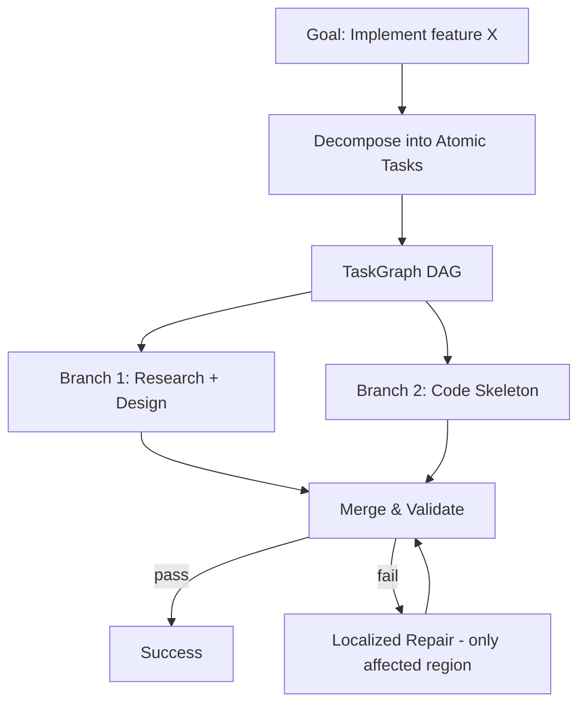

```markdown
# Goblin - Sistema de Grafos e Workflows no Fork do Grok-Build

## Resumo Executivo

Goblin é um fork avançado do harness Grok-Build (repositório nonexphere/grok-build, branch goblin, PR #2) que evolui o modelo atual de agentes conversacionais e "vibe coding" (não-determinístico, baseado em loops de chat + tools livres) para um sistema de **execução estruturada de múltiplos pipelines representados como grafos**. 

O sistema introduz taxonomias explícitas de ações, grafos de tarefas/decisões/estados (DAGs, grafos reativos e event-sourced), blueprints de execução determinística ou semi-determinística, algoritmos de orquestração com suporte a paralelismo, forking barato de branches, reparo localizado, replay completo e controle fino por turno. LLMs são usados apenas como nós especializados e delimitados (nunca controlam o fluxo principal). 

A abordagem combina pesquisa recente (Atomic Task Graph, Blueprint First Model Second, Event-Sourced Reactive Graphs / ActiveGraph, Microsoft Agent Framework workflows, taxonomias da Anthropic e surveys de workflow optimization) com as capacidades existentes do Grok-Build (subagentes paralelos, plan/review/approve, MCP, skills, TUI, headless, Tokio async). 

O desenvolvimento segue estratégia híbrida: prototipagem rápida de lógica de grafos, algoritmos e fluxos em TypeScript/JavaScript (hot-reload instantâneo, visualização fácil), seguida de port para Rust para performance, concorrência segura e integração nativa com o harness. O objetivo final é um harness controlável, auditável, forkável e extensível que permita "dirigir como a IA pensa" em vez de depender de autonomia não-determinística.

## 1. Contexto, Motivação e Objetivos do Projeto

O projeto nasce do fork do usuário (nonexphere/grok-build) e do PR #2 ("feat(goblin): multi-provider Codex auth, finalization, and build loop"), que já introduz multi-provider auth (Codex), request-scoped 401 recovery, prompt cache scoping, model catalog, identidade Grok Build / grok-oss (@brasalabs/grok-oss), scripts de build/install (install-goblin.sh) e documentação de loop de desenvolvimento local.

**Motivação central**:
- Agentes atuais (mesmo avançados como Grok Build) são predominantemente conversacionais e livres: o LLM decide o fluxo de forma não-determinística a cada turno. Isso é "extremamente burro" para tarefas de engenharia complexas que exigem previsibilidade, validação passo a passo, decomposição organizada e controle explícito.
- Necessidade de **pipelines e workflows pré-definidos**, taxonomias de tipos de ações, gráficos de ações/decisões e execução organizada/validada.
- Desejo de **controle fino por turno**: modificar o loop, controlar para onde vai a execução, injetar lógica, forkar agentes/processos em paralelo para mais inteligência computacional e raciocínio dirigido.
- Dores práticas do Rust no harness: compilação demorada, dificuldade de hot-reload de módulos/lógica de agentes. Solução proposta: prototipar fluxos complexos (gráficos, algoritmos de controle, branching) em TS/JS (flexibilidade e velocidade de iteração), validar o modelo mental, depois traduzir a lógica estável para Rust.
- Visão de longo prazo: construir harnesses/agent OS que transcendam chats lineares, suportando interações não-lineares, UIs customizadas, orquestração de múltiplos sistemas/IAs e integração com infraestrutura descentralizada (ex: Forge platform do usuário, blockchain/WebRTC para trackers privados).

**Objetivos**:
- Transformar o harness em um motor de execução de grafos/pipelines com múltiplos algoritmos de scheduling, paralelismo, error handling e forking.
- Suportar tanto workflows determinísticos (blueprints em código) quanto semi-determinísticos (com nós LLM controlados).
- Permitir replay determinístico, forking barato de execuções e lineage completo.
- Manter compatibilidade e estender funcionalidades existentes do Grok-Build (subagentes em paralelo/worktrees, plan mode, MCP servers, skills, AGENTS.md, TUI interativa, headless via ACP).
- Facilitar experimentação rápida (TS) + produção eficiente (Rust).
- Criar taxonomia explícita de ações e grafos para decomposição, categorização e execução organizada.

## 2. Visão Geral da Arquitetura

Arquitetura em camadas sobre o runtime existente do Grok-Build (Rust + Tokio):

- **Camada de Modelo de Grafos**: Definição e representação de pipelines como grafos (DAGs explícitos, grafos reativos/event-sourced, state graphs). Inclui taxonomia de nós (ações) e arestas (dependências, fluxo de controle/dados).
- **Camada de Execução e Orquestração**: Motor de execução com algoritmos de traversal, resolução de dependências, execução paralela de branches independentes, conditional routing, retry, rollback parcial e reparo localizado (inspirado em ATG). Suporte a scheduling, priorização e alocação de recursos.
- **Camada de Estado e Memória**: Event log append-only como source of truth (ActiveGraph style). Grafo de trabalho como projeção determinística do log. Permite replay, forking barato e lineage completo do goal até cada model call ou tool invocation.
- **Camada de Integração com Harness**: Extensão do goblin binary / xai-grok-pager-bin. Reutiliza Tokio async runtime para múltiplos agentes/tasks no mesmo processo (baixa overhead). Integração com subagentes existentes, tool calling, MCP, worktrees (isolamento para forks), TUI (comandos para inspecionar/editar grafos), headless e ACP.
- **Camada de Prototipagem e Extensibilidade**: Camada scriptável (possivelmente via deno_core ou similar embedado) para nós customizados e lógica de grafos que pode ser hot-reloaded durante desenvolvimento. Blueprints definidos em YAML/JSON/TOML ou código-fonte (Source Code Agent style).
- **Camada de Observabilidade e Controle**: Logging estruturado, tracing de lineage, métricas por nó/branch, human-in-the-loop (HITL) em nós específicos, e capacidade de pausar/inspecionar/modificar execução por turno.

O sistema suporta tanto execução batch/headless quanto interativa (TUI com controle por turno). Múltiplos pipelines podem rodar concorrentemente no mesmo processo ou serem forkados em processos/worktrees isolados quando necessário mais poder computacional ou isolamento.

## 3. Modelo de Grafos e Representação de Workflows/Pipelines

### Tipos de Nós (Actions)
Taxonomia explícita de ações (baseada em discussões e papers como ATG, process-centric analysis de code agents, e categorizações de workflows):

- **Decomposition / Planning Nodes**: Goal → TaskGraph (decomposição recursiva em DAG de subtarefas, como ATG). Inclui Plan, Decompose, HierarchicalBreakdown.
- **Execution Nodes**: ExecuteTool, RunCommand, CodeEdit/Patch, FileRead/Write, LLMCall (sempre bounded e com schema de input/output estrito), SubAgentSpawn.
- **Validation / Evaluation Nodes**: Validate, TestRun, ConstraintCheck, Evaluator (ex: self-critique ou comparator).
- **Control Flow Nodes**: Router/Conditional, Fork (cria branch alternativo), Merge/Aggregate (sintetiza resultados de branches paralelos), Loop (controlado, com condição de saída).
- **State / Memory Nodes**: UpdateState, ReadFromLog, ProjectGraph (reconstrói estado a partir do event log).
- **Human / HITL Nodes**: ApprovalGate, RequestInfo.
- **Specialized / Meta Nodes**: SkillInvoke, MCPToolCall, SelfEvolvingWorkflowOptimizer (inspirado em SEW).

Cada nó tem:
- `id`, `type` (da taxonomia), `name`, `description`
- `preconditions` / `effects` (modelados como em STRIPS ou Atomic Task Graph)
- `input_schema`, `output_schema` (JSON Schema ou Rust structs)
- `prompt_template` (para nós LLM, com placeholders estritos)
- `metadata`: effort_level, estimated_cost, timeout, retry_policy, parallel_safe, etc.
- `implementation`: referência a função Rust, script externo ou bounded LLM call.

### Tipos de Arestas (Edges)
- **Dependency Edges** (data flow): "produz output que é input de"
- **Control Flow Edges**: sequential, conditional (com predicate), parallel fan-out, fan-in (com aggregation strategy: vote, merge, reduce)
- **Typed Message Edges**: para comunicação entre subagentes ou subgrafos (inspirado em Microsoft Agent Framework)
- **Event / Reactive Edges**: "reage a evento X no log"

### Propriedades e Metadados do Grafo
- `graph_id`, `version`, `blueprint_source` (código ou YAML que gerou)
- `execution_mode`: deterministic | semi_deterministic | fully_agentic (limitado)
- `state`: projected from event log
- Histórico de evolução do grafo (para repair localizado)
- Lineage completo e causalidade

### Como Pipelines são Modelados como Grafos
- Um **Pipeline** é um grafo (ou composição de subgrafos) com um nó inicial (Goal) e nós terminais (Success/Failure com output agregado).
- **Workflows** podem ser hierárquicos: um nó "Orchestrator" expande para um subgrafo.
- **Blueprints** são definições de grafos em formato declarativo (YAML/JSON/TOML) ou código-fonte compilável/executável de forma determinística. O LLM nunca decide a estrutura do grafo principal.
- Grafos podem ser **reativos/event-sourced**: o log é append-only; o grafo de execução é reconstruído deterministicamente a partir dele. Isso permite forking a partir de qualquer evento sem re-executar o prefixo.

Exemplo conceitual de estrutura de grafo (Mermaid):


## 4. Algoritmos de Execução, Scheduling e Orquestração

### Algoritmos Principais
- **Topological Traversal + Dependency Resolution** (para DAGs): Kahn's algorithm ou DFS com detecção de ciclos. Usado em ATG para decomposição recursiva.
- **Parallel Execution of Independent Branches**: Identifica nós sem dependências pendentes e executa concorrentemente via Tokio tasks (múltiplos agentes no mesmo processo com baixa overhead). Aggregation em fan-in nodes.
- **Conditional / Router Execution**: Avalia predicates em edges (pode ser função Rust pura ou bounded LLM classifier).
- **Retry, Rollback e Error Handling**: Por-nó retry policy. Rollback parcial de efeitos (usando effects declarados). Error localization no grafo (ATG style) → repair apenas da região afetada, preservando validated regions.
- **Forking Algorithm**: A partir de qualquer evento no log, cria novo branch do grafo (cópia shallow do prefixo + novo contexto). Barato porque não re-executa shared prefix (Event-Sourced Reactive Graphs).
- **Scheduling**: Priority-based ou resource-aware (ex: nós com alto effort vão para workers com mais contexto). Suporte a worktrees para isolamento quando forking para processos separados.
- **Self-Evolving / Optimization** (futuro, inspirado em SEW): Algoritmo que analisa execuções passadas no log e propõe melhorias na estrutura do grafo ou prompts de nós.

### Tabela Comparativa de Abordagens de Execução

| Abordagem              | Determinismo | Paralelismo | Forking | Repair | Replay | Custo LLM | Recomendado para |
|------------------------|--------------|-------------|---------|--------|--------|-----------|------------------|
| Pure Conversational (atual Grok-Build) | Baixo       | Limitado   | Caro   | Difícil | Parcial | Alto     | Tarefas abertas |
| Blueprint + Deterministic Engine | Alto        | Bom        | Barato | Localizado | Completo | Baixo (bounded) | Workflows estruturados |
| Atomic Task Graph (ATG) | Médio-Alto  | Excelente  | Bom    | Excelente | Bom    | Médio    | Planejamento multi-step com dependências |
| Event-Sourced Reactive (ActiveGraph) | Alto     | Excelente  | Excelente | Bom   | Excelente | Médio    | Auditabilidade + forking frequente |
| Microsoft Agent Framework Workflows | Alto     | Bom        | Médio  | Bom    | Bom    | Médio    | Integração enterprise + graph edges tipados |

## 5. Tipos de Pipelines e Workflows Suportados

- **Linear / Sequential Pipelines**: Passos fixos com validação entre eles (Prompt Chaining style da Anthropic).
- **Parallel Fan-out / Fan-in**: Decomposição em branches independentes + agregação (Orchestrator-workers pattern).
- **Hierarchical / Recursive**: Decomposição em TaskGraph (ATG) com sub-pipelines.
- **Conditional / Routing Workflows**: Decisões explícitas em nós/edges (Routing pattern).
- **Blueprint-Driven Deterministic**: Execução de blueprint em código-fonte (Blueprint First Model Second). LLM só em sub-tarefas bounded.
- **Reactive / Event-Driven**: Baseado em event log; behaviors reagem a mudanças no grafo.
- **Self-Evolving Workflows**: Geração/otimização automática da estrutura do grafo (SEW style) a partir de histórico de execuções.
- **Multi-Agent Collaborative Graphs**: Subgrafos por agente com comunicação via typed edges ou shared event log.
- **Interactive / Per-Turn Control**: No TUI, usuário inspeciona estado do grafo por turno, injeta decisões, força forks ou modifica routing.

## 6. Componentes Principais do Sistema e Responsabilidades

- **Graph Definition / Blueprint Engine**: Parseia definições (YAML/JSON ou código). Valida taxonomia, schemas e preconditions. Gera grafo inicial.
- **Graph Runtime / Executor**: Gerencia ciclo de vida dos nós, executa traversal, dispara tasks Tokio, gerencia contexto por branch.
- **Event Log Store**: Append-only log (fonte da verdade). Suporta persistência (arquivo + index ou SQLite) e projeção em-memória do grafo.
- **State Projector**: Reconstrói estado atual do grafo a partir do log (deterministicamente).
- **Fork Manager**: Cria branches a partir de eventos. Gerencia isolamento (mesmo processo vs worktree/processo filho).
- **Scheduler**: Decide ordem/execução paralela. Integra com resource limits do harness.
- **Error Handler & Repair Engine**: Localiza falhas no grafo, aplica retry/rollback e repara região afetada.
- **Integration Layer (Grok-Build)**: Hooks para tool calling existente, subagent spawning, MCP invocation, TUI commands (/graph inspect, /fork, /pause), headless ACP.
- **Observability Module**: Lineage tracing, métricas por nó, export para logging/TUI.
- **Scriptable Node Runtime** (dev): Camada para hot-reload de lógica de nós/grafos (via deno_core ou cdylib + hot-lib-reloader).

## 7. Integração com o Harness Grok-Build

**O que será forkado / estendido**:
- Branch `goblin` e binary `goblin` (em vez de `grok`).
- Módulos existentes: codex auth/multi-provider, sampler, model catalog, prompt cache, wire protocol handling.
- Runtime Tokio para concorrência de múltiplos agentes/tasks no mesmo processo.
- Suporte a worktrees (já usado para subagentes isolados) → estendido para forks de branches de grafo.
- TUI interativa → adicionados comandos para visualizar/editar/inspecionar grafos em tempo real e controle por turno.
- Headless mode e ACP → expostos endpoints para submissão/execução de pipelines como grafos.
- MCP servers e skills → expostos como nós nativos ou ferramentas invocáveis por nós Execution.

**Interação**:
- Um pipeline/grafo pode spawnar subagentes Grok-Build existentes como nós especializados.
- O event log captura todas as interações (model calls, tool uses, edits) para lineage completo.
- Plan/review/approve do Grok-Build pode ser mapeado para nós específicos do grafo (ex: Plan node → Review node com HITL).
- Multi-provider auth e prompt cache do PR #2 são reutilizados para nós LLM.

## 8. Interfaces, Contratos e Esquemas

**Rust (principal)**:
```rust
// Exemplo de traits e structs principais (conceitual)
pub trait Node {
    fn id(&self) -> NodeId;
    fn node_type(&self) -> ActionType; // enum da taxonomia
    fn execute(&self, ctx: &mut ExecutionContext) -> Result<NodeOutput, NodeError>;
    fn preconditions(&self) -> Vec<Precondition>;
    // ...
}

pub struct Graph {
    nodes: HashMap<NodeId, Box<dyn Node>>,
    edges: Vec<Edge>,
    event_log: EventLog,
}

pub struct Edge {
    from: NodeId,
    to: NodeId,
    edge_type: EdgeType, // Dependency, ControlFlow(Conditional), etc.
    condition: Option<Box<dyn Fn(&State) -> bool>>,
}

pub trait Executor {
    fn run(&self, graph: &Graph, goal: Goal) -> ExecutionResult;
    fn fork_at(&self, event_id: EventId) -> Graph; // cheap fork
}
```

**Definição de Blueprints** (YAML/JSON/TOML ou código):
Exemplos no Apêndice.

**Contratos internos**:
- Todos os nós devem declarar input/output schemas estritos.
- Efeitos colaterais devem ser declarados (para rollback e repair).
- Determinism contract para replay (Event-Sourced).

## 9. Fluxos de Execução e Casos de Uso Principais

**Fluxo principal (exemplo de feature implementation)**:
1. Usuário submete Goal via CLI/TUI ou headless.
2. Blueprint Engine carrega ou gera TaskGraph (decomposição).
3. Executor faz topological sort + identifica branches paralelos.
4. Executa branches independentes concorrentemente (Tokio tasks ou subagentes).
5. Merge/Aggregate + Validation nodes.
6. Se falha → Repair Engine localiza região afetada no grafo → re-executa só aquela parte.
7. Sucesso → output agregado + registro completo no event log.

**Caso de uso interativo (TUI)**:
- Usuário vê grafo visual (ou textual).
- A cada turno/nó relevante, pode inspecionar estado, forçar fork de um branch para testar abordagem alternativa, injetar decisão manual ou pausar.
- Controle explícito sobre "para onde vai" a execução.

**Outros casos**:
- Incident diagnosis com SOP (Standard Operating Procedure) em blueprint determinístico.
- Pesquisa + síntese multi-fonte com parallel research branches + merge.
- Code generation com localization → patch → test → repair loop estruturado.

## 10. Decisões de Design Tomadas + Justificativas

- **Uso de Event Log como source of truth + grafo como projeção**: Permite replay perfeito, forking barato e lineage completo (decisão chave para auditabilidade e forking, alinhada com interesse do usuário em forks paralelos para mais inteligência).
- **LLM apenas em nós bounded com schemas estritos (Blueprint First)**: Reduz não-determinismo no fluxo principal. LLM vira ferramenta especializada.
- **Estratégia híbrida TS → Rust**: Aceita dor de compilação Rust em troca de iteração rápida na lógica complexa de grafos/algoritmos durante prototipagem. Validação do fluxo antes de portar.
- **Suporte a múltiplos algoritmos de execução no mesmo harness**: Flexibilidade (deterministic blueprint vs ATG-style parallel repair vs fully reactive).
- **Taxonomia explícita de ações + grafos**: Permite decomposição organizada, categorização e execução validada passo a passo (responde diretamente à crítica ao vibe coding).
- **Reutilização pesada do Grok-Build existente** (Tokio, subagentes, MCP, worktrees, TUI): Evita reimplementar o que já funciona bem; foca em adicionar camada de orquestração por grafos.

## 11. Alternativas Consideradas e Status

- **Manter modelo puramente conversacional / vibe coding**: Rejeitado. Muito não-determinístico para tarefas estruturadas.
- **Hot-reload nativo só com cdylib + hot-lib-reloader no Rust**: Considerado viável para partes da lógica, mas complexo para estado e ABI. Preferida abordagem híbrida + scriptable nodes.
- **Implementar tudo em Python (LangGraph style)**: Rejeitado por performance, concorrência e integração com harness Rust existente.
- **Workflows puramente estáticos sem LLMs**: Rejeitado; mantém poder dos modelos em nós delimitados.
- **Graph-of-Thoughts / Tree-of-Thoughts puros**: Considerados como baseline; evoluídos para Atomic Task Graph + event-sourced para melhor repair e forking.

Status atual: Fase de pesquisa e design de alto nível. PR #2 já estabelece base de build/dev loop e multi-provider.

## 12. Considerações de Implementação

**Persistência**:
- Event log append-only (formato binário ou JSON lines + índice). Projeção em memória do grafo atual.
- Opção de snapshot periódico do grafo projetado.
- Para produção: integração com storage existente do harness ou SQLite.

**Performance e Concorrência**:
- Tokio async tasks por nó/branch independente (múltiplos agentes no mesmo processo — confirmado viável e eficiente).
- Evitar lock contention no event log (append-only é natural para isso).
- Parallel execution de branches independentes reduz latência total.

**Observabilidade**:
- Todo evento no log carrega contexto completo (causalidade).
- TUI com visualização de grafo em tempo real + lineage.
- Export estruturado para ferramentas externas.

**Hot-reload / Dev Experience**:
- Durante prototipagem: lógica de grafos/algoritmos em TS (Bun/Deno) com hot-reload.
- Em Rust: cargo watch + check rápido; eventualmente scriptable nodes ou cdylib para partes quentes.

## 13. Extensibilidade, MCP, Multi-agent e Roadmap Futuro

- **MCP**: MCP servers expostos como nós Execution ou ferramentas invocáveis. Suporte nativo a discovery de tools via MCP.
- **Multi-agent**: Subgrafos por agente ou grafo compartilhado com typed message passing. Integração com A2A (Agent-to-Agent) quando disponível.
- **Extensibilidade**: Traits para novos tipos de nós/algoritmos de execução. Plugin system via cdylib ou scripts.
- **Roadmap**:
  1. Definir taxonomia completa de ações e schemas.
  2. Implementar modelo de grafo + event log básico em Rust (estendendo goblin).
  3. Protótipo de executor DAG + parallel branches (TS primeiro).
  4. Integração com TUI e comandos de controle por turno / fork.
  5. Suporte a blueprints YAML + bounded LLM nodes.
  6. Repair localizado e forking.
  7. Self-evolving workflows + visual graph tools.
  8. Integração profunda com Forge platform do usuário.

## 14. Riscos, Desafios Técnicos e Questões em Aberto

- Complexidade de gerenciar estado consistente durante forks e partial repairs.
- Garantir determinism contract para replay (especialmente com nós LLM não-determinísticos).
- Overhead de projeção de grafo a partir de log muito grande.
- Definição precisa da taxonomia de ações (pode evoluir).
- Integração sem quebrar funcionalidades existentes do Grok-Build (backward compatibility).
- Experiência do usuário na TUI para grafos complexos (precisa ser intuitiva).
- Questões em aberto: Melhor formato para blueprints (código vs declarativo)? Como versionar grafos evoluídos? Estratégia exata de hot-reload em produção vs dev?

## 15. Próximos Passos e Sugestões de Implementação

1. **Imediato**: Documentar taxonomia completa de ações (tabela com id, descrição, preconditions, effects, schemas).
2. **Curto prazo**: Criar protótipo em TypeScript do modelo de grafo + executor DAG básico + event log simples. Validar fluxos de decompose → parallel → merge → repair.
3. **Médio prazo**: Portar modelo e executor básico para Rust no branch goblin. Estender binary goblin com subcomandos `/graph run`, `/graph fork`, `/graph inspect`.
4. **Integração**: Adicionar hooks no runtime existente para capturar eventos no log central.
5. **Validação**: Testar com casos de uso reais do usuário (code generation estruturado, incident response).
6. Sugestão: Começar pelo componente mais impactante para o usuário — o Fork Manager + Event Log (atende diretamente ao desejo de forkar para mais inteligência paralela e controle).

## Apêndice

### Pseudocódigos e Trechos de Código Discutidos

**Exemplo simplificado de execução ATG-style (pseudocódigo)**:
```python
def execute_atg(goal):
    task_graph = decompose_recursively(goal)  # retorna DAG
    while not all_done(task_graph):
        ready_nodes = get_ready_independent_nodes(task_graph)
        results = execute_in_parallel(ready_nodes)  # Tokio tasks
        update_graph(task_graph, results)
        if failure_detected:
            affected_region = localize_error(task_graph)
            repair_only(affected_region)  # preserva validated regions
    return aggregate_final(task_graph)
```

**Exemplo de Fork (inspirado em Event-Sourced)**:
```rust
fn fork_at_event(&self, event_id: EventId) -> Graph {
    let prefix = self.event_log.up_to(event_id);
    let new_graph = self.state_projector.project(&prefix);
    // Adiciona novo branch context sem re-executar prefixo
    new_graph
}
```

### Exemplos de Definição de Pipelines

**YAML Blueprint simples (conceitual)**:
```yaml
name: feature_implementation
version: 1.0
mode: deterministic
nodes:
  - id: decompose
    type: Decompose
    prompt: "Decompose the goal into atomic tasks with dependencies"
  - id: research_branch
    type: ParallelBranch
    depends_on: [decompose]
  - id: code_branch
    type: ParallelBranch
    depends_on: [decompose]
  - id: merge
    type: Merge
    strategy: synthesize
    depends_on: [research_branch, code_branch]
edges:
  - from: decompose
    to: research_branch
    type: control
  # ...
```

### Diagramas Mermaid (descrições para gerar)

1. Visão geral da arquitetura em camadas.
2. Exemplo de TaskGraph com branches paralelos e repair.
3. Fluxo de forking a partir de event log.
4. Integração com componentes existentes do Grok-Build.

### Glossário de Termos

- **Blueprint**: Definição declarativa ou em código de um workflow/grafo (executado deterministicamente).
- **Event Log**: Log append-only que serve como source of truth; grafo é projeção dele.
- **Fork**: Criação de branch alternativo a partir de um ponto específico da execução (barato via event log).
- **Localized Repair**: Reparo apenas da região afetada do grafo, preservando partes validadas.
- **TaskGraph / Atomic Task Graph (ATG)**: Grafo explícito de dependências entre subtarefas com suporte a decomposição recursiva e execução paralela.
- **Taxonomia de Ações**: Conjunto categorizado e tipado de tipos de nós (ações) com preconditions/effects/schemas.
- **Workflow vs Agent** (Anthropic): Workflows têm controle de fluxo predefinido (previsível); Agents deixam o LLM decidir o fluxo (mais autônomo, menos previsível).

---

*Documento gerado para handoff. Pronto para ser usado como contexto principal por outro agente de codificação ou gerador de specs técnicas.*
```
