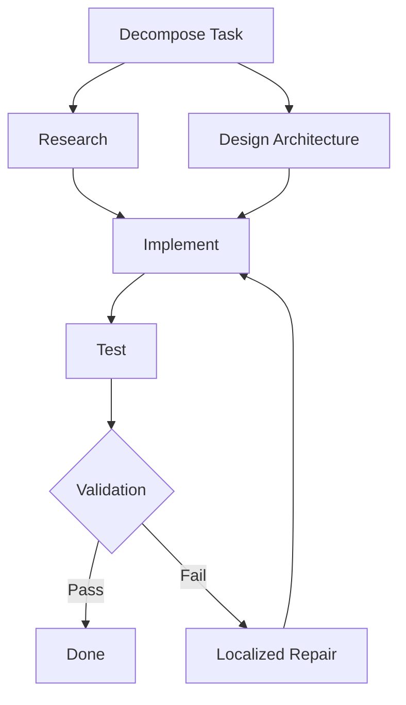

```markdown
# Goblin - Sistema de Grafos e Workflows no Fork do Grok-Build

## Resumo Executivo

Goblin é um fork do harness grok-build (branch `goblin` do repositório `nonexphere/grok-build`) que evolui o modelo atual de agentes conversacionais livres para um sistema estruturado de **pipelines executáveis representados como grafos**. 

O objetivo central é substituir loops não-determinísticos ("vibe coding") por workflows pré-definidos, taxonomias de ações, grafos de decisão/ação explícitos (DAGs e StateGraphs), execução controlada por turno, paralelismo seguro, reparo localizado, validação por etapa e orquestração multi-agente. 

O sistema combina:
- **Core em Rust** (eficiência, concorrência via Tokio, múltiplos agentes no mesmo processo, baixo overhead).
- **Prototipagem em TypeScript** (validação rápida de fluxos, graphs e algoritmos antes do port para Rust).
- Integração com o trabalho existente do PR #2 (multi-provider Codex auth, harness identity "Grok Build", session/turn handling, sampler, local build loop via `install-goblin.sh`).
- Suporte a taxonomias (Act·ONOMY e adaptada para coding), algoritmos de planejamento (ATG, GATS), padrões de orquestração (Microsoft Agent Framework / LangGraph) e extensibilidade via MCP e skills.

O resultado é um harness mais controlável, auditável, eficiente e direcionado, capaz de conectar múltiplas IAs/providers, executar pipelines complexos de code generation/repair e suportar forking paralelo controlado para maior inteligência computacional.

## 1. Contexto, Motivação e Objetivos do Projeto

### Contexto
O projeto surge da insatisfação com agentes LLM atuais, predominantemente conversacionais e não-determinísticos (loops livres do tipo ReAct). O usuário (desenvolvedor com background em Federal Police, infraestrutura Docker/Ansible, customização de Codex CLI/app-server, plataforma Forge e specs de agentes como Globin/Goblin) está construindo um fork avançado do grok-build chamado **goblin**.

O PR #2 (`feat(goblin): multi-provider Codex auth, finalization, and build loop`) já avançou:
- Multi-provider authentication (Codex + outros).
- Harness identity fixa no system prompt ("Grok Build").
- Melhorias em session lifecycle, turn handling e sampler.
- Local dev loop prático (`cargo build -p xai-grok-pager-bin --bin goblin` + `install-goblin.sh` que prioriza o binário mais recente em `target/{debug,release}`).

### Motivação
- Agentes "livres" divagam, alucinam e são difíceis de controlar/validar por turno.
- Compilação Rust lenta dificulta iteração rápida → necessidade de hot reload prático + prototipagem em TS.
- Necessidade de **controle explícito** sobre o raciocínio da IA a cada turno.
- Desejo de **mais inteligência via paralelismo controlado** (forks de sub-agentes com roles diferentes, aggregation).
- Conectar múltiplos sistemas/IAs de forma estruturada (multi-provider).
- Evoluir de chat para **sistemas de pipelines executáveis** com grafos, taxonomias e algoritmos bem definidos.

### Objetivos Principais
- Modelar pipelines/workflows como **grafos explícitos** (Task Graphs, Execution DAGs, StateGraphs, Workflow Graphs).
- Suportar **taxonomias de ações/skills** reutilizáveis (base Act·ONOMY + adaptação para coding).
- Implementar **algoritmos de execução** determinísticos ou semi-determinísticos (decomposição recursiva, topological sort, parallel branches, localized repair, reflection).
- Permitir **controle fino por turno** (state machine explícita em vez de loop livre).
- Executar múltiplos agentes/sub-agentes **no mesmo processo** com eficiência (Tokio tasks, channels, shared state seguro).
- Facilitar iteração rápida (TS prototype → validação → port Rust; hot reload via WASM/scripting ou fast rebuild).
- Manter compatibilidade e estender o harness existente (CLI/TUI goblin, multi-provider, harness identity, skills em `.agents/skills/`).
- Suportar extensibilidade via MCP, multi-agent orchestration e roadmap futuro (graphs dinâmicos, self-evolving workflows).

## 2. Visão Geral da Arquitetura

O sistema segue uma arquitetura híbrida **Rust Core + TS Prototyping Layer** com grafos como primeira classe.

**Camadas principais**:
- **Rust Runtime Core** (goblin binary): Session/Turn handling, Graph Executor, Skill Registry, Multi-provider Auth, Sampler, Tokio-based concurrency.
- **Graph & Workflow Layer**: Representação e execução de pipelines como grafos (StateGraph + Execution DAG inspirado em ATG).
- **Taxonomy & Skill Layer**: Classificação e execução de ações via taxonomia (Act·ONOMY adaptada).
- **Orchestration Layer**: Padrões de multi-agente (Supervisor, Orchestrator-Worker, Handoff, Magentic-style).
- **Prototyping & Validation Layer** (TS/Bun): Rápida iteração em graphs, control flows e algoritmos antes do port.
- **Dev & Hot Reload Layer**: `install-goblin.sh` + cargo watch + WASM/script embed para partes dinâmicas.
- **Integration Layer**: MCP, tool calling, memory (in-memory + possível vector/context graph), HITL checkpoints.

**Princípios de Design**:
- **Explicit over Implicit**: Grafos e dependências declaradas em vez de raciocínio puramente textual.
- **Control per Turn**: Cada turno avança explicitamente via state machine/graph traversal.
- **Determinism where Possible**: Localized repair, topological execution, pre-validation, world models (GATS-style).
- **Parallelism Controlled**: Branches independentes executadas em paralelo no mesmo processo quando seguro.
- **Composability & Reuse**: Skills/taxonomia + subgraphs reutilizáveis.
- **Handoff-friendly**: Documentação e contratos claros para continuação por outro agente.

## 3. Modelo de Grafos e Representação de Workflows/Pipelines

### Tipos de Grafos Suportados (Taxonomia consolidada)

| Categoria              | Nome                        | Descrição                                                                 | Exemplo / Referência                  | Papel Principal                          |
|------------------------|-----------------------------|---------------------------------------------------------------------------|---------------------------------------|------------------------------------------|
| Estrutural / Execução  | State Graph                 | Nós (estados/ações), edges condicionais/loops, estado compartilhado      | LangGraph StateGraph, Microsoft GraphFlow | Controle de fluxo + persistência de estado |
| Estrutural / Execução  | Workflow Graph              | Fluxo com ramificações, aprovação, loops, conditional routing            | Microsoft Agent Framework, Dify      | Orquestração explícita (seq/parallel/cond) |
| Execução / Dependência | Execution Order Graph (DAG) | DAG acíclico para ordem topológica + paralelismo                         | ATG (Atomic Task Graph)              | Execução ordenada + branches paralelos   |
| Planejamento           | Task Graph                  | Nós = tarefas/subtarefas, edges = dependências/pré-requisitos            | Hierarchical Task Networks, ATG      | Decomposição do objetivo                 |
| Planejamento Avançado  | Atomic Task Graph (ATG)     | DAG de unidades atômicas de tool-use com I/O dependencies explícitas     | arXiv:2607.01942                     | Decomposição recursiva + reparo localizado |
| Busca / Exploração     | Graph-Augmented Tree Search | Árvore de busca + grafo de mundo em camadas (symbolic + stats + LLM)     | GATS (arXiv:2607.08894)              | Planejamento eficiente e mais determinístico |
| Memória / Conhecimento | Knowledge Graph / Context Graph | Entidades, relações semânticas e transições vivas                        | Graph RAG, Context Graphs            | Memória de longo prazo e proativa        |
| Reativo / Auditável    | Reactive / Event-Sourced Graph | Event log append-only com projeção determinística                        | ActiveGraph                          | Replay, lineage, forking                 |
| Híbrido                | Agentic Computation Graph (ACG) | Nós = ações atômicas (LLM/tool/verifier), edges = data/control deps     | Surveys de workflow optimization     | Unificação de workflows executáveis      |

**Taxonomia simples recomendada para uso prático**:
1. Knowledge/Context Graph (significado e memória)
2. Task Graph (o que fazer)
3. Execution DAG (ordem + paralelismo)
4. Workflow Graph (fluxo com controle)
5. State Graph (estado atual e transições)

### Como Pipelines são Modelados como Grafos
- Um **pipeline** é um grafo direcionado (DAG ou StateGraph com loops controlados).
- **Nós** representam:
  - Ações atômicas (skills da taxonomia).
  - Subtarefas / subgraphs.
  - Pontos de decisão/branching.
  - Verificadores / evaluators / reflectors.
  - HITL checkpoints.
- **Arestas** representam:
  - Dependências de dados (output de um node → input de outro).
  - Dependências de controle (condicionais, loops, parallel merge).
  - Ordem topológica.
- **Metadados por node/edge**:
  - Tipo de skill/ação (da taxonomia).
  - Input/output schema (JSON Schema ou Zod em TS).
  - Condições de execução / guards.
  - Retry policy, timeout, fallback.
  - Confidence / validation status.
  - Execution history (para repair).

Exemplo conceitual de pipeline de code generation:
```
Task: "Implementar feature X"
├── Decompose (Task Graph node)
│   ├── Research requirements
│   ├── Design architecture (subgraph)
│   └── Create plan
├── Execute Plan (Execution DAG)
│   ├── Implement core logic (parallel branches)
│   ├── Write tests
│   └── Review & Refactor
└── Validate & Repair (loop condicional)
```

## 4. Algoritmos de Execução, Scheduling e Orquestração

### Algoritmos Principais
- **Decomposição Recursiva + Topological Sort** (ATG-style): Quebra tarefa em DAG atômico preservando interfaces input/output. Executa em ordem topológica; branches independentes em paralelo.
- **Graph-Augmented Tree Search (GATS)**: Combina UCB1 tree search com layered world model (L1: symbolic matching, L2: stats de logs, L3: LLM prediction). Reduz drasticamente chamadas LLM durante planejamento.
- **Localized / Minimal Subgraph Repair**: Em falha, identifica subgraph afetado via graph history e re-executa apenas ele (preserva partes validadas).
- **Parallel Execution com Merge**: Branches independentes rodam em paralelo (Tokio tasks ou Promise.all em TS). Resultados agregados por reducer (LLM synthesis, voting ou heuristic).
- **Reflection / Self-Evaluation Loops**: Nodes de reflection após execução ou falha (inspirado em Reflexion).
- **Conditional Routing + Handoff**: Supervisor decide próximo node/agent baseado em estado/output.
- **Retry + Rollback**: Políticas por node/edge com backoff e possível rollback de efeitos.
- **Scheduling**: Prioridade por criticidade, dependências, custo estimado ou confidence.

### Comparação de Abordagens de Execução

| Abordagem              | Determinismo | Paralelismo | Repair          | Custo LLM | Adequado para                  |
|------------------------|--------------|-------------|-----------------|-----------|--------------------------------|
| ReAct Linear           | Baixo        | Baixo       | Global          | Alto      | Tarefas simples                |
| Plan-and-Execute       | Médio        | Médio       | Global          | Médio     | Tarefas estruturadas           |
| ATG (Atomic Task Graph)| Alto         | Alto        | Localizado      | Médio     | Code gen, long-horizon         |
| GATS                   | Muito Alto   | Médio       | N/A (pre-planning) | Baixo  | Planejamento eficiente         |
| StateGraph + Conditional | Alto       | Alto        | Parcial         | Variável  | Workflows com controle fino    |
| Graph-of-Thoughts      | Médio        | Médio       | Via backtracking| Alto      | Exploração de raciocínio       |

## 5. Tipos de Pipelines e Workflows Suportados

- **Code Generation & Repair Pipelines**: Decompose → Research → Design → Implement (parallel) → Test → Review → Refactor → Validate (com repair localizado).
- **Research & Synthesis Pipelines**: Parallel researcher agents → Synthesis node.
- **Multi-Agent Debate / Ensemble**: Parallel sub-agents com roles diferentes → Aggregation.
- **Long-Horizon Task Workflows**: StateGraph com checkpoints e HITL.
- **Dynamic / Adaptive Workflows**: Graph gerado ou modificado em runtime (com guardrails).
- **Skill Composition Pipelines**: Reutilização de skills da taxonomia em diferentes grafos.

## 6. Componentes Principais do Sistema e Responsabilidades

- **Graph Executor / Runtime**: Traversal, scheduling, parallel execution, state management (Rust + Tokio).
- **Planner / Decomposer**: ATG-style recursive decomposition e GATS world model.
- **Skill Registry & Executor**: Carrega/executa skills categorizadas pela taxonomia (code-backed preferencial).
- **Session / Turn Manager**: Controla avanço por turno, mantém contexto e graph history.
- **Orchestrator (Supervisor)**: Decide routing, spawning de sub-agents, handoff.
- **Memory Manager**: In-memory + Knowledge/Context Graph + compaction (account-scoped prompt_cache_key do PR).
- **Multi-Provider Auth Layer**: Do PR #2 — credential-scoped, attempt_id, recovery.
- **Harness Identity Enforcer**: Garante system prompt "Grok Build".
- **Validation & Repair Engine**: Evaluators, localized repair.
- **Dev Loop Support**: Fast rebuild + launcher (install-goblin.sh).
- **Prototyping Layer (TS)**: Validação rápida de graphs e algoritmos.

## 7. Integração com o Harness Grok-Build

### O que será forkado / estendido
- Branch `goblin` como principal.
- Crates existentes: `xai-grok-multi-auth`, `xai-grok-sampler`, `xai-grok-pager-bin`, `acp_session_impl`.
- `.agents/skills/` (expandir com taxonomia Act·ONOMY).
- System prompt handling (fixar identidade harness).
- Local build & test loop (`install-goblin.sh`).

### Como os pipelines interagem
- **CLI/TUI goblin**: Expõe comandos para carregar/executar pipelines definidos como graphs (ex: `goblin run-pipeline feature-impl.yaml`).
- **Session/Turn**: Cada turno do agente pode acionar avanço no grafo atual.
- **Sampler**: Integrado ao Graph Executor para chamadas LLM controladas.
- **Threads / Concorrência**: Múltiplos sub-agents como Tokio tasks no mesmo processo.
- **MCP**: Extensão futura para tool integration e context protocol.
- **App-server / Electron**: Possível embedding futuro para remote control.

## 8. Interfaces, Contratos e Esquemas

**Exemplo de Structs (Rust-inspired)**:

```rust
// Pseudocódigo / Conceito
pub struct GraphNode {
    id: String,
    node_type: NodeType, // Task, Skill, Decision, Verifier, etc.
    skill_id: Option<String>, // referência à taxonomia
    input_schema: JsonSchema,
    output_schema: JsonSchema,
    metadata: HashMap<String, Value>,
}

pub struct GraphEdge {
    from: String,
    to: String,
    edge_type: EdgeType, // DataDependency, ControlFlow, Conditional
    condition: Option<String>,
}

pub struct PipelineGraph {
    nodes: HashMap<String, GraphNode>,
    edges: Vec<GraphEdge>,
    entry_point: String,
    metadata: PipelineMetadata, // version, author, taxonomia version
}

pub trait GraphExecutor {
    async fn execute_turn(&mut self, state: &mut ExecutionState) -> Result<StepResult>;
    async fn repair_subgraph(&mut self, failed_node: &str) -> Result<()>;
}
```

**TS Protótipo (exemplo de schema)**:
- Usar Zod para schemas de nodes/edges.
- Graph representado como objeto com nodes + edges.

## 9. Fluxos de Execução e Casos de Uso Principais

**Fluxo Principal de um Turn Controlado**:
1. Recebe input / goal.
2. Planner (ATG/GATS) atualiza ou cria subgraph.
3. Graph Executor avança topologicamente (paralelo onde possível).
4. Executa skill/action do node.
5. Valida output (evaluator / schema).
6. Reflection se necessário.
7. Atualiza estado + graph history.
8. Decide próximo (routing ou fim do pipeline).

**Caso de Uso Principal**: Code feature implementation pipeline com parallel research + implement + test branches e localized repair.

## 10. Decisões de Design Tomadas + Justificativas

- **Híbrido TS → Rust**: Validação rápida de fluxos complexos em TS; performance e concorrência em Rust.
- **Grafos explícitos (ATG + StateGraph)**: Controle, reparo localizado, paralelismo e auditabilidade superiores ao ReAct linear.
- **Taxonomia Act·ONOMY como base**: Padronização de ações para reusabilidade e análise.
- **Mesmo processo com Tokio**: Eficiência para múltiplos agentes (evita overhead de processos).
- **Harness identity fixa**: Consistência de comportamento independentemente do model provider.
- **Dev loop via install-goblin.sh + cargo watch**: Resolve dor de compilação lenta sem full hot-swap inicial.
- **Localized repair + graph history**: Eficiência e robustez em long-horizon tasks.

## 11. Alternativas Consideradas e Status

- **ReAct puro**: Rejeitado por ser não-determinístico e difícil de controlar por turno.
- **Plan-and-Execute simples**: Considerado, mas insuficiente para reparo granular e paralelismo dinâmico.
- **Graph-of-Thoughts puro**: Útil para exploração, mas combinado com ATG para execução.
- **Full dynamic graph generation por LLM**: Evitado inicialmente (risco de não-determinismo); permitido apenas com guardrails fortes.
- **Multi-processo para isolamento**: Considerado, mas priorizado mesmo-processo por performance (pode ser opção futura para untrusted agents).

## 12. Considerações de Implementação

### Persistência
- Graph definition (YAML/TOML/JSON ou struct serializado).
- Execution state + history (snapshot + event log para replay/repair).
- Skill registry persistente com versioning.

### Performance & Concorrência
- Tokio multi-thread runtime para tasks paralelas.
- Shared state via Arc<RwLock> ou actor model.
- Evitar context bloat (compaction account-scoped como no PR).

### Observabilidade
- Logging estruturado por node/turn.
- Graph visualization (Mermaid export ou UI).
- Metrics de execução, confidence, repair frequency.

## 13. Extensibilidade, MCP, Multi-agent e Roadmap Futuro

- **MCP Integration**: Para tool/context protocol padronizado.
- **Multi-agent**: Suporte nativo a sub-agents paralelos com roles da taxonomia + aggregation.
- **Roadmap**:
  - Fase 1: Graph Executor básico + taxonomia + integração session atual.
  - Fase 2: ATG/GATS planner + localized repair.
  - Fase 3: Hot reload avançado (WASM nodes ou scripting).
  - Fase 4: Self-evolving graphs + aprendizado de workflows.
  - Fase 5: Visual graph editor + HITL UI.

## 14. Riscos, Desafios Técnicos e Questões em Aberto

- **Complexidade de Graph Management**: Custo de manter graph history e repair logic.
- **Hot Reload Real**: Ainda limitado em Rust puro (WASM/scripting como mitigação).
- **Balanceamento Determinismo vs Flexibilidade**: Evitar over-constraint que limite capacidades do LLM.
- **Schema Evolution**: Versionamento de nodes/edges quando pipelines evoluem.
- **Debuggabilidade de Grafos Dinâmicos**: Ferramentas de visualização e stepping.
- **Questões em Aberto**:
  - Nível exato de granularidade dos nodes atômicos.
  - Estratégia de aggregation de resultados de sub-agentes paralelos.
  - Como expor criação/edição de pipelines via TUI/CLI.

## 15. Próximos Passos e Sugestões de Implementação

1. Definir taxonomia de ações específica para coding agents (base Act·ONOMY + SWE patterns).
2. Implementar protótipo em TS de um Execution DAG + StateGraph simples para validar fluxo de code gen.
3. Mapear e estender crates do PR #2 (`acp_session_impl`, sampler) para integrar Graph Executor.
4. Criar primeiro pipeline exemplo (feature implementation) como TOML/YAML + graph definition.
5. Adicionar Graph visualization export (Mermaid) para debugging.
6. Testar localized repair em cenário de falha parcial.
7. Avaliar integração com MCP para tools.

## Apêndice

### Pseudocódigos e Trechos de Código Discutidos

**Exemplo de Turn Loop Controlado (conceitual)**:
```python
# Pseudocódigo
state = load_or_init_state(goal)
graph = planner.decompose_or_update(state)  # ATG-style

while not graph.is_complete():
    current_nodes = graph.get_ready_nodes()  # topological + parallel
    results = await execute_parallel(current_nodes, state)  # Tokio tasks
    state.update(results)
    
    if failure_detected:
        graph = repair_engine.repair_subgraph(graph, failed_node, history)
    
    graph.advance()  # apply edges, update state
    reflect_if_needed(state)
    
    if hitl_checkpoint:
        await human_input(state)
```

**Exemplo de Decomposição ATG-style**:
```python
def decompose(task):
    atomic_units = []
    for sub in recursive_decompose(task):
        atomic = make_atomic(sub)  # tool-use unit with I/O contract
        atomic_units.append(atomic)
    dag = build_dag_with_dependencies(atomic_units)
    return dag
```

### Exemplos de Definição de Pipelines (YAML conceitual)
```yaml
pipeline:
  name: feature-implementation
  version: 1.0
  entry: decompose
  nodes:
    - id: decompose
      type: planner
      skill: task_decomposer
    - id: implement_core
      type: skill
      skill: code_implementer
      parallel_group: coding
  edges:
    - from: decompose
      to: implement_core
      type: data
```

### Diagramas Mermaid (Descrições para Geração)
**Exemplo de Workflow Graph simples**:


### Glossário de Termos
- **ATG (Atomic Task Graph)**: Framework de decomposição em DAG atômico com reparo localizado.
- **GATS**: Graph-Augmented Tree Search com world models para planejamento eficiente.
- **StateGraph**: Grafo de estados com nós e transições condicionais (LangGraph style).
- **Act·ONOMY**: Taxonomia hierárquica de comportamentos de agentes (10 ações principais).
- **Localized Repair**: Reparo apenas do subgraph afetado por falha.
- **Harness Identity**: System prompt fixo do harness ("Grok Build").
- **Execution DAG**: Grafo acíclico para ordem de execução e paralelismo.
- **vibe coding**: Abordagem não-determinística e pouco controlada de agentes LLM.

---

*Documento gerado para handoff. Contém todo o conhecimento extraído da conversa sobre evolução do goblin fork para sistema de grafos e workflows estruturados.*
```
