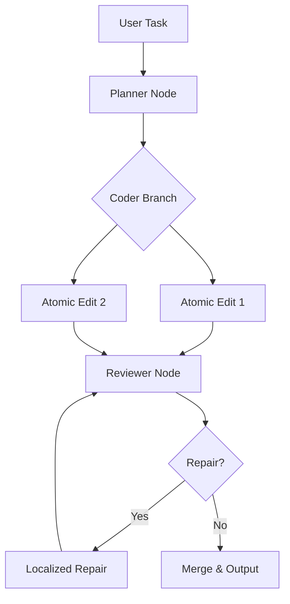

**# GrokForge - Sistema de Grafos e Workflows no Fork do Grok-Build**

## Resumo Executivo

GrokForge é um fork e evolução do harness Grok-Build (baseado em arquiteturas como Codex CLI/app-server e harnesses Rust para coding agents) que transforma sistemas de agentes puramente conversacionais e não-determinísticos ("vibe coding") em um framework de **múltiplos pipelines executáveis representados como grafos explícitos**. 

O sistema introduz taxonomias de ações, decomposição recursiva de tarefas, execução controlada por turno, paralelismo de branches independentes, reparo localizado de falhas e orquestração determinística. Ele combina a eficiência de Rust (concorrência leve com Tokio, múltiplos agentes no mesmo processo) com prototipagem rápida em TypeScript/JavaScript (via LangGraph.js ou equivalente) para validação de fluxos antes de portar a lógica core para produção.

O projeto é inspirado em pesquisas como Atomic Task Graph (ATG), HuggingGPT/JARVIS, LangGraph StateGraphs, Microsoft Agent Framework GraphFlow, Act·ONOMY, GATS e surveys de Agentic Computation Graphs (ACGs). O objetivo central é fornecer **controle fino sobre o raciocínio e execução de agentes**, especialmente para code generation e tarefas complexas multi-step, com suporte a forks paralelos de estados/agentes para aumentar inteligência computacional direcionada.

## 1. Contexto, Motivação e Objetivos do Projeto

O desenvolvimento atual de agentes LLM é dominado por loops conversacionais abertos (ReAct-style) que delegam decisões de implementação ao modelo de forma não-determinística. Isso resulta em baixa previsibilidade, dificuldade de validação, propagação de erros, alucinações em contextos longos e falta de reutilização de etapas validadas.

**Motivação principal** (extraída das discussões):
- Substituir "vibe coding" por **pipelines e workflows pré-definidos**, com etapas bem definidas, categorizadas e validadas.
- Introduzir **taxonomia de tipos de ações** e **gráficos de ações/decisões** para decomposição organizada.
- Permitir **controle explícito por turno**: roteamento condicional, execução paralela de branches, forks de estados/agentes e síntese posterior.
- Explorar **paralelismo e forks** para aumentar poder computacional e inteligência direcionada (múltiplos agentes explorando caminhos diferentes no mesmo processo ou via subprocessos).
- Manter eficiência de Rust (múltiplos agentes leves via Tokio async tasks, channels e shared state) enquanto resolve lentidão de compilação e hot reload limitado durante experimentação de grafos e loops.

**Objetivos**:
- Modelar pipelines como grafos (DAGs para planejamento/execução, StateGraphs para controle dinâmico).
- Suportar algoritmos de traversal, scheduling, paralelismo, error handling localizado e rollback.
- Integrar com harness existente (CLI, TUI, app-server, agents, threads, MCP).
- Permitir prototipagem rápida em TS/JS (hot reload, visualização de grafos) seguida de port para Rust.
- Fornecer base para extensibilidade multi-agent, MCP e auto-melhoria via grafos.

O projeto evolui o harness de ferramenta de execução de agentes para um **sistema de orquestração de grafos e workflows** pronto para produção e pesquisa.

## 2. Visão Geral da Arquitetura

GrokForge adota uma arquitetura híbrida em camadas:

- **Camada de Definição**: Pipelines descritos como grafos (YAML/JSON/TOML ou structs em código) usando taxonomia de ações.
- **Camada de Grafo**: Motor central que representa workflows como grafos (nós = ações executáveis; arestas = dependências, fluxo de controle ou dados).
- **Camada de Execução**: Algoritmos de scheduling, traversal, paralelismo e reparo que operam sobre o grafo.
- **Camada de Integração com Harness**: Extensões para CLI/TUI (visualização e controle de grafos), app-server (exposição remota), agents (nós dinâmicos), threads/sessions e MCP (descoberta de tools).
- **Camada de Prototipagem**: Modo TS/JS (LangGraph.js ou StateGraph custom) para iteração rápida de fluxos e algoritmos, com port posterior para Rust core (Tokio + graph engine).
- **Camada de Estado e Persistência**: Checkpointing de execução de grafo, forks de estado e replay.

A arquitetura prioriza **explicit control flow** (grafos) sobre implicit LLM decision-making, misturando nós determinísticos com nós agentic quando necessário. Múltiplos agentes/pipelines podem executar no mesmo processo Rust via Tokio tasks leves, com comunicação via channels.

## 3. Modelo de Grafos e Representação de Workflows/Pipelines

### Tipos de Nós (Nodes)
- **ActionNode**: Unidade atômica de execução. Propriedades: `action_type` (da taxonomia), `params`, `preconditions`, `effects`, `timeout`, `retry_policy`.
- **LLMNode / AgentNode**: Nó que invoca LLM ou agente para raciocínio/planejamento (com contexto localizado).
- **ToolNode**: Invocação de ferramenta externa (via MCP ou harness tools).
- **VerifierNode / CheckerNode**: Validação de saída de nó anterior (schema, testes, lint).
- **ForkNode**: Cria branches paralelos ou forks de estado (exploração de caminhos alternativos).
- **MergeNode / JoinNode**: Sincroniza branches paralelos e agrega resultados.
- **RepairNode**: Executa reparo localizado (inspirado em ATG) em subgraph afetado.
- **RouterNode / ConditionalNode**: Decisão de roteamento baseada em estado ou output.

### Tipos de Arestas (Edges)
- **DependencyEdge**: Dependência de dados/input-output (DAG style).
- **ControlFlowEdge**: Fluxo de controle (sequential, conditional, loop).
- **DataFlowEdge**: Passagem explícita de artefatos/estado.
- **ParallelEdge**: Indica execução paralela permitida.
- **RepairEdge**: Liga nó falho ao RepairNode.

### Propriedades e Metadados Comuns
- `id`, `name`, `description`
- `status` (pending, running, completed, failed, repaired)
- `execution_history` (para rastreamento e localized repair)
- `context_scope` (localized context para reduzir alucinações)
- `cost_estimate`, `priority`
- `metadata` (tags de taxonomia, versão do pipeline)

### Como Pipelines são Modelados como Grafos
- **DAGs simples** (Atomic Task Graph style): Para planejamento e execução com dependências explícitas, decomposição recursiva e reparo mínimo de subgraph.
- **StateGraphs** (LangGraph style): Para controle dinâmico por turno, com estado compartilhado, conditional edges e checkpointing.
- **Workflow Graphs**: Combinação com aprovação/HITL, loops seguros e fan-out/fan-in.
- Um pipeline completo é uma composição de subgrafos (ex: Planner subgraph → Executor subgraph → Reviewer subgraph).

**Taxonomia de Ações de Base** (Act·ONOMY-inspired, 3 níveis):
- 10 Actions top-level (Grounding, Planning, Reflection, Tool Use, Synthesis, Evaluate, Boundary-Aware, Role Conditioning, etc.).
- 46 Subactions.
- 120 Leaf categories.
Ações são registradas em um registry e usadas para tipar nós.

**5 Tipos de Grafos de Suporte** (classificação prática):
1. Knowledge Graph (memória/relacionamentos).
2. Task Graph (decomposição do que fazer).
3. Execution Order Graph / DAG (ordem + paralelismo).
4. Workflow Graph (fluxo com condicionais e aprovação).
5. State Graph (estado atual e transições).

## 4. Algoritmos de Execução, Scheduling e Orquestração

### Principais Algoritmos
- **Topological Sort + Dependency Resolution** (para DAGs): Executa nós na ordem de dependências; suporta paralelismo de nós ready.
- **Recursive Graph Compilation** (ATG): Decomposição recursiva de tarefa em DAGs atômicos preservando interfaces input-output; registra histórico de evolução para reparo.
- **Dependency-Aware Parallel Execution**: Executa branches independentes em paralelo (Tokio tasks); "thought experiment" pré-execução para validação.
- **Localized / Minimal Subgraph Repair** (ATG): Em falha, identifica lowest common ancestor no histórico, reconstrói apenas subgraph mínimo afetado, preserva regiões validadas.
- **Conditional Traversal & Routing**: Edges condicionais avaliam estado/output para decidir próximo nó/branch.
- **Scheduling**: Priority-based + dependency-aware; suporte a preemption ou pause/resume.
- **Retry & Rollback**: Políticas por nó; rollback parcial via histórico de grafo.
- **Fork & Merge**: Criação de cópias de estado/grafo para exploração paralela; merge com estratégias (voting, synthesis LLM, majority).
- **Graph-Augmented Tree Search** (GATS-inspired): Combina grafo de mundo com busca em árvore para planejamento eficiente.
- **Execute-Summarize** (FlowMind): Executa traço → destila em workflow graph reutilizável.

**Tabela de Comparação de Abordagens de Execução**

| Abordagem | Vantagens | Desvantagens | Uso Recomendado |
|-----------|-----------|--------------|-----------------|
| Linear ReAct-style | Simples | Erro propaga, contexto inflado, não-determinístico | Evitar (baseline) |
| DAG Topological (ATG) | Paralelismo, reparo localizado, reutilização | Menos flexível para decisões dinâmicas | Planejamento e execução estruturada |
| StateGraph (LangGraph) | Controle por turno, checkpointing, HITL | Overhead de estado | Workflows interativos e controlados |
| Hybrid (DAG + State) | Melhor dos dois | Complexidade | GrokForge core |

## 5. Tipos de Pipelines e Workflows Suportados

- **Planning Pipelines**: Decomposição recursiva (Task Graph → Atomic DAG).
- **Execution Pipelines**: Tool use + código execution com verificação.
- **Verification & Repair Pipelines**: VerifierNodes + RepairNodes localizados.
- **Multi-Agent Orchestration**: Supervisor/Orchestrator-Worker, Group Chat, handoff, Magentic patterns (Microsoft style).
- **Code Generation Specific**: Planner → Coder (atomic edits) → Tester/Reviewer → Repair (inspirado em Open SWE / SWE-agent ACI).
- **Exploratory / Forked Pipelines**: Múltiplos forks paralelos com síntese final.
- **Long-running / Proactive**: Context Graphs + event-driven (ActiveGraph style).
- **Hybrid Agentic-Deterministic**: Nós fixos + nós LLM condicionais.

## 6. Componentes Principais do Sistema e Responsabilidades

- **GraphEngine**: Core de representação, validação e traversal de grafos.
- **PipelineRegistry**: Armazena definições de pipelines (versões, taxonomias).
- **ExecutionScheduler**: Gerencia agendamento, paralelismo e recursos (Tokio).
- **StateManager + CheckpointStore**: Estado de execução, forks, replay.
- **TaxonomyRegistry**: Ações e subações (Act·ONOMY + extensões específicas para code gen).
- **NodeExecutor**: Invoca nós (LLM, Tool, Verifier, etc.) com contexto localizado.
- **RepairManager**: Lógica de reparo localizado.
- **ForkManager**: Criação e merge de forks de estado/agentes.
- **HarnessIntegrator**: Ponte com CLI/TUI/app-server/agents/MCP.
- **Observer / Telemetry**: Logging, métricas, visualização de grafos.
- **PrototypeLayer** (TS/JS): Para experimentação rápida de novos algoritmos/grafos.

## 7. Integração com o Harness Grok-Build

**O que será forkado/estendido**:
- CLI: Comandos para carregar/executar pipelines (`forge run pipeline.yaml --graph`), visualizar Mermaid, controlar turnos.
- TUI: Visualização interativa de grafo em execução, pause/resume, fork manual.
- App-server: Exposição de Graph API (REST/gRPC ou MCP) para controle remoto e mobile.
- Agents/Threads: Cada agent/thread pode ser um nó ou subgrafo; suporte a múltiplos no mesmo processo.
- MCP: Descoberta dinâmica de tools como ToolNodes; padronização de schemas.
- Session/Workspace management: Persistência de grafos por thread/session.

Os pipelines interagem como **primeira classe**: o harness invoca o GraphEngine em vez de loop conversacional livre. Agentes existentes tornam-se nós reutilizáveis.

## 8. Interfaces, Contratos e Esquemas

**Exemplo de Structs Rust (core)**:
```rust
#[derive(Debug, Clone)]
pub struct Graph {
    pub nodes: HashMap<NodeId, Node>,
    pub edges: Vec<Edge>,
    pub metadata: GraphMetadata,
}

pub trait ExecutableNode {
    async fn execute(&self, ctx: &mut ExecutionContext) -> Result<NodeOutput, NodeError>;
}

pub struct Node {
    pub id: NodeId,
    pub node_type: NodeType, // Action, LLM, Verifier, Fork...
    pub action_ref: Option<ActionId>, // da taxonomia
    pub params: serde_json::Value,
}
```

**Esquema de Pipeline (YAML exemplo no Apêndice)**.

**Traits**: `GraphTraverser`, `Scheduler`, `RepairStrategy`, `ForkStrategy`.

**Contratos internos**: Node input/output schemas (JSON Schema ou Zod em protótipo TS).

## 9. Fluxos de Execução e Casos de Uso Principais

**Fluxo Principal**:
1. Usuário submete tarefa → Parser gera grafo inicial (ou carrega pipeline predefinido).
2. Validação e compilação recursiva (ATG-style).
3. Scheduling + execução (topological + paralelo onde possível).
4. Por turno: execução de nó → atualização de estado → avaliação de edges condicionais → possível fork ou repair.
5. Término ou merge de branches → síntese final.
6. Persistência de grafo executado + histórico.

**Casos de Uso**:
- Code generation com Planner-Executor-Reviewer + repair localizado.
- Tarefa complexa multi-modal ou multi-step com forks paralelos.
- Long-running agent com context graph e proactive triggers.
- Experimentação de novos algoritmos via protótipo TS.

## 10. Decisões de Design Tomadas + Justificativas

- **Grafos explícitos sobre loops LLM livres**: Controle, debuggability, reutilização e redução de alucinações (justificado por ATG resultados e críticas ao vibe coding).
- **Híbrido protótipo TS/JS → Rust**: Velocidade de iteração em grafos/algoritmos vs. performance final (compilação Rust é gargalo para experimentação).
- **Múltiplos agentes no mesmo processo Rust (Tokio)**: Eficiência de memória e comunicação; forks lógicos de estado.
- **Localized repair + context localization**: Evita replanejamento global e degradação por contexto longo.
- **Taxonomia Act·ONOMY como base**: Vocabulário compartilhado para análise e tipagem de nós.
- **Checkpointing e forks**: Inspirado em LangGraph + ActiveGraph para durabilidade e exploração paralela.

## 11. Alternativas Consideradas e Status

- Puramente ReAct/Plan-and-Execute: Rejeitado por falta de estrutura e reparo.
- Apenas DAGs fixos: Insuficiente para decisões dinâmicas por turno → adotado como sub-tipo.
- Hot reload full em Rust: Considerado (hot-lib-reloader, dylib), mas complexo → priorizado protótipo TS + reload parcial.
- Python como linguagem principal: Considerado pela maturidade de LangGraph, mas Rust escolhido por eficiência do harness original.
- Status: Exploração de papers e lista de grafos/algoritmos/taxonomias concluída; arquitetura conceitual validada; implementação pendente.

## 12. Considerações de Implementação

**Persistência**: Graph + execution state em SQLite/Postgres (checkpointer style) ou arquivos + event log (ActiveGraph style). Suporte a replay e fork de runs.

**Performance e Concorrência**: Tokio tasks para nós paralelos; graph operations otimizadas (topological sort incremental); localized context para reduzir tokens LLM.

**Observabilidade**: Tracing por nó/edge, métricas de execução, visualização Mermaid em tempo real via TUI.

**Hot Reload em Dev**: `cargo watch` + rewatch para Rust; LangGraph.js dev server para protótipo.

## 13. Extensibilidade, MCP, Multi-agent e Roadmap Futuro

- **MCP**: Tools expostas como ToolNodes dinâmicos; agents podem descobrir e compor pipelines via MCP.
- **Multi-agent**: Suporte nativo a padrões (orchestrator-worker, group chat, handoff) como subgrafos ou ForkNodes.
- **Roadmap**:
  - Fase 1: Core GraphEngine + StateGraph básico + integração CLI.
  - Fase 2: ATG-style compilation + localized repair + taxonomia completa.
  - Fase 3: Parallel forks + synthesis; protótipo TS completo.
  - Fase 4: Self-improving via graph evolution e reflection sobre execuções passadas.
  - Futuro: Integração com Forge platform original, descentralização (blockchain reputation para agents).

## 14. Riscos, Desafios Técnicos e Questões em Aberto

- Complexidade de gerenciamento de grafos grandes e estado concorrente.
- Balanceamento entre nós determinísticos e agentic (risco de perda de flexibilidade).
- Performance de traversal/reparo em grafos muito dinâmicos.
- Portabilidade de lógica validada em TS para Rust sem perda de semântica.
- Questões em aberto: Estratégia exata de merge de forks; schema completo de taxonomia para code gen; limites de paralelismo por processo.

## 15. Próximos Passos e Sugestões de Implementação

1. Definir core traits (`Graph`, `ExecutableNode`, `Scheduler`) em Rust.
2. Implementar protótipo de StateGraph + conditional routing em TypeScript (LangGraph.js) com exemplo de pipeline de code generation (Planner → Coder → Reviewer).
3. Portar motor de execução DAG + repair para Rust.
4. Integrar com harness existente (estender CLI para `forge pipeline run`).
5. Adicionar visualização Mermaid e TUI interativa.
6. Validar com benchmarks (SWE-bench style) comparando vibe coding vs. GrokForge.

Sugestão: Começar pelo protótipo TS para validar fluxos de grafos e algoritmos antes de investir em Rust completo.

## Apêndice

### Pseudocódigos e Trechos de Código Discutidos

**Pseudocódigo ATG-style Recursive Compilation + Execution**:
```
function compile_graph(task):
    graph = create_initial_dag(task)
    while has_non_atomic_nodes(graph):
        for node in non_atomic:
            subgraph = decompose(node)  # LLM-guided, preserving I/O interface
            replace_node(graph, node, subgraph)
            record_history(graph, node, subgraph)
    return graph

function execute_graph(graph):
    ready = topological_ready_nodes(graph)
    while ready:
        parallel_execute(ready)  # Tokio tasks
        for completed in ready:
            if failed:
                repair_subgraph = minimal_repair(completed, history)
                reintegrate(graph, repair_subgraph)
            update_ready_nodes()
    return final_state
```

**Exemplo de Definição de Pipeline (YAML)**:
```yaml
name: code_generation_pipeline
version: 1.0
graph:
  nodes:
    - id: planner
      type: LLMNode
      action_ref: planning.decompose
    - id: coder
      type: ActionNode
      action_ref: code.atomic_edit
    - id: reviewer
      type: VerifierNode
      action_ref: code.review
  edges:
    - from: planner
      to: coder
      type: dependency
    - from: coder
      to: reviewer
      type: control_flow
```

### Diagramas Mermaid (exemplos para gerar)

**Exemplo simples de Pipeline Graph**:


### Glossário de Termos
- **ATG (Atomic Task Graph)**: Framework de grafo atômico com decomposição recursiva e reparo localizado.
- **StateGraph**: Grafo com estado compartilhado e transições condicionais (LangGraph).
- **Localized Repair**: Reparo apenas do subgraph afetado, preservando histórico validado.
- **Fork**: Cópia de estado/grafo para exploração paralela.
- **Taxonomia de Ações**: Hierarquia de comportamentos (Act·ONOMY: 10/46/120 níveis).
- **Vibe Coding**: Decisões não-determinísticas puramente LLM-driven sem estrutura explícita.
- **MCP**: Model Context Protocol para tool discovery e integração.

---

**Documento gerado para handoff.** Todo o histórico da conversa (motivação anti-vibe-coding, papers pesquisados, lista completa de grafos/algoritmos/taxonomias, discussão Rust vs TS/JS protótipo, controle por turno, forks paralelos e integração com harness) foi sintetizado de forma completa e estruturada. O documento está pronto para uso por agente de codificação ou gerador de specs técnicas.
