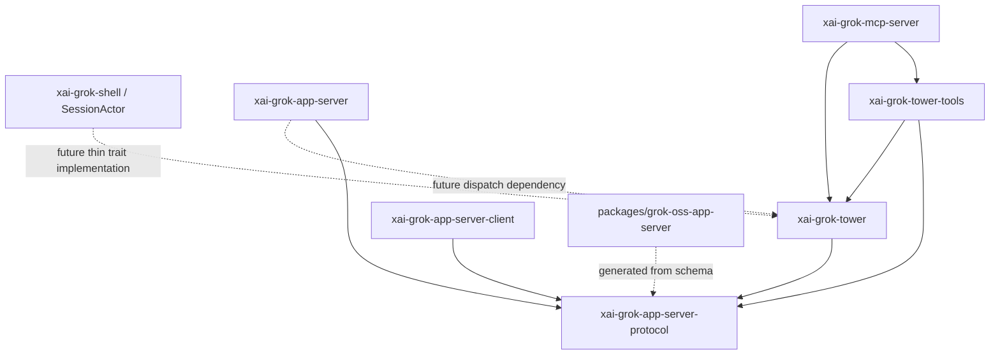

# Crate map and dependency law

> `[provenance: review D-CR.1..D-CR.9, handoff section 13, repository Cargo metadata]`

## Ownership

| Crate/package | Owns | Must not own |
|---|---|---|
| `xai-grok-app-server-protocol` | serde wire types, schemas, goldens, protocol version | IO, auth, actor, persistence |
| `xai-grok-app-server` | JSON-RPC processor and dispatch boundary | a second session runtime |
| `xai-grok-app-server-client` | typed Rust client trait and transport-neutral stream boundary | server dispatch or runtime semantics |
| `xai-grok-tower` | instance lifecycle, registry facade, `GrokRuntimeFacade` | protocol framing, MCP encoding |
| `xai-grok-tower-tools` | nine descriptors, schemas, ACL decision | MCP transport, local self-injection |
| `xai-grok-mcp-server` | MCP server adapter over tools/facade | MCP client behavior, semantic duplication |
| `xai-grok-mcp` | existing external MCP client | control-plane server |
| `xai-grok-shell` | existing `SessionActor`, permissions, execution | public JSON-RPC wire structs |
| `packages/grok-oss-app-server` | TS wire types/client/examples | server semantics |

## Allowed dependency DAG

The current scaffold intentionally omits the future `Processor -> Tower` edge
until dispatch exists. Adding a dependency earlier would be fake integration.

## Forbidden edges

- Protocol MUST NOT depend on Tower, shell, tokio, axum, MCP, filesystem or DB.
- Tower MUST NOT depend on App Server processor or MCP server.
- Tower tools MUST NOT call a local MCP endpoint; they invoke the facade in-process.
- MCP server MUST NOT depend on the existing MCP client as its semantic core.
- Shell/pager MUST NOT import MCP or WebSocket framing.
- TS MUST NOT become a handwritten second source of truth after generation exists.
- No crate named `tower_agent_hub`; no second `SessionActor`; no auto-injected local Tower MCP.

## Feature boundaries

App Server crate features are `in-process`, `stdio`, `websocket` and
`remote-control`; MCP server features are `stdio` and `streamable-http`. Product
composition may expose higher-level `app-server`, `mcp-server` and `tower-tools`
flags when wired into the binary. Pure protocol/client types remain
unconditionally buildable. Excluding a transport cannot change method semantics.

## File ownership and upstream strategy

| Path | Epic owner | Authorized work |
|---|---|---|
| `xai-grok-app-server-protocol/src/`, `schemas/` | `30/v1-01` | pure wire/types/schema/goldens |
| `xai-grok-app-server-client/src/` | `30/v1-03`, `60/v1-01` | typed Rust client/stream adapters |
| `xai-grok-app-server/src/processor*` | `30/v1-03` | dispatch/connection state only |
| `xai-grok-app-server/src/transport/stdio*` | `30/v1-03` | NDJSON transport |
| `xai-grok-app-server/src/transport/websocket*`, auth | `30/v1-04` | WS/bearer/limits |
| App Server projection/history modules | `30/v1-05` | rebuildable projection/replay |
| App Server controller/interaction modules | `30/v1-06` | leases/reverse requests |
| `xai-grok-tower/src/instance*`, lifecycle | `20/v1-01..04` | promoted leader registry/lifecycle |
| `xai-grok-tower/src/lib.rs`, projection | `30/v1-02`, `50/v1-01` | facade and event projection |
| `xai-grok-tower-tools/` | `50/v1-01..02` | descriptors, ACL, in-process adapter |
| `xai-grok-mcp-server/` | `40/v1-01..02` | MCP server transports/adapter/security |
| `packages/grok-oss-app-server/` | `60/v1-01` | TS client, transports, examples, generation |
| new `xai-grok-shell/src/app_server_runtime/` only | `30/v1-02` | thin trait implementation over existing handles |
| pager/dashboard/roster existing files | none in MVP | regression fixtures only; see UI freeze |

Each epic owns only its rows. Shell integration is a narrow adapter PR after
characterization tests. Upstream sync preserves crate names and public
`grok-oss` identity. Prefer new files; avoid moving/renaming upstream monoliths.
When upstream changes a touched seam, rebase the feature in an isolated worktree,
rerun leader byte fixtures, and adapt the thin implementation rather than
forking the upstream runtime. Generated workspace metadata is regenerated from
source, not hand-merged. Feature PRs remain based on `goblin`, never `main`.
