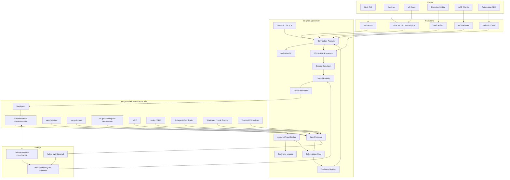

# Grok App Server
## Production-Grade Architecture Plan and Full Technical Specification

**Status:** Proposed
**Target:** `xai-org/grok-build`
**Reference:** OpenAI Codex app-server
**Reviewed snapshots:** `xai-org/grok-build@b189869b7755d2b482969acf6c92da3ecfeffd36` and `openai/codex@800715d201651a2a07c2706dca10400109dae3d3`

---

# 1. Executive Summary

Grok Build should implement its App Server by **promoting and generalizing the existing leader**, not by introducing a second daemon beside it. The repository already contains most of the hard runtime primitives:

- a multi-client leader with cross-platform IPC, capability registration, request-ID multiplexing, ACP fan-out, workspace exposure, reconnect behavior, and process lifecycle control;
- a mature session actor with persistent session IDs, current prompt IDs, pending interactions, model state, permission state, plan mode, MCP state, subagents, worktrees, background terminals, scheduler handles, and session signals;
- append-oriented session storage containing chronological ACP/xAI updates, chat history, plan state, plan-mode state, rewind points, goals, fork metadata, and subagent metadata;
- a TUI-side streaming tracker that already converts protocol events into rich scrollback blocks;
- native model-provider abstraction for OpenAI Chat Completions, OpenAI Responses, Anthropic Messages, and arbitrary compatible endpoints.

The proposed system adds five layers around those assets:

1. **`xai-grok-app-server-protocol`** — stable JSON-RPC 2.0 types, Thread/Turn/Item entities, approvals, capabilities, errors, JSON Schema, and generated TypeScript.
2. **Runtime facade** — a narrow API over `MvpAgent`, `SessionActor`, storage, permissions, tools, MCP, hooks, skills, subagents, and worktrees.
3. **Item projector** — deterministic normalization from current ACP/xAI/runtime events into stable Thread/Turn/Item events.
4. **Subscription and approval control plane** — observers, interactive clients, controller leases, reconnect, replay, and rerouted reverse requests.
5. **Rebuildable projection store** — efficient Thread/Turn/Item listing and pagination while current Grok session files remain authoritative during migration.

The native protocol should stay deliberately close to Codex: `initialize`, `thread/start`, `thread/resume`, `thread/fork`, `thread/read`, `thread/list`, `turn/start`, `turn/steer`, `turn/interrupt`, `item/started`, `item/completed`, and server-initiated approval requests. Grok-only features are additive through typed items and `grok/*` methods.

The native wire includes standard `"jsonrpc":"2.0"`; a compatibility listener may accept Codex-style messages that omit it. The same Rust source types generate JSON Schema, TypeScript declarations, fixtures, and SDK bindings.

Estimated implementation: **31–44 person-weeks**, approximately **14–20 calendar weeks with three to four focused engineers**. A useful in-process MVP—initialize, thread lifecycle, turn execution, item streaming, and persisted-session replay—should take **8–12 person-weeks**.

> The App Server owns orchestration, identity, routing, replay, and client coordination. Existing Grok components remain authoritative for agent behavior, tools, providers, permissions, sandboxes, worktrees, and persistence semantics.

---

# 2. Goals, Non-Goals, and Principles

## 2.1 Goals

The stable v1 must:

1. Serve multiple simultaneous clients: TUI, Electron, VS Code, remote/mobile, and automation.
2. Expose stable `Thread -> Turn -> Item` primitives.
3. Support bidirectional JSON-RPC requests, notifications, server requests, and responses.
4. Preserve multi-provider inference, MCP, skills, hooks, plan mode, goals, subagents, worktrees, rewind, and background tasks.
5. Support persistence, resume, replay, pagination, forking, daemon mode, remote control, and graceful restart.
6. Keep the Grok TUI the richest and best-supported client.
7. Remain structurally close enough to Codex for mechanical adapters.

## 2.2 Non-goals for v1

- Rewriting `SessionActor`, sampling, or tool implementations.
- Replacing existing session files with SQLite as the sole truth.
- Guaranteed compatibility with every Codex experimental endpoint.
- Requiring all clients to provide filesystem or terminal backends.
- Exposing hidden chain-of-thought.
- Letting remote clients bypass trust, hook, sandbox, or permission policy.
- Removing ACP.

## 2.3 Principles

| Principle | Consequence |
|---|---|
| Runtime-first | Adapt Grok; do not duplicate it. |
| Stable identity | Thread, Turn, Item, interaction, client, and event IDs are explicit. |
| Append-oriented | History is ordered events plus materialized state. |
| Rebuildable projections | Indexes can be regenerated from session artifacts. |
| Capability-negotiated | Clients only receive or perform advertised features. |
| One semantic core | All transports and adapters share one method processor. |
| TUI parity gate | No stable release with material TUI regression. |
| Local-secure default | Remote exposure is off, scoped, authenticated, and origin-checked. |
| Explicit backpressure | Slow clients cannot block runtime execution. |
| Generated protocol | Rust types generate schemas and client declarations. |

---

# 3. Current-State Assessment

## 3.1 Reusable Grok components

### Existing leader

The leader already provides local multi-client ownership, registration, capability metadata, framed IPC, namespaced request IDs, message fan-out, workspace exposure, readiness, and relaunch control. It should become the transport and daemon substrate.

### Session runtime

`SessionHandle` already exposes or references the command channel, current prompt, pending interactions, session metadata, chat state, signals, hunk tracker, active model, permissions, plan mode, MCP snapshot, subagent state, background terminal, scheduler, filesystem, and terminal backends. It is close to a `ThreadRuntimeHandle` already.

### Persistence

Existing artifacts include:

```text
~/.grok/sessions/<encoded-cwd>/<session-id>/
  summary.json
  updates.jsonl
  chat_history.jsonl
  plan.json
  plan_mode.json
  rewind_points.jsonl
  signals.json
  feedback.jsonl
  compaction_checkpoints/
  subagents/
```

The App Server should project these artifacts rather than create a competing transcript.

### TUI projection

`AcpUpdateTracker` is a stateful stream processor for messages, reasoning, tools, out-of-order updates, retries, compaction, subagents, waiting states, and rich scrollback blocks. It should be the behavioral oracle during migration.

## 3.2 Codex patterns to adopt

Adopt:

- Thread/Turn/Item lifecycle;
- bidirectional JSON-RPC;
- per-connection initialization state;
- request serialization scopes;
- independent inbound processor and outbound writer loops;
- bounded per-connection queues;
- generated schemas and TypeScript;
- item-specific deltas;
- replay and pagination;
- server-initiated approval requests.

Do not copy blindly:

- OpenAI-specific account/provider semantics;
- Codex rollout storage assumptions;
- Codex-only sandbox profiles;
- unrelated app/plugin surfaces;
- a second thread runtime beside Grok sessions.

---

# 4. High-Level Architecture



## 4.1 Responsibility split

### App Server owns

- JSON-RPC parsing and validation;
- per-connection initialize state;
- client identity and authorization;
- subscriptions and controller leases;
- reverse-request routing;
- request serialization;
- normalized Thread/Turn/Item identities and events;
- replay cursors and pagination;
- transport backpressure;
- daemon lifecycle.

### Runtime owns

- prompt strategy and model loops;
- provider selection and authentication;
- tools and MCP execution;
- sandbox and permission decisions;
- hooks and skills;
- subagents and worktrees;
- actual session semantics and files.

## 4.2 Runtime facade

```rust
#[async_trait]
pub trait GrokRuntime: Send + Sync {
    async fn start_thread(&self, req: StartThread) -> Result<RuntimeThread>;
    async fn resume_thread(&self, req: ResumeThread) -> Result<RuntimeThread>;
    async fn fork_thread(&self, req: ForkThread) -> Result<RuntimeThread>;
    async fn unload_thread(&self, thread_id: &ThreadId) -> Result<()>;

    async fn start_turn(&self, req: StartTurn) -> Result<RuntimeTurn>;
    async fn steer_turn(&self, req: SteerTurn) -> Result<()>;
    async fn interrupt_turn(&self, req: InterruptTurn) -> Result<()>;

    async fn compact_thread(&self, thread_id: &ThreadId) -> Result<()>;
    async fn rewind_thread(&self, req: RewindThread) -> Result<RewindResult>;

    async fn read_snapshot(&self, thread_id: &ThreadId) -> Result<RuntimeSnapshot>;
    async fn list_threads(&self, q: RuntimeThreadQuery) -> Result<RuntimeThreadPage>;
    fn subscribe_runtime_events(&self) -> broadcast::Receiver<RuntimeEvent>;
}
```

The protocol crate must not depend directly on all of `xai-grok-shell`.

---

# 5. Canonical Domain Model

## 5.1 Thread

A Thread is the protocol view of a Grok session plus its workspace/runtime binding.

```ts
interface Thread {
  id: ThreadId;
  status: ThreadStatus;
  title: string | null;
  cwd: string;
  displayCwd: string | null;
  createdAtMs: number;
  updatedAtMs: number;
  model: ModelSelection | null;
  provider: ProviderDescriptor | null;
  parentThreadId: ThreadId | null;
  relation: ThreadRelation | null;
  kind: ThreadKind;
  worktree: WorktreeBinding | null;
  activeTurnId: TurnId | null;
  latestTurnId: TurnId | null;
  planMode: PlanModeSnapshot | null;
  goal: GoalSnapshot | null;
  capabilities: ThreadCapabilities;
  metadata: Record<string, unknown>;
}
```

Statuses:

| Status | Grok mapping |
|---|---|
| `starting` | actor/materialization in progress |
| `ready` | loaded and idle (`IdleResident`) |
| `running` | active turn (`Working`) |
| `waitingForInput` | pending approval/question/plan gate |
| `dormant` | persisted, actor unloaded |
| `completed` | completed session |
| `failed` | dead/failed runtime |
| `archived` | hidden archived persistence |

A Thread remains durable when no actor is resident.

## 5.2 Turn

A Turn is one coherent user- or system-triggered foreground execution interval.

```ts
interface Turn {
  id: TurnId;
  threadId: ThreadId;
  ordinal: number;
  kind: TurnKind;
  status: TurnStatus;
  input: InputItem[];
  startedAtMs: number;
  completedAtMs: number | null;
  model: ModelSelection | null;
  promptOrigin: string | null;
  items: ThreadItem[];
  itemsView: "notLoaded" | "summary" | "full";
  usage: Usage | null;
  error: ProtocolErrorData | null;
  metadata: Record<string, unknown>;
}
```

Kinds:

`user`, `steered`, `plan`, `goal`, `review`, `compaction`, `rewind`, `userShell`, `scheduler`, `notification`, `subagentContinuation`, `system`.

Statuses:

`queued`, `inProgress`, `waitingForApproval`, `waitingForInput`, `completed`, `failed`, `interrupted`, `declined`.

A Thread has at most one active foreground Turn. Background terminals, monitors, scheduled tasks, and detached subagents may outlive it.

## 5.3 Item

Core item variants:

| Type | Meaning |
|---|---|
| `userMessage` | initial or steering input |
| `agentMessage` | assistant-visible response |
| `reasoning` | safe reasoning summary/provider-exposed reasoning |
| `toolCall` | generic tool lifecycle |
| `commandExecution` | shell/terminal execution |
| `fileChange` | proposed/applied diffs |
| `mcpToolCall` | MCP tool lifecycle |
| `plan` | plan document and structured steps |
| `question` | user-input request |
| `permissionRequest` | materialized approval state |
| `subagent` | child agent lifecycle |
| `worktree` | create/apply/remove lifecycle |
| `hookExecution` | hook action and decision |
| `skillInvocation` | skill selection/invocation |
| `contextCompaction` | compaction lifecycle |
| `rewind` | rewind preview/result |
| `backgroundTask` | long-lived task |
| `usage` | usage timeline snapshot |
| `notice` | runtime notice |
| `error` | item-scoped error |

```ts
interface ItemBase {
  id: ItemId;
  threadId: ThreadId;
  turnId: TurnId | null;
  type: string;
  status: ItemStatus;
  revision: number;
  createdAtMs: number;
  completedAtMs: number | null;
  metadata: Record<string, unknown>;
}
```

Item statuses: `pending`, `inProgress`, `waitingForApproval`, `waitingForInput`, `completed`, `failed`, `declined`, `cancelled`, `backgrounded`.

---

# 6. Detailed Codex-to-Grok Mapping

## 6.1 Threads

| Codex | Grok | Rule |
|---|---|---|
| Thread | Session | Existing session UUID is the Thread ID. |
| Loaded Thread | Resident SessionActor | State from `SessionLiveState`. |
| Unloaded Thread | Persisted session | Exposed as `dormant`. |
| Fork | Session copy/fork | Preserve parent ID and relation. |
| Child agent Thread | Subagent child session | Add graph edge and subagent item. |
| Workspace | cwd/display cwd/worktree | Expose explicit binding. |
| Archive | archived session metadata/storage | New API, no silent delete. |

## 6.2 Turns

| Codex Turn | Grok concept | Rule |
|---|---|---|
| normal turn | user prompt execution | existing prompt ID preferred |
| steer | interjection/redirect | same Turn, additional userMessage item |
| interrupt | session cancel | terminal `interrupted` event is authoritative |
| compact | `/compact` | synthetic `compaction` Turn |
| plan work | plan-mode prompt | `plan` Turn; steps are Items |
| goal iteration | goal orchestration prompt | `goal` Turn |
| scheduler action | synthetic prompt | `scheduler` Turn |
| post-turn subagent completion | synthetic origin | origin Turn if active; otherwise continuation Turn |
| notification drain | synthetic prompt | active Turn or `notification` Turn |

A plan step is not a Turn. It is structured state within a plan Item.

## 6.3 Items

| Grok source | App Server projection |
|---|---|
| `UserMessageChunk` | userMessage |
| `AgentMessageChunk` | agentMessage + delta |
| `AgentThoughtChunk` | reasoning + summary delta |
| `ToolCall` / `ToolCallUpdate` | generic or specialized tool item |
| edit tool | fileChange |
| bash/terminal | commandExecution |
| MCP call | mcpToolCall |
| TODO state / plan file | plan and plan-step updates |
| permission prompt | server request + permission item |
| `ask_user_question` | server request + question item |
| exit-plan approval | server request + plan state |
| subagent spawn/progress/end | subagent item + child Thread |
| worktree create/apply/remove | worktree item |
| hunk tracker/diff review | fileChange revisions |
| hook execution | hookExecution |
| skill metadata | skillInvocation or Turn metadata |
| auto-compact | contextCompaction |
| rewind | rewind |
| background command | backgroundTask/backgrounded commandExecution |
| token update | Turn usage; optional usage item |
| runtime error | error + terminal state |

## 6.4 Identity rules

### Thread ID

- Existing and new Grok UUIDv7 IDs remain canonical.
- Never derive from cwd.
- A Codex adapter may map to a prefixed external form.

### Turn ID

Priority:

1. stable existing `promptId`;
2. stable trace/turn ID;
3. UUIDv7 allocated before dispatch;
4. deterministic legacy ID from Thread ID, source byte offset, ordinal, and projector version.

### Item ID

Priority:

1. tool call ID;
2. event ID;
3. task/subagent ID;
4. UUIDv7;
5. deterministic reconstructed ID.

### Interaction ID

`interactionId` is stable across reconnect. JSON-RPC request IDs are connection-scoped. Reissued requests get a new request ID but preserve interaction identity.

---

# 7. Protocol Specification

## 7.1 Envelope

Native messages are strict JSON-RPC 2.0.

Request:

```json
{"jsonrpc":"2.0","id":1,"method":"thread/read","params":{"threadId":"019c..."}}
```

Success:

```json
{"jsonrpc":"2.0","id":1,"result":{"thread":{}}}
```

Error:

```json
{"jsonrpc":"2.0","id":1,"error":{"code":-32602,"message":"Invalid params","data":{"field":"threadId"}}}
```

Notification:

```json
{"jsonrpc":"2.0","method":"turn/completed","params":{}}
```

Compatibility mode may accept omitted `jsonrpc`; generated clients always send it.

## 7.2 Request IDs

- string or JavaScript-safe integer;
- never `null` for requests;
- unique while unresolved on a connection;
- recommended server request prefix `srv_`.

## 7.3 Versioning

`initialize` sends a supported range. The server selects one version and returns a schema revision. Breaking changes require a major protocol version; additive methods/fields use capabilities.

## 7.4 Initialization

`initialize` must be first.

```ts
interface InitializeParams {
  protocol: { min: string; max: string };
  clientInfo: { name: string; version: string; platform?: string; instanceId?: string };
  capabilities: ClientCapabilities;
  authentication?: { bearerToken?: string; pairingToken?: string };
  notificationOptOut?: string[];
  metadata?: Record<string, unknown>;
}
```

Capabilities include inline approvals, structured diffs, reasoning summaries, subagent tree, plan mode, MCP apps, hooks, skills, client terminal/filesystem, rich tool blocks, compression, maximum message size, and preferred replay mode.

Response includes selected protocol, server instance/version/PID, server capabilities, transport properties, public auth state, model state, and default Thread settings.

After success, client sends:

```json
{"jsonrpc":"2.0","method":"initialized","params":{}}
```

No mutation method is accepted before this notification.

## 7.5 Stable Thread methods

| Method | Purpose |
|---|---|
| `thread/start` | create/materialize |
| `thread/resume` | load persisted Thread |
| `thread/fork` | fork, optionally into worktree |
| `thread/read` | read materialized or persisted Thread |
| `thread/list` | page Threads |
| `thread/turns/list` | page Turns |
| `thread/items/list` | page Items |
| `thread/subscribe` | subscribe live events |
| `thread/unsubscribe` | unsubscribe |
| `thread/archive` | archive |
| `thread/unarchive` | restore |
| `thread/delete` | hard delete with confirmation |
| `thread/metadata/update` | title/tags/safe metadata |
| `thread/compact/start` | manual compaction |
| `thread/rewind/preview` | preview destructive rewind |
| `thread/rewind/start` | execute rewind |
| `thread/unload` | release resident actor |

Grok extension methods:

- `grok/thread/planMode/set`
- `grok/thread/goal/set|get|clear`
- `grok/thread/worktree/apply|remove`
- `grok/thread/backgroundTasks/list|terminate|clean`

### `thread/start`

```ts
interface ThreadStartParams {
  cwd: string;
  title?: string;
  model?: ModelSelection;
  mcpServers?: McpServerConfig[];
  settings?: Partial<ThreadSettings>;
  worktree?: { mode: "current" | "new"; baseRef?: string };
  clientThreadId?: string;
  idempotencyKey?: string;
  subscribe?: { access: "observe" | "interact" | "control"; claimController?: boolean };
  metadata?: Record<string, unknown>;
}
```

Rules:

- cwd is normalized and absolute server-side;
- client Thread ID must be a valid unused UUID;
- no implicit upsert;
- start and resume are separate;
- worktree creation is explicit and durably recorded.

### `thread/resume`

Accepts Thread ID, optional compatible cwd/model override, subscription request, and replay cursor. It validates persisted workspace semantics before materializing.

### `thread/fork`

```ts
interface ThreadForkParams {
  threadId: ThreadId;
  atTurnId?: TurnId;
  atItemId?: ItemId;
  newThreadId?: ThreadId;
  model?: ModelSelection;
  directive?: InputItem[];
  isolation: "sharedWorkspace" | "worktree";
  worktree?: { baseRef?: string; pathHint?: string };
  subscribe?: { access: "observe" | "interact" | "control"; claimController?: boolean };
}
```

`atTurnId` and `atItemId` are mutually exclusive. The existing session-copy pipeline remains the implementation base.

### `thread/subscribe`

Access levels:

- `observe`: events only;
- `interact`: may start/steer if authorized;
- `control`: eligible for controller lease and server requests.

## 7.6 Turn methods

- `turn/start`
- `turn/steer`
- `turn/interrupt`
- `turn/read`
- optional `turn/wait` automation helper

### `turn/start`

```ts
interface TurnStartParams {
  threadId: ThreadId;
  clientUserMessageId?: string;
  idempotencyKey?: string;
  input: InputItem[];
  model?: ModelSelection;
  reasoningEffort?: string;
  mode?: "default" | "plan" | "goal" | "review";
  approvalPolicy?: "ask" | "auto" | "alwaysApprove";
  approvalReviewer?: "user" | "autoReview";
  outputSchema?: Record<string, unknown>;
  metadata?: Record<string, unknown>;
}
```

The method returns after durable Turn creation; notifications carry execution. Duplicate idempotency keys return the original response and do not duplicate user input.

### `turn/steer`

Requires `expectedTurnId`. Maps to interjection/redirect and does not emit another `turn/started`.

### `turn/interrupt`

The response only acknowledges the request. `turn/completed` with terminal status is authoritative.

## 7.7 Item events

Generic lifecycle:

- `item/started`
- `item/updated`
- `item/completed`

Each carries `threadId`, nullable `turnId`, `eventSeq`, `timestampMs`, and full materialized Item.

Deltas:

- `item/agentMessage/delta`
- `item/reasoning/summaryDelta`
- `item/toolCall/inputDelta`
- `item/toolCall/outputDelta`
- `item/commandExecution/outputDelta`
- `item/fileChange/patchUpdated`
- `item/plan/delta`
- `item/subagent/progress`
- `item/backgroundTask/outputDelta`

Lifecycle messages are never dropped. Deltas may be coalesced but remain ordered.

## 7.8 Thread and Turn notifications

- `thread/started`
- `thread/updated`
- `thread/statusChanged`
- `thread/archived`
- `thread/unarchived`
- `thread/deleted`
- `thread/controllerChanged`
- `thread/subscriptionChanged`
- `turn/started`
- `turn/statusChanged`
- `turn/completed`
- `error`
- `server/warning`
- `server/shuttingDown`

Every Thread-scoped event has a monotonically increasing `eventSeq`.

## 7.9 Server-initiated requests

Common fields:

```ts
interface ServerInteraction {
  interactionId: string;
  threadId: ThreadId;
  turnId: TurnId | null;
  itemId: ItemId;
  createdAtMs: number;
  expiresAtMs?: number;
  reason?: string;
  availableDecisions?: string[];
}
```

### Command approval

Method: `item/commandExecution/requestApproval`

Params include command, argv, cwd, parsed actions, requested permission overlay, persistence choices, and safe display metadata.

Response:

```ts
interface ApprovalResponse {
  decision:
    | "accept"
    | "acceptForTurn"
    | "acceptForSession"
    | "acceptAlways"
    | "decline"
    | "cancel";
  grantedPermissions?: PermissionOverlay;
  note?: string;
}
```

### File-change approval

Method: `item/fileChange/requestApproval`

Carries structured changes, unified diff or chunk references, target paths, optional requested writable root, and persistence choices.

### Plan approval

Method: `item/plan/requestApproval`

Responses: `accept`, `acceptWithChanges`, `decline`, `cancel`. `acceptWithChanges` includes user text and keeps plan mode active.

### User input

Method: `item/tool/requestUserInput`

Modes: text, single-select, multi-select, confirmation, or JSON-schema form.

### MCP elicitation

Method: `mcpServer/elicitation/request`

Preserves MCP form/URL semantics and identifies server, Thread, Turn, Item, schema/URL, and any persistence options.

### Resolution notification

```json
{
  "jsonrpc":"2.0",
  "method":"serverRequest/resolved",
  "params":{
    "threadId":"019c...",
    "interactionId":"int_...",
    "requestId":"srv_...",
    "resolution":"answered"
  }
}
```

Other resolutions: `controllerDisconnected`, `turnCompleted`, `turnInterrupted`, `expired`, `cancelled`, `superseded`.

## 7.10 Multi-client controller semantics

Each Thread can have many observers, many interactive subscribers, and one controller lease holder.

Default routing:

1. Reverse requests go to the controller.
2. Every subscriber receives Item state showing pending input.
3. On controller disconnect, keep the interaction pending.
4. After a short grace interval, elect an eligible control subscriber.
5. Reissue with a new JSON-RPC request ID and same `interactionId`.
6. If no controller exists, use configured auto-review/policy or park the Thread as `waitingForInput`.

Suggested priority:

1. local TUI;
2. explicitly claimed local desktop/IDE;
3. authenticated remote controller;
4. automation client with approval scope.

First valid response for an unresolved interaction wins. Late responses to old request IDs are rejected as stale.

## 7.11 Ordering, replay, and pagination

### Event sequence

- monotonic per Thread;
- assigned at normalization boundary;
- persisted or reconstructable;
- used by reconnect and subscription replay.

### Item revision

- starts at 1;
- increases on every materialized state change;
- clients never replace a newer revision with an older one.

### Snapshot-then-live algorithm

1. Register subscription in buffering mode.
2. Capture current high-water `eventSeq`.
3. Read a projection snapshot through that sequence.
4. Send snapshot.
5. Flush buffered events above high-water.
6. Switch to live fan-out.

This prevents replay/live gaps.

### Pagination

Opaque cursors and deterministic sorting. Defaults: Threads 50, Turns 50, Items 100. Maximum 500 subject to byte limits.

## 7.12 Errors

| Code | Meaning |
|---:|---|
| `-32700` | parse error |
| `-32600` | invalid request |
| `-32601` | method not found |
| `-32602` | invalid params |
| `-32603` | internal error |
| `-32001` | overloaded |
| `-32002` | not initialized |
| `-32003` | unauthorized |
| `-32004` | forbidden |
| `-32005` | Thread not found |
| `-32006` | active Turn/expected ID conflict |
| `-32007` | stale interaction |
| `-32008` | controller required |
| `-32009` | unsupported state |
| `-32010` | replay unavailable |
| `-32011` | input too large |
| `-32012` | sandbox denied |
| `-32013` | approval declined |
| `-32014` | version mismatch |
| `-32015` | idempotency conflict |

Error data contains stable machine fields: `kind`, `retryable`, optional Thread/Turn/Item/interaction IDs, field, expected/actual values, and details.

---

# 8. Transport Specification

## 8.1 Shared requirements

- UTF-8;
- advertised maximum decoded message size;
- single writer task per connection;
- bounded outbound queues;
- transport identity passed to authorization;
- graceful close reason;
- heartbeat for remote connections;
- no transport-specific business logic.

## 8.2 stdio

- one complete JSON object per line;
- stdout reserved for protocol;
- stderr for logs;
- default 16 MiB line limit, configurable to 64 MiB;
- one local connection;
- remote control disabled.

Use for automation, editor-spawned processes, test harnesses, and compatibility adapters.

## 8.3 Unix socket / Windows named pipe

Native framing reuses the leader design:

- 4-byte unsigned big-endian payload length;
- UTF-8 JSON payload;
- 64 MiB maximum by default.

Security:

- Unix parent directory `0700`, socket `0600`;
- validate peer UID where supported;
- named-pipe ACL limited to current user/session;
- startup lock and stale-socket cleanup.

An optional WebSocket-over-Unix compatibility listener may be added later and must route to the same connection registry.

## 8.4 WebSocket

- one JSON-RPC object per text frame;
- optional `permessage-deflate`;
- ping/pong heartbeat;
- subprotocol `grok-app-server.v1`;
- loopback bind by default;
- disabled unless configured;
- bearer or pairing token;
- strict Origin allowlist;
- TLS for non-loopback access;
- `/healthz` and `/readyz` expose no session data.

## 8.5 In-process

The TUI initially uses an in-process connection implementing the same typed client API. This provides exact protocol semantics, lower migration risk, and deterministic integration tests. It can later switch to IPC without changing TUI business logic.

---

# 9. Authentication, Authorization, and Remote Control

## 9.1 Separate planes

1. App Server client authentication: who can read/control the daemon.
2. Provider/model authentication: credentials used by inference, MCP, and backends.

Provider credentials are never returned over App Server methods.

## 9.2 Local clients

- stdio inherits trust from the spawning process;
- IPC validates same-user peer where possible;
- socket/pipe ACL is mandatory;
- optional local nonce is stored in a `0600` metadata file;
- client type/version is audited.

## 9.3 Remote scopes

Recommended scopes:

- `threads:read`
- `threads:write`
- `turns:start`
- `turns:steer`
- `turns:interrupt`
- `approvals:respond`
- `files:readDiff`
- `backgroundTasks:control`
- `admin:server`

Tokens may include a Thread allowlist and device identity.

## 9.4 Pairing

1. Local TUI starts pairing.
2. Server creates a short-lived one-time token/QR payload.
3. Remote client exchanges it for a pending device request.
4. Local controller approves scopes.
5. Server issues a revocable device credential and stores only a hash.
6. Pairing token itself cannot read Threads.

## 9.5 Remote control modes

- `disabled` — default;
- `observeOnly`;
- `interactive`;
- `fullControl`.

Remote control requires explicit claim, scope, policy allowance, and a controller-change notification.

---

# 10. Security, Sandboxing, and Permissions

## 10.1 Authority boundary

The App Server routes decisions; it does not replace Grok's permission manager.

```text
Tool intent
 -> policy/trust/safe-command analysis
 -> sandbox and path checks
 -> hooks
 -> persisted/session grants
 -> auto classifier if enabled
 -> client approval if still needed
 -> execution
```

## 10.2 Grant scopes

- turn;
- session;
- always.

`always` is only offered when local policy permits persisted grants and the client is authorized. Administrators may prohibit remote persistent grants.

## 10.3 Path safety

Every path is normalized and rechecked at execution. Relative resolution is allowed only by explicit method contract. Symlink and trust-boundary checks happen at execution time, not only during deserialization.

Keep separate:

- execution cwd;
- display cwd;
- source workspace;
- isolated worktree path.

## 10.4 Command approval display

Clients receive command, parsed actions, cwd, sandbox profile, requested network/filesystem overlay, dangerous classification, and persistence options. Never send full environment variables.

## 10.5 Secret handling

Redact:

- API keys and bearer tokens;
- MCP secrets;
- auth headers;
- secret environment variables;
- schema-marked secret tool arguments;
- provider request headers.

Debug logging defaults to metadata-only. Full protocol payload logs require an explicit development flag.

## 10.6 Hooks and skills

- untrusted hooks remain disabled;
- hook denial remains authoritative even after user approval;
- clients cannot enable hooks/skills without separate authorization;
- skill content is not an execution-policy bypass.

## 10.7 Worktrees and subagents

- child Thread records parent, relation, worktree path, base, and source Item;
- applying changes requires explicit operation and diff preview;
- child sandbox policy cannot weaken parent policy implicitly;
- subagents inherit correct permission/hook context;
- remote visibility follows parent/Thread scopes.

---

# 11. Crate and Module Structure

```text
crates/codegen/
  xai-grok-app-server-protocol/
    src/
      lib.rs
      jsonrpc.rs
      ids.rs
      capabilities.rs
      errors.rs
      method.rs
      protocol/
        initialize.rs
        thread.rs
        turn.rs
        item.rs
        approvals.rs
        models.rs
        mcp.rs
        skills.rs
        hooks.rs
        remote.rs
        server.rs
      schema/
        mod.rs
        export.rs
    tests/
      schema_snapshots.rs
      serde_roundtrip.rs
      compatibility.rs

  xai-grok-app-server/
    src/
      lib.rs
      config.rs
      server.rs
      connection.rs
      connection_registry.rs
      message_processor.rs
      request_serialization.rs
      outbound_router.rs
      backpressure.rs
      thread_registry.rs
      turn_coordinator.rs
      item_projector.rs
      approval_broker.rs
      controller_lease.rs
      subscription_hub.rs
      replay.rs
      projection_store.rs
      runtime/
        facade.rs
        grok_shell_adapter.rs
        event_adapter.rs
      transport/
        in_process.rs
        stdio.rs
        ipc.rs
        websocket.rs
        auth.rs
      processors/
        initialize.rs
        thread.rs
        turn.rs
        models.rs
        mcp.rs
        skills.rs
        hooks.rs
        remote.rs
        admin.rs
      compatibility/
        acp.rs
        codex.rs

  xai-grok-app-server-client/
    src/
      client.rs
      typed_methods.rs
      subscription.rs
      controller.rs
      transports/

  xai-grok-app-server-test-support/
    src/
      scripted_runtime.rs
      protocol_driver.rs
      golden.rs
      fault_injection.rs
```

## 11.1 Existing crate changes

### `xai-grok-shell`

Add a small `app_server_runtime` module exposing the runtime facade, event sink, session adapter, and projection helpers. Initially wrap the leader in place; extract it after the vertical slice proves ownership boundaries.

### `xai-grok-pager`

Add App Server client, tracker, event-to-scrollback adapter, approvals, and reconnect modules. Keep the ACP tracker behind a feature flag during migration.

### `xai-grok-pager-bin`

Suggested commands:

```text
grok app-server --stdio
grok app-server --socket auto
grok app-server --listen ws://127.0.0.1:0
grok app-server status
grok app-server stop
grok app-server pair
```

### `xai-acp-lib`

No breaking rewrite. Add or consume a bridge from the App Server compatibility layer.

---

# 12. Internal APIs

## 12.1 Runtime event model

```rust
pub enum RuntimeEvent {
    ThreadMaterialized(ThreadRuntimeSnapshot),
    ThreadStateChanged(ThreadStateChange),
    TurnStarted(RuntimeTurnStarted),
    TurnSteered(RuntimeTurnSteered),
    TurnCompleted(RuntimeTurnCompleted),
    MessageStarted(RuntimeMessageStarted),
    MessageDelta(RuntimeMessageDelta),
    MessageCompleted(RuntimeMessageCompleted),
    ToolStarted(RuntimeToolStarted),
    ToolUpdated(RuntimeToolUpdated),
    ToolCompleted(RuntimeToolCompleted),
    PermissionRequested(RuntimePermissionRequest),
    PermissionResolved(RuntimePermissionResolution),
    QuestionRequested(RuntimeQuestionRequest),
    PlanApprovalRequested(RuntimePlanApprovalRequest),
    FileChangeUpdated(RuntimeFileChange),
    PlanUpdated(RuntimePlanUpdate),
    SubagentStarted(RuntimeSubagentStarted),
    SubagentProgress(RuntimeSubagentProgress),
    SubagentCompleted(RuntimeSubagentCompleted),
    WorktreeChanged(RuntimeWorktreeEvent),
    HookExecuted(RuntimeHookEvent),
    SkillInvoked(RuntimeSkillEvent),
    McpEvent(RuntimeMcpEvent),
    Compaction(RuntimeCompactionEvent),
    Rewind(RuntimeRewindEvent),
    BackgroundTask(RuntimeBackgroundTaskEvent),
    Usage(RuntimeUsageEvent),
    Error(RuntimeErrorEvent),
}
```

Phase 1 emits these from current ACP/xAI/session updates. Later, runtime producers may emit them directly.

## 12.2 Request serialization scopes

```rust
enum SerializationScope {
    Global(&'static str),
    GlobalSharedRead(&'static str),
    Thread(ThreadId),
    ThreadPath(PathBuf),
    Turn(ThreadId, TurnId),
    Interaction(InteractionId),
    Process(ProcessId),
    McpServer(String),
}
```

Thread mutations serialize per Thread. Reads can run concurrently. Start/resume/fork serialize by target ID/path. A model turn must not hold a request queue for its full duration; only state transitions are serialized.

## 12.3 Outbound routing

Three lanes:

1. **Critical:** responses, server requests, terminal lifecycle, shutdown.
2. **State:** item start/update, status and controller changes.
3. **Streaming:** message/output/reasoning deltas.

Policy:

- coalesce streaming deltas by Thread/Item/stream;
- never coalesce across lifecycle boundaries;
- never drop critical messages;
- disconnect a client whose critical queue cannot progress;
- one slow client never affects another or the runtime.

Suggested defaults:

- 1,024 envelopes;
- 8 MiB queued serialized bytes;
- 256 KiB coalesced delta;
- 100 ms maximum coalescing delay;
- 30 s local write timeout;
- 10 s remote write timeout.

---

# 13. Persistence and Recovery

## 13.1 Source of truth

During v1 migration, current session files remain authoritative. The App Server SQLite projection is disposable and rebuildable.

## 13.2 Projection schema

```sql
CREATE TABLE threads (
  thread_id TEXT PRIMARY KEY,
  cwd TEXT NOT NULL,
  display_cwd TEXT,
  title TEXT,
  status TEXT NOT NULL,
  created_at_ms INTEGER NOT NULL,
  updated_at_ms INTEGER NOT NULL,
  model_id TEXT,
  provider_id TEXT,
  parent_thread_id TEXT,
  thread_kind TEXT NOT NULL,
  archived INTEGER NOT NULL DEFAULT 0,
  history_epoch INTEGER NOT NULL DEFAULT 0,
  source_revision TEXT NOT NULL
);

CREATE TABLE turns (
  turn_id TEXT PRIMARY KEY,
  thread_id TEXT NOT NULL,
  ordinal INTEGER NOT NULL,
  kind TEXT NOT NULL,
  status TEXT NOT NULL,
  started_at_ms INTEGER NOT NULL,
  completed_at_ms INTEGER,
  model_id TEXT,
  prompt_origin TEXT,
  error_json TEXT,
  usage_json TEXT,
  UNIQUE(thread_id, ordinal)
);

CREATE TABLE items (
  item_id TEXT PRIMARY KEY,
  thread_id TEXT NOT NULL,
  turn_id TEXT,
  ordinal INTEGER NOT NULL,
  type TEXT NOT NULL,
  status TEXT,
  created_at_ms INTEGER NOT NULL,
  completed_at_ms INTEGER,
  revision INTEGER NOT NULL,
  payload_json TEXT NOT NULL,
  source_event_id TEXT,
  source_offset INTEGER,
  UNIQUE(thread_id, ordinal)
);

CREATE TABLE thread_edges (
  parent_thread_id TEXT NOT NULL,
  child_thread_id TEXT NOT NULL,
  relation TEXT NOT NULL,
  source_item_id TEXT,
  PRIMARY KEY(parent_thread_id, child_thread_id, relation)
);

CREATE TABLE client_dedup (
  client_identity TEXT NOT NULL,
  idempotency_key TEXT NOT NULL,
  method TEXT NOT NULL,
  request_hash TEXT NOT NULL,
  response_json TEXT NOT NULL,
  expires_at_ms INTEGER NOT NULL,
  PRIMARY KEY(client_identity, idempotency_key)
);

CREATE TABLE projection_cursors (
  thread_id TEXT PRIMARY KEY,
  updates_offset INTEGER NOT NULL,
  source_revision TEXT NOT NULL,
  last_event_seq INTEGER NOT NULL
);
```

## 13.3 Incremental ingestion

1. Scan summaries incrementally.
2. Compare summary revision, updates length, projector version, and source hash.
3. Continue from stored byte offset when valid.
4. Fully rebuild when source shrank, rewind occurred, schema changed, or hash mismatched.
5. Publish projection lag and rebuild metrics.

## 13.4 Active-turn journal

Maintain:

- in-memory replay ring per active Thread;
- append-batched normalized journal for crash recovery;
- current item assembly state.

Suggested path:

```text
~/.grok/app-server/events/<thread-id>.jsonl
```

Flush every 100 ms, at 64 KiB, before terminal lifecycle, and before graceful restart. Coalesce deltas; do not fsync every token.

## 13.5 Crash recovery

1. Detect incomplete Turns.
2. Load session updates and active journal.
3. Reconstruct partial Items.
4. Mark the Turn interrupted unless safe continuation is explicitly supported.
5. Reissue only recoverable pending interactions.
6. Broadcast truthful recovered terminal state after reconnect.

Never infer completion from partial output.

## 13.6 Forking

Use current session-copy logic, adding parent-child edges, optional Turn/Item fork point, worktree binding, source Item ID, projection rebuild, and transactional cleanup on partial failure.

## 13.7 Rewind

Two-phase destructive workflow:

1. `thread/rewind/preview` returns candidate, affected Turns/Items, files, warnings, and confirmation token.
2. `thread/rewind/start` requires token and expected history epoch.

After success: truncate/rebuild projection, increment history epoch, invalidate stale cursors, emit rewind Item, and force clients to discard deleted history.

---

# 14. TUI as Primary Client

## 14.1 Migration stages

### A. Shadow projection

Current TUI consumes ACP while App Server projects the same stream. Tests compare messages, reasoning, tools, diffs, plan state, subagents, and terminal status.

### B. Adapter client

TUI uses `xai-grok-app-server-client`; an adapter maps Items into current scrollback block constructors. ACP path remains feature-flagged.

### C. Native tracker

Introduce `AppEventTracker` using Item IDs and revisions rather than ACP-specific merge assumptions.

### D. Default daemon

TUI connects over IPC by default, retaining in-process mode for tests and constrained use.

## 14.2 TUI capability profile

The TUI advertises inline approvals, structured diffs, reasoning summaries, subagent tree, plan mode, MCP apps, hooks, skills, and rich tool blocks. Local Grok runtime normally owns terminal and filesystem execution.

## 14.3 Quality gate

No migration completion until:

- scrollback fidelity is unchanged or better;
- latency has no material regression;
- all specialized tool blocks remain;
- plan/subagent/background state survives reconnect;
- approvals remain inline;
- resume/fork/rewind/compact/goal/dashboard remain equivalent or better;
- interruption and steering semantics are exact.

---

# 15. Electron, VS Code, Remote, and ACP

## 15.1 Electron

Prefer local IPC. Use WebSocket for remote workspace scenarios. Electron owns presentation, not execution policy.

## 15.2 VS Code

Support either server-owned terminal/filesystem or per-Thread client delegation. Delegation is connection- and Thread-scoped, never a daemon-global toggle.

## 15.3 Remote/mobile

May receive summaries, safe diffs, lifecycle, scoped approvals, and background-task state. Must not receive provider credentials, arbitrary files, secret environment, hidden reasoning, or unrestricted process APIs.

## 15.4 ACP coexistence

```text
ACP client
 -> ACP adapter
 -> shared App Server method processor/runtime facade
 -> Grok runtime
```

Mapping:

| ACP | App Server |
|---|---|
| initialize | initialize |
| session/new | thread/start |
| session/load | thread/resume |
| prompt | turn/start |
| cancel | turn/interrupt |
| session/update | item/turn events |
| reverse permission | approval broker |
| xAI extension | typed Grok event/item |

One shared Thread registry prevents duplicate actor creation.

## 15.5 Codex adapter

Core names align intentionally. Adapter responsibilities are ID translation, optional missing `jsonrpc`, capability names, Item variants, provider metadata, Grok subagent/worktree/plan extensions, and approval-decision mapping.

---

# 16. Migration and Backward Compatibility

Commitments:

1. Existing session directories remain readable.
2. Existing ACP clients continue working.
3. Existing CLI/headless behavior continues.
4. TUI can roll back to ACP during rollout.
5. Existing session IDs remain Thread IDs.
6. Existing forks and subagents remain discoverable.
7. New persisted fields use defaults.
8. Protocol v1 evolves additively.

Suggested feature flags:

```toml
[features]
app_server = true
app_server_tui_client = false
app_server_projection = true
app_server_websocket = false
app_server_remote_control = false
app_server_codex_compat = false
app_server_shadow_compare = false
```

Rollout:

1. protocol crate;
2. read-only projection;
3. in-process server;
4. experimental headless CLI;
5. TUI shadow compare;
6. TUI opt-in;
7. leader/IPC promotion;
8. desktop/IDE;
9. remote opt-in;
10. App Server becomes TUI default.

Legacy IDs are deterministic from stable source inputs, so projector rebuilds do not change already exposed IDs.

---

# 17. Implementation Plan

| Phase | Deliverable | Person-weeks | Dependencies |
|---|---|---:|---|
| 0 | ADRs, invariants, protocol baseline | 2–3 | none |
| 1 | protocol crate, schema generation, client skeleton | 3–4 | phase 0 |
| 2 | runtime facade and event normalization | 4–6 | phase 1 |
| 3 | in-process server and core Thread/Turn/Item | 4–6 | 1–2 |
| 4 | projection, replay, pagination, fork/rewind | 5–7 | 2–3 |
| 5 | approvals and multi-client control | 4–5 | phase 3 |
| 6 | IPC/stdio/WebSocket daemon hardening | 4–6 | 3–5 |
| 7 | TUI migration and parity | 5–7 | 3–6 |
| 8 | ACP/Codex adapters, SDKs, remote | 3–5 | 5–7 |
| 9 | GA hardening, docs, performance, security | 3–5 | all |

Parallelized/reuse-adjusted total: **31–44 person-weeks**.

## Phase 0 — Architecture decisions

Deliver ADRs for leader ownership, identity, persistence, controller lease, protocol strictness, threat model, and method inventory. Exit only after a vertical spike validates the ownership boundary.

## Phase 1 — Protocol crate

Deliver envelopes, IDs, core entities/methods, approval requests, generated JSON Schema/TypeScript, snapshots, examples, serde tests, and fuzz deserialization.

## Phase 2 — Runtime facade

Deliver event enum, Grok adapter, stable ID allocator, source-offset tracking, and golden normalization fixtures for all major flows.

## Phase 3 — Core server

Deliver connection state, initialize gate, message processor, Thread registry, Turn coordinator, subscription hub, outbound router, in-process client, and core start/resume/read/list/turn methods.

Exit criterion: a scripted client runs a complete coding Turn and reconstructs the final transcript.

## Phase 4 — Persistence/history

Deliver SQLite projection, incremental ingestion, replay, pagination, archive/delete, fork, compaction, rewind, and history-epoch cursor invalidation.

## Phase 5 — Approvals/control

Deliver stable interactions, controller lease, disconnect failover, command/file/plan/question/MCP requests, auto-review routing, and grant integration.

## Phase 6 — Daemon/transports

Deliver stdio, IPC, WebSocket, auth, health, bounded queues, graceful restart, and transport conformance.

## Phase 7 — TUI

Deliver adapter, native tracker, controller/reconnect UX, shadow comparison, feature rollout, and parity benchmarks.

## Phase 8 — Ecosystem

Deliver ACP bridge, Codex compatibility adapter, TypeScript SDK, Electron/VS Code examples, and remote reference flow.

## Phase 9 — GA

Deliver threat review, load/fuzz tests, migration docs, stability policy, observability, runbooks, and recovery tools.

# 18. Testing Strategy

## 18.1 Transport conformance

One black-box suite runs unchanged against in-process, stdio, IPC, and WebSocket. It validates initialize, errors, ordering, reverse requests, reconnect, pagination, idempotency, cancellation, and shutdown.

## 18.2 Golden replay fixtures

Maintain anonymized fixtures for:

- simple answer;
- reasoning summary;
- command execution;
- edit/diff;
- MCP;
- skill;
- hook denial;
- permission request;
- plan mode;
- goal mode;
- subagent with worktree;
- background command;
- compaction;
- rewind;
- provider error;
- interrupted Turn.

Assert stable IDs, order, final state, no duplicates, and schema validity.

## 18.3 Property tests

- `eventSeq` strictly increases per Thread;
- Item revision never decreases;
- replay plus live equals uninterrupted live;
- projection rebuild is idempotent;
- duplicate idempotency key does not duplicate mutation;
- at most one foreground Turn;
- first valid interaction response wins;
- terminal Item never returns to in-progress;
- completed Turn has no unresolved interaction.

## 18.4 Fault injection

Inject server crash after Turn start, crash during delta, crash after approval request, controller disconnect, corrupt JSONL tail, locked projection DB, slow client, full disk, WebSocket half-close, provider stream disconnect, surviving tool process, and partial fork failure.

## 18.5 Performance targets

- local dispatch p95 below 10 ms excluding runtime work;
- local lifecycle delivery p95 below 25 ms;
- remote lifecycle p95 below 100 ms excluding network RTT;
- 10,000-Item resume snapshot below 1.5 s on a typical developer machine;
- shadow mode runtime overhead below 3%;
- 10 clients and 100 loaded Threads without unbounded memory;
- slow observer has no measurable active-TUI effect.

## 18.6 Security tests

Peer identity, socket permissions, pipe ACL, Origin rejection, token scopes, path traversal, symlink race, secret redaction, decompression bombs, replay cursor tampering, stale approvals, controller takeover, and hook trust bypass.

---

# 19. Risk Assessment

| Risk | Likelihood | Impact | Mitigation |
|---|---:|---:|---|
| duplicate control planes | medium | critical | promote leader; one Thread registry |
| missing stable event IDs | high | high | ID allocator and narrow runtime hooks early |
| TUI regression | medium | critical | shadow comparison and parity gate |
| approval races | high | high | interaction IDs, controller lease, first-answer broker |
| replay/live gap | medium | high | snapshot-then-live buffering |
| projection drift | medium | high | rebuildable DB, offsets, epochs, golden tests |
| slow client blocks runtime | medium | critical | per-connection queues and writer tasks |
| remote security weakness | medium | critical | off by default, scopes, loopback, Origin/TLS |
| ACP/App Server duplicate actor | medium | high | shared registry/runtime facade |
| protocol freezes too early | medium | medium | only core stable; capability-gated extensions |
| excessive delta I/O | medium | medium | coalesced journal |
| provider details leak | medium | medium | provider-neutral protocol |
| worktree path confusion | high | medium | explicit execution/display/source paths |
| reasoning privacy regression | low | critical | safe-summary-only default |

---

# 20. Observability and Operations

Metrics:

- active/initialized connections by transport and client;
- subscriptions and controllers;
- Threads by state;
- active Turns;
- pending interactions;
- request latency by method;
- queue depth and bytes;
- delta coalescing ratio;
- slow-client disconnects;
- replay duration and count;
- projection lag and rebuilds;
- auth failures;
- stale interaction responses;
- runtime adapter errors;
- restart drain duration.

Trace fields: connection, client, Thread, Turn, Item, interaction, method, transport, event sequence, queue lane, session ID, prompt ID. Secret payloads are excluded by default.

Operational commands:

```text
grok app-server status
grok app-server connections
grok app-server threads
grok app-server projection verify
grok app-server projection rebuild
grok app-server tokens list
grok app-server tokens revoke <device>
grok app-server stop --graceful
```

---

# 21. Open Questions

1. Is missing `jsonrpc` accepted permanently or only on a compatibility listener?
2. Are raw UUID Thread IDs used everywhere or only internally?
3. How much partial assistant output is durably journaled?
4. Is hard delete stable v1 or administrative/experimental?
5. Is archive physical storage movement or metadata first?
6. Is controller election automatic or explicitly reclaimed?
7. Can remote clients grant persistent `always` permission?
8. Are client terminal/filesystem capabilities stable v1 or ACP-only initially?
9. Are all subagent child Threads visible by default?
10. How is provider-exposed reasoning represented without privacy regressions?
11. Is a plan one Item with steps, multiple plan-step Items, or both? Recommendation: one plan Item owning structured steps, with step-specific updates.
12. Is exact Codex compatibility isolated in a separate adapter crate?
13. What enterprise identity source backs remote pairing?
14. Does existing session search power `thread/list`, or does App Server own separate FTS?
15. Which Grok extensions are stable versus experimental?
16. Where do background-task updates go after the originating Turn completes?
17. What summary-only defaults are required for mobile clients?

---

# 22. Decision Log

| ID | Decision | Rationale |
|---|---|---|
| D-001 | evolve current leader into App Server | avoids duplicate ownership |
| D-002 | existing session files remain authoritative initially | lowest migration risk |
| D-003 | add rebuildable SQLite projection | efficient lists and pagination |
| D-004 | existing session UUID is Thread ID | stable migration |
| D-005 | existing prompt ID is preferred Turn ID | runtime correlation |
| D-006 | interaction ID is separate from RPC request ID | reconnect and failover |
| D-007 | one foreground Turn per Thread | matches runtime assumptions |
| D-008 | background tasks can outlive Turns | preserves Grok power |
| D-009 | core names stay close to Codex | easier adapters |
| D-010 | unique operations use `grok/*` | additive extension space |
| D-011 | native wire includes JSON-RPC 2.0 field | standards/tooling |
| D-012 | TUI starts in-process, later IPC default | lower migration risk |
| D-013 | controller lease routes reverse requests | avoids duplicate unsafe dialogs |
| D-014 | lifecycle never drops; deltas coalesce | correctness under load |
| D-015 | runtime facade isolates protocol | testability and extraction |
| D-016 | Rust/schema/TypeScript have one source | prevents drift |
| D-017 | remote control disabled by default | secure local-first behavior |
| D-018 | ACP remains via shared-runtime adapter | compatibility |
| D-019 | reasoning is safe-summary-only by default | privacy/provider neutrality |
| D-020 | rewind increments history epoch | invalidates deleted-history cursors |

---

# 23. Recommended First Pull Requests

## PR 1 — ADRs and vocabulary

Architecture docs, identity/status enums, capability names, method inventory, threat model, and decision log. No runtime changes.

## PR 2 — Protocol crate

JSON-RPC envelope, IDs, core types, schema/TS export, examples, serde and snapshot tests.

## PR 3 — Runtime facade spike

`GrokRuntime`, fake runtime, shell adapter, Thread start/resume/read. Proves ownership boundaries.

## PR 4 — Event normalization and IDs

Runtime event enum, ACP/xAI adapter, ID allocator, and golden fixtures for messages, command, edit, and completion.

## PR 5 — In-process vertical slice

Initialize, Thread start, Turn start, Item stream, Turn completion, typed Rust client.

## PR 6 — Projection index

SQLite schema, session scanner, Thread/Turn/Item read APIs, rebuild command.

## PR 7 — Approval broker

Interaction ID, command/file approvals, controller lease, disconnect/reissue, stale-answer rejection.

## PR 8 — Leader/IPC integration

Native App Server frames beside ACP, per-connection queues, graceful restart, capability registration.

## PR 9 — TUI shadow mode

App Server tracker, comparison against ACP tracker, metrics and test reports.

## PR 10 — TUI opt-in

In-process client, approvals, reconnect, scrollback parity, rollback flag.

## PR 11 — stdio and WebSocket

Common conformance, auth, Origin policy, health, overload handling.

## PR 12 — Fork/worktree/subagent graph

Fork methods, worktree binding, child relations, subagent Items, apply/remove.

## PR 13 — App Server default for TUI

Only after parity, performance, rollback, migration docs, and security gates pass.

---

# 24. Definition of Done

App Server v1 is production-ready when:

1. One daemon concurrently serves TUI, desktop, IDE, automation, and observers.
2. Clients see one consistent ordered Thread/Turn/Item history.
3. Reconnect during an active Turn has no transcript gap.
4. Approval failover cannot double-execute work.
5. Existing sessions project without loss.
6. Fork, worktree, subagent, plan, MCP, hooks, skills, compaction, rewind, and background tasks are represented.
7. ACP still works.
8. TUI parity and latency targets pass.
9. Remote mode is authenticated, scoped, origin-checked, and off by default.
10. Schemas, TypeScript, examples, and conformance derive from one protocol source.
11. Projection corruption is recoverable by supported rebuild.
12. Graceful restart drains or truthfully marks interrupted Turns.
13. No model/provider secret appears in events.
14. Threat-model findings are closed or explicitly accepted.
15. Stable core methods have a documented compatibility policy.

---

# Appendix A — Suggested Rust APIs

```rust
pub struct AppServer {
    runtime: Arc<dyn GrokRuntime>,
    processor: Arc<MessageProcessor>,
    connections: Arc<ConnectionRegistry>,
    threads: Arc<ThreadRegistry>,
    subscriptions: Arc<SubscriptionHub>,
    approvals: Arc<ApprovalBroker>,
    projection: Arc<ProjectionStore>,
}

impl AppServer {
    pub async fn serve(self, transport: impl TransportAcceptor) -> anyhow::Result<()>;
    pub fn in_process_client(&self, info: ClientInfo) -> AppServerClient;
    pub async fn shutdown(&self, mode: ShutdownMode) -> anyhow::Result<()>;
}

pub struct ThreadRegistry {
    loaded: DashMap<ThreadId, Arc<ThreadRuntimeEntry>>,
    pending_loads: DashMap<ThreadId, SharedLoadFuture>,
}

pub struct ThreadRuntimeEntry {
    runtime: RuntimeThread,
    state: watch::Receiver<ThreadState>,
    active_turn: Mutex<Option<TurnId>>,
    event_seq: AtomicU64,
    controller: ControllerLease,
}

pub struct ApprovalBroker {
    interactions: DashMap<InteractionId, PendingInteraction>,
    controller_leases: Arc<ControllerLeaseManager>,
    grants: Arc<dyn PermissionGrantStore>,
}
```

# Appendix B — Client compatibility matrix

| Capability | TUI | Electron | VS Code | Remote/mobile | ACP |
|---|---:|---:|---:|---:|---:|
| Thread list/read | yes | yes | yes | yes | session load |
| live Items | yes | yes | yes | yes | session updates |
| rich tool blocks | full | full | full | summary | client-defined |
| inline approvals | full | full | full | scoped | yes |
| plan mode | full | full | basic | view/approve | extension |
| subagent tree | full | full | full | summary | extension |
| worktree actions | full | full | full | usually no | extension |
| client terminal | no | optional | optional | no | yes |
| client filesystem | no | optional | optional | no | yes |
| MCP app UI | yes | yes | optional | limited | capability |
| remote controller | local owner | local | local | scoped | no |
| rewind | full | full | full | preview by default | extension |

# Appendix C — Source-informed notes

- Generalize current leader request routing instead of replacing it wholesale.
- Adopt existing event IDs and prompt IDs before allocating new IDs.
- Use `updates.jsonl` chronology and byte offsets for incremental projection.
- Keep current pending-interaction RAII behavior as a runtime primitive; add durable interaction identity above it.
- Seed plan-approval recovery from persisted plan-mode state.
- Represent subagent child sessions as child Threads, not flattened text.
- Use `AcpUpdateTracker` as the TUI parity oracle.
- Keep provider backends entirely below App Server; expose only safe model/provider descriptors.
