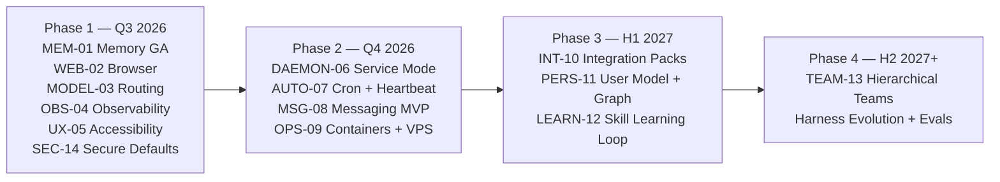
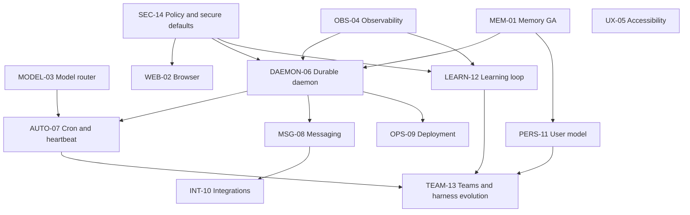

# grok-build Competitor Comparison and Strategic Roadmap

> **Version:** 1.0
> **Assessment date:** July 18, 2026
> **Repository:** [`nonexphere/grok-build`](https://github.com/nonexphere/grok-build)
> **Feature taxonomy:** [`FEATURE_MAP.md`](./FEATURE_MAP.md)

## Positioning Statement

The `nonexphere/grok-build` fork is positioned as:

> **The terminal-native, high-performance, extensible harness that leads in interactive coding UX while evolving to match the autonomy, persistence, and integration depth of top personal-assistant harnesses.**

grok-build should not become a clone of a messaging gateway with a secondary terminal client, nor should it remain only a coding CLI. Its strategic opportunity is to combine:

* The interactive depth of a dedicated full-screen Rust TUI.
* Native mouse interaction, rich scrollback blocks, panes, queues, modals, themes, and long-running task controls.
* One modular agent runtime across TUI, headless, ACP, WebSocket, CI, and future gateway surfaces.
* OS-enforced sandboxing and explicit permission controls.
* Strong local coding tools, codebase awareness, Git/worktree support, subagents, and background execution.
* Human-readable local state, including Markdown skills, project rules, and experimental hybrid memory.
* An extensibility stack spanning plugins, hooks, skills, agents, personas, MCP, LSP, and custom protocols.
* A staged expansion into durable scheduling, proactive behavior, messaging, personal integrations, and evidence-gated self-improvement.

## Scope and Methodology

The comparison evaluates **harness capabilities**, not the raw intelligence of any one underlying model. A product receives credit for a capability only when the harness provides a usable implementation or a documented extension path. “Possible through arbitrary shell code” is not treated as equivalent to a typed, permission-aware, observable product feature.

The assessment distinguishes:

* Local coding-agent workflows from cloud-delegated workflows.
* Built-in features from extensions that require substantial custom engineering.
* Foreground session scheduling from always-on gateway scheduling.
* Human-readable memory from simple transcript persistence.
* Tool approval from actual OS or container isolation.
* Multiple selectable models from automatic policy-based routing.
* Parallel processes from coordinated multi-agent orchestration.

Claude Code’s current baseline includes auto-memory, plugins, skills, hooks, MCP, custom subagents, background agents, worktrees, and agent-team surfaces. ([Claude][1])

OpenAI Codex’s baseline spans the local CLI/IDE/app and cloud-delegated agents. Its current strengths include local and cloud sandboxing, approvals, web search, MCP, images, parallel cloud tasks, test evidence, plugins, skills, and app-backed integrations. ([OpenAI Help Center][2])

OpenCode’s baseline includes a TUI backed by an HTTP/OpenAPI server, programmatic control, agents, plugins, MCP, and multiple client surfaces. Pi intentionally keeps its coding-agent core small: four default tools, broad provider support, sessions, skills, hot-reloadable TypeScript extensions, packages, print/JSON/RPC modes, and an SDK, while deliberately omitting built-in MCP, subagents, permission popups, plan mode, and background shell execution. ([OpenCode][3])

OpenClaw’s baseline is gateway-first: durable cron, heartbeat, background tasks, messaging delivery, memory, MCP, browser/computer tools, and optional sandboxed execution. Hermes combines persistent memory, user profiles, cron, messaging, MCP, browser automation, subagents, multiple execution backends, and autonomous skill workflows. ([OpenClaw][4])

The “Meta-Harness” column refers to the Stanford IRIS reference framework for automated search over executable task-specific harnesses. It is an outer-loop optimization system rather than a day-to-day coding assistant. ([GitHub][5])

## Status Legend

| Symbol                    | Meaning                                                                                        |
| ------------------------- | ---------------------------------------------------------------------------------------------- |
| 🌟 **Key Differentiator** | A strategically distinctive or unusually strong implementation.                                |
| ✅ **Full**                | Mature, documented, and directly usable for the assessed workflow.                             |
| 🟡 **Partial**            | Available with meaningful limits, experimental status, edition differences, or extension work. |
| 🔵 **Planned**            | Approved direction linked to a concrete roadmap issue to create.                               |
| ❌ **None**                | No material built-in capability for the assessed product surface.                              |

---

# Coding Harnesses Comparison

## 1. Terminal, CLI, Headless, and Embedded Experience

| Capability                                              | grok-build Current                                                                                          | grok-build Roadmap                                                                                 | Claude Code                                                                                              | OpenAI Codex                                                                                    | OpenCode                                                                                            | Pi                                                                                             | (Meta) Harness Tool                                           |
| ------------------------------------------------------- | ----------------------------------------------------------------------------------------------------------- | -------------------------------------------------------------------------------------------------- | -------------------------------------------------------------------------------------------------------- | ----------------------------------------------------------------------------------------------- | --------------------------------------------------------------------------------------------------- | ---------------------------------------------------------------------------------------------- | ------------------------------------------------------------- |
| Full-screen terminal application                        | 🌟 Rich Rust TUI with persistent scrollback, panes, modals, task views, and prompt workspace.               | 🔵 Continue performance and accessibility work under [UX-05](#issue-register).                     | 🟡 Strong interactive terminal experience, but less oriented around a mouse-first full-screen workspace. | ✅ Rich Rust terminal UI with formatted tool calls, diffs, approvals, images, and task tracking. | ✅ Dedicated TUI backed by a reusable server.                                                        | 🟡 Extensible terminal UI and editor, intentionally smaller and more inline.                   | ❌ Not an end-user terminal assistant.                         |
| Native mouse interaction                                | 🌟 Click, wheel scrolling, focus, hover, selection-related behavior, and mouse-aware modals.                | 🔵 Expand hit targets, pane resizing, selection, and accessibility under [UX-05](#issue-register). | 🟡 Terminal-dependent selection and interaction; keyboard remains primary.                               | 🟡 Terminal UI is primarily keyboard-driven.                                                    | 🟡 TUI interaction is primarily keyboard-driven.                                                    | 🟡 Extension UI can implement interaction, but mouse-first UX is not the core proposition.     | ❌ None.                                                       |
| Rich scrollback, folds, and fullscreen block inspection | 🌟 Typed blocks, raw Markdown, folding, copy operations, rich diffs, and fullscreen viewers.                | 🔵 Add replay links and artifact provenance through [OBS-04](#issue-register).                     | ✅ Good transcript, tool, and task visibility.                                                            | ✅ Strong diff, command, progress, and evidence formatting.                                      | ✅ Structured sessions, messages, tool parts, and TUI controls.                                      | ✅ Messages, tools, extension UI, images, and configurable footer/widgets.                      | ❌ Uses experiment logs rather than conversational scrollback. |
| Prompt queue and mid-turn steering                      | 🌟 Queue follow-ups, interject, cancel-and-send, demote foreground work, and retain background tasks.       | 🔵 Preserve semantics across daemon and channels through [DAEMON-06](#issue-register).             | ✅ Backgrounding, steering, task controls, and multiple worker surfaces.                                  | ✅ Supports steering and monitoring local or cloud work.                                         | 🟡 Session prompts and server control are available; orchestration UX is less differentiated.       | ✅ Message queue and extension-controlled delivery modes.                                       | ❌ Not applicable.                                             |
| Theming and visual customization                        | ✅ Themes, terminal capability detection, syntax rendering, and configuration.                               | 🔵 Contrast validation and semantic tokens in [UX-05](#issue-register).                            | 🟡 Configurable appearance and status line, with less emphasis on theme ecosystems.                      | 🟡 Polished built-in UI; customization is not a primary platform feature.                       | ✅ Theme picker and configurable TUI.                                                                | 🌟 Themes and fully customizable extension UI.                                                 | ❌ None.                                                       |
| Keyboard remapping and accessibility                    | 🟡 Simple/Vim modes and terminal fallbacks; broad remapping and formal accessibility coverage are gaps.     | 🔵 Full keymap and accessibility program in [UX-05](#issue-register).                              | 🟡 Keyboard-centric and usable across terminals; accessibility remains terminal-dependent.               | 🟡 Cross-platform work is strong, but terminal accessibility remains constrained.               | 🟡 Configurable keybinds; screen-reader and nonvisual workflows remain limited by terminal clients. | 🟡 Keybindings and extension UI are configurable; terminal accessibility is still constrained. | ❌ None.                                                       |
| One-shot CLI and structured headless mode               | ✅ Text and structured automation paths with CI-friendly execution.                                          | 🔵 Signed execution receipts under [OBS-04](#issue-register).                                      | ✅ Print/headless modes and SDK-style automation options.                                                 | ✅ CLI scripting plus local and cloud automation.                                                | ✅ `run`, server, web, and machine-facing APIs.                                                      | 🌟 Print, JSON event stream, RPC, and embeddable SDK.                                          | ✅ Batch experiment CLI, not a general coding session CLI.     |
| CI execution                                            | ✅ Headless mode, shell tools, permissions, and deterministic process execution.                             | 🔵 Maintained CI templates and remote execution under [OPS-09](#issue-register).                   | ✅ Widely used in CI and repository automation.                                                           | ✅ Local and cloud delegation, PR review, and sandboxed task execution.                          | ✅ CLI and GitHub-oriented automation surfaces.                                                      | ✅ Print/JSON/SDK can drive CI, with policy supplied externally.                                | ✅ Designed to run evaluation and optimization experiments.    |
| ACP support                                             | 🌟 Native ACP stdio, WebSocket server, streamed plans/tools/thoughts, permissions, and `x.ai/*` extensions. | 🔵 Harden multi-user service mode through [DAEMON-06](#issue-register).                            | ❌ No comparable native ACP server baseline.                                                              | ❌ Uses its own app-server and product protocols rather than ACP as the primary contract.        | ❌ OpenAPI server rather than ACP.                                                                   | ❌ RPC and SDK are proprietary Pi interfaces.                                                   | ❌ Invokes proposer agents through wrappers.                   |
| IDE embedding                                           | 🌟 ACP works with compatible editors and custom clients while reusing the same runtime.                     | 🔵 Compatibility suite and richer diagnostics under [DAEMON-06](#issue-register).                  | ✅ Deep first-party editor integrations.                                                                  | ✅ IDE extensions and desktop app support.                                                       | ✅ IDE plugins use the OpenCode server.                                                              | ✅ SDK and RPC support custom embedding; no dominant first-party IDE protocol.                  | ❌ None.                                                       |
| Reconnectable local server                              | 🟡 ACP/WebSocket server and relay foundations exist.                                                        | 🔵 Production daemon, authentication, recovery, and tenancy in [DAEMON-06](#issue-register).       | 🟡 Background and remote agent surfaces exist, but not as a general local harness server contract.       | ✅ Cloud task service and local app-server architecture.                                         | 🌟 TUI-as-client architecture over an OpenAPI server.                                               | 🟡 RPC process and SDK embedding, without a general always-on control plane.                   | ❌ None.                                                       |

## 2. Agent Loop, Tools, Execution, and Security

| Capability                         | grok-build Current                                                                                                      | grok-build Roadmap                                                                          | Claude Code                                                                                                     | OpenAI Codex                                                                                                        | OpenCode                                                                                                           | Pi                                                                                                     | (Meta) Harness Tool                                                                         |
| ---------------------------------- | ----------------------------------------------------------------------------------------------------------------------- | ------------------------------------------------------------------------------------------- | --------------------------------------------------------------------------------------------------------------- | ------------------------------------------------------------------------------------------------------------------- | ------------------------------------------------------------------------------------------------------------------ | ------------------------------------------------------------------------------------------------------ | ------------------------------------------------------------------------------------------- |
| Planning mode                      | ✅ Structured plan mode with approval before coding.                                                                     | 🔵 Durable typed plans through [DAEMON-06](#issue-register).                                | ✅ First-class plan mode and planning subagents.                                                                 | ✅ Task plans and progress tracking.                                                                                 | ✅ Plan/build agents and configurable agent roles.                                                                  | ❌ Intentionally omitted from core; available through extensions or files.                              | 🟡 The optimizer plans candidate changes, not user coding tasks.                            |
| File and structured edit tools     | 🌟 File tools, hunk tracking, diff rendering, checkpoints, and workspace integration.                                   | 🔵 Execution receipts under [OBS-04](#issue-register).                                      | ✅ Mature read/edit/write and patch workflows.                                                                   | ✅ Mature local and cloud file editing with reviewable diffs.                                                        | ✅ Filesystem and patch tools with snapshot/revert support.                                                         | ✅ Minimal `read`, `write`, and `edit` tools, extensible or replaceable.                                | 🟡 Modifies harness candidate files rather than serving as a general editor.                |
| Shell and PTY execution            | ✅ Streaming terminal commands, PTY support, cancellation, and process management.                                       | 🔵 Remote execution backends in [OPS-09](#issue-register).                                  | ✅ Shell execution and background tasks.                                                                         | ✅ Sandboxed local/cloud command execution.                                                                          | ✅ Shell tools through the server/runtime.                                                                          | ✅ Minimal `bash` tool; background execution intentionally externalized to tmux/extensions.             | ✅ Runs candidate and evaluation commands.                                                   |
| Background commands and monitoring | 🌟 Background task IDs, wait-any/wait-all, monitor streams, `/loop`, and a tasks pane.                                  | 🔵 Durable cross-restart execution through [DAEMON-06](#issue-register).                    | ✅ Background agents and commands.                                                                               | ✅ Cloud tasks continue independently; local workflow supports longer task execution.                                | 🟡 Server sessions support concurrent work, but dedicated monitoring UX is less differentiated.                    | ❌ No built-in background shell by design.                                                              | ✅ Long-running evaluation jobs, not interactive development processes.                      |
| Web search and fetch               | ✅ First-class web search and retrieval tools.                                                                           | 🔵 Provenance and browser integration in [WEB-02](#issue-register).                         | ✅ Web research through built-ins or configured integrations.                                                    | ✅ Web search is available alongside MCP.                                                                            | 🟡 Available through providers, plugins, or MCP configurations.                                                    | 🟡 Commonly supplied as a skill or extension rather than a core tool.                                  | ❌ Not a general research harness.                                                           |
| Browser automation                 | 🟡 Reachable through MCP/plugins but no first-party deterministic browser tool.                                         | 🔵 Native browser and vision tool in [WEB-02](#issue-register).                             | 🟡 Available through browser tooling and MCP, depending on setup.                                               | 🟡 Web search and app integrations are strong; general local browser automation depends on supported tools/plugins. | 🟡 MCP/plugin path rather than a defining built-in.                                                                | 🟡 Third-party skills and extensions can add browser automation.                                       | ❌ None.                                                                                     |
| Tool permissions                   | ✅ Interactive approvals, always-approve mode, safe-command policies, hooks, and ACP permission requests.                | 🔵 Unified risk policy and expiring grants in [SEC-14](#issue-register).                    | ✅ Detailed permission modes, managed policies, per-agent restrictions, and hooks.                               | ✅ Multiple approval modes and escalation outside sandbox/workspace boundaries.                                      | ✅ Configurable permissions, though enforcement is primarily harness-level.                                         | ❌ No built-in permission popups by design; container or extension policy is expected.                  | 🟡 Candidate write scopes and validation constraints, not interactive tool approvals.       |
| OS-enforced local sandbox          | 🌟 Process-wide Landlock/Seatbelt profiles, custom deny masks, read-only/strict modes, and Linux child-network control. | 🔵 Default-safe profiles and macOS egress broker in [SEC-14](#issue-register).              | 🟡 Permissions and isolation options are strong, but grok-build’s process-wide kernel profile is more explicit. | 🌟 Strong local and cloud sandboxes, with network disabled by default in constrained modes.                         | 🟡 Permissions and external containers can constrain execution; no equivalent default process-wide kernel sandbox. | ❌ No sandbox in core; users are expected to run Pi in a container when required.                       | 🟡 Runs experiments in configured environments; isolation is deployment-specific.           |
| Custom sandbox profiles            | 🌟 Built-in and user-defined profiles with filesystem and network policy.                                               | 🔵 Policy simulator and presets in [SEC-14](#issue-register).                               | 🟡 Organization settings and execution environments provide controls, but not the same local profile model.     | ✅ Configurable approval and sandbox modes, including platform-specific implementations.                             | 🟡 External environment and permission configuration.                                                              | ❌ External responsibility.                                                                             | 🟡 Benchmark-specific environment configuration.                                            |
| Checkpoints and rollback           | ✅ Session rewind, workspace checkpoints, Git worktrees, diffs, and discard flows.                                       | 🔵 Cross-restart transaction recovery through [DAEMON-06](#issue-register).                 | ✅ Git/worktree workflows and session history support recovery.                                                  | ✅ Isolated task branches/sandboxes and review before integration.                                                   | ✅ Snapshot, undo, and revert capabilities.                                                                         | ✅ Session tree/forking; workspace rollback depends on Git or extensions.                               | ✅ Candidate archive preserves baselines and prior variants.                                 |
| Secret management                  | 🟡 Dedicated secret/auth crates and environment-based configuration; fine-grained leases remain a gap.                  | 🔵 Scoped secret delivery in [SEC-14](#issue-register).                                     | ✅ Mature provider and enterprise authentication controls.                                                       | ✅ Local credential handling and enterprise/app permissions.                                                         | 🟡 Provider keys and server configuration; enterprise secret governance is external.                               | 🟡 Local auth storage and provider credentials; extension isolation is user-managed.                   | 🟡 Environment variables and experiment configuration.                                      |
| Prompt-injection containment       | 🟡 Permission, sandbox, and hook foundations; retrieved-content trust labels need improvement.                          | 🔵 Provenance and egress policy in [SEC-14](#issue-register) and [WEB-02](#issue-register). | 🟡 Permissions and tool restrictions reduce impact; browser/MCP content still requires careful operation.       | ✅ Default sandbox and network restrictions provide strong containment for untrusted content.                        | 🟡 Depends heavily on configured permissions and external isolation.                                               | 🟡 Minimal core makes trust boundaries understandable, but provides few built-in containment controls. | 🟡 Evaluation scopes reduce damage but do not address general interactive prompt injection. |

## 3. Context, Memory, Extensibility, and Models

| Capability                      | grok-build Current                                                                                                 | grok-build Roadmap                                                         | Claude Code                                                                                                     | OpenAI Codex                                                                                                              | OpenCode                                                                                 | Pi                                                                                                         | (Meta) Harness Tool                                                                           |
| ------------------------------- | ------------------------------------------------------------------------------------------------------------------ | -------------------------------------------------------------------------- | --------------------------------------------------------------------------------------------------------------- | ------------------------------------------------------------------------------------------------------------------------- | ---------------------------------------------------------------------------------------- | ---------------------------------------------------------------------------------------------------------- | --------------------------------------------------------------------------------------------- |
| Project rules and context files | ✅ Hierarchical `AGENTS.md`, agent profiles, skills, and scoped configuration.                                      | 🔵 Unified precedence diagnostics in [MEM-01](#issue-register).            | 🌟 `CLAUDE.md`, scoped rules, managed policy, skills, and agent definitions.                                    | ✅ `AGENTS.md`, skills, repository instructions, and environment setup.                                                    | ✅ `AGENTS.md` and configurable instruction sources.                                      | ✅ `AGENTS.md`, context files, prompts, skills, and loader customization.                                   | ✅ Optimizes instruction and harness files as candidate artifacts.                             |
| Session persistence and resume  | ✅ Save, resume, continue, rewind, compact, and branch through worktrees/session state.                             | 🔵 Durable daemon recovery in [DAEMON-06](#issue-register).                | ✅ Persistent sessions, subagent transcripts, resume, compaction, and memory.                                    | ✅ Local sessions and durable cloud tasks.                                                                                 | ✅ Server-managed sessions and client reconnection.                                       | 🌟 Persistent sessions, tree navigation, fork, clone, compaction, and custom storage.                      | ✅ Experiment runs and candidate histories persist.                                            |
| Cross-session memory            | 🟡 Markdown memory, session summaries, `/flush`, `/dream`, hybrid retrieval; experimental and disabled by default. | 🔵 Memory GA and typed user profile in [MEM-01](#issue-register).          | ✅ Auto-memory is on by default, plus editable `CLAUDE.md` and scoped agent memory.                              | 🟡 Persistent instructions and product context exist; local coding memory is less central than Claude Code’s auto-memory. | 🟡 Session/context persistence, without an equally mature automatic local memory system. | 🟡 Context files and persistent extension state; no built-in auto-memory system.                           | ✅ Prior candidate source, scores, and traces are the optimizer’s experience store.            |
| Hybrid local memory search      | 🟡 FTS5, optional vectors, source weights, temporal decay, and MMR configuration.                                  | 🔵 Production retrieval diagnostics in [MEM-01](#issue-register).          | 🟡 Auto-memory uses curated Markdown and on-demand file reads rather than a general hybrid personal RAG engine. | 🟡 Connected data and product search are strong; local CLI hybrid memory is not the defining feature.                     | ❌ No comparable built-in hybrid personal memory baseline.                                | ❌ No built-in hybrid memory engine.                                                                        | 🟡 Uses filesystem access to prior artifacts rather than a user-facing memory search service. |
| Skills                          | ✅ Portable `SKILL.md` packages and TUI management.                                                                 | 🔵 Generation and evaluation in [LEARN-12](#issue-register).               | ✅ First-class skills, plugin distribution, and subagent preloading.                                             | ✅ Skills are part of the current Codex plugin/workflow system.                                                            | ✅ Agent skills and command/config integration.                                           | 🌟 Standards-compatible skills, cross-harness loading, packages, and progressive disclosure.               | 🟡 Candidate harnesses can include skills, but skill UX is not its purpose.                   |
| Plugins and marketplace         | 🌟 Bundles skills, commands, agents, hooks, MCP, and LSP; supports trust prompts, updates, and commit pins.        | 🔵 Signatures and capability manifests in [SEC-14](#issue-register).       | ✅ Plugins bundle skills, agents, hooks, MCP, LSP, and monitors with marketplace distribution.                   | ✅ Plugins combine skills, apps, and app templates with workspace controls.                                                | ✅ JavaScript/TypeScript plugins and ecosystem configuration.                             | 🌟 NPM/Git/local packages, hot-reloadable extensions, skills, prompts, themes, and project scope.          | ❌ No end-user plugin marketplace.                                                             |
| Lifecycle hooks                 | ✅ Script and HTTP lifecycle hooks around tool use and agent events.                                                | 🔵 Versioned replay and policy testing in [OBS-04](#issue-register).       | 🌟 Extensive hooks integrated with permissions, agents, and plugins.                                            | 🟡 Notifications, policies, and plugin/app lifecycle exist, but not the same general local hook surface.                  | ✅ Plugin events can observe or modify runtime behavior.                                  | 🌟 TypeScript extensions can intercept events, modify tool calls, context, compaction, and UI.             | 🟡 Optimizer hooks are experiment-specific.                                                   |
| MCP client                      | ✅ First-class MCP configuration and plugin bundling.                                                               | 🔵 OAuth, diagnostics, and policy hardening in [INT-10](#issue-register).  | ✅ First-class MCP, including per-agent configuration.                                                           | ✅ MCP and tool search are core integrations.                                                                              | ✅ MCP support and dynamic server registration.                                           | ❌ Explicitly omitted from core; extensions may implement it.                                               | ❌ Not a general MCP client.                                                                   |
| MCP server                      | ❌ No canonical safe export surface.                                                                                | 🔵 Export selected tools and memory under [INT-10](#issue-register).       | ❌ Primarily an MCP client.                                                                                      | 🟡 Product app/tool surfaces can be exposed through OpenAI protocols, but Codex is not primarily a generic MCP server.    | ❌ Primarily a client/server for OpenCode’s own API.                                      | ❌ None in core.                                                                                            | ❌ None.                                                                                       |
| Multi-provider support          | ✅ Grok defaults plus Anthropic Messages, OpenAI Chat Completions/Responses, Ollama, and compatible endpoints.      | 🔵 Capability negotiation and routing in [MODEL-03](#issue-register).      | 🟡 Claude-centric, with Anthropic-supported cloud and gateway deployment paths.                                 | 🟡 OpenAI-model-centric, including supported OpenAI models through Bedrock.                                               | 🌟 Broad provider and model ecosystem is a core proposition.                             | 🌟 Extensive provider catalog, subscriptions, custom APIs, local servers, and extension-defined providers. | 🟡 Proposer and evaluator backends are wrapper-dependent.                                     |
| Automatic model routing         | ❌ Manual model choice and per-agent overrides, without a general policy router.                                    | 🔵 Cost-, task-, and privacy-aware routing in [MODEL-03](#issue-register). | ✅ Routes subagents among Claude tiers and supports per-agent model selection, within one vendor family.         | 🟡 Product-managed model selection and task specialization; limited broad provider routing.                               | 🟡 Configurable agents/models, but policy routing is not the central differentiator.     | 🟡 Highly configurable selection; automatic routing is extension territory.                                | 🟡 Can optimize harness choices, but not a production request router.                         |
| Local-model operation           | ✅ Ollama and generic compatible endpoints.                                                                         | 🔵 Offline policy and capability probes in [MODEL-03](#issue-register).    | 🟡 Third-party gateways may route to supported endpoints, but local open-weight operation is not first-class.   | 🟡 Bedrock and compatible OpenAI deployment paths exist; arbitrary local models are not the core experience.              | ✅ Broad local-provider support.                                                          | 🌟 Ollama, LM Studio, vLLM, and custom providers are first-class.                                          | 🟡 Experiment backend dependent.                                                              |
| Hot reload                      | 🟡 Plugin reload exists; active-session version semantics need formalization.                                      | 🔵 Safe version pinning under [SEC-14](#issue-register).                   | 🟡 Some components take effect immediately; file-based definitions may require session reload.                  | 🟡 Plugin and app configuration is managed through product surfaces.                                                      | ✅ Plugins/configuration can update through the running server.                           | 🌟 Extensions and active tools can reload dynamically.                                                     | ❌ Candidate iterations are separate experiment runs.                                          |

## 4. Multi-Agent, Autonomy, Observability, and Operations

| Capability                    | grok-build Current                                                                                                      | grok-build Roadmap                                                                                 | Claude Code                                                                                                                              | OpenAI Codex                                                                                          | OpenCode                                                                                                    | Pi                                                                                             | (Meta) Harness Tool                                                                                     |
| ----------------------------- | ----------------------------------------------------------------------------------------------------------------------- | -------------------------------------------------------------------------------------------------- | ---------------------------------------------------------------------------------------------------------------------------------------- | ----------------------------------------------------------------------------------------------------- | ----------------------------------------------------------------------------------------------------------- | ---------------------------------------------------------------------------------------------- | ------------------------------------------------------------------------------------------------------- |
| Specialized subagents         | ✅ Built-in explore/plan/general roles, custom agents, personas, models, tools, and capability modes.                    | 🔵 Typed team graphs in [TEAM-13](#issue-register).                                                | 🌟 Rich custom subagents, memory, hooks, skills, permissions, worktrees, and background operation.                                       | 🟡 Multiple delegated agents and specialized cloud workflows; local customization differs by surface. | ✅ Configurable primary and subagent roles.                                                                  | ❌ Deliberately omitted from core; extensions or multiple processes can add them.               | ❌ Uses a proposer agent but is not itself a subagent platform.                                          |
| Parallel agent execution      | ✅ Concurrent background subagents and wait-any/wait-all coordination.                                                   | 🔵 Hierarchical teams and consensus in [TEAM-13](#issue-register).                                 | 🌟 Subagents, agent view, teams, and isolated sessions.                                                                                  | 🌟 Cloud Codex runs many tasks independently in parallel.                                             | 🟡 Multiple sessions/agents can run through the server; coordinated teams are less mature.                  | 🟡 Multiple SDK sessions or tmux processes, with coordination supplied externally.             | ✅ Evaluates candidate variants and rollouts, often in parallel.                                         |
| Worktree isolation            | 🌟 Native worktree mode, capability restrictions, and apply flow.                                                       | 🔵 Team-aware merge UX in [TEAM-13](#issue-register).                                              | ✅ Worktree-isolated subagents and sessions.                                                                                              | ✅ Every cloud task runs in an isolated repository environment.                                        | 🟡 Git branches and snapshots are available; dedicated per-subagent worktree orchestration is less central. | 🟡 Achievable through extensions or external Git tooling.                                      | ✅ Candidate workspaces are isolated by experiment design.                                               |
| Hierarchical agent teams      | ❌ Depth is intentionally limited to one.                                                                                | 🔵 Bounded supervisors and teams in [TEAM-13](#issue-register).                                    | ✅ Agent teams enable communicating workers, subject to product limits.                                                                   | 🟡 Parallel delegated tasks are strong; general user-defined hierarchy is less explicit.              | 🟡 Agent roles exist, but mature hierarchical orchestration is not a defining feature.                      | ❌ None in core.                                                                                | 🟡 Outer optimizer and inner candidate execution form a hierarchy, but not an interactive team runtime. |
| Background scheduler          | 🟡 `/loop`, scheduler tools, recurring and one-shot records, and durable flags; execution depends on an active runtime. | 🔵 Always-on scheduler in [AUTO-07](#issue-register).                                              | 🟡 Background agents and automation exist, but it is not a personal gateway cron system.                                                 | ✅ Cloud tasks can run remotely; recurring personal cron is outside the core coding proposition.       | ❌ No comparable always-on personal scheduler baseline.                                                      | ❌ None in core.                                                                                | ✅ Runs iterative optimization schedules, not user reminders.                                            |
| Always-on daemon              | 🟡 Agent server/relay can remain running, but no fork-owned supervised personal-assistant daemon.                       | 🔵 Service mode in [DAEMON-06](#issue-register).                                                   | ❌ Primarily interactive/editor/cloud-agent surfaces rather than a self-hosted personal gateway.                                          | ✅ OpenAI-hosted cloud service, but not a user-owned general assistant daemon.                         | 🟡 Standalone server can remain active; durable personal gateway semantics are absent.                      | 🟡 SDK can be embedded in a service such as Pi Mom, but the coding-agent core is not a daemon. | ❌ None.                                                                                                 |
| Token and cost visibility     | 🟡 Token estimation and telemetry foundations; no cohesive task-level cost dashboard.                                   | 🔵 Cost ledger and budgets in [OBS-04](#issue-register).                                           | ✅ Usage visibility and model-tier choices, with organization analytics depending on plan.                                                | ✅ Product usage reporting and OpenTelemetry-compatible local instrumentation.                         | 🟡 Usage metadata is available; cost analytics are not the primary differentiator.                          | 🌟 Footer and session information show token, cache, context, and cost.                        | ✅ Candidate scores, run costs, and experiment artifacts are central.                                    |
| OpenTelemetry and tracing     | 🟡 Relevant crates and dependencies exist; public span conventions and dashboard are incomplete.                        | 🔵 End-to-end OTLP and replay in [OBS-04](#issue-register).                                        | 🟡 Debug and enterprise telemetry exist; support varies by deployment.                                                                   | ✅ OpenTelemetry export covers important CLI execution and approval events.                            | 🟡 Server logs and events are accessible; full distributed tracing depends on integrations.                 | 🟡 Extension events can instrument execution; no standard built-in OTLP story.                 | 🌟 Full traces and scores drive candidate optimization.                                                 |
| Session replay and evidence   | 🟡 Transcripts, sandbox logs, diffs, tool blocks, and session files exist without one canonical replay bundle.          | 🔵 Replay and signed receipts in [OBS-04](#issue-register).                                        | ✅ Persistent transcripts, subagent records, tool results, and hooks provide strong inspection.                                           | 🌟 Cloud tasks provide terminal/test evidence and isolated change history.                            | ✅ Server session data and snapshots are inspectable.                                                        | ✅ Sessions can be exported, branched, and shared; extensions can append durable entries.       | 🌟 Candidate source, scores, and traces form an explicit evidence ledger.                               |
| Container/VPS deployment      | 🟡 Buildable and runnable on servers; no maintained fork container/service distribution.                                | 🔵 Images and service packaging in [OPS-09](#issue-register).                                      | 🟡 Commonly used in dev containers and managed environments; not a self-hosted gateway product.                                          | ✅ Managed cloud environments plus local desktop/CLI deployment.                                       | ✅ Server architecture is straightforward to containerize.                                                   | ✅ Node package and SDK are easy to embed; security boundary remains deployment-owned.          | ✅ Python experiment framework is container-friendly.                                                    |
| Automatic harness improvement | ❌ No production candidate/evaluation loop.                                                                              | 🔵 Evidence-gated harness evolution in [TEAM-13](#issue-register) and [LEARN-12](#issue-register). | 🟡 Claude can generate agents, skills, and configuration, but does not automatically benchmark and promote harness mutations by default. | 🟡 Codex can create plugins and skills; promotion remains user/workspace controlled.                  | 🟡 Agents can edit configuration and plugins, without an external optimizer baseline.                       | ✅ Pi can create skills/extensions, but validation and automatic promotion are user-defined.    | 🌟 Primary purpose: search over executable harness code using prior source, scores, and traces.         |

## 5. Coding Workflow Depth

| Capability                        | grok-build Current                                                                                | grok-build Roadmap                                                                                | Claude Code                                                           | OpenAI Codex                                                                                  | OpenCode                                                                 | Pi                                                                                      | (Meta) Harness Tool                                                                             |
| --------------------------------- | ------------------------------------------------------------------------------------------------- | ------------------------------------------------------------------------------------------------- | --------------------------------------------------------------------- | --------------------------------------------------------------------------------------------- | ------------------------------------------------------------------------ | --------------------------------------------------------------------------------------- | ----------------------------------------------------------------------------------------------- |
| Codebase discovery                | ✅ Search, codebase graph, file index, project rules, and workspace state.                         | 🔵 Retrieval evaluation in [MEM-01](#issue-register).                                             | 🌟 Strong dynamic repository exploration and dedicated Explore agent. | 🌟 Strong repository navigation in local and cloud environments.                              | ✅ Repository-aware agents and server state.                              | ✅ Fast tool-driven discovery with minimal defaults and extensible context loading.      | 🟡 Inspects the harness or benchmark workspace rather than serving as a general repo assistant. |
| Multi-file refactoring            | ✅ Plans, edits, diffs, shell validation, and checkpoints.                                         | 🔵 Transaction/evidence model in [OBS-04](#issue-register).                                       | ✅ Mature.                                                             | ✅ Mature, including cloud delegation.                                                         | ✅ Mature.                                                                | ✅ Capable through core tools, with workflow supplied by model, skill, or extension.     | 🟡 Can optimize a coding harness that performs refactors; not the primary user workflow.        |
| Test-debug-fix loop               | ✅ Foreground/background tests, monitor, plans, and iterative edits.                               | 🔵 Browser feedback in [WEB-02](#issue-register).                                                 | 🌟 Mature debugging, test, hook, and subagent workflows.              | 🌟 Tests, linters, type checks, and evidence are core completion signals.                     | ✅ Full coding loop.                                                      | ✅ Bash plus editing supports the loop; no built-in todo/plan enforcement.               | ✅ Evaluation loops are the core optimization mechanism.                                         |
| Git workflow                      | 🌟 Typed Git/ACP extensions, status, diff, worktrees, staging, commits, checkpoints, and discard. | 🔵 Forge integration in [INT-10](#issue-register).                                                | 🌟 Deep Git and worktree workflows.                                   | 🌟 Local Git plus cloud branches, commits, and PR handoff.                                    | ✅ Git-oriented sessions and change tracking.                             | 🟡 Shell-driven Git with extensible workflows.                                          | ✅ Versioned candidates and baseline comparison, not everyday Git assistance.                    |
| Pull requests and review          | 🟡 Strong local primitives and `gh`/MCP paths; no unified typed forge workflow.                   | 🔵 GitHub/GitLab adapter in [INT-10](#issue-register).                                            | 🌟 Mature PR creation, review, feedback, and repository automation.   | 🌟 Core cloud workflow includes review, revision, and PR creation.                            | ✅ GitHub action and server integrations.                                 | 🟡 Implementable through skills/extensions or shell tools.                              | 🟡 Can optimize PR-oriented harnesses but does not manage PRs itself.                           |
| CI failure remediation            | 🟡 Headless execution and shell/web tools support it; provider adapters are missing.              | 🔵 Forge/CI integration in [INT-10](#issue-register).                                             | ✅ Strong.                                                             | ✅ Strong local and cloud remediation workflows.                                               | ✅ Suitable for CI and GitHub automation.                                 | ✅ Suitable through print/JSON/SDK with externally supplied permissions.                 | ✅ Benchmarks and evaluates candidate fixes, not an operational CI agent by default.             |
| Long-running development tasks    | 🌟 Background processes, tasks pane, monitors, `/loop`, subagents, and interjection.              | 🔵 Durable daemon and browser loop in [DAEMON-06](#issue-register) and [WEB-02](#issue-register). | ✅ Background agents, teams, and worktrees.                            | 🌟 Cloud tasks can continue independently and in parallel.                                    | ✅ Server-based sessions support extended work.                           | 🟡 Sessions are durable, but background shell and subagents are intentionally external. | ✅ Long-running optimization experiments rather than interactive feature development.            |
| Codebase-specific memory          | 🟡 Workspace Markdown memory and hybrid retrieval are experimental.                               | 🔵 GA in [MEM-01](#issue-register).                                                               | 🌟 Auto-memory, `CLAUDE.md`, scoped rules, and per-agent memory.      | 🟡 Repository instructions and cloud task context; persistent local learning is less central. | 🟡 Instructions and session state, without equivalent auto-memory depth. | 🟡 Context files and extension state, without automatic curated codebase memory.        | 🌟 Retains candidate traces and source as optimization memory.                                  |
| Browser-based application testing | 🟡 MCP/plugin path only.                                                                          | 🔵 First-party browser tool in [WEB-02](#issue-register).                                         | 🟡 Available through browser integrations and MCP.                    | 🟡 Depends on supported tools/plugins and environment setup.                                  | 🟡 Plugin/MCP path.                                                      | 🟡 Skill/extension path.                                                                | ❌ None.                                                                                         |

---

# Personal Assistant Harnesses Comparison

## 1. Memory, Personalization, and Learning

| Capability                      | grok-build Current                                                                                          | grok-build Roadmap                                                                                     | OpenClaw                                                                                                    | Hermes Agent                                                                                                          |
| ------------------------------- | ----------------------------------------------------------------------------------------------------------- | ------------------------------------------------------------------------------------------------------ | ----------------------------------------------------------------------------------------------------------- | --------------------------------------------------------------------------------------------------------------------- |
| Human-readable long-term memory | 🟡 Global/workspace `MEMORY.md`, session logs, and editable Markdown; experimental and disabled by default. | 🔵 Production default, migrations, review, and diagnostics in [MEM-01](#issue-register).               | ✅ Markdown workspace memory, daily notes, search, and configurable memory engines.                          | 🌟 `MEMORY.md`, `USER.md`, project context, session search, and agent-curated learning.                               |
| Hybrid memory retrieval         | 🟡 FTS5 plus optional vector retrieval, source weights, temporal decay, and optional MMR.                   | 🔵 Provider-portable embeddings and retrieval quality tests in [MEM-01](#issue-register).              | ✅ Local indexing and hybrid memory search with configurable engines.                                        | ✅ Persistent memory and search, including full-text session recall.                                                   |
| Automatic session capture       | ✅ Lightweight session-end summaries; richer `/flush` is user-triggered.                                     | 🔵 Configurable high-value capture in [MEM-01](#issue-register).                                       | ✅ Daily memory and gateway workflows can capture durable context.                                           | ✅ Agent-curated memory and session search are core features.                                                          |
| Memory consolidation            | 🟡 `/dream` and gated auto-dream consolidate and deduplicate memory.                                        | 🔵 Conflict-aware, provenance-preserving consolidation in [MEM-01](#issue-register).                   | ✅ Dreaming phases can stage, reflect, and promote durable memory.                                           | ✅ Closed learning behavior curates useful memories and skills.                                                        |
| Typed user preference model     | ❌ Global memory can store preferences, but there is no formal user schema, confidence, or expiry.           | 🔵 `USER.md`, typed preferences, confidence, provenance, and visibility in [PERS-11](#issue-register). | 🟡 Durable memory supports user context; typed preference semantics are still largely file/prompt-driven.   | 🌟 `USER.md` is a first-class user model alongside memory and personality files.                                      |
| Graph and relational memory     | ❌ No first-class entity graph.                                                                              | 🔵 Temporal entity and relationship layer in [PERS-11](#issue-register).                               | 🟡 Memory plugins and advanced engines can extend retrieval; graph semantics are not the universal default. | 🟡 Rich memory/profile model, but graph behavior depends on configuration and extensions.                             |
| Explicit remember and forget    | ✅ `/remember`, natural-language remember/forget, memory browser, direct editing, and clear commands.        | 🔵 Verified deletion and retention policy in [MEM-01](#issue-register).                                | ✅ User-owned files, memory CLI, indexing, and editable state.                                               | ✅ Editable local memory and user profile files.                                                                       |
| Autonomous skill creation       | ❌ The agent can edit files, but no governed skill workshop or promotion lifecycle exists.                   | 🔵 Generate, validate, evaluate, review, and promote skills in [LEARN-12](#issue-register).            | 🟡 Skill workshop and plugin ecosystem can create capabilities, with trust controls varying by setup.       | 🌟 `skill_manage` and the closed learning loop can create or update reusable `SKILL.md` capabilities.                 |
| Skill evaluation and promotion  | ❌ Plugin validation does not yet prove task quality.                                                        | 🔵 Candidate/stable lifecycle with evals in [LEARN-12](#issue-register).                               | 🟡 Verification and trust mechanisms exist, but comprehensive behavioral evaluation is operator-dependent.  | 🟡 Generated skills can be reviewed and managed; systematic benchmark promotion remains an area for improvement.      |
| Safe self-improvement           | 🟡 Human-editable files and permission boundaries help, but no immutable candidate/evaluation separation.   | 🔵 Evidence-gated changes under [LEARN-12](#issue-register) and [TEAM-13](#issue-register).            | 🟡 Strong extensibility and task audits; self-change governance depends on policy.                          | 🌟 Closed loop with optional approval, though generated skills still require careful trust and regression management. |

## 2. Autonomy, Scheduling, and Proactive Behavior

| Capability                           | grok-build Current                                                                             | grok-build Roadmap                                                                                                                     | OpenClaw                                                                                                             | Hermes Agent                                                                                          |
| ------------------------------------ | ---------------------------------------------------------------------------------------------- | -------------------------------------------------------------------------------------------------------------------------------------- | -------------------------------------------------------------------------------------------------------------------- | ----------------------------------------------------------------------------------------------------- |
| Background commands                  | ✅ Task IDs, streaming monitors, wait-any/wait-all, cancellation, and completion notifications. | 🔵 Cross-restart task ownership in [DAEMON-06](#issue-register).                                                                       | ✅ Background task ledger covers detached work and agent operations.                                                  | ✅ Background agents, terminal sessions, and delegated work.                                           |
| Background subagents                 | ✅ Independent contexts, task pane, capability modes, worktree isolation, and resume.           | 🔵 Durable team workflows in [TEAM-13](#issue-register).                                                                               | ✅ Subagents and ACP runs are tracked as tasks.                                                                       | ✅ `delegate_task` creates isolated workers and returns concise summaries.                             |
| One-shot reminders                   | 🟡 Scheduler supports non-recurring jobs while the runtime infrastructure is available.        | 🔵 Always-on execution and delivery in [AUTO-07](#issue-register).                                                                     | ✅ Gateway cron persists and wakes the agent at the specified time.                                                   | ✅ Cron supports one-shot jobs and delivery to configured targets.                                     |
| Recurring schedules                  | 🟡 `/loop` and scheduler intervals exist; no production daemon guarantee.                      | 🔵 Cron expressions, run ledger, recovery, and budgets in [AUTO-07](#issue-register).                                                  | 🌟 Durable cron with isolated runs, run history, channel or webhook delivery, and task auditing.                     | 🌟 Cron supports create, edit, pause, resume, run, remove, skills, models, and delivery.              |
| Script-only watchdogs                | ✅ `monitor` and background scripts can emit events during a session.                           | 🔵 Durable no-model watchdogs in [AUTO-07](#issue-register).                                                                           | 🟡 Cron and tasks can run automation; exact script-only behavior depends on job configuration.                       | 🌟 No-agent cron runs scripts with zero inference cost and sends only meaningful output or errors.    |
| Heartbeat                            | ❌ No dedicated periodic awareness loop with quiet acknowledgment semantics.                    | 🔵 Context-aware heartbeat, active hours, and cheap-model routing in [AUTO-07](#issue-register).                                       | 🌟 Dedicated heartbeat with configurable cadence, active hours, lightweight context, routing, and silence semantics. | 🟡 Cron/watchdogs cover periodic awareness; heartbeat behavior is less separately branded.            |
| Always-on gateway                    | 🟡 ACP/WebSocket server can persist, but it is not yet a supervised assistant gateway.         | 🔵 Service installation, recovery, control socket, and health checks in [DAEMON-06](#issue-register).                                  | 🌟 Gateway is the product’s operational center.                                                                      | 🌟 Messaging gateway and cron daemon are first-class surfaces.                                        |
| Durable goals and standing orders    | ❌ Project rules and memory can describe goals, but no typed durable-goal engine exists.        | 🔵 Goals, authority, success criteria, and review in [AUTO-07](#issue-register).                                                       | ✅ Standing orders, goals, inferred commitments, task flows, and durable task records.                                | 🟡 Profiles, memory, cron, and skills can express durable responsibilities.                           |
| Proactive notifications              | 🟡 In-session completion notifications only.                                                   | 🔵 Routed notifications, quiet hours, deduplication, and receipts in [MSG-08](#issue-register).                                        | ✅ Heartbeat, cron, tasks, channels, and webhooks support proactive delivery.                                         | ✅ Cron and gateway notifications can target supported messaging platforms.                            |
| Active hours and interruption policy | ❌ No general personal-assistant interruption model.                                            | 🔵 Per-user/channel active hours and urgency policy in [AUTO-07](#issue-register).                                                     | ✅ Heartbeat active hours and delivery routing are configurable.                                                      | 🟡 Scheduling and channel delivery can be configured; a unified interruption policy is less explicit. |
| Budget-aware automation              | 🟡 Scheduler limits exist, but task-level cost budgets and model routing are absent.           | 🔵 Cost, frequency, tool, and model budgets in [MODEL-03](#issue-register), [OBS-04](#issue-register), and [AUTO-07](#issue-register). | 🟡 Model/cadence configuration and usage visibility exist; operators still need careful budget policy.               | ✅ Jobs can pin providers/models and use zero-model scripts where appropriate.                         |

## 3. Messaging and External Integrations

| Capability                    | grok-build Current                                                                                             | grok-build Roadmap                                                                                         | OpenClaw                                                                            | Hermes Agent                                                                                           |
| ----------------------------- | -------------------------------------------------------------------------------------------------------------- | ---------------------------------------------------------------------------------------------------------- | ----------------------------------------------------------------------------------- | ------------------------------------------------------------------------------------------------------ |
| Messaging abstraction         | ❌ No normalized channel runtime.                                                                               | 🔵 Channel API and identity model in [MSG-08](#issue-register).                                            | 🌟 Broad gateway architecture for channels, accounts, groups, and delivery.         | 🌟 Multi-platform gateway using the same agent core as terminal and desktop surfaces.                  |
| Telegram                      | ❌ MCP or custom plugin only.                                                                                   | 🔵 First-wave adapter in [MSG-08](#issue-register).                                                        | ✅ Supported channel.                                                                | ✅ Supported platform and cron delivery target.                                                         |
| Discord                       | ❌ MCP or custom plugin only.                                                                                   | 🔵 First-wave adapter in [MSG-08](#issue-register).                                                        | ✅ Supported channel with group/thread workflows.                                    | ✅ Supported platform and delivery target.                                                              |
| Slack                         | ❌ MCP or custom plugin only.                                                                                   | 🔵 First-wave team adapter in [MSG-08](#issue-register).                                                   | ✅ Supported channel.                                                                | ✅ Supported messaging platform; Pi-style Slack delegation is also possible through related ecosystems. |
| WhatsApp and mobile messaging | ❌ No first-party adapter.                                                                                      | 🔵 Second-wave adapters after gateway hardening in [MSG-08](#issue-register).                              | ✅ WhatsApp and additional channel plugins are supported.                            | ✅ WhatsApp and multiple messaging platforms are supported.                                             |
| Email                         | 🟡 Achievable through MCP, plugins, shell, or APIs without a canonical connector.                              | 🔵 OAuth-backed connector pack in [INT-10](#issue-register).                                               | ✅ Available through integrations, MCP, or plugins.                                  | ✅ Available through MCP/skills and gateway-compatible workflows.                                       |
| GitHub and code forges        | 🟡 Excellent local Git; remote forge workflows rely on `gh`, shell, MCP, or plugins.                           | 🔵 Typed GitHub/GitLab adapter and events in [INT-10](#issue-register).                                    | ✅ GitHub-oriented tools, MCP, ACP coding sessions, and task triggers.               | ✅ GitHub and other services through MCP, tools, and coding workflows.                                  |
| Calendar and task management  | ❌ No canonical connector.                                                                                      | 🔵 Calendar/task integration pack in [INT-10](#issue-register).                                            | ✅ Common through MCP and assistant integrations.                                    | ✅ MCP and scheduled workflows support calendar-related use cases.                                      |
| Smart home                    | ❌ None.                                                                                                        | 🔵 Safety-scoped Home Assistant connector in [INT-10](#issue-register).                                    | 🟡 Nodes, computer, and plugins can bridge devices; deployment varies.              | 🌟 Built-in Home Assistant-oriented integration tools.                                                 |
| Browser automation            | 🟡 MCP/plugin path.                                                                                            | 🔵 Deterministic browser and vision tooling in [WEB-02](#issue-register).                                  | ✅ Browser and computer tools are part of the assistant tool surface.                | 🌟 Browser navigation, snapshots, vision, web extraction, and multimodal tools.                        |
| MCP integrations              | ✅ Strong MCP client and plugin bundling.                                                                       | 🔵 OAuth, server mode, policy, and health UI in [INT-10](#issue-register).                                 | 🌟 MCP client/server ecosystem, tool filters, diagnostics, and gateway integration. | ✅ Standard install includes stdio and HTTP MCP client support plus a limited server mode.              |
| Large connector ecosystem     | 🟡 Technically compatible with many MCP servers, but discoverability, authentication, quality, and trust vary. | 🔵 Curated compatibility registry and health checks in [INT-10](#issue-register).                          | ✅ Broad plugin/MCP/channel ecosystem, with quality varying by source.               | ✅ Skills Hub, MCP, built-in tools, and messaging integrations provide broad coverage.                  |
| OAuth and account linking     | 🟡 Model auth, browser login, OIDC/SSO, and secret infrastructure exist; channel identity linking does not.    | 🔵 Connector OAuth broker and identity mapping in [MSG-08](#issue-register) and [INT-10](#issue-register). | ✅ Gateway and MCP integrations support multiple account and auth patterns.          | ✅ Provider, platform, and MCP authentication are part of gateway operation.                            |

## 4. Execution, Security, Deployment, and Observability

| Capability                    | grok-build Current                                                                                                | grok-build Roadmap                                                                                          | OpenClaw                                                                                                       | Hermes Agent                                                                                                                               |
| ----------------------------- | ----------------------------------------------------------------------------------------------------------------- | ----------------------------------------------------------------------------------------------------------- | -------------------------------------------------------------------------------------------------------------- | ------------------------------------------------------------------------------------------------------------------------------------------ |
| Local-first operation         | 🌟 Native Rust binary, local tools, local sessions, local Markdown memory, and local sandboxing.                  | 🔵 Offline policy and service packaging in [OPS-09](#issue-register).                                       | 🌟 Self-hosted gateway with local state and selectable providers.                                              | 🌟 Local CLI/gateway with selectable execution and model backends.                                                                         |
| Process-wide kernel sandbox   | 🌟 Landlock/Seatbelt applied to the agent process and descendants, with custom deny profiles.                     | 🔵 Default-safe profiles and macOS egress broker in [SEC-14](#issue-register).                              | 🟡 Docker, SSH, OpenShell, and policy isolation are available; gateway host remains a distinct trust boundary. | 🟡 Docker and remote terminal backends provide strong boundaries, but local execution policy differs from grok-build’s process-wide model. |
| Container execution           | 🟡 User-supplied containers are possible; maintained images and tool backends are missing.                        | 🔵 Rootless images and remote backends in [OPS-09](#issue-register).                                        | ✅ Sandbox execution can use Docker or remote environments.                                                     | 🌟 Local, Docker, SSH, Singularity, Modal, and Daytona-style terminal backends.                                                            |
| Default sandbox posture       | 🟡 Sandbox is strong but off by default.                                                                          | 🔵 Risk-aware onboarding and secure defaults in [SEC-14](#issue-register).                                  | 🟡 Sandboxing is optional and policy-dependent.                                                                | 🟡 Execution backend and approval policy determine the effective boundary.                                                                 |
| Child-process network control | 🟡 Linux seccomp control exists; macOS child-process network restriction is a documented gap.                     | 🔵 Cross-platform egress broker in [SEC-14](#issue-register).                                               | ✅ Container and policy configurations can restrict network access.                                             | ✅ Container and remote environments can constrain network, depending on backend.                                                           |
| Permission prompts and policy | ✅ Tool approvals, safe commands, capability modes, hooks, and ACP requests.                                       | 🔵 Unified policy engine and expiring authority in [SEC-14](#issue-register).                               | ✅ Tool policy, sandbox policy, and elevated execution are separately configurable.                             | ✅ Local execution approval and environment controls; scheduled tasks require carefully configured authority.                               |
| Audit trail                   | 🟡 Transcripts, tool results, sandbox JSONL, diffs, and telemetry exist without one task ledger.                  | 🔵 Canonical ledger and replay in [OBS-04](#issue-register).                                                | ✅ Task audits, gateway logs, cron history, and usage records.                                                  | ✅ Cron run history, sessions, gateway logs, and task outputs are inspectable.                                                              |
| Token and cost analytics      | 🟡 Estimation and telemetry foundations.                                                                          | 🔵 Task, schedule, agent, model, and plugin attribution in [OBS-04](#issue-register).                       | ✅ Usage and cost summaries, plus OpenTelemetry integrations.                                                   | ✅ Usage/insights and per-job model choices; script-only jobs avoid inference cost.                                                         |
| OpenTelemetry                 | 🟡 Dependencies and telemetry crate exist; product conventions are incomplete.                                    | 🔵 OTLP logs, metrics, traces, and privacy controls in [OBS-04](#issue-register).                           | ✅ OpenTelemetry export and model-call correlation are documented.                                              | 🟡 Logs and usage insights exist; OTLP is less central to the documented product story.                                                    |
| TUI operational control       | 🌟 Tasks, todos, prompt queue, subagent transcript views, plugin management, memory browser, and settings modals. | 🔵 Daemon/channel control center in [DAEMON-06](#issue-register).                                           | 🟡 CLI and web/gateway operational interfaces, but less coding-focused terminal depth.                         | 🟡 Capable TUI/CLI, with more emphasis on breadth of tools and channels than Rust full-screen interaction.                                 |
| VPS/service installation      | ❌ No supported fork-owned service package.                                                                        | 🔵 systemd/launchd, health checks, backups, and upgrades in [OPS-09](#issue-register).                      | ✅ Gateway deployment is a primary use case.                                                                    | ✅ Gateway daemon and server deployment are primary use cases.                                                                              |
| Multi-user tenancy            | ❌ Local and agent-server modes are not yet a tenant-safe shared assistant.                                        | 🔵 Later RBAC after [DAEMON-06](#issue-register), [MSG-08](#issue-register), and [SEC-14](#issue-register). | 🟡 Multiple channels/accounts/agents are supported; full enterprise tenancy depends on deployment.             | 🟡 Multiple messaging identities and profiles are supported; enterprise tenancy requires operator design.                                  |

---

# grok-build Strategic Roadmap: 2026–2027

## Roadmap Principles

1. **Harden existing advantages before broadening the surface.**
2. **Reuse one runtime for coding and personal-assistant workloads.**
3. **Do not add messaging before durable tasks, identity, policy, and observability exist.**
4. **Do not add self-improvement before evaluation and immutable policy boundaries exist.**
5. **Prefer a narrow, reliable first-party integration set plus MCP over dozens of shallow connectors.**
6. **Preserve local Markdown and user-owned state as canonical sources wherever practical.**
7. **Treat the TUI as the primary control center for local and daemon activity.**

## Phase Visualization



## Roadmap Table

| Phase    | Feature-map references                              | Initiative                                                                | Why it matters                                                                                                                                            | Key deliverables                                                                                                                                                                                   | Effort                     | GitHub issue                                                                                                                                                                     | Priority | Dependencies                                                                            |
| -------- | --------------------------------------------------- | ------------------------------------------------------------------------- | --------------------------------------------------------------------------------------------------------------------------------------------------------- | -------------------------------------------------------------------------------------------------------------------------------------------------------------------------------------------------- | -------------------------- | -------------------------------------------------------------------------------------------------------------------------------------------------------------------------------- | -------- | --------------------------------------------------------------------------------------- |
| Q3 2026  | `CTX-03`, `CTX-04`, `CTX-07`, `CTX-11`, `LEARN-03`  | **Memory GA and durable profile foundation**                              | Converts an existing experimental advantage into a credible coding and personal-assistant primitive. Closes a gap with Claude Code, OpenClaw, and Hermes. | Default-safe onboarding; migration/versioning; index recovery; local embedding option; retrieval inspector; retention and verified deletion; `USER.md` candidate schema; memory evaluation corpus. | L — 8–12 engineer-weeks    | [#NEW-TO-CREATE: MEM-01](https://github.com/nonexphere/grok-build/issues/new?title=%5BRoadmap%5D%20MEM-01%20Memory%20GA%20and%20durable%20profile%20foundation)                  | P0       | Existing `xai-grok-memory`, SQLite journal, compaction, model embeddings.               |
| Q3 2026  | `TOOL-07`, `ADV-03`, `CODE-11`                      | **First-party browser automation and browser vision**                     | Closes a major personal-assistant and web-app testing gap while strengthening coding feedback loops.                                                      | Controlled browser process; accessibility snapshots; click/type/upload/download; screenshots; session profiles; origin policy; action preview; TUI blocks; ACP events; deterministic tests.        | XL — 12–18 engineer-weeks  | [#NEW-TO-CREATE: WEB-02](https://github.com/nonexphere/grok-build/issues/new?title=%5BRoadmap%5D%20WEB-02%20First-party%20browser%20automation%20and%20vision)                   | P0       | Sandbox policy, HTTP, multimodal attachments, tool protocol, PTY testing.               |
| Q3 2026  | `MODEL-07`, `MODEL-08`, `MODEL-09`, `MODEL-10`      | **Capability-aware model router**                                         | Makes multi-provider support operationally meaningful and lowers the cost of subagents, memory, and future heartbeats.                                    | Capability registry; task-class policies; per-agent/job routing; privacy/local-only rules; fallback; budget checks; route explanations; provider health.                                           | L — 8–12 engineer-weeks    | [#NEW-TO-CREATE: MODEL-03](https://github.com/nonexphere/grok-build/issues/new?title=%5BRoadmap%5D%20MODEL-03%20Capability-aware%20model%20routing%20and%20fallback)             | P0       | Model catalog, token estimation, circuit breaker, telemetry, proposed policy engine.    |
| Q3 2026  | `OBS-01`–`OBS-10`, `ADV-12`                         | **Unified OpenTelemetry, cost ledger, replay, and execution receipts**    | Required for safe autonomy, contributor debugging, regression analysis, and credible enterprise use.                                                      | Stable event/span schema; OTLP export; exact usage reconciliation; task cost ledger; replay bundle; privacy controls; local TUI report; signed receipt format.                                     | L — 10–14 engineer-weeks   | [#NEW-TO-CREATE: OBS-04](https://github.com/nonexphere/grok-build/issues/new?title=%5BRoadmap%5D%20OBS-04%20Unified%20telemetry%20cost%20ledger%20and%20session%20replay)        | P0       | `xai-grok-telemetry`, SQLite journal, tool lifecycle events, model usage events.        |
| Q3 2026  | `UX-06`, `UX-07`, `OPS-10`                          | **Configurable keymaps and terminal accessibility baseline**              | Protects the flagship TUI differentiator and expands the addressable user base without waiting for gateway work.                                          | Declarative keymap schema; conflict diagnostics; high-contrast and non-color modes; reduced animation; screen-reader guidance; accessibility test checklist; mouse alternatives.                   | M — 5–8 engineer-weeks     | [#NEW-TO-CREATE: UX-05](https://github.com/nonexphere/grok-build/issues/new?title=%5BRoadmap%5D%20UX-05%20Configurable%20keymaps%20and%20terminal%20accessibility)               | P1       | Pager input architecture, config schema, PTY harness, theme tokens.                     |
| Q3 2026  | `SEC-01`–`SEC-11`                                   | **Secure-by-default sandbox and unified policy engine**                   | grok-build already has unusually strong isolation, but default-off behavior and platform gaps weaken the positioning.                                     | Risk-aware onboarding; recommended default profile; policy simulator; macOS/network egress broker design; tool risk classes; expiring grants; secret leases; extension capability manifests.       | XL — 12–18 engineer-weeks  | [#NEW-TO-CREATE: SEC-14](https://github.com/nonexphere/grok-build/issues/new?title=%5BRoadmap%5D%20SEC-14%20Secure-by-default%20sandbox%20and%20unified%20policy%20engine)       | P0       | Sandbox crate, secrets, hooks, tool registry, HTTP client, ACP approvals.               |
| Q4 2026  | `AUTO-04`, `UX-11`, `OPS-03`, `OPS-07`              | **Supervised daemon and durable task service**                            | Establishes the operational foundation for messaging, cron, proactive behavior, remote clients, and cross-restart work.                                   | `xai-grok-daemon`; local control socket; service install; health and readiness; task leases; restart recovery; encrypted state references; TUI attach/detach; ACP reuse.                           | XL — 16–24 engineer-weeks  | [#NEW-TO-CREATE: DAEMON-06](https://github.com/nonexphere/grok-build/issues/new?title=%5BRoadmap%5D%20DAEMON-06%20Supervised%20daemon%20and%20durable%20task%20service)          | P0       | Memory GA, observability, policy engine, persistent journal, server mode.               |
| Q4 2026  | `AUTO-02`, `AUTO-03`, `AUTO-05`–`AUTO-10`           | **Durable cron, heartbeat, event triggers, and autonomy budgets**         | Closes the clearest gap with OpenClaw and Hermes while reusing existing scheduler and background-task primitives.                                         | Cron expressions and one-shots; run ledger; fresh-session jobs; no-model scripts; heartbeat; active hours; event hooks; quiet acknowledgment; budgets; idempotency; delivery contract.             | L — 10–14 engineer-weeks   | [#NEW-TO-CREATE: AUTO-07](https://github.com/nonexphere/grok-build/issues/new?title=%5BRoadmap%5D%20AUTO-07%20Durable%20cron%20heartbeat%20and%20autonomy%20budgets)             | P0       | Daemon, model router, telemetry, policy, notification abstraction.                      |
| Q4 2026  | `INT-01`–`INT-04`, `INT-11`, `AUTO-06`              | **Messaging gateway MVP: Telegram, Discord, and Slack**                   | Enters the personal-assistant market through high-value channels without immediately supporting every platform.                                           | Normalized message/channel API; identity mapping; DMs/groups/threads; attachments; approvals; outbound notifications; delivery receipts; quiet hours; adapter diagnostics.                         | XL — 16–22 engineer-weeks  | [#NEW-TO-CREATE: MSG-08](https://github.com/nonexphere/grok-build/issues/new?title=%5BRoadmap%5D%20MSG-08%20Messaging%20gateway%20MVP%20for%20Telegram%20Discord%20and%20Slack)  | P0       | Daemon, durable tasks, policy, secrets, OAuth/account linking, observability.           |
| Q4 2026  | `OPS-02`, `OPS-03`, `OPS-05`, `OPS-07`, `OPS-09`    | **Container, VPS, backup, and service distribution**                      | Makes daemon and gateway capabilities deployable, reproducible, and supportable rather than source-only demos.                                            | Rootless images; minimal/full variants; systemd/launchd units; persistent-volume contract; backups; health checks; upgrade/migration tests; deployment guide.                                      | L — 8–12 engineer-weeks    | [#NEW-TO-CREATE: OPS-09](https://github.com/nonexphere/grok-build/issues/new?title=%5BRoadmap%5D%20OPS-09%20Container%20VPS%20and%20service%20distribution)                      | P0       | Daemon, migration framework, release signing, sandbox compatibility.                    |
| H1 2027  | `INT-05`–`INT-12`, `EXT-04`, `EXT-05`               | **Productivity integration pack and hardened MCP hub**                    | Provides practical assistant value while avoiding an unmaintainable native connector explosion.                                                           | GitHub/GitLab; email; calendar/tasks; OAuth broker; webhooks; curated MCP compatibility; server export; health UI; per-tool policy; optional Home Assistant adapter.                               | XL — 18–26 engineer-weeks  | [#NEW-TO-CREATE: INT-10](https://github.com/nonexphere/grok-build/issues/new?title=%5BRoadmap%5D%20INT-10%20Productivity%20integrations%20and%20hardened%20MCP%20hub)            | P1       | Messaging gateway, browser, policy, daemon, MCP OAuth, audit ledger.                    |
| H1 2027  | `CTX-05`–`CTX-07`, `ADV-04`, `LEARN-01`–`LEARN-03`  | **Typed user model, temporal graph memory, and cross-channel continuity** | Differentiates grok-build from coding-only agents and turns memory into a coherent personal-assistant substrate.                                          | `USER.md`; typed preferences; entities/relationships; temporal validity; channel visibility; contradiction review; graph/Markdown round trip; user export; privacy controls.                       | XL — 16–24 engineer-weeks  | [#NEW-TO-CREATE: PERS-11](https://github.com/nonexphere/grok-build/issues/new?title=%5BRoadmap%5D%20PERS-11%20Typed%20user%20model%20and%20temporal%20graph%20memory)            | P1       | Memory GA, identity mapping, provenance, retention, integration object IDs.             |
| H1 2027  | `LEARN-04`–`LEARN-10`, `EXT-01`, `EXT-08`, `OBS-08` | **Closed learning loop and autonomous skill workshop**                    | Matches Hermes’ strongest strategic differentiator while preserving grok-build’s stronger review, sandbox, and evaluation posture.                        | Failure/correction capture; skill scaffolding; generated scripts; sandbox tests; security scan; benchmark set; candidate/stable channels; review UI; signed publish flow.                          | XL — 16–24 engineer-weeks  | [#NEW-TO-CREATE: LEARN-12](https://github.com/nonexphere/grok-build/issues/new?title=%5BRoadmap%5D%20LEARN-12%20Closed%20learning%20loop%20and%20autonomous%20skill%20workshop)  | P1       | Memory GA, eval platform, policy, plugin signatures, observability, model router.       |
| H2 2027+ | `MULTI-05`–`MULTI-10`, `ADV-05`, `ADV-10`, `OBS-08` | **Hierarchical teams, consensus, and evidence-gated harness evolution**   | Moves beyond coding parity toward a differentiated Rust control plane for reliable multi-agent and adaptive harness operation.                            | Bounded team graphs; supervisors; shared artifact registry; consensus/review; durable workflows; candidate harness generation; benchmark gates; immutable policies; rollback and frontier history. | XL — multi-release program | [#NEW-TO-CREATE: TEAM-13](https://github.com/nonexphere/grok-build/issues/new?title=%5BRoadmap%5D%20TEAM-13%20Hierarchical%20teams%20and%20evidence-gated%20harness%20evolution) | P2       | Daemon, task ledger, evals, skill lifecycle, model router, policy engine, graph memory. |

---

# Competitive Advantages of grok-build

## 1. Terminal UX is a product, not a transport

grok-build’s TUI is built as a dedicated full-screen Rust application with mouse interaction, structured scrollback blocks, fullscreen inspection, task/todo/queue panes, model and extension management, image input, theming, and explicit mid-turn steering.

This creates a stronger control surface for long-running coding and agent operations than a line-oriented terminal chat or a gateway CLI that primarily configures a web/messaging service.

**Evidence in the repository:**

* [`xai-grok-pager`](https://github.com/nonexphere/grok-build/tree/main/crates/codegen/xai-grok-pager)
* [`Keyboard Shortcuts`](https://github.com/nonexphere/grok-build/blob/main/crates/codegen/xai-grok-pager/docs/user-guide/03-keyboard-shortcuts.md)
* [`Background Tasks and Monitoring`](https://github.com/nonexphere/grok-build/blob/main/crates/codegen/xai-grok-pager/docs/user-guide/20-background-tasks.md)
* [`Subagents and Personas`](https://github.com/nonexphere/grok-build/blob/main/crates/codegen/xai-grok-pager/docs/user-guide/16-subagents.md)

## 2. One runtime already serves interactive, headless, and embedded markets

The same core agent runtime supports:

* Full-screen interactive TUI.
* One-shot and headless execution.
* CI scripting.
* ACP stdio.
* WebSocket server operation.
* Outbound relay patterns.
* IDE and custom-client embedding.

This is strategically important: the fork does not need to create a second agent implementation for personal-assistant gateways. It needs a durable daemon, channel adapters, and operational hardening around the existing runtime.

**Evidence:**

* [`README.md`](https://github.com/nonexphere/grok-build/blob/main/README.md)
* [`Agent Mode and IDE Integration`](https://github.com/nonexphere/grok-build/blob/main/crates/codegen/xai-grok-pager/docs/user-guide/15-agent-mode.md)
* [`Headless Mode and Scripting`](https://github.com/nonexphere/grok-build/blob/main/crates/codegen/xai-grok-pager/docs/user-guide/14-headless-mode.md)

## 3. ACP is a meaningful interoperability advantage

grok-build does not merely expose a prompt endpoint. Its ACP implementation includes:

* Session creation, loading, and resumption.
* Streamed messages, thoughts, plans, and tool state.
* Interactive permission requests.
* Filesystem operations.
* Git and worktree operations.
* Search and index notifications.
* Terminal lifecycle operations.
* Authentication and telemetry extensions.

This supports a strategy in which grok-build becomes a trusted local agent runtime embedded by editors, terminals, notebooks, web clients, and future assistant surfaces.

## 4. Sandboxing is unusually deep for a terminal-native OSS harness

grok-build applies restrictions to the entire process using OS facilities rather than relying only on tool-name allowlists.

Current strengths include:

* Landlock on Linux.
* Seatbelt on macOS.
* Bubblewrap-backed read-deny masks on Linux.
* Built-in `workspace`, `read-only`, `strict`, and `devbox` profiles.
* Custom read-only, read-write, deny, and network settings.
* Fail-closed behavior for custom profiles that cannot satisfy critical deny rules.
* Sandbox profile persistence across resumed sessions.
* Sandbox event logs.

The remaining weaknesses—default-off posture and incomplete macOS child-network enforcement—are specific and addressable.

**Evidence:**

* [`Sandbox Mode`](https://github.com/nonexphere/grok-build/blob/main/crates/codegen/xai-grok-pager/docs/user-guide/18-sandbox.md)
* [`Permissions and Safety Controls`](https://github.com/nonexphere/grok-build/blob/main/crates/codegen/xai-grok-pager/docs/user-guide/22-permissions-and-safety.md)

## 5. Rust crate modularity supports controlled expansion

The repository already separates major responsibilities into focused crates rather than concentrating the product in one CLI package.

Relevant boundaries include:

* TUI and rendering.
* Agent runtime and lifecycle.
* Tools and tool protocols.
* Filesystem, VCS, and worktrees.
* Models, sampling, HTTP, and token estimation.
* Memory and SQLite journals.
* MCP, hooks, plugins, and marketplace.
* Sandbox, secrets, auth, and telemetry.
* ACP and workspace clients.
* Subagent resolution, personas, and agent definitions.
* Voice and multimodal support.

This makes it practical to add a daemon, gateway, policy engine, browser runtime, and eval platform without turning the interactive binary into an inseparable monolith.

## 6. The extension stack is already broad and safety-aware

grok-build plugins can bundle:

* Skills.
* Commands.
* Agent definitions.
* Hooks.
* MCP servers.
* LSP servers.

The marketplace supports local and Git sources, installation trust prompts, updates, enable/disable controls, validation, version tags, and optional exact-commit requirements. This is a stronger base for an assistant ecosystem than raw “run this script” extensibility.

**Evidence:**

* [`Plugins`](https://github.com/nonexphere/grok-build/blob/main/crates/codegen/xai-grok-pager/docs/user-guide/09-plugins.md)
* [`Skills`](https://github.com/nonexphere/grok-build/blob/main/crates/codegen/xai-grok-pager/docs/user-guide/08-skills.md)
* [`Hooks`](https://github.com/nonexphere/grok-build/blob/main/crates/codegen/xai-grok-pager/docs/user-guide/10-hooks.md)
* [`MCP Servers`](https://github.com/nonexphere/grok-build/blob/main/crates/codegen/xai-grok-pager/docs/user-guide/07-mcp-servers.md)

## 7. Important personal-assistant primitives already exist

The personal-assistant expansion is not a greenfield rewrite. grok-build already has:

* Persistent Markdown memory.
* Hybrid full-text and vector retrieval.
* Automatic session summaries.
* Manual rich memory flushes.
* Memory consolidation.
* Session-local and durable scheduler records.
* Recurring loops.
* Background commands.
* Streaming monitors.
* Parallel subagents.
* WebSocket server and relay modes.
* Provider-neutral model endpoints.
* Plugin, MCP, hook, skill, and persona systems.

The roadmap must productionize and connect these primitives rather than replace them.

## 8. Local-first state is understandable and portable

Memory files, skills, agent definitions, personas, configuration, hooks, plugin manifests, sessions, and logs are predominantly based on human-readable formats plus local SQLite indexes.

That supports:

* Manual audit and correction.
* Backup and version control.
* Migration between machines and providers.
* Debugging without a proprietary cloud console.
* Contributor participation in the data model.
* A credible privacy story.

---

# Known Gaps and Risks

## Product Gaps

| Gap                                                 | Impact                                                                                                    | Mitigation                                                                                          |
| --------------------------------------------------- | --------------------------------------------------------------------------------------------------------- | --------------------------------------------------------------------------------------------------- |
| No production always-on daemon                      | Blocks dependable cron, messaging, proactive notifications, and restart recovery.                         | Make `DAEMON-06` the Phase 2 architectural dependency for all assistant surfaces.                   |
| No native messaging gateway                         | Prevents direct competition with OpenClaw and Hermes for personal-assistant workflows.                    | Launch only after durable tasks, identity, policy, and observability exist.                         |
| Memory is experimental and disabled by default      | Weakens claims of persistence despite a technically strong implementation.                                | Complete `MEM-01`, publish memory safety guarantees, and add retrieval evaluation.                  |
| No first-party browser automation                   | Limits authenticated web workflows and browser-based application testing.                                 | Implement `WEB-02` with deterministic accessibility data before vision-only control.                |
| No dedicated heartbeat                              | Session scheduler features do not create context-aware proactive awareness.                               | Build heartbeat on the daemon, model router, memory, and notification layers.                       |
| Model selection is manual rather than policy-driven | Increases cost and prevents efficient heartbeat, subagent, privacy, and fallback behavior.                | Complete `MODEL-03` before scaling autonomous workloads.                                            |
| Observability is fragmented                         | Makes failures, costs, and policy decisions difficult to reconstruct.                                     | Complete `OBS-04` before messaging and broad scheduled execution.                                   |
| Subagent depth is limited to one                    | Prevents supervisor/team patterns and durable decomposition.                                              | Preserve the safe flat default; add bounded hierarchy only with budgets and task ledgers.           |
| No governed self-improvement loop                   | Falls behind Hermes in autonomous skill creation and behind Meta-Harness in evidence-driven optimization. | Build evals, candidate promotion, immutable policy, and rollback before enabling automatic changes. |
| No typed forge integration                          | Local Git is excellent, but PR, issue, review, and CI workflows rely on shell or MCP composition.         | Include GitHub/GitLab in `INT-10`.                                                                  |
| Limited Windows assurance                           | Reduces enterprise and broad developer adoption.                                                          | Expand PTY, sandbox, installer, and CI coverage; publish an explicit support matrix.                |
| Keybindings are not generally remappable            | Limits accessibility, international keyboard compatibility, and power-user customization.                 | Complete `UX-05`.                                                                                   |

## Security Risks

| Risk                                                  | Why it matters                                                                          | Required control                                                                                          |
| ----------------------------------------------------- | --------------------------------------------------------------------------------------- | --------------------------------------------------------------------------------------------------------- |
| Sandbox is off by default                             | A strong optional sandbox does not protect users who never enable it.                   | Risk-aware onboarding, visible status, recommended profiles, and safe defaults.                           |
| macOS child-process network restriction is incomplete | Filesystem isolation does not prevent all exfiltration paths.                           | Brokered egress or a documented container profile for high-risk work.                                     |
| MCP and plugin supply chain                           | Extensions can expose tools, execute code, read secrets, or inject instructions.        | Signatures, exact pins, declared capabilities, policy allowlists, sandboxing, provenance, and revocation. |
| Browser prompt injection                              | Authenticated pages can direct the model to perform unrelated privileged actions.       | Trust labels, origin scoping, action previews, output isolation, and permission boundaries.               |
| Persistent memory poisoning                           | Incorrect or adversarial content can influence future sessions.                         | Provenance, confidence, user review, retention, conflict detection, and safe retrieval thresholds.        |
| Cross-channel identity confusion                      | A message from one platform could be mapped to the wrong user, workspace, or authority. | Explicit account linking, verified identities, channel scopes, and audit events.                          |
| Pre-authorized scheduled actions                      | Recurring jobs can retain more authority than the user intended.                        | Expiring grants, budgets, active hours, recipient restrictions, and immediate revocation.                 |
| Autonomous skill generation                           | Generated instructions or scripts may contain insecure or destructive behavior.         | Candidate state, sandbox tests, static checks, behavioral evals, and human approval by default.           |
| Audit logs containing secrets                         | Better observability can increase data exposure.                                        | Structured redaction, secret references, local-only sinks, retention policy, and encrypted backups.       |

## Strategic Risks

| Risk                                        | Consequence                                                                                                    | Response                                                                                                            |
| ------------------------------------------- | -------------------------------------------------------------------------------------------------------------- | ------------------------------------------------------------------------------------------------------------------- |
| Fork divergence from upstream SpaceXAI code | Syncs may become difficult as the fork adds daemon and assistant-specific architecture.                        | Isolate fork features behind new crates and stable interfaces; maintain a documented upstream-sync process.         |
| Attempting feature-count parity             | Produces many shallow integrations and weakens the TUI, security, and reliability differentiators.             | Prioritize durable primitives and a small first-party connector set; use MCP for breadth.                           |
| Blurring coding and assistant UX            | Could make the TUI feel cluttered or force messaging abstractions into local coding paths.                     | Keep surfaces separate while sharing runtime primitives and task models.                                            |
| Model-provider protocol churn               | Custom endpoints may appear compatible but fail on tool streaming, reasoning, or multimodal behavior.          | Capability probes, contract tests, graceful degradation, and versioned adapters.                                    |
| Trademark and provenance ambiguity          | The fork may be mistaken for an official SpaceXAI/xAI product or retain branding it cannot use.                | Establish fork-owned naming, attribution, release channels, and legal review before external launch.                |
| Contributor-governance mismatch             | The upstream tree states that external contributions are not accepted, conflicting with an open fork strategy. | Replace fork governance docs with an explicit contribution model, CODEOWNERS, issue templates, and release process. |
| Self-improvement overfitting                | Harness changes may improve a benchmark while degrading real tasks or safety.                                  | Use holdout suites, diverse tasks, immutable policies, review, canary releases, and rollback.                       |
| Operational burden                          | A daemon, channels, OAuth, browsers, and connectors materially increase maintenance and security obligations.  | Create subsystem ownership, compatibility matrices, security response procedures, and release gates.                |

---

# Maintenance and Contribution Guide

## Update Triggers

Update this document and [`FEATURE_MAP.md`](./FEATURE_MAP.md) in the same pull request when any of the following occurs:

1. A feature moves between planned, experimental, and production status.
2. A public crate, protocol, plugin schema, memory format, or persistent database schema changes.
3. A roadmap issue is created, renumbered, split, merged, completed, or abandoned.
4. A new first-party tool, provider, channel, integration, agent type, or deployment mode ships.
5. A competitor releases a capability that changes a material comparison.
6. A security limitation is discovered or mitigated.
7. A quarterly strategic review occurs, even if no status changes are required.

## Evidence Rules

* Prefer official documentation, release notes, repositories, and source code.
* Record the exact assessment date.
* Compare released capabilities, not demonstrations or announced intentions.
* Distinguish local CLI, IDE, cloud, enterprise, and experimental editions.
* Do not equate “can call a shell script” with a supported product integration.
* Do not equate “supports MCP” with compatibility with every listed MCP server.
* Do not compare raw connector, plugin, skill, or model counts without quality and maintenance context.
* Link every grok-build roadmap claim to a GitHub issue.
* Mark uncertain or edition-dependent assessments as 🟡 rather than inferring ✅.
* Include limitations directly in status cells rather than hiding them in footnotes.

## Pull-Request Checklist

A pull request that modifies either strategic document should confirm:

```markdown
## Strategic documentation checklist

- [ ] I updated the assessment date in both strategic documents.
- [ ] Every changed grok-build capability links to source code, user documentation, or a roadmap issue.
- [ ] Every new roadmap row references one or more FEATURE_MAP IDs.
- [ ] I did not represent an experimental or disabled-by-default feature as production-ready.
- [ ] Competitor claims are based on current primary sources.
- [ ] I distinguished built-in capabilities from plugins, MCP servers, or custom engineering.
- [ ] I evaluated security, observability, persistence, cancellation, and migration implications.
- [ ] I added or updated acceptance criteria in the linked GitHub issue.
- [ ] I updated the #NEW-TO-CREATE register if issue numbers are now available.
- [ ] Mermaid diagrams render successfully on GitHub.
- [ ] Markdown tables render without missing cells.
```

## Status Change Requirements

| Transition | Required evidence                                                                                                                            |
| ---------- | -------------------------------------------------------------------------------------------------------------------------------------------- |
| ❌ → 🔵     | Approved issue, feature-map reference, owner, dependencies, and acceptance criteria.                                                         |
| 🔵 → 🟡    | Merged implementation or usable branch, documented enablement, limitations, tests, and migration behavior.                                   |
| 🟡 → ✅     | Production default or clearly supported opt-in, compatibility matrix, security review, observability, recovery path, and user documentation. |
| ✅ → 🟡     | Documented regression, security concern, deprecation, or support reduction.                                                                  |
| Any → ❌    | Removal rationale, migration path, and archival or replacement issue.                                                                        |

## Review Cadence

* **Monthly:** Update issue numbers, completion state, and release references.
* **Quarterly:** Revalidate competitor tables and roadmap sequencing.
* **Before major releases:** Confirm all ✅ claims against the release candidate.
* **After security incidents:** Update affected capability, risk, and mitigation entries immediately.
* **Before public positioning campaigns:** Validate external product names, edition differences, and source dates.

---

# Appendix A: Assumptions and Data Sources

## Assessment Assumptions

1. The assessment date is **July 18, 2026**.
2. “grok-build Current” refers to the accessible `main` branch of `nonexphere/grok-build` and its included user documentation.
3. The repository currently exposes no existing public roadmap issues through the connected issue search; roadmap entries therefore use `#NEW-TO-CREATE` links rather than fabricated issue numbers.
4. “OpenAI Codex” combines the current Codex CLI, IDE/app, and cloud-agent product where the capability is materially part of the Codex offering. Cells identify cloud-specific strengths where necessary.
5. “Pi” refers to the Pi coding-agent core. Separate products built with the Pi SDK, such as messaging bots, do not automatically count as built-in Pi coding-agent features.
6. “OpenClaw” and “Hermes Agent” are assessed as self-hosted personal-assistant harnesses, even where they also invoke coding agents or expose ACP.
7. “Meta-Harness” is assessed as an outer-loop harness optimizer, not as a direct replacement for a TUI coding agent.
8. Support through MCP or plugins receives 🟡 when substantial configuration or third-party trust is required and ✅ when the integration protocol is itself the assessed capability.
9. Product features, editions, and documentation change quickly. The source date is part of every assessment.

## grok-build Primary Sources

* [`README.md`](https://github.com/nonexphere/grok-build/blob/main/README.md)
* [`Cargo.toml`](https://github.com/nonexphere/grok-build/blob/main/Cargo.toml)
* [`Grok Build User Guide`](https://github.com/nonexphere/grok-build/tree/main/crates/codegen/xai-grok-pager/docs/user-guide)
* [`Keyboard Shortcuts and Mouse Support`](https://github.com/nonexphere/grok-build/blob/main/crates/codegen/xai-grok-pager/docs/user-guide/03-keyboard-shortcuts.md)
* [`MCP Servers`](https://github.com/nonexphere/grok-build/blob/main/crates/codegen/xai-grok-pager/docs/user-guide/07-mcp-servers.md)
* [`Skills`](https://github.com/nonexphere/grok-build/blob/main/crates/codegen/xai-grok-pager/docs/user-guide/08-skills.md)
* [`Plugins`](https://github.com/nonexphere/grok-build/blob/main/crates/codegen/xai-grok-pager/docs/user-guide/09-plugins.md)
* [`Hooks`](https://github.com/nonexphere/grok-build/blob/main/crates/codegen/xai-grok-pager/docs/user-guide/10-hooks.md)
* [`Custom Models`](https://github.com/nonexphere/grok-build/blob/main/crates/codegen/xai-grok-pager/docs/user-guide/11-custom-models.md)
* [`Cross-Session Memory`](https://github.com/nonexphere/grok-build/blob/main/crates/codegen/xai-grok-pager/docs/user-guide/13-memory.md)
* [`Headless Mode and Scripting`](https://github.com/nonexphere/grok-build/blob/main/crates/codegen/xai-grok-pager/docs/user-guide/14-headless-mode.md)
* [`Agent Mode and IDE Integration`](https://github.com/nonexphere/grok-build/blob/main/crates/codegen/xai-grok-pager/docs/user-guide/15-agent-mode.md)
* [`Subagents and Personas`](https://github.com/nonexphere/grok-build/blob/main/crates/codegen/xai-grok-pager/docs/user-guide/16-subagents.md)
* [`Session Management`](https://github.com/nonexphere/grok-build/blob/main/crates/codegen/xai-grok-pager/docs/user-guide/17-sessions.md)
* [`Sandbox Mode`](https://github.com/nonexphere/grok-build/blob/main/crates/codegen/xai-grok-pager/docs/user-guide/18-sandbox.md)
* [`Plan Mode`](https://github.com/nonexphere/grok-build/blob/main/crates/codegen/xai-grok-pager/docs/user-guide/19-plan-mode.md)
* [`Background Tasks and Monitoring`](https://github.com/nonexphere/grok-build/blob/main/crates/codegen/xai-grok-pager/docs/user-guide/20-background-tasks.md)
* [`Permissions and Safety Controls`](https://github.com/nonexphere/grok-build/blob/main/crates/codegen/xai-grok-pager/docs/user-guide/22-permissions-and-safety.md)

## Competitor Primary Sources

### Claude Code

* [Create custom subagents](https://code.claude.com/docs/en/sub-agents)
* [How Claude remembers your project](https://code.claude.com/docs/en/memory)
* [Create plugins](https://code.claude.com/docs/en/plugins)
* [Plugins reference](https://code.claude.com/docs/en/plugins-reference)
* [Run agents in parallel](https://code.claude.com/docs/en/agents)

### OpenAI Codex

* [OpenAI Codex CLI — Getting Started](https://help.openai.com/en/articles/11096431)
* [Introducing Codex](https://openai.com/index/introducing-codex/)
* [Introducing upgrades to Codex](https://openai.com/index/introducing-upgrades-to-codex/)
* [Building a safe, effective sandbox to enable Codex on Windows](https://openai.com/index/building-codex-windows-sandbox/)
* [Plugins in ChatGPT and Codex](https://help.openai.com/en/articles/20001256-plugins-in-codex)
* [Using Codex with your ChatGPT plan](https://help.openai.com/en/articles/11369540-using-codex-with-your-chatgpt-plan)

### OpenCode

* [OpenCode Server](https://opencode.ai/docs/server/)
* [OpenCode Documentation](https://opencode.ai/docs/)

### Pi

* [Pi coding-agent README](https://github.com/badlogic/pi-mono/blob/main/packages/coding-agent/README.md)
* [Pi extensions](https://github.com/badlogic/pi-mono/blob/main/packages/coding-agent/docs/extensions.md)
* [Pi skills](https://github.com/badlogic/pi-mono/blob/main/packages/coding-agent/docs/skills.md)
* [Pi SDK](https://github.com/badlogic/pi-mono/blob/main/packages/coding-agent/docs/sdk.md)
* [Pi providers](https://github.com/badlogic/pi-mono/blob/main/packages/coding-agent/docs/providers.md)

### OpenClaw

* [OpenClaw Heartbeat](https://docs.openclaw.ai/gateway/heartbeat)
* [OpenClaw Automation](https://docs.openclaw.ai/cron-vs-heartbeat)
* [OpenClaw Memory CLI](https://docs.openclaw.ai/cli/memory)
* [OpenClaw Sandbox and Tool Policy](https://docs.openclaw.ai/gateway/sandbox-vs-tool-policy-vs-elevated)
* [OpenClaw Documentation](https://docs.openclaw.ai/)

### Hermes Agent

* [Hermes Agent Documentation](https://hermes-agent.nousresearch.com/docs/)
* [Features Overview](https://hermes-agent.nousresearch.com/docs/user-guide/features/overview/)
* [Scheduled Tasks](https://hermes-agent.nousresearch.com/docs/user-guide/features/cron)
* [MCP](https://hermes-agent.nousresearch.com/docs/user-guide/features/mcp)
* [Tools and Toolsets](https://hermes-agent.nousresearch.com/docs/user-guide/features/tools/)
* [Built-in Tools Reference](https://hermes-agent.nousresearch.com/docs/reference/tools-reference/)

### Meta-Harness

* [Stanford IRIS Meta-Harness reference repository](https://github.com/stanford-iris-lab/meta-harness)
* [Meta-Harness: End-to-End Optimization of Model Harnesses](https://arxiv.org/abs/2603.28052)

---

# Appendix B: Issue Register

All roadmap items are marked `#NEW-TO-CREATE` because no existing matching public issues were identified in the fork at the assessment date. When an issue is created:

1. Replace every `#NEW-TO-CREATE` link with the assigned issue number.
2. Preserve the stable roadmap ID in the issue title and labels.
3. Add the issue number to both strategic documents in the same pull request.
4. Do not reuse a retired roadmap ID for a different initiative.

| Roadmap ID | Proposed issue title                                                        | Phase    | Suggested labels                                | Minimum acceptance criteria                                                                                                                           |
| ---------- | --------------------------------------------------------------------------- | -------- | ----------------------------------------------- | ----------------------------------------------------------------------------------------------------------------------------------------------------- |
| MEM-01     | `[Roadmap] MEM-01 Memory GA and durable profile foundation`                 | Q3 2026  | `roadmap`, `memory`, `p0`, `security`           | Versioned storage; migration tests; recovery; retrieval inspector; local embedding option; retention/deletion; quality benchmark; updated user guide. |
| WEB-02     | `[Roadmap] WEB-02 First-party browser automation and vision`                | Q3 2026  | `roadmap`, `tools`, `browser`, `p0`, `security` | Accessibility snapshot; navigation/actions; downloads/uploads; screenshots; origin policy; sandbox integration; TUI/ACP events; deterministic tests.  |
| MODEL-03   | `[Roadmap] MODEL-03 Capability-aware model routing and fallback`            | Q3 2026  | `roadmap`, `models`, `p0`, `cost`               | Capability registry; policy routes; fallback; budgets; privacy/local rules; route explanation; provider health; integration tests.                    |
| OBS-04     | `[Roadmap] OBS-04 Unified telemetry, cost ledger, and session replay`       | Q3 2026  | `roadmap`, `observability`, `p0`                | Stable event schema; OTLP; exact usage; task costs; replay bundle; redaction tests; local report; retention controls.                                 |
| UX-05      | `[Roadmap] UX-05 Configurable keymaps and terminal accessibility`           | Q3 2026  | `roadmap`, `tui`, `accessibility`, `p1`         | Declarative keymaps; conflict detection; non-color mode; contrast checks; reduced motion; accessibility docs; PTY tests.                              |
| SEC-14     | `[Roadmap] SEC-14 Secure-by-default sandbox and unified policy engine`      | Q3 2026  | `roadmap`, `security`, `sandbox`, `p0`          | Recommended default; visible status; risk classes; policy simulator; secret scoping; expiring grants; egress design; extension permissions.           |
| DAEMON-06  | `[Roadmap] DAEMON-06 Supervised daemon and durable task service`            | Q4 2026  | `roadmap`, `daemon`, `p0`, `architecture`       | Service install; control socket; durable leases; restart recovery; health endpoints; TUI attach; ACP reuse; migration and failure tests.              |
| AUTO-07    | `[Roadmap] AUTO-07 Durable cron, heartbeat, and autonomy budgets`           | Q4 2026  | `roadmap`, `automation`, `scheduler`, `p0`      | Cron and one-shot jobs; run ledger; heartbeat; script-only jobs; active hours; idempotency; budgets; cancellation; recovery.                          |
| MSG-08     | `[Roadmap] MSG-08 Messaging gateway MVP for Telegram, Discord, and Slack`   | Q4 2026  | `roadmap`, `gateway`, `integrations`, `p0`      | Normalized channel API; identity mapping; threads/groups; attachments; approvals; notifications; receipts; diagnostics; security review.              |
| OPS-09     | `[Roadmap] OPS-09 Container, VPS, and service distribution`                 | Q4 2026  | `roadmap`, `deployment`, `containers`, `p0`     | Signed images; rootless support; persistent-volume contract; systemd/launchd; backup/restore; health checks; upgrade tests.                           |
| INT-10     | `[Roadmap] INT-10 Productivity integrations and hardened MCP hub`           | H1 2027  | `roadmap`, `mcp`, `integrations`, `p1`          | GitHub/GitLab; email; calendar/tasks; OAuth; webhooks; MCP health; safe server export; policy scopes; compatibility tests.                            |
| PERS-11    | `[Roadmap] PERS-11 Typed user model and temporal graph memory`              | H1 2027  | `roadmap`, `memory`, `personalization`, `p1`    | `USER.md`; typed preferences; graph model; temporal validity; provenance; contradictions; channel scopes; export/delete; retrieval tests.             |
| LEARN-12   | `[Roadmap] LEARN-12 Closed learning loop and autonomous skill workshop`     | H1 2027  | `roadmap`, `skills`, `learning`, `evals`, `p1`  | Feedback capture; skill generation; sandbox tests; static checks; behavioral evals; candidate/stable lifecycle; review UI; rollback.                  |
| TEAM-13    | `[Roadmap] TEAM-13 Hierarchical teams and evidence-gated harness evolution` | H2 2027+ | `roadmap`, `multi-agent`, `research`, `p2`      | Bounded team graph; supervisors; shared artifacts; consensus; durable workflows; harness candidates; holdout evals; immutable policy; rollback.       |

# Appendix C: Issue Creation Order



# Appendix D: Definition of Strategic Success

The fork will have achieved its intended dual-market position when all of the following are true:

1. A developer can use grok-build as a best-in-class full-screen terminal coding agent without enabling any personal-assistant services.
2. The same user can attach that runtime to an IDE through ACP without losing tool, session, permission, memory, or subagent capabilities.
3. The user can run a supervised local or VPS daemon that safely resumes durable tasks after restart.
4. Scheduled jobs and heartbeats can select appropriate models, obey active hours and budgets, and deliver only meaningful results.
5. Messaging channels reuse the same sessions, memory, policy, tools, and audit model rather than invoking a separate assistant implementation.
6. Browser, email, calendar, GitHub, and MCP actions carry explicit identity, authority, provenance, and review semantics.
7. Persistent memory remains human-readable, exportable, correctable, and deletable.
8. Generated skills or harness changes remain candidates until they pass security checks, behavioral evaluations, and configured approval.
9. Every autonomous action can be traced to a user request, standing order, schedule, event, or expiring authority grant.
10. Rust performance, TUI quality, sandbox depth, ACP interoperability, and crate modularity remain visible product differentiators rather than disappearing under integration breadth.

[1]: https://code.claude.com/docs/en/sub-agents "https://code.claude.com/docs/en/sub-agents"
[2]: https://help.openai.com/en/articles/20001256-plugins-in-codex "https://help.openai.com/en/articles/20001256-plugins-in-codex"
[3]: https://opencode.ai/docs/server/ "https://opencode.ai/docs/server/"
[4]: https://docs.openclaw.ai/gateway/heartbeat "https://docs.openclaw.ai/gateway/heartbeat"
[5]: https://github.com/stanford-iris-lab/meta-harness "https://github.com/stanford-iris-lab/meta-harness"

