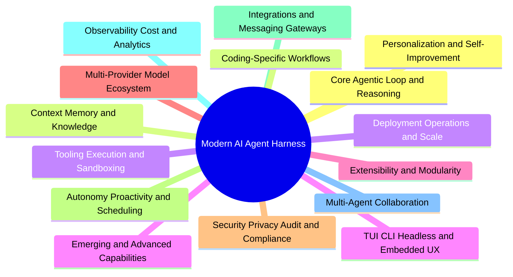
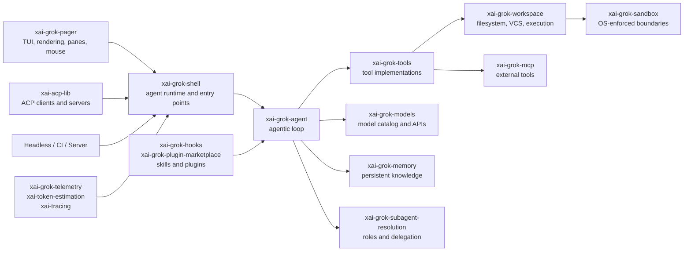

# grok-build Feature Map

> **Version:** 1.0
> **Assessment date:** July 18, 2026
> **Repository:** [`nonexphere/grok-build`](https://github.com/nonexphere/grok-build)
> **Scope:** Coding-agent harnesses, personal-assistant harnesses, and shared agent infrastructure
> **Companion document:** [`COMPETITOR_COMPARISON.md`](./COMPETITOR_COMPARISON.md)

## Purpose

This document is the canonical feature taxonomy for the `nonexphere/grok-build` fork. It defines the capability surface of a modern AI agent harness and provides a shared vocabulary for product strategy, architecture, roadmap planning, issue triage, contributor onboarding, release notes, and competitive positioning.

The fork’s objective is to establish **grok-build as the premier terminal-native, high-performance, extensible agent harness serving both the coding-agent market and the personal-assistant market**.

The strategy builds from grok-build’s strongest foundations:

* A production-grade Rust runtime and modular `xai-grok-*` crate architecture.
* A full-screen, mouse-interactive terminal experience rather than a line-oriented chat wrapper.
* One runtime that supports interactive TUI, headless automation, and ACP embedding.
* OS-enforced sandbox profiles, permission controls, checkpoints, and auditable execution.
* First-class tools for code, files, shell commands, search, long-running work, and subagent delegation.
* Skills, plugins, hooks, MCP servers, LSP integrations, agent definitions, personas, and a plugin marketplace.
* Durable sessions and an experimental Markdown-backed hybrid memory system.

This taxonomy intentionally includes capabilities that are already implemented, experimental, planned, or appropriate only for later research. A capability’s presence here does not imply that it is currently shipped.

## Status Vocabulary

| Status                        | Meaning                                                                                                                     |
| ----------------------------- | --------------------------------------------------------------------------------------------------------------------------- |
| ✅ **Current**                 | Implemented and suitable for normal production use in the fork, subject to documented limitations.                          |
| 🟡 **Partial / Experimental** | Implemented with meaningful limitations, disabled by default, or not yet hardened for broad production use.                 |
| 🔵 **Roadmap**                | Approved strategic direction requiring an implementation issue in [`COMPETITOR_COMPARISON.md`](./COMPETITOR_COMPARISON.md). |
| ⚪ **Research**                | Promising but insufficiently proven, standardized, or safe for near-term product commitment.                                |

## Product Principles

1. **Terminal-native does not mean terminal-limited.** The TUI is the flagship interface; headless, ACP, server, IDE, and messaging surfaces must reuse the same runtime.
2. **Local-first, not local-only.** Local execution, editable files, and user-owned state are defaults. Remote providers, servers, and integrations remain composable.
3. **Capability must be paired with control.** Every new tool, channel, memory source, or autonomous behavior requires permissions, auditing, revocation, and failure containment.
4. **Extensibility is a product surface.** Skills, plugins, hooks, MCP, agents, personas, and protocol extensions require stable schemas, diagnostics, versioning, and trust controls.
5. **Coding and personal-assistant capabilities should share primitives.** Sessions, memory, scheduling, tools, subagents, permissions, and notifications should not be reimplemented in separate products.
6. **Human-readable state is strategic.** Markdown, TOML, JSON, JSONL, and SQLite indexes should remain inspectable, exportable, and recoverable.
7. **The harness must be model-portable.** Provider-specific optimization is valuable, but core workflows must not depend on one model vendor.
8. **Autonomy must be bounded.** Proactive execution requires explicit authority, budgets, schedules, escalation paths, and kill switches.
9. **Self-improvement requires evidence.** The agent may propose skills, rules, memories, and harness changes, but promotion requires review or measurable evaluation.
10. **Rust is a differentiator, not a constraint.** Performance-sensitive, security-sensitive, and terminal-native components belong in Rust; external capabilities can be connected through stable protocols.

## Top-Level Taxonomy

## Architectural Mapping

---

# 1. Core Agentic Loop & Reasoning

| ID      | Feature                                         | Description                                                                                                              | Why it matters in 2026                                                                                                                   | Competitive landscape                                                                                                                                      | grok-build implementation notes                                                                                                                                                                         |
| ------- | ----------------------------------------------- | ------------------------------------------------------------------------------------------------------------------------ | ---------------------------------------------------------------------------------------------------------------------------------------- | ---------------------------------------------------------------------------------------------------------------------------------------------------------- | ------------------------------------------------------------------------------------------------------------------------------------------------------------------------------------------------------- |
| CORE-01 | Goal interpretation and task framing            | Converts an underspecified request into an explicit goal, constraints, success criteria, and working assumptions.        | Agent failures increasingly come from solving the wrong problem rather than lacking raw model capability.                                | Claude Code, Codex, and Hermes infer task scope; structured agent frameworks expose explicit goal objects.                                                 | ✅ Current foundation in `xai-grok-agent`, `xai-grok-shell`, and prompt construction. Add typed goal state to `xai-chat-state` so plans, subagents, telemetry, and resumptions share the same contract.  |
| CORE-02 | Structured planning and plan approval           | Produces an inspectable plan before mutation, supports revisions, and allows the user to approve or exit planning mode.  | Long-horizon coding and personal workflows need a stable intermediate artifact that can be reviewed before costly or destructive action. | Claude Code and grok-build provide plan modes; Codex tracks task progress; OpenClaw supports durable task flows.                                           | ✅ Current plan mode in `xai-grok-agent` and `xai-grok-pager`. Extend plans with stable IDs, dependencies, acceptance checks, and ACP serialization through `xai-acp-lib`.                               |
| CORE-03 | ReAct and native tool-calling loop              | Alternates model reasoning, tool selection, execution, observation, and continuation until completion or escalation.     | Reliable tool use is the central harness responsibility; models alone do not manage permissions, retries, context, or state transitions. | All compared coding harnesses implement tool loops; Hermes also exposes programmatic multi-tool execution.                                                 | ✅ Current in `xai-grok-agent`, `xai-grok-tools-api`, `xai-tool-runtime`, and `xai-tool-protocol`. Preserve provider-neutral tool schemas and deterministic lifecycle events.                            |
| CORE-04 | Reflection, verification, and completion checks | Evaluates whether outputs satisfy the goal, tests evidence, detects contradictions, and chooses whether to continue.     | “The tool call succeeded” is not equivalent to “the task is complete.” Verification is essential for autonomous execution.               | Codex emphasizes test evidence; Claude Code uses review and test loops; Meta-Harness evaluates candidate harnesses against external scores.                | 🟡 Partial through prompts, tests, and tool results. Add a verifier interface to `xai-grok-agent` with configurable completion policies and evidence records in `xai-sqlite-journal`.                   |
| CORE-05 | Dynamic workflow composition                    | Builds a task-specific workflow from available tools, skills, agents, policies, and integration capabilities.            | Static one-size-fits-all prompts underperform on heterogeneous coding and personal tasks.                                                | Claude Code composes skills, subagents, hooks, and plugins; Hermes attaches skills to cron jobs; OpenClaw combines tasks, heartbeats, hooks, and channels. | 🟡 Partial through skills, agents, hooks, MCP, and personas. Add a typed workflow graph in `xai-grok-agent`, resolved by `xai-grok-subagent-resolution`.                                                |
| CORE-06 | Dynamic harness generation                      | Generates or mutates prompts, rules, retrieval policies, workflow code, or agent definitions for a specific task class.  | 2026 research shows that optimizing the harness can improve results without changing model weights.                                      | Meta-Harness searches over executable harness code; Hermes can create skills; Pi extensions can generate new workflows.                                    | ⚪ Research. Implement only behind evaluation gates using proposed `xai-grok-harness-lab`; store candidates, traces, and scores outside the production configuration path.                               |
| CORE-07 | Mid-turn steering and interruption              | Lets users queue context, interject, cancel, redirect, or background active work without losing the session.             | Interactive agents must remain steerable during long model turns, builds, searches, and subagent work.                                   | Most CLIs support cancellation; grok-build’s prompt queue, interjection, and foreground-to-background controls are unusually rich.                         | 🌟 Current differentiator in `xai-grok-pager`, `xai-prompt-queue`, `xai-grok-shell`, and `xai-agent-lifecycle`. Preserve deterministic cancellation semantics across TUI, headless, and ACP.            |
| CORE-08 | Checkpointed long-horizon execution             | Persists plans, tool state, workspace checkpoints, pending tasks, and continuation metadata across failures or restarts. | Multi-hour coding jobs and recurring assistant tasks cannot depend on one uninterrupted process or context window.                       | Cloud Codex persists delegated tasks; OpenClaw has a durable task ledger; Hermes cron jobs run in fresh sessions.                                          | 🟡 Partial through sessions, checkpoints, background tasks, and SQLite journals. Consolidate resumable execution state in `xai-chat-state`, `xai-sqlite-journal`, and `xai-grok-shell-session-support`. |
| CORE-09 | Structured outputs and artifact contracts       | Produces machine-readable results that conform to schemas, file contracts, or ACP response types.                        | Automation and multi-agent pipelines require outputs that can be consumed without reparsing conversational prose.                        | ACP provides structured events; SDK-oriented harnesses expose JSON and typed APIs; subagent systems increasingly declare outputs.                          | ✅ Current for ACP, tool schemas, JSON headless output, and persona I/O contracts. Expand schema validation through `xai-grok-tools-api`, `jsonschema`, and `xai-acp-lib`.                               |
| CORE-10 | Escalation and human-in-the-loop decisions      | Detects uncertainty, missing authority, ambiguous goals, or high-risk actions and requests a bounded decision.           | Autonomous agents must know when not to proceed, especially for financial, administrative, production, and destructive actions.          | Permission prompts are common; Hermes supports approvals; OpenClaw separates tool policy, sandboxing, and elevated execution.                              | ✅ Current permission and needs-input primitives in `xai-grok-agent`, `xai-grok-pager`, and ACP. Add reusable escalation classes and channel-safe approval tokens.                                       |

---

# 2. Context, Memory & Knowledge Management

| ID     | Feature                                        | Description                                                                                                                                | Why it matters in 2026                                                                                                                      | Competitive landscape                                                                                                                        | grok-build implementation notes                                                                                                                                                          |
| ------ | ---------------------------------------------- | ------------------------------------------------------------------------------------------------------------------------------------------ | ------------------------------------------------------------------------------------------------------------------------------------------- | -------------------------------------------------------------------------------------------------------------------------------------------- | ---------------------------------------------------------------------------------------------------------------------------------------------------------------------------------------- |
| CTX-01 | Active conversation context                    | Maintains the current transcript, tool results, attachments, system rules, and task state within model limits.                             | Tool-heavy sessions can exhaust large context windows quickly; relevance and ordering directly affect reliability and cost.                 | Every harness manages active context; differences increasingly lie in compaction, selective loading, and provenance.                         | ✅ Current in `xai-chat-state`, `xai-grok-shell-session-support`, and `xai-grok-compaction`. Keep UI transcript state separable from model-visible context.                               |
| CTX-02 | Context compaction and summarization           | Compresses older turns while retaining goals, decisions, unresolved tasks, and critical evidence.                                          | Long-running work must survive context-window boundaries without silently losing constraints.                                               | Claude Code, Pi, OpenCode, and grok-build support compaction; memory-aware systems rehydrate relevant knowledge afterward.                   | ✅ Current auto-compaction and manual controls. Connect compaction summaries to `xai-grok-memory` and record discarded-source references for auditability.                                |
| CTX-03 | Human-readable persistent memory               | Stores durable preferences, decisions, project knowledge, and session summaries in editable local Markdown.                                | Users need ownership, inspectability, portability, and manual correction rather than an opaque vendor profile.                              | grok-build, Claude Code, OpenClaw, and Hermes use Markdown memory or instruction files.                                                      | 🟡 Experimental in `xai-grok-memory`: global and workspace `MEMORY.md`, session logs, `/remember`, `/flush`, and `/dream`. Harden migrations, locking, recovery, and defaults before GA. |
| CTX-04 | Hybrid retrieval and RAG                       | Combines keyword, vector, metadata, recency, and source weighting to retrieve relevant memory or documents.                                | Pure vector search misses exact identifiers; pure keyword search misses semantic relationships. Hybrid retrieval is the practical baseline. | OpenClaw and grok-build use hybrid local retrieval; enterprise assistants add connected-source search and synchronization.                   | 🟡 Experimental FTS5 plus optional vector search in `xai-grok-memory`, backed by SQLite. Add embedding-provider portability, retrieval diagnostics, and test corpora.                    |
| CTX-05 | Repository and workspace knowledge             | Builds a navigable understanding of files, symbols, dependencies, VCS state, language services, and project rules.                         | Coding agents must reason over repositories larger than the context window without repeatedly rediscovering structure.                      | Claude Code and Codex dynamically inspect repositories; OpenCode and grok-build maintain server/indexing infrastructure; IDE agents use LSP. | ✅ Current through `xai-codebase-graph`, `xai-grok-workspace`, search tools, LSP configuration, and `AGENTS.md`. Add explicit index freshness and source attribution.                     |
| CTX-06 | Graph memory and relationship modeling         | Represents people, projects, systems, decisions, events, and dependencies as typed nodes and edges.                                        | Personal assistants need relational recall that cannot be reliably reconstructed from flat chunks alone.                                    | Emerging assistant systems combine Markdown memories with entity graphs; graph-enhanced RAG remains uneven in production.                    | 🔵 Roadmap. Extend `xai-grok-memory` with `petgraph`-backed entities or add proposed `xai-grok-knowledge-graph`; retain Markdown as the canonical human-editable layer.                  |
| CTX-07 | User preference and profile modeling           | Maintains explicit and inferred preferences, roles, communication style, routines, boundaries, and frequently used services.               | A personal assistant must adapt across domains without repeatedly asking the same setup questions.                                          | Hermes uses `USER.md`; Claude Code auto-memory records workflow habits; OpenClaw stores durable workspace memory.                            | 🟡 Explicit global memory exists, but no typed user model. Add opt-in `USER.md`, provenance, confidence, expiry, and per-channel visibility in `xai-grok-memory`.                        |
| CTX-08 | Session save, resume, branch, fork, and rewind | Persists sessions and lets users continue, branch from earlier turns, rewind changes, or inspect alternate trajectories.                   | Agent work is iterative; safe experimentation requires recoverable conversational and workspace state.                                      | Pi exposes session trees; Claude Code and grok-build support resume and rewind; Codex persists cloud tasks.                                  | ✅ Current through `xai-chat-state`, `xai-grok-shell-session-support`, `xai-grok-workspace`, and the session picker. Align session lineage with subagent and worktree lineage.            |
| CTX-09 | Context files and scoped rules                 | Discovers hierarchical project, directory, user, organization, and agent-specific instruction files with precedence rules.                 | Large organizations need enforceable, reviewable behavior that varies by repository and directory.                                          | `AGENTS.md`, `CLAUDE.md`, project rules, skills, and managed policies are common cross-harness patterns.                                     | ✅ Current `AGENTS.md`, agent profiles, skills, personas, and configuration scopes. Publish one precedence algorithm from `xai-grok-config` and expose it through diagnostics.            |
| CTX-10 | External knowledge ingestion and provenance    | Imports files, URLs, messages, documents, databases, and connected services while retaining source, timestamp, permissions, and freshness. | Personal assistants and enterprise agents must distinguish current authoritative data from stale generated summaries.                       | OpenAI plugins/apps, OpenClaw channels, Hermes MCP, and enterprise RAG systems connect external sources.                                     | 🟡 Files, web fetches, MCP resources, images, and tool results exist. Add a provenance envelope to `xai-tool-types`, `xai-grok-memory`, and ACP events.                                  |
| CTX-11 | Memory lifecycle, retention, and forgetting    | Supports review, deletion, expiry, export, retention scopes, conflict resolution, and verified forgetting.                                 | Persistent assistants create privacy and correctness risks when memory cannot be inspected or removed.                                      | Markdown-backed systems permit manual deletion; enterprise platforms add retention and policy controls.                                      | 🟡 `/forget`, direct editing, and memory clearing exist. Add tombstones, deletion audit, retention policies, secure export, and stale-memory detection.                                  |

---

# 3. Tooling, Execution & Sandboxing

| ID      | Feature                                     | Description                                                                                                                                  | Why it matters in 2026                                                                                                                 | Competitive landscape                                                                                                                       | grok-build implementation notes                                                                                                                                         |
| ------- | ------------------------------------------- | -------------------------------------------------------------------------------------------------------------------------------------------- | -------------------------------------------------------------------------------------------------------------------------------------- | ------------------------------------------------------------------------------------------------------------------------------------------- | ----------------------------------------------------------------------------------------------------------------------------------------------------------------------- |
| TOOL-01 | File read, write, create, move, and delete  | Provides bounded filesystem operations with structured results and consistent encoding behavior.                                             | File operations are foundational to coding, document work, personal automation, and skill execution.                                   | All coding harnesses ship filesystem tools; assistant harnesses expose them directly or through sandboxed workspaces.                       | ✅ Current in `xai-grok-tools`, `xai-grok-workspace`, and `xai-file-utils`. Preserve atomic writes, symlink safety, path normalization, and sandbox enforcement.         |
| TOOL-02 | Structured edits, patches, and diffs        | Applies exact replacements or patches, displays diffs, tracks hunks, and supports review before persistence.                                 | Reliable editing requires lower ambiguity and better recoverability than rewriting complete files.                                     | Codex emphasizes patch review; Claude Code and OpenCode expose diffs; grok-build includes hunk tracking and rich rendering.                 | 🌟 Current in `xai-grok-tools`, `xai-hunk-tracker`, `xai-grok-workspace`, and `xai-grok-pager-render`. Add edit-conflict diagnostics and patch provenance.              |
| TOOL-03 | Shell, PTY, and process execution           | Runs commands interactively or non-interactively, captures output, manages exit state, and supports cancellation.                            | Real development and operations workflows depend on arbitrary local programs, test runners, package managers, and scripts.             | All coding harnesses expose shell tools; implementation quality varies around PTYs, streaming, and background control.                      | ✅ Current in `xai-grok-tools`, `xai-grok-workspace`, `ptyctl`, and `xai-tool-runtime`. Keep process groups, signal handling, and output truncation deterministic.       |
| TOOL-04 | Background commands and process monitoring  | Starts long-lived processes, retrieves incremental output, waits on multiple tasks, monitors streams, and terminates work.                   | Dev servers, builds, logs, downloads, and asynchronous checks must not block the main conversation.                                    | grok-build and major autonomous assistants support background work; Pi intentionally delegates this to tmux/extensions.                     | ✅ Current through background terminal execution, `monitor`, task IDs, and the tasks pane. Consolidate task records with future daemon scheduling.                       |
| TOOL-05 | Local search, grep, and semantic navigation | Searches filenames, contents, symbols, references, code graphs, and language-server indexes.                                                 | Agent speed and accuracy depend on finding the smallest relevant context rather than reading entire repositories.                      | Claude Code, Codex, OpenCode, and grok-build provide repository search; LSP integration improves precision.                                 | ✅ Current in `xai-grok-tools`, `xai-codebase-graph`, `xai-grok-workspace`, and plugin-provided LSP. Add query plans that explain why sources were selected.             |
| TOOL-06 | Web search and page retrieval               | Searches the public web, fetches pages, extracts useful content, and reports source metadata.                                                | Current technical information, package documentation, security advisories, and real-world research are inherently external.            | Most leading harnesses provide built-in search or web tools; Pi commonly adds them through skills.                                          | ✅ Current web search/fetch tools in `xai-grok-tools` and `xai-grok-http`. Strengthen citation objects, robots handling, content limits, and prompt-injection labeling.  |
| TOOL-07 | Browser automation and computer use         | Navigates interactive sites, reads accessibility trees, clicks, types, uploads, downloads, captures screenshots, and optionally uses vision. | Many personal and business workflows lack stable APIs and require authenticated browser interaction.                                   | Hermes exposes browser navigation and vision; OpenClaw includes browser/computer tools; coding harnesses often rely on MCP browser servers. | 🔵 Roadmap. Add proposed `xai-grok-browser` using a controlled browser protocol, with events surfaced through `xai-grok-tools-api`, ACP, and the TUI.                   |
| TOOL-08 | HTTP, API, and webhook calls                | Invokes REST, GraphQL, RPC, and webhook endpoints with authentication, schemas, retries, and redaction.                                      | Integrations should not require shelling out to `curl`, especially when credentials and structured responses are involved.             | MCP servers and plugin ecosystems frequently wrap APIs; Hermes and OpenClaw expose broad integration tools.                                 | 🟡 Generic HTTP infrastructure and MCP exist. Add a policy-aware HTTP tool in `xai-grok-http` with secret references from `xai-grok-secrets`.                           |
| TOOL-09 | Custom native and protocol tools            | Registers custom tools from plugins, hooks, MCP servers, SDKs, or compiled components.                                                       | No core harness can ship every domain-specific capability; stable tool contracts determine ecosystem reach.                            | MCP is the dominant interoperability layer; Pi’s TypeScript extensions provide unusually flexible in-process customization.                 | ✅ Current through `xai-grok-tools-api`, `xai-grok-mcp`, plugins, and hooks. Define compatibility guarantees for schemas, streaming, cancellation, and permissions.      |
| TOOL-10 | Permission and risk classification          | Assigns tools or invocations to risk classes and requests, caches, scopes, or denies approval.                                               | Users need practical autonomy without treating every read and every production mutation as equally risky.                              | Codex, Claude Code, OpenClaw, Hermes, and grok-build expose different approval and policy models.                                           | ✅ Current always-approve mode, safe-command rules, ACP permission requests, and hooks. Move policy evaluation into a reusable `xai-grok-policy` crate.                  |
| TOOL-11 | OS sandboxing and containerized execution   | Restricts filesystem, network, process, and environment access using kernel mechanisms, containers, VMs, or remote runtimes.                 | Tool-capable agents process untrusted repositories, web content, dependencies, and instructions that can trigger destructive commands. | Codex provides local/cloud sandboxes; OpenClaw and Hermes use container or remote backends; grok-build applies process-wide OS controls.    | 🌟 Current Landlock/Seatbelt profiles in `xai-grok-sandbox`, with bubblewrap deny masks and Linux network controls. Close macOS network and default-off gaps.           |
| TOOL-12 | Workspace checkpoints and rollback          | Snapshots or records workspace state before mutations and supports restore, discard, or comparison.                                          | Autonomous edits need a recovery path independent of model memory or Git cleanliness.                                                  | Hermes exposes checkpoints; Git-based harnesses use worktrees, commits, or patch rollback.                                                  | ✅ Current through `xai-grok-workspace`, `xai-fast-worktree`, `xai-hunk-tracker`, and rewind workflows. Standardize checkpoint metadata across file tools and subagents. |

---

# 4. Terminal UI, CLI, Headless & Embedded Experiences

| ID    | Feature                                     | Description                                                                                                                      | Why it matters in 2026                                                                                                      | Competitive landscape                                                                                                               | grok-build implementation notes                                                                                                                                                  |
| ----- | ------------------------------------------- | -------------------------------------------------------------------------------------------------------------------------------- | --------------------------------------------------------------------------------------------------------------------------- | ----------------------------------------------------------------------------------------------------------------------------------- | -------------------------------------------------------------------------------------------------------------------------------------------------------------------------------- |
| UX-01 | Full-screen terminal workspace              | Uses the terminal as a persistent application surface with scrollback, prompt, panes, modals, status, and task views.            | Long-running agent work requires more information architecture than an alternating stream of plain chat lines.              | OpenCode and Codex have terminal UIs; Pi has a highly extensible inline TUI; grok-build emphasizes a full-screen application model. | 🌟 Key differentiator in `xai-grok-pager`, `xai-grok-pager-render`, and `xai-ratatui-inline`. Protect frame rate, low flicker, and large-transcript performance.                 |
| UX-02 | Native mouse interaction                    | Supports clicking, scrolling, pane focus, hover, selection, buttons, and context-sensitive controls.                             | Mouse input materially improves discoverability and navigation for users who are not terminal keyboard experts.             | Mouse support remains inconsistent across coding agents and terminal emulators.                                                     | 🌟 Current click, wheel, focus, hover, and Linux selection behavior in `xai-grok-pager`. Expand draggable scrollbars, pane resizing, text selection, and accessible hit targets. |
| UX-03 | Rich scrollback and block rendering         | Renders reasoning, tool calls, diffs, Markdown, code, errors, subagents, and task state as inspectable blocks.                   | Users need to distinguish intent, command, output, evidence, warning, and result at a glance.                               | Codex and Claude Code format tool calls and diffs; grok-build offers folding, fullscreen viewers, and task-specific blocks.         | 🌟 Current in `xai-grok-pager-render`, `xai-grok-markdown`, and `xai-grok-mermaid`. Preserve raw views and copyable source content.                                              |
| UX-04 | Prompt editor, queues, and interjection     | Provides multiline editing, history, file mentions, image chips, queued follow-ups, and mid-turn redirection.                    | Agent sessions behave more like an IDE or operations console than a single-turn chatbot.                                    | Pi has a strong editor and message queue; grok-build adds explicit send-now and background transitions.                             | 🌟 Current in `xai-ratatui-textarea`, `xai-prompt-queue`, and `xai-grok-pager`. Make keymaps configurable without weakening terminal-specific fallbacks.                         |
| UX-05 | Panes for tasks, todos, agents, and context | Shows active workstreams, background commands, queues, plans, and auxiliary state without leaving the main session.              | Parallel work becomes unusable when progress is hidden in log lines or separate processes.                                  | Claude Code agent view and teams expose worker state; grok-build has task, todo, and queue panes.                                   | ✅ Current in `xai-grok-pager`. Unify pane item models around durable task IDs and ACP events.                                                                                    |
| UX-06 | Theming and visual customization            | Supports color schemes, terminal capability detection, syntax highlighting, density settings, and shareable themes.              | Terminal users expect compatibility across dark/light backgrounds, SSH, tmux, and diverse accessibility needs.              | Pi and OpenCode support themes; grok-build includes dedicated theming and terminal diagnostics.                                     | ✅ Current in `xai-grok-pager`, `xai-grok-config`, and syntax-rendering dependencies. Add contrast validation and semantic theme tokens.                                          |
| UX-07 | Accessibility and configurable keymaps      | Supports screen readers, reduced motion, high contrast, non-color status, keyboard remapping, and alternative navigation models. | A flagship developer interface cannot require one physical keyboard layout, visual acuity profile, or terminal feature set. | Accessibility remains a general weakness across terminal agent products.                                                            | 🟡 Vim/simple modes and terminal fallbacks exist, but keybindings are not generally remappable. Add declarative keymaps and an accessibility audit in `xai-grok-pager`.          |
| UX-08 | CLI print and structured output             | Runs one-shot prompts and emits plain text, JSON, or event streams suitable for scripts.                                         | Composable command-line automation requires predictable stdout, stderr, exit codes, and schemas.                            | Claude Code, Codex, OpenCode, Pi, and grok-build all expose non-interactive modes.                                                  | ✅ Current headless entry points in `xai-grok-shell`. Version JSON event schemas and guarantee no TUI escape sequences in machine modes.                                          |
| UX-09 | Headless and CI execution                   | Runs unattended tasks with explicit permissions, timeouts, output contracts, and deterministic exit status.                      | Agents increasingly participate in pull-request checks, release pipelines, and scheduled maintenance.                       | Codex cloud, Claude Code headless mode, OpenCode CLI, and grok-build support automation.                                            | ✅ Current. Add CI policy presets, artifact manifests, and signed execution summaries through `xai-grok-shell` and `xai-grok-telemetry`.                                          |
| UX-10 | ACP and IDE embedding                       | Exposes sessions, prompts, streaming, tools, plans, permissions, filesystem, Git, and terminal operations over ACP.              | Organizations want one trusted agent runtime across terminal, editor, notebook, and custom clients.                         | ACP adoption is growing across editors and personal harnesses; many competitors still expose proprietary APIs.                      | 🌟 Current `grok agent stdio`, WebSocket server, and `x.ai/*` extensions through `xai-acp-lib`. Treat protocol compatibility as a release-gated surface.                         |
| UX-11 | Remote, server, and web clients             | Supports authenticated remote clients, reconnectable sessions, web frontends, and constrained multi-user access.                 | Personal assistants and remote development need access beyond the local foreground terminal.                                | OpenClaw and Hermes center on gateways; OpenCode exposes an HTTP server; grok-build has ACP/WebSocket server and relay foundations. | 🟡 Server and relay modes exist. Add production auth, tenant isolation, rate limits, service management, and browser-friendly event transport.                                   |

---

# 5. Extensibility & Modularity

| ID     | Feature                                 | Description                                                                                                               | Why it matters in 2026                                                                                             | Competitive landscape                                                                                                           | grok-build implementation notes                                                                                                                                 |
| ------ | --------------------------------------- | ------------------------------------------------------------------------------------------------------------------------- | ------------------------------------------------------------------------------------------------------------------ | ------------------------------------------------------------------------------------------------------------------------------- | --------------------------------------------------------------------------------------------------------------------------------------------------------------- |
| EXT-01 | Skills as portable instruction packages | Loads `SKILL.md` packages containing workflow guidance, scripts, references, and metadata through progressive disclosure. | Skills let communities share domain expertise without rebuilding the runtime or permanently inflating context.     | Claude Code, Codex, Pi, OpenClaw, Hermes, and grok-build converge on Markdown skills.                                           | ✅ Current in grok-build. Formalize supported frontmatter, compatibility metadata, capability declarations, and validation.                                      |
| EXT-02 | Plugins as distributable bundles        | Packages skills, commands, agents, hooks, MCP, LSP, metadata, and supporting assets into one installable unit.            | Teams need versioned, reviewable capability bundles rather than manual copies of disconnected configuration files. | Claude Code and grok-build have broad plugin bundles; Pi packages combine extensions, skills, prompts, and themes.              | ✅ Current `xai-grok-plugin-marketplace`, `xai-hooks-plugins-types`, and TUI/CLI management. Publish a stable manifest specification.                            |
| EXT-03 | Lifecycle hooks                         | Runs scripts or HTTP callbacks before and after tool calls, sessions, compaction, prompts, or other lifecycle events.     | Hooks enable policy enforcement, logging, context injection, notifications, and organization-specific automation.  | Claude Code and grok-build expose rich hooks; OpenClaw uses internal and plugin hooks; Pi extensions intercept events.          | ✅ Current in `xai-grok-hooks`. Add event versioning, timeout budgets, concurrency rules, and a replayable hook test harness.                                    |
| EXT-04 | MCP client                              | Connects to local stdio and remote HTTP MCP servers, discovers tools/resources/prompts, and controls exposure.            | MCP has become the primary cross-harness integration protocol, reducing bespoke connector work.                    | All strategic personal assistants and most coding harnesses support MCP; Pi intentionally leaves it to extensions.              | ✅ Current in `xai-grok-mcp`. Add OAuth flows, capability caching, health checks, resource UX, and granular server/tool permissions.                             |
| EXT-05 | MCP server                              | Exposes grok-build tools, sessions, memory, or workflows to other MCP-compatible clients.                                 | A dual-market harness should be both a consumer and a provider in the agent ecosystem.                             | OpenClaw and Hermes can expose MCP surfaces; many coding tools remain client-only.                                              | 🔵 Roadmap. Extend `xai-grok-mcp` with an authenticated server mode and an explicit safe export registry.                                                       |
| EXT-06 | Agent and persona definitions           | Defines reusable agent roles, prompts, models, tools, isolation defaults, skills, and I/O contracts.                      | Specialized workers outperform one generic prompt and make multi-agent behavior reviewable.                        | Claude Code, grok-build, OpenCode, OpenClaw, and Hermes support specialized agents or profiles.                                 | ✅ Current through agent Markdown, roles, personas, and `xai-grok-subagent-resolution`. Add schema tooling and compatibility tests.                              |
| EXT-07 | Custom commands and protocol actions    | Registers slash commands, command-palette entries, ACP extensions, server endpoints, or domain actions.                   | Users need ergonomic entry points for repeatable workflows, not only natural-language invocation.                  | Plugins and extensions commonly register commands; grok-build also exposes extensive `x.ai/*` ACP methods.                      | ✅ Current. Centralize command metadata so CLI help, command palette, ACP discovery, and docs derive from one registry.                                          |
| EXT-08 | Marketplace and discovery               | Searches, installs, updates, pins, enables, disables, validates, and audits extensions from trusted sources.              | Ecosystem value depends on discoverability, while agent plugins have a uniquely high supply-chain risk.            | Claude Code, Codex, OpenClaw, Hermes, Pi, and grok-build provide registries or package sources with different trust guarantees. | ✅ Current marketplace support, explicit trust, local/Git sources, update controls, and optional commit-SHA enforcement. Add signatures and reputation metadata. |
| EXT-09 | Hot reload and development loop         | Reloads plugins, tools, skills, themes, or configuration without restarting long-running work.                            | Extension authors need rapid iteration, and gateway-style assistants cannot restart for every change.              | Pi hot-reloads extensions; grok-build reloads plugins; server harnesses increasingly support dynamic configuration.             | 🟡 Plugin reload exists. Define which component types can reload safely and how active sessions pin extension versions.                                         |
| EXT-10 | Stable SDK and embedding API            | Exposes the runtime as reusable Rust and language-neutral APIs for custom products and automation.                        | The fork can become infrastructure for IDEs, terminals, assistants, and specialized vertical agents.               | Pi ships an SDK; OpenCode exposes an OpenAPI server; ACP provides a language-neutral bridge.                                    | 🟡 ACP and internal crates are strong foundations, but public Rust APIs are not yet a compatibility commitment. Add `xai-grok-sdk` facade and semver policy.    |
| EXT-11 | Extension supply-chain controls         | Verifies source identity, versions, manifests, declared capabilities, dependencies, signatures, and revocation status.    | Skills and plugins can instruct models to execute arbitrary code or exfiltrate data.                               | Mature ecosystems increasingly add scanning, trust prompts, pinning, and admin allowlists.                                      | 🟡 Explicit trust and SHA pinning exist. Add signed manifests, SBOMs, capability declarations, quarantine, and policy-managed registries.                       |

---

# 6. Multi-Provider & Model Ecosystem

| ID       | Feature                                              | Description                                                                                                                               | Why it matters in 2026                                                                                                | Competitive landscape                                                                                                                           | grok-build implementation notes                                                                                                                                       |
| -------- | ---------------------------------------------------- | ----------------------------------------------------------------------------------------------------------------------------------------- | --------------------------------------------------------------------------------------------------------------------- | ----------------------------------------------------------------------------------------------------------------------------------------------- | --------------------------------------------------------------------------------------------------------------------------------------------------------------------- |
| MODEL-01 | Native Grok/xAI integration                          | Provides first-class authentication, model discovery, streaming, tool calls, reasoning controls, and optimized defaults for Grok models.  | The fork inherits an architecture optimized around Grok Build and should preserve that high-quality default path.     | Vendor coding agents usually provide their strongest experience with their own models.                                                          | ✅ Current through `xai-grok-auth`, `xai-grok-models`, `xai-grok-sampler`, and SpaceXAI-compatible APIs. Keep provider-specific features behind capability interfaces. |
| MODEL-02 | Anthropic Messages compatibility                     | Supports Claude models through the Anthropic Messages protocol and provider-specific headers.                                             | Claude remains a major coding and agentic model family; users expect model choice without changing harnesses.         | Pi and OpenCode provide extensive provider support; Claude Code is optimized for Anthropic models.                                              | ✅ Current configurable Messages backend in `xai-grok-models` and `xai-grok-http`. Add first-class setup validation and capability discovery.                          |
| MODEL-03 | OpenAI Responses and Chat Completions                | Supports OpenAI-compatible Chat Completions and Responses APIs, including hosted and gateway endpoints.                                   | Responses-compatible servers have become a common local and hosted interoperability layer.                            | Codex is OpenAI-centric; Pi, OpenCode, Hermes, and grok-build support broader APIs.                                                             | ✅ Current backends and custom endpoints. Normalize reasoning, tool-streaming, image, and structured-output differences in `xai-grok-models`.                          |
| MODEL-04 | Gemini and Google ecosystems                         | Supports Gemini APIs, Vertex AI, or OpenAI-compatible gateways with correct authentication and model capabilities.                        | Gemini models are widely used for large-context coding, multimodal work, and enterprise deployments.                  | Pi and OpenCode offer direct Gemini/Vertex support; generic OpenAI compatibility is not always sufficient.                                      | 🟡 Usable through compatible endpoints where available, but not a complete first-class adapter. Add a provider adapter in `xai-grok-models`.                          |
| MODEL-05 | Local Ollama, vLLM, LM Studio, and inference servers | Connects to local or self-hosted models, including tool-capable OpenAI-compatible endpoints.                                              | Local inference provides privacy, cost control, offline operation, and experimentation with open weights.             | Pi, OpenCode, Hermes, and grok-build support local-compatible endpoints.                                                                        | ✅ Current documented Ollama and generic endpoint configuration. Add capability probes and safer defaults for limited-context or weak-tool-use models.                 |
| MODEL-06 | Model catalog and runtime switching                  | Lists models, filters by capability, switches during sessions, and records the selected model in session state.                           | Different tasks need different latency, reasoning, context, modality, and cost profiles.                              | Model pickers are standard in multi-provider harnesses; vendor tools expose smaller curated catalogs.                                           | ✅ Current model picker, `/model`, CLI selection, and session configuration in `xai-grok-models` and `xai-grok-pager`.                                                 |
| MODEL-07 | Capability negotiation                               | Detects context size, tools, streaming, reasoning, images, structured outputs, caching, and endpoint limitations.                         | Provider protocols expose superficially similar APIs with materially different behavior.                              | Multi-provider harnesses maintain model registries and compatibility metadata; failures remain common at protocol edges.                        | 🟡 Static configuration exists. Add runtime probes, a normalized capability matrix, and graceful feature degradation.                                                 |
| MODEL-08 | Policy-based routing and fallback                    | Selects a model by task type, sensitivity, latency, quality, availability, or organization policy and retries on compatible alternatives. | A dual-market harness must balance premium coding tasks, lightweight heartbeats, local privacy, and provider outages. | OpenClaw and Hermes support per-agent/job model choice; Claude Code routes subagents to cheaper Claude tiers; Pi exposes broad provider choice. | 🔵 Roadmap. Add proposed `xai-grok-router` using model metadata from `xai-grok-models` and policy from proposed `xai-grok-policy`.                                    |
| MODEL-09 | Cost-aware model selection                           | Estimates prompt, completion, cache, tool, and recurring-task cost before or during execution.                                            | Always-on assistants can create uncontrolled spend through heartbeats, cron jobs, subagents, and oversized context.   | Pi shows session cost; OpenClaw exposes usage summaries; commercial platforms attribute usage by task.                                          | 🔵 Roadmap. Extend `xai-token-estimation` and `xai-grok-telemetry` with pricing snapshots, budgets, and route decisions.                                              |
| MODEL-10 | Provider resilience and rate-limit management        | Handles retries, backoff, circuit breaking, quota exhaustion, regional failures, and model deprecation.                                   | Autonomous and CI workflows require predictable behavior when providers fail or change.                               | Mature SDKs and gateways provide fallback and circuit breakers; terminal agents often surface raw errors.                                       | 🟡 Retry infrastructure and `xai-circuit-breaker` exist. Unify provider health, fallback eligibility, and resumable requests.                                         |

---

# 7. Security, Privacy, Auditing & Compliance

| ID     | Feature                                   | Description                                                                                                                       | Why it matters in 2026                                                                                              | Competitive landscape                                                                                                                        | grok-build implementation notes                                                                                                                                       |
| ------ | ----------------------------------------- | --------------------------------------------------------------------------------------------------------------------------------- | ------------------------------------------------------------------------------------------------------------------- | -------------------------------------------------------------------------------------------------------------------------------------------- | --------------------------------------------------------------------------------------------------------------------------------------------------------------------- |
| SEC-01 | Process-wide OS sandbox                   | Applies irreversible kernel-enforced filesystem and process restrictions to the agent and its child commands.                     | Tool-level allowlists can be bypassed when shell commands, interpreters, or dependencies access resources directly. | Codex uses platform sandboxes; OpenClaw and Hermes often use Docker or remote execution; grok-build uses Landlock and Seatbelt.              | 🌟 Current in `xai-grok-sandbox`. Make supported enforcement explicit at startup and expose profile status continuously in the TUI and ACP.                           |
| SEC-02 | Least-privilege permission policy         | Grants only the files, tools, network destinations, commands, and integrations required for the current task.                     | Broad “always allow” modes are unacceptable for persistent assistants and untrusted repositories.                   | Claude Code, Codex, OpenClaw, Hermes, and grok-build expose approval or policy mechanisms.                                                   | ✅ Current sandbox profiles, capability modes, tool approvals, safe command lists, and restrictive hooks. Consolidate policy evaluation in proposed `xai-grok-policy`. |
| SEC-03 | Secrets storage and injection             | Stores credentials securely, exposes them by reference, redacts them from logs, and limits which tools or plugins receive them.   | Integrations and provider portability increase secret count and accidental disclosure risk.                         | Personal-assistant gateways manage channel tokens; enterprise platforms provide managed secrets and scoped app authentication.               | 🟡 `xai-grok-secrets`, environment variables, and auth flows exist. Add OS keychain backends, per-tool leases, and audit events.                                      |
| SEC-04 | Network egress control                    | Restricts child-process, tool, plugin, MCP, browser, and provider traffic by policy or domain allowlist.                          | Prompt injection and compromised dependencies frequently target data exfiltration over the network.                 | Codex defaults to constrained network modes; containerized assistants can isolate egress; grok-build blocks child network on Linux profiles. | 🟡 Linux child-process restriction exists; macOS child networking and in-process HTTP need stronger controls. Add a brokered egress layer in `xai-grok-http`.         |
| SEC-05 | Audit logs and evidence records           | Records prompts, approvals, policies, tools, commands, file changes, network activity, models, costs, and outcomes.               | Operators need to reconstruct who authorized an action and what the agent actually did.                             | Codex surfaces test/terminal evidence; OpenClaw has task audits; OpenTelemetry is increasingly common.                                       | 🟡 Sandbox JSONL, session transcripts, tool events, and telemetry exist. Define one append-only audit schema in `xai-sqlite-journal`.                                 |
| SEC-06 | Local-only and data-residency modes       | Keeps state, retrieval, tools, and optionally inference within approved devices, networks, or regions.                            | Regulated code, personal records, and enterprise data may not be sent to external providers.                        | Local-model harnesses and self-hosted personal assistants emphasize user-controlled deployment.                                              | 🟡 Local memory and local model endpoints exist. Add an enforceable offline profile that rejects remote providers, web tools, and remote MCP.                         |
| SEC-07 | Data retention, export, and deletion      | Controls how long sessions, logs, memories, embeddings, telemetry, and integration caches persist.                                | Persistent agent state can become a shadow data store containing sensitive or outdated information.                 | Enterprise products expose retention policies; local OSS systems often rely on manual deletion.                                              | 🟡 Manual memory and session management exists. Add policy-driven retention and verified purge across `xai-chat-state`, memory indexes, and telemetry.                |
| SEC-08 | Plugin, skill, and MCP trust boundaries   | Treats extension instructions and external tool results as potentially malicious, requiring explicit trust and capability limits. | Open extension ecosystems amplify software supply-chain and prompt-injection risks.                                 | grok-build supports trust prompts and SHA pinning; other ecosystems add admin allowlists and verification.                                   | ✅ Strong foundation in plugin trust and sandboxing. Add signatures, declared permissions, static checks, and runtime provenance labels.                               |
| SEC-09 | Prompt-injection resistance               | Labels untrusted content, isolates instructions from data, limits delegated authority, and detects suspicious tool directives.    | Web pages, issues, emails, documents, and MCP results may contain adversarial instructions.                         | Browser-capable assistants increasingly separate trusted policy from untrusted retrieved content.                                            | 🟡 General prompt and permission controls exist. Add trust metadata to `xai-tool-types`, policy checks before privileged calls, and injection-focused evals.          |
| SEC-10 | Enterprise policy and compliance controls | Supports managed configuration, SSO, RBAC, approved providers, audit export, legal holds, and organization-wide extension policy. | Enterprise adoption depends on centrally enforceable controls rather than per-user configuration discipline.        | Commercial coding agents provide managed policies; OSS gateways expose config but vary in administrative depth.                              | 🟡 OIDC/SSO and configuration layers exist. Add signed managed policy bundles, role-aware server mode, and compliance exports.                                        |
| SEC-11 | Safety budgets and kill switches          | Limits tokens, cost, time, tool calls, subagents, retries, schedules, and external side effects; supports immediate revocation.   | Persistent agents can fail through repetition and resource exhaustion even without a single catastrophic action.    | Gateways expose task cancellation and limits; coding agents typically limit turns or require approvals.                                      | 🟡 Timeouts, task limits, cancellation, and scheduler caps exist. Add unified budget accounting to `xai-agent-lifecycle` and `xai-grok-telemetry`.                    |

---

# 8. Autonomy, Proactivity & Scheduling

| ID      | Feature                                    | Description                                                                                                               | Why it matters in 2026                                                                                            | Competitive landscape                                                                                                  | grok-build implementation notes                                                                                                                      |
| ------- | ------------------------------------------ | ------------------------------------------------------------------------------------------------------------------------- | ----------------------------------------------------------------------------------------------------------------- | ---------------------------------------------------------------------------------------------------------------------- | ---------------------------------------------------------------------------------------------------------------------------------------------------- |
| AUTO-01 | Background agent turns and commands        | Continues work while the user interacts with the main session and reports completion asynchronously.                      | Long builds, research, tests, and delegated work should not monopolize the primary conversation.                  | grok-build, Claude Code, Codex cloud, OpenClaw, and Hermes support concurrent work.                                    | ✅ Current background commands and subagents in `xai-grok-shell`, `xai-agent-lifecycle`, and the tasks pane.                                          |
| AUTO-02 | Interval and one-shot scheduling           | Runs a prompt or script at a delay, interval, or calendar schedule and records the next execution.                        | Reminders, reports, CI checks, backups, and maintenance need time-based execution.                                | OpenClaw and Hermes provide gateway cron; grok-build provides `/loop` and scheduler tools.                             | 🟡 Current scheduler supports recurring, one-shot, and durable records, but execution is not backed by a production always-on service.               |
| AUTO-03 | Heartbeat and periodic awareness           | Runs a lightweight context-aware check that decides whether anything warrants user attention.                             | Personal assistants should notice relevant changes without sending a message on every polling cycle.              | OpenClaw has a dedicated heartbeat model; Hermes supports script-only watchdogs and scheduled agent jobs.              | 🔵 Roadmap. Add heartbeat policies to proposed `xai-grok-daemon`, reusing memory, schedules, budgets, and notification routing.                      |
| AUTO-04 | Always-on daemon or gateway                | Runs independently of a foreground terminal, owns durable tasks, reconnects channels, and restarts safely.                | Messaging, reminders, event monitoring, and remote access require a supervised long-lived process.                | OpenClaw and Hermes are gateway-oriented; grok-build currently centers on sessions and agent server processes.         | 🔵 Roadmap. Add proposed `xai-grok-daemon` with service installation, local control socket, health checks, and state recovery.                       |
| AUTO-05 | Event-triggered execution                  | Starts workflows from filesystem changes, webhooks, repository events, messages, calendar events, or integration signals. | Many useful automations are event-driven rather than time-driven.                                                 | Hooks, GitHub events, messaging gateways, and webhook-triggered cron are common in assistant harnesses.                | 🟡 Hooks and monitors can approximate event triggers. Add a durable event bus in `xai-agent-lifecycle` and daemon adapters.                          |
| AUTO-06 | Proactive notifications                    | Delivers concise, deduplicated alerts through the TUI, desktop, email, webhook, or messaging channel.                     | Autonomous work is valuable only if important results reach the user in the right place and at the right urgency. | OpenClaw and Hermes route scheduled results to messaging platforms; coding agents usually notify only in their own UI. | 🔵 Roadmap. Add proposed `xai-grok-notify` with routing, quiet hours, urgency, deduplication, and delivery receipts.                                 |
| AUTO-07 | Standing orders and durable goals          | Stores ongoing responsibilities, constraints, and success measures that survive individual sessions.                      | Personal assistants need persistent commitments such as “monitor this service” or “prepare a weekly report.”      | OpenClaw provides standing orders and goals; Hermes profile distributions can bundle cron, skills, and personality.    | 🔵 Roadmap. Represent durable goals in `xai-grok-memory` and `xai-sqlite-journal`, executed by the daemon under explicit authority.                  |
| AUTO-08 | Retry, idempotency, and failure recovery   | Retries transient failures safely, prevents duplicate side effects, and resumes interrupted workflows.                    | Scheduled and remote tasks encounter provider outages, expired tokens, network failures, and process restarts.    | Mature gateways maintain run ledgers; cloud coding agents persist task state.                                          | 🟡 Command retries and provider backoff exist in parts. Add invocation IDs, idempotency keys, leases, and retry policies to the durable task engine. |
| AUTO-09 | Autonomy budgets and active hours          | Restricts schedules by time window, cost, model, tool scope, frequency, channel, and cumulative resource use.             | Always-on assistants must not wake users, exhaust quotas, or run expensive models unnecessarily.                  | OpenClaw supports active hours and heartbeat tuning; Hermes pins models and supports script-only jobs.                 | 🔵 Roadmap. Integrate model routing, telemetry, policy, and daemon schedules.                                                                        |
| AUTO-10 | Approval delegation and expiring authority | Lets users pre-authorize a narrow class of future actions for a limited time, scope, or budget.                           | Requiring approval for every recurring task defeats autonomy; unlimited approval creates unacceptable risk.       | Existing systems offer broad allow modes, but fine-grained expiring authority remains immature.                        | ⚪ Research-to-roadmap. Add signed capability grants evaluated by proposed `xai-grok-policy`, with revocation and audit.                              |

---

# 9. External Integrations & Messaging Gateways

| ID     | Feature                                | Description                                                                                                       | Why it matters in 2026                                                                                                  | Competitive landscape                                                                                                                                 | grok-build implementation notes                                                                                                                        |
| ------ | -------------------------------------- | ----------------------------------------------------------------------------------------------------------------- | ----------------------------------------------------------------------------------------------------------------------- | ----------------------------------------------------------------------------------------------------------------------------------------------------- | ------------------------------------------------------------------------------------------------------------------------------------------------------ |
| INT-01 | Messaging gateway abstraction          | Normalizes inbound messages, threads, attachments, reactions, identity, and outbound delivery across channels.    | Personal assistants must meet users in existing communication tools without duplicating the agent runtime per platform. | OpenClaw and Hermes support broad multi-channel gateways; coding harnesses rarely do.                                                                 | 🔵 Roadmap. Add proposed `xai-grok-gateway` and `xai-grok-channel-api`, backed by the daemon and shared session runtime.                               |
| INT-02 | Telegram and Discord                   | Supports bots, DMs, groups, threads, attachments, commands, approvals, and notifications.                         | These platforms are accessible entry points for OSS communities, remote operations, and early assistant adopters.       | OpenClaw and Hermes provide mature adapters.                                                                                                          | 🔵 Roadmap MVP channels. Implement adapters outside the core runtime with normalized events and strict identity mapping.                               |
| INT-03 | Slack and team chat                    | Supports workspaces, channels, threads, mentions, files, enterprise auth, and team-scoped agents.                 | Team assistants need collaboration context, organizational identity, and auditable actions.                             | OpenClaw, Hermes, Pi’s `mom`, and commercial assistants integrate with Slack.                                                                         | 🔵 Roadmap. Build on the gateway abstraction and MCP/plugin integrations; require organization policy controls.                                        |
| INT-04 | WhatsApp, Signal, and mobile messaging | Supports personal messaging channels with secure identity verification and attachment handling.                   | Personal-assistant adoption depends on low-friction mobile access.                                                      | OpenClaw and Hermes support multiple mobile channels, subject to platform-specific setup and policy.                                                  | 🔵 Later roadmap. Keep channel-specific dependencies out of the core binary and isolate credentials.                                                   |
| INT-05 | Email                                  | Searches, summarizes, drafts, sends, labels, and monitors email with explicit action controls.                    | Email remains a primary source of commitments, documents, notifications, and business workflows.                        | Personal assistants commonly integrate through APIs, MCP servers, or provider plugins.                                                                | 🔵 Roadmap integration pack. Prefer OAuth-backed MCP or plugin connectors; require confirmation policies for sends and deletes.                        |
| INT-06 | GitHub, GitLab, and code forges        | Reads issues, PRs, reviews, checks, releases, discussions, and repository events; can create or update artifacts. | Coding agents need first-class collaboration beyond local Git commands.                                                 | Codex and Claude Code integrate strongly with GitHub workflows; OpenClaw and Hermes can use MCP or native tools.                                      | 🟡 `git`, `gh`, shell, hooks, web, and MCP enable many workflows. Add a typed forge integration with webhook triggers and permission scopes.           |
| INT-07 | Calendar, tasks, and reminders         | Reads availability, schedules events, manages invitations, creates tasks, and links commitments to durable goals. | Time and commitment management are central personal-assistant capabilities.                                             | Gateway assistants commonly support calendar integrations through APIs or MCP.                                                                        | 🔵 Roadmap integration pack. Store external object IDs and provenance in durable task state, not only memory text.                                     |
| INT-08 | Databases and data platforms           | Queries SQL, warehouses, vector stores, analytics systems, and internal data services with read/write separation. | Analysts, operators, and developers increasingly use agents as interfaces to organizational data.                       | MCP has accelerated database integrations; enterprise plugins add governed data access.                                                               | 🟡 Available through MCP and custom tools. Add result-size controls, query explain plans, and read-only policy presets.                                |
| INT-09 | Smart home and device control          | Reads sensor state and performs bounded actions through Home Assistant, MQTT, or device-specific integrations.    | Personal assistants increasingly bridge digital tasks and physical environments.                                        | Hermes exposes Home Assistant tools; OpenClaw supports nodes and computer/device integrations.                                                        | ⚪ Research-to-roadmap. Require explicit device scopes, presence checks, safety classes, and local gateway deployment.                                  |
| INT-10 | Browser and SaaS integrations          | Uses browser automation, OAuth apps, webhooks, or MCP to work with services lacking native adapters.              | The service ecosystem is too large for native connectors alone.                                                         | MCP catalogs are often marketed as containing tens of thousands of entries, but counts include duplicates, abandoned servers, and unaudited packages. | 🔵 Browser and MCP hardening roadmap. Add integration health, permission summaries, and trust metadata rather than optimizing for raw connector count. |
| INT-11 | OAuth, identity, and account linking   | Authenticates users and integrations, maps channel identities, refreshes tokens, and scopes delegated access.     | Multi-channel assistants must not confuse users, accounts, organizations, or authority boundaries.                      | Enterprise assistants provide managed app auth; OSS gateways vary from token files to OAuth brokers.                                                  | 🟡 Provider auth and OIDC/SSO foundations exist in `xai-grok-auth`. Add account-linking services and scoped connector tokens.                          |
| INT-12 | Webhooks and outbound automation       | Receives authenticated events and sends signed callbacks with retries, filtering, and delivery history.           | Webhooks are the simplest universal bridge for CI, incident response, forms, and internal automation.                   | OpenClaw cron can deliver webhooks; plugin and hook systems commonly expose HTTP callbacks.                                                           | 🟡 Hook HTTP callbacks exist. Move durable inbound/outbound webhook handling into the daemon with replay protection.                                   |

---

# 10. Observability, Tracing, Cost & Analytics

| ID     | Feature                                  | Description                                                                                                                 | Why it matters in 2026                                                                                                 | Competitive landscape                                                                                                               | grok-build implementation notes                                                                                                                |
| ------ | ---------------------------------------- | --------------------------------------------------------------------------------------------------------------------------- | ---------------------------------------------------------------------------------------------------------------------- | ----------------------------------------------------------------------------------------------------------------------------------- | ---------------------------------------------------------------------------------------------------------------------------------------------- |
| OBS-01 | Structured application logs              | Emits machine-readable events with timestamp, session, task, agent, provider, tool, severity, and correlation IDs.          | Distributed tools, subagents, gateways, and scheduled tasks cannot be debugged from unstructured console output alone. | OpenClaw and production agent systems expose structured gateway logs; coding CLIs commonly have debug logs.                         | 🟡 Tracing and logging infrastructure exists. Standardize fields across `xai-grok-shell`, tools, ACP, sandbox, and plugins.                    |
| OBS-02 | Distributed traces                       | Correlates model calls, tool calls, hooks, MCP operations, subagents, browser actions, and notifications end to end.        | Latency and failure often span several components and external services.                                               | OpenTelemetry support is emerging across Codex, OpenClaw, and production agent platforms.                                           | 🟡 OpenTelemetry dependencies and `xai-grok-telemetry` exist. Publish a stable span model and optional OTLP exporter.                          |
| OBS-03 | Token and context accounting             | Tracks input, output, cache, reasoning, compaction, retrieval, and subagent token use.                                      | Context management and cost optimization require visibility into where tokens are spent.                               | Pi displays token, context, cache, and cost data; gateway assistants expose usage summaries.                                        | 🟡 `xai-token-estimation` and model usage events exist. Add exact provider-reported usage reconciliation.                                      |
| OBS-04 | Cost attribution and budgets             | Maps model, embedding, browser, integration, and infrastructure costs to users, tasks, schedules, agents, and plugins.      | Persistent assistants introduce recurring cost centers that are invisible in a single-session total.                   | Commercial platforms provide project billing; OSS harnesses usually expose only model usage.                                        | 🔵 Roadmap. Add pricing tables, budget policies, and cost ledgers to `xai-grok-telemetry` and the daemon.                                      |
| OBS-05 | Session replay                           | Reconstructs model-visible context, decisions, approvals, tool inputs, outputs, timing, and workspace evidence.             | Debugging an agent requires knowing what it knew and what it observed, not only the final transcript.                  | Codex exposes command and test evidence; Meta-Harness uses complete traces when optimizing harness candidates.                      | 🔵 Roadmap. Build a privacy-aware replay format over `xai-sqlite-journal`, session files, and artifact references.                             |
| OBS-06 | Performance and resource metrics         | Measures latency, first-token time, render time, CPU, memory, I/O, queue depth, task duration, and provider error rates.    | Rust performance is a differentiator only when regressions are measured across real workloads.                         | Server-style harnesses publish operational metrics; terminal products seldom expose end-to-end performance dashboards.              | 🟡 Prometheus and tracing dependencies exist. Add low-overhead local metrics and benchmark baselines for TUI and headless modes.               |
| OBS-07 | Tool and integration reliability metrics | Tracks invocation success, retries, denials, timeouts, malformed responses, MCP health, and browser flakiness.              | Extension ecosystems fail at boundaries; operators need to identify unstable servers and skills.                       | MCP diagnostics and gateway health checks are increasingly expected.                                                                | 🔵 Roadmap. Add per-tool health records, circuit-breaker state, and TUI diagnostics.                                                           |
| OBS-08 | Quality evaluation and regression suites | Runs repeatable tasks, scores outcomes, compares harness/model variants, and gates releases.                                | Model and harness changes can improve one workflow while silently degrading another.                                   | Meta-Harness centers on evaluation; coding agents use SWE-style and terminal benchmarks; mature teams maintain private task suites. | 🟡 Crate-level tests exist, but no unified product evaluation platform. Add proposed `xai-grok-evals` with reproducible fixtures and evidence. |
| OBS-09 | Local dashboard and exports              | Presents searchable task history, costs, failures, memory operations, and integrations; exports JSON, CSV, OTLP, or traces. | Users need a practical control plane without deploying a full observability stack.                                     | OpenClaw offers operational CLIs; commercial products provide web dashboards.                                                       | 🔵 Roadmap. Begin with TUI modals and headless reports, then add a daemon-served local dashboard.                                              |
| OBS-10 | Telemetry privacy controls               | Makes telemetry opt-in or policy-controlled, documents fields, redacts sensitive content, and supports local-only sinks.    | Trust is lost when an agent’s observability becomes an undocumented data-export channel.                               | Enterprise platforms publish data controls; OSS projects vary widely.                                                               | ✅ Current telemetry configuration foundation. Add field-level documentation, testable redaction, and “no remote telemetry” enforcement.        |

---

# 11. Multi-Agent Orchestration & Collaboration

| ID       | Feature                               | Description                                                                                                       | Why it matters in 2026                                                                                                       | Competitive landscape                                                                                                              | grok-build implementation notes                                                                                           |
| -------- | ------------------------------------- | ----------------------------------------------------------------------------------------------------------------- | ---------------------------------------------------------------------------------------------------------------------------- | ---------------------------------------------------------------------------------------------------------------------------------- | ------------------------------------------------------------------------------------------------------------------------- |
| MULTI-01 | Subagent delegation                   | Spawns specialized child agents with independent context, prompts, tools, models, and result summaries.           | Delegation prevents research and logs from consuming the parent context and enables specialization.                          | Claude Code, grok-build, OpenClaw, and Hermes provide subagents; Pi intentionally leaves them to extensions.                       | ✅ Current `spawn_subagent`, built-in agent types, and custom agents through `xai-grok-subagent-resolution`.               |
| MULTI-02 | Parallel workstreams                  | Runs multiple agents or commands concurrently and waits for any or all results.                                   | Independent research, implementation, testing, and review can reduce wall-clock time.                                        | Claude Code agent teams and Codex cloud parallelize tasks; Hermes and grok-build support concurrent delegation.                    | ✅ Current background subagents, task waiting, and task pane. Add explicit concurrency budgets and dependency graphs.      |
| MULTI-03 | Roles, personas, and capability modes | Applies specialized behavior, model selection, tool restrictions, and output contracts to workers.                | A reviewer, researcher, planner, and implementer require different authority and context.                                    | Claude Code and grok-build expose agent definitions; Hermes profiles and OpenClaw agents serve similar roles.                      | ✅ Current roles, personas, agent types, and read/write/execute capability modes.                                          |
| MULTI-04 | Worktree and workspace isolation      | Gives mutating agents separate Git worktrees or sandboxes and later applies selected changes.                     | Parallel coding agents otherwise overwrite files, mix diffs, and contaminate tests.                                          | Claude Code and grok-build support worktree isolation; cloud Codex uses separate task sandboxes.                                   | 🌟 Current `xai-fast-worktree`, `xai-grok-workspace`, and ACP worktree methods. Improve merge conflict and provenance UX. |
| MULTI-05 | Typed delegation contracts            | Defines required inputs, expected outputs, constraints, evidence, and completion criteria for delegated work.     | Natural-language delegation alone produces inconsistent and difficult-to-compose results.                                    | grok-build personas expose I/O contracts; workflow frameworks use typed state and schemas.                                         | 🟡 Current persona contracts. Generalize them to every subagent and validate artifacts in `xai-grok-subagent-resolution`. |
| MULTI-06 | Shared artifacts and blackboard state | Lets agents publish plans, reports, patches, test results, and structured facts to a controlled shared workspace. | Passing everything through parent prose wastes tokens and loses machine-readable state.                                      | Agent teams and orchestration frameworks use shared files, messages, or state stores.                                              | 🟡 Worktrees and files provide an implicit substrate. Add a task-scoped artifact registry to `xai-sqlite-journal`.        |
| MULTI-07 | Hierarchical agent teams              | Allows supervisors, teams, and nested specialists while enforcing depth, budget, and authority limits.            | Complex projects benefit from hierarchy, but unrestricted recursive spawning creates runaway cost and coordination failures. | Claude Code agent teams support communicating workers; OpenClaw has tasks and subagents; grok-build currently limits depth to one. | 🔵 Roadmap. Extend `xai-grok-subagent-resolution` with bounded team graphs and explicit supervisor contracts.             |
| MULTI-08 | Peer review and consensus             | Uses independent agents to review plans, code, evidence, or decisions and reconcile disagreements.                | Single-agent confidence is poorly calibrated; independent review catches implementation and reasoning errors.                | Coding workflows increasingly chain implementation and review agents; meta-harness systems compare candidates.                     | 🔵 Roadmap. Add review policies and consensus reducers in `xai-grok-agent`, with cost-aware model diversity.              |
| MULTI-09 | Durable multi-agent workflows         | Persists task graphs, worker state, messages, retries, artifacts, and ownership across restarts.                  | Personal-assistant operations and large coding projects can outlive one parent session.                                      | OpenClaw task flow and cloud task systems maintain durable orchestration.                                                          | 🔵 Roadmap dependent on `xai-grok-daemon` and the durable task ledger.                                                    |
| MULTI-10 | Human-team collaboration              | Supports shared sessions, ownership, handoffs, comments, approval roles, and team-visible artifacts.              | Organizations need agents to collaborate with multiple humans rather than impersonate one local user.                        | Cloud coding agents and team chat assistants provide collaborative surfaces; local CLIs are mostly single-user.                    | ⚪ Research-to-roadmap. Requires authenticated multi-user server mode, RBAC, audit, and conflict resolution.               |

---

# 12. Personalization, Learning & Self-Improvement

| ID       | Feature                                     | Description                                                                                                                  | Why it matters in 2026                                                                                                      | Competitive landscape                                                                                                           | grok-build implementation notes                                                                                                                   |
| -------- | ------------------------------------------- | ---------------------------------------------------------------------------------------------------------------------------- | --------------------------------------------------------------------------------------------------------------------------- | ------------------------------------------------------------------------------------------------------------------------------- | ------------------------------------------------------------------------------------------------------------------------------------------------- |
| LEARN-01 | Explicit preference capture                 | Saves user-approved preferences, conventions, communication style, tools, and recurring choices.                             | Explicit preferences are more trustworthy than repeatedly inferring behavior from sparse interactions.                      | grok-build `/remember`, Hermes `USER.md`, Claude auto-memory, and OpenClaw Markdown memory support durable preferences.         | 🟡 Current through global memory and reviewable Markdown. Add typed preference categories and applicability scopes.                               |
| LEARN-02 | Inferred preference modeling                | Proposes preferences from repeated behavior or corrections, with confidence and user review.                                 | A useful assistant should reduce setup burden without silently converting one-off choices into permanent rules.             | Claude Code auto-memory and personal assistants infer workflow habits; implementation transparency varies.                      | 🔵 Roadmap. Add candidate memories with evidence, confidence, expiry, and approval in `xai-grok-memory`.                                          |
| LEARN-03 | Memory consolidation and deduplication      | Periodically reorganizes session memories into concise, stable, topic-oriented knowledge.                                    | Unbounded append-only memory becomes contradictory, repetitive, and expensive to retrieve.                                  | grok-build `/dream` and OpenClaw dreaming consolidate local memory; Hermes curates durable memory.                              | 🟡 Experimental `/dream` and auto-dream exist. Add conflict detection, provenance retention, and evaluation of retrieval quality.                 |
| LEARN-04 | Correction and feedback loop                | Converts user corrections, failed tests, denied actions, and poor outcomes into proposed behavior changes.                   | The highest-value learning signal comes from real failures and explicit corrections.                                        | Hermes describes a closed learning loop; Claude auto-memory records corrections; Meta-Harness uses execution traces and scores. | 🔵 Roadmap. Capture structured feedback in `xai-grok-telemetry`, then propose memory, skill, or policy changes through a controlled review queue. |
| LEARN-05 | Autonomous skill creation                   | Generates a standards-compliant `SKILL.md`, scripts, references, and metadata after solving a reusable task.                 | Repeated complex workflows should become reusable capabilities rather than repeated long prompts.                           | Hermes can create and update skills; Pi explicitly encourages the agent to build skills and extensions.                         | 🔵 Roadmap. Add a skill workshop to the plugin system with sandboxed scaffolding, validation, provenance, and mandatory review by default.        |
| LEARN-06 | Skill evaluation, versioning, and promotion | Tests generated or edited skills against representative tasks before enabling or publishing them.                            | Self-generated instructions can encode mistakes, insecure commands, or overfit behavior.                                    | Meta-Harness evaluates executable candidates; most skill ecosystems lack rigorous promotion gates.                              | 🔵 Roadmap. Integrate proposed `xai-grok-evals` with plugin validation and a candidate/stable lifecycle.                                          |
| LEARN-07 | Reflection policies                         | Runs bounded post-task reflection to identify reusable insights, failure causes, and missing capabilities.                   | Reflection can improve future behavior, but unrestricted self-analysis wastes tokens and may reinforce incorrect beliefs.   | Hermes and memory-consolidation systems use post-task learning; research systems mine trajectories.                             | 🟡 `/flush` and `/dream` provide foundations. Add policy triggers based on task value, failure, novelty, and cost.                                |
| LEARN-08 | User and agent identity files               | Separates durable user profile, agent personality, project rules, and temporary session context.                             | Personalization is safer when identity and authority sources are explicit and independently editable.                       | Hermes uses `USER.md` and personality/context files; OpenClaw uses workspace files; coding agents use project rule files.       | 🔵 Roadmap. Standardize optional `USER.md`, `SOUL.md`, and policy file semantics while retaining `AGENTS.md` compatibility.                       |
| LEARN-09 | Safe self-modification                      | Allows the agent to propose changes to prompts, skills, rules, routes, or tools without silently changing its own authority. | Self-improvement becomes dangerous when the agent can weaken approvals, expand permissions, or rewrite evaluation criteria. | Meta-harness research separates candidate generation from external evaluation; production systems often require review.         | ⚪ Research. Enforce immutable policy roots and two-phase candidate promotion through proposed `xai-grok-harness-lab`.                             |
| LEARN-10 | Portable learning export                    | Exports memories, preferences, skills, evaluations, and profiles in documented formats without secrets.                      | Users should be able to migrate between machines, providers, forks, and compatible harnesses.                               | Markdown skills and memory files already provide partial portability across ecosystems.                                         | 🟡 Human-readable files are a strong foundation. Add manifest-based export/import with secret stripping and conflict resolution.                  |

---

# 13. Coding-Specific Workflows

| ID      | Feature                                        | Description                                                                                                                  | Why it matters in 2026                                                                             | Competitive landscape                                                                                                   | grok-build implementation notes                                                                                                           |
| ------- | ---------------------------------------------- | ---------------------------------------------------------------------------------------------------------------------------- | -------------------------------------------------------------------------------------------------- | ----------------------------------------------------------------------------------------------------------------------- | ----------------------------------------------------------------------------------------------------------------------------------------- |
| CODE-01 | Codebase discovery and repository map          | Identifies languages, build systems, entry points, modules, ownership, generated files, and project instructions.            | Correct changes depend on understanding repository structure before editing.                       | Every leading coding agent performs repository discovery; persistent graph/index support reduces repeated work.         | ✅ Current through `xai-codebase-graph`, workspace indexing, search, and `AGENTS.md`. Add a user-visible repo map and freshness indicator. |
| CODE-02 | Symbol, dependency, and call graph reasoning   | Navigates definitions, references, imports, tests, and component relationships across files.                                 | Text search alone is insufficient for safe large-scale refactors and impact analysis.              | IDE-integrated agents use LSP; graph-aware systems maintain repository structure explicitly.                            | 🟡 `xai-codebase-graph` and LSP foundations exist. Expand language coverage and expose graph queries as structured tools.                 |
| CODE-03 | Multi-file refactoring                         | Plans and applies coordinated changes across implementation, tests, configuration, schemas, and documentation.               | Production work rarely fits in a single file; partial edits create broken intermediate states.     | Claude Code, Codex, OpenCode, Pi, and grok-build can edit multiple files, with varying verification quality.            | ✅ Current tool loop and diff model. Add refactor transactions, dependency checks, and completion criteria.                                |
| CODE-04 | Test generation and test-fix loop              | Writes or updates tests, runs targeted suites, interprets failures, fixes code, and repeats until policy-defined completion. | Tests provide the most reliable external feedback available to coding agents.                      | Codex emphasizes iterative test execution; all major coding agents use test loops.                                      | ✅ Current shell, file, background, and planning tools. Add structured test-result parsing and retry budgets.                              |
| CODE-05 | Debugging and root-cause workflow              | Reproduces failures, inspects logs and state, forms hypotheses, instruments code, and verifies the fix.                      | Superficial error-message patching creates regressions and misses environmental causes.            | Coding agents commonly support debugging, but durable hypothesis tracking remains inconsistent.                         | ✅ Current tools and long-running monitoring. Add a debugging state object and evidence links to plans.                                    |
| CODE-06 | Git status, diff, staging, commit, and history | Understands repository state, protects unrelated work, stages selected changes, and creates reviewable commits.              | Coding agents must coexist safely with human work and established VCS practices.                   | Claude Code, Codex, and grok-build provide strong Git workflows; Pi relies more on shell conventions.                   | ✅ Current through `xai-grok-workspace`, `xai-gix-status`, `xai-fast-worktree`, and ACP Git extensions.                                    |
| CODE-07 | Branch and worktree workflows                  | Creates isolated branches or worktrees, delegates tasks, applies results, and cleans up safely.                              | Parallel work and experimental changes require isolation without repeated full clones.             | grok-build and Claude Code expose worktree isolation; cloud Codex isolates each delegated task.                         | 🌟 Current worktree support in `xai-fast-worktree` and ACP. Improve merge previews, conflict handling, and lineage display.               |
| CODE-08 | Pull-request creation and review               | Creates PRs, summarizes changes, references issues, reviews diffs, responds to feedback, and monitors checks.                | The practical unit of team software delivery is the reviewed change, not the local patch.          | Codex and Claude Code have deep PR workflows; forge integrations and MCP extend other harnesses.                        | 🟡 Achievable through Git, shell, `gh`, web, MCP, and hooks but not one typed end-to-end workflow. Add forge adapters.                    |
| CODE-09 | Issue-to-code workflow                         | Reads an issue, gathers context, proposes a plan, implements, tests, documents, and links the result.                        | Teams increasingly delegate well-scoped backlog items directly to agents.                          | Cloud coding agents specialize in issue-to-PR delegation; terminal agents support it through repository tools.          | 🟡 Core pieces exist. Add issue provenance, acceptance-criteria tracking, and PR handoff contracts.                                       |
| CODE-10 | CI diagnosis and remediation                   | Reads failing checks and logs, identifies root cause, applies fixes, reruns targeted validations, and reports evidence.      | CI failures are frequent, structured, and well suited to agent automation.                         | Codex and Claude Code support CI workflows; specialized GitHub integrations automate log access.                        | 🟡 Headless and shell workflows exist. Add typed CI-provider adapters and secure artifact/log ingestion.                                  |
| CODE-11 | Long-running development environments          | Starts dev servers, watches logs, performs iterative browser/API checks, and keeps processes alive during edits.             | Modern application development requires feedback from live services, not only one-shot unit tests. | grok-build background commands and monitors are strong; Pi intentionally recommends tmux.                               | ✅ Current background commands, `monitor`, `/loop`, and task pane. Browser automation will complete the feedback loop.                     |
| CODE-12 | Dependency, license, and security maintenance  | Audits dependencies, updates packages, evaluates advisories, runs compatibility tests, and prepares upgrade changes.         | Dependency risk and update volume exceed manual maintenance capacity in many repositories.         | Coding agents already perform upgrades; reliable policy, network, and supply-chain controls distinguish production use. | 🟡 Shell and web tools support the workflow. Add dependency provenance, advisory sources, and update-specific sandbox presets.            |

---

# 14. Deployment, Operations & Scalability

| ID     | Feature                              | Description                                                                                                         | Why it matters in 2026                                                                                      | Competitive landscape                                                                                                             | grok-build implementation notes                                                                                                                      |
| ------ | ------------------------------------ | ------------------------------------------------------------------------------------------------------------------- | ----------------------------------------------------------------------------------------------------------- | --------------------------------------------------------------------------------------------------------------------------------- | ---------------------------------------------------------------------------------------------------------------------------------------------------- |
| OPS-01 | Native binary distribution           | Ships reproducible, signed binaries for major desktop and server platforms with simple updates.                     | Terminal tools win adoption through low-friction installation and predictable startup.                      | Rust coding agents offer compact native binaries; Python and Node harnesses trade packaging simplicity for extension flexibility. | ✅ Current Rust binary architecture and release installer path. Add fork-owned release signing, SBOMs, and provenance.                                |
| OPS-02 | Container images and dev containers  | Provides minimal and full images for CI, sandboxed coding, gateway deployment, and reproducible environments.       | Containers simplify dependency management and strengthen isolation across servers and contributor machines. | OpenClaw and Hermes use containerized execution; Codex cloud provides isolated environments.                                      | 🔵 Roadmap. Publish rootless images, seccomp profiles, persistent-volume layout, and health checks.                                                  |
| OPS-03 | Local service and VPS mode           | Runs as a supervised user service or server daemon with durable state and remote administration.                    | Messaging gateways, schedules, and proactive assistants require operation beyond a foreground shell.        | OpenClaw and Hermes lead in gateway deployment; grok-build has ACP/WebSocket server foundations.                                  | 🔵 Roadmap via proposed `xai-grok-daemon`, systemd/launchd support, local control socket, and safe remote binding.                                   |
| OPS-04 | CI/CD integration                    | Runs deterministic jobs in GitHub Actions, GitLab CI, Jenkins, Buildkite, and other pipelines.                      | Agent automation must fit existing build and approval systems.                                              | Headless coding agents are increasingly used for review, fixes, and release preparation.                                          | ✅ Current headless mode. Add maintained action templates, policy presets, caching guidance, and artifact schemas.                                    |
| OPS-05 | Remote execution backends            | Executes tasks on SSH hosts, containers, Kubernetes jobs, cloud sandboxes, or developer workspaces.                 | Local laptops are not always suitable for large builds, sensitive environments, or always-on operation.     | Hermes supports multiple terminal backends; Codex cloud uses managed sandboxes.                                                   | 🔵 Roadmap. Abstract execution behind `xai-grok-workspace-client` while preserving tool and audit semantics.                                         |
| OPS-06 | Queueing and horizontal workers      | Distributes independent tasks to bounded workers with leases, backpressure, retries, and isolation.                 | Multi-user servers and scheduled assistants need protection from concurrency spikes and stuck work.         | Gateway and cloud agent products maintain task queues; local CLIs typically do not.                                               | ⚪ Later roadmap. Extend the daemon task ledger before considering distributed coordination.                                                          |
| OPS-07 | State backup, restore, and migration | Backs up sessions, memory, schedules, plugins, profiles, and audit state and migrates schemas safely.               | Persistent assistants become critical personal infrastructure and cannot treat local state as disposable.   | Self-hosted gateways document state directories; cloud services handle migration internally.                                      | 🔵 Roadmap. Add versioned manifests and transactional migrations across `xai-sqlite-journal`, memory, and configuration.                             |
| OPS-08 | Configuration and secret management  | Supports layered user, project, managed, environment, and deployment configuration with validation.                 | The same runtime must operate safely on laptops, CI runners, IDEs, and servers.                             | All major harnesses have layered configuration; precedence and diagnostics vary.                                                  | ✅ Strong `xai-grok-config`, typed config crates, and secret foundations. Add `grok doctor` output covering every resolved source.                    |
| OPS-09 | Upgrade and compatibility management | Detects updates, preserves state, validates plugins, handles deprecations, and supports rollback.                   | Fast-moving model APIs and extension ecosystems cause breakage without compatibility discipline.            | Package-oriented harnesses update frequently; enterprise installations demand controlled channels.                                | 🟡 `xai-grok-update` and version crates exist. Add fork release channels, migration previews, and plugin compatibility checks.                       |
| OPS-10 | Cross-platform operation             | Supports macOS, Linux, Windows, SSH, tmux, containers, and common integrated terminals with documented limitations. | Terminal-native tools must work in heterogeneous developer environments.                                    | Native coding agents increasingly support all desktop platforms; sandbox parity remains difficult.                                | 🟡 macOS/Linux are primary; Windows is best-effort. Maintain a platform matrix and automated PTY/sandbox tests through `xai-grok-pager-pty-harness`. |

---

# 15. Emerging & Advanced Capabilities

| ID     | Feature                                        | Description                                                                                                             | Why it matters in 2026                                                                                                        | Competitive landscape                                                                                              | grok-build implementation notes                                                                                                                         |
| ------ | ---------------------------------------------- | ----------------------------------------------------------------------------------------------------------------------- | ----------------------------------------------------------------------------------------------------------------------------- | ------------------------------------------------------------------------------------------------------------------ | ------------------------------------------------------------------------------------------------------------------------------------------------------- |
| ADV-01 | Image and visual context                       | Accepts screenshots, diagrams, UI references, photos, and generated visual artifacts in terminal and embedded sessions. | Coding and personal tasks frequently depend on visual state that cannot be represented accurately as text.                    | Codex, Pi, Hermes, and grok-build accept image inputs; browser-capable systems add screenshots and vision.         | 🟡 Image paste and drag-and-drop exist in `xai-grok-pager`; model and provider support varies. Normalize multimodal attachments in `xai-chat-state`.    |
| ADV-02 | Voice input and speech output                  | Supports push-to-talk, transcription, voice activity, text-to-speech, interruption, and channel-aware audio delivery.   | Voice enables mobile, accessibility, hands-busy, and ambient personal-assistant use cases.                                    | Hermes exposes speech capabilities; consumer assistants normalize voice, while coding harness support is limited.  | 🟡 `xai-grok-voice` exists, but a complete assistant-grade voice experience is not established. Add explicit privacy, latency, and activation controls. |
| ADV-03 | Browser vision and computer control            | Combines DOM/accessibility data with screenshots and visual reasoning to operate interactive applications.              | Some applications expose incomplete accessibility trees or canvas-based interfaces.                                           | Hermes and personal-assistant systems combine browser text and vision; security remains a major concern.           | 🔵 Roadmap after deterministic browser automation. Require action previews, origin restrictions, and screenshot redaction.                              |
| ADV-04 | Advanced memory graphs and temporal reasoning  | Tracks relationships, event sequences, changing facts, contradictions, and time-bounded validity.                       | Personal knowledge changes; assistants must distinguish “was true” from “is true.”                                            | Research systems combine knowledge graphs, temporal stores, and retrieval policies; production maturity is uneven. | ⚪ Research. Extend graph memory only after Markdown memory GA and provenance are reliable.                                                              |
| ADV-05 | Agent-generated tools and code execution plans | Generates a temporary script, tool, or adapter when existing tools are insufficient, then runs it under policy.         | Models can solve novel integration tasks faster by creating narrow code than by emitting dozens of tool calls.                | Hermes exposes programmatic tool calling; Pi extensions make generated tools natural; skills often bundle scripts. | 🟡 Shell and file tools already permit this informally. Add an ephemeral-tool lifecycle with sandbox, schema, review, and cleanup.                      |
| ADV-06 | Formal policy and action verification          | Validates high-risk actions against machine-readable invariants, schemas, simulations, or external policy engines.      | Natural-language safety instructions are insufficient for production infrastructure, finance, or physical devices.            | Enterprise agent systems increasingly combine LLM decisions with deterministic policy engines.                     | ⚪ Research. Integrate policy evaluation through a proposed `xai-grok-policy` boundary; never let generated code alter root policy.                      |
| ADV-07 | Local on-device and offline assistant mode     | Runs inference, memory, speech, tools, and scheduling without internet connectivity.                                    | Privacy-sensitive, field, and resilient operation benefit from complete local ownership.                                      | Local Ollama/vLLM support is common, but fully offline multimodal assistants remain resource-constrained.          | 🟡 Local models and local state exist. Add an enforceable offline profile, local embeddings, and offline documentation bundles.                         |
| ADV-08 | Multi-user shared assistants                   | Provides distinct identities, private and shared memory, team channels, delegated authority, and role-specific views.   | Teams want a shared operational agent without collapsing every user into one authority context.                               | Slack assistants and cloud coding platforms provide partial multi-user collaboration.                              | ⚪ Later roadmap dependent on daemon, gateway, RBAC, audit, and tenant-safe memory.                                                                      |
| ADV-09 | Ambient and sensor-aware context               | Incorporates device presence, location, calendar state, system health, or environmental events under explicit consent.  | Proactive assistants become more useful when they understand whether and how to interrupt.                                    | Smart-home and mobile assistants use ambient context; OSS harnesses expose early device integrations.              | ⚪ Research. Treat every sensor as a scoped integration with retention limits and local processing where possible.                                       |
| ADV-10 | Harness evolution and meta-evaluation          | Uses traces and evaluation outcomes to propose improved prompts, retrieval, routing, skills, tools, or workflows.       | Harness engineering is becoming an optimization discipline rather than a collection of manually tuned prompts.                | Meta-Harness and follow-on 2026 research optimize harness code or adapt it from experience.                        | ⚪ Strategic research differentiator. Build on `xai-grok-evals`, immutable baselines, candidate ledgers, and human-controlled promotion.                 |
| ADV-11 | Simulation and digital-twin testing            | Replays integrations, browser actions, filesystems, or messaging events against safe simulated environments.            | Autonomous agents need realistic testing without sending messages, modifying production systems, or controlling real devices. | Browser and enterprise automation platforms increasingly provide test tenants and recorded fixtures.               | ⚪ Research-to-roadmap. Add mock tool runtimes through `xai-tool-runtime` and deterministic recorded responses.                                          |
| ADV-12 | Verifiable execution receipts                  | Produces signed summaries of inputs, policies, tools, artifacts, tests, and outputs for a completed task.               | Teams need portable evidence for reviews, audits, CI, and delegation across systems.                                          | Codex exposes evidence from terminal and test output; supply-chain systems use signed attestations.                | 🔵 Roadmap. Generate optional attestations from the audit ledger, with hashes rather than embedded sensitive content.                                   |

---

# Cross-Cutting Capability Requirements

Every production feature added to grok-build should be evaluated against the following requirements.

| Requirement      | Questions that must be answered                                                                                   |
| ---------------- | ----------------------------------------------------------------------------------------------------------------- |
| Interface parity | Does the capability work in the TUI, headless mode, ACP, and server mode where appropriate?                       |
| Permission model | What authority does it require, and can that authority be narrowed, reviewed, cached, and revoked?                |
| Sandbox behavior | What happens under `workspace`, `read-only`, `strict`, custom deny rules, containers, and future remote backends? |
| Persistence      | Which state survives a session, process restart, machine restart, upgrade, or migration?                          |
| Provenance       | Can the user determine where an instruction, fact, file, memory, or integration result came from?                 |
| Observability    | Are lifecycle events, duration, errors, cost, retries, and side effects visible without exposing secrets?         |
| Cancellation     | Can the action be interrupted safely, and what state remains afterward?                                           |
| Idempotency      | Can retrying or resuming duplicate an external side effect?                                                       |
| Portability      | Does the feature depend unnecessarily on one provider, operating system, terminal, or deployment mode?            |
| Accessibility    | Can status and controls be understood without color, mouse input, or terminal-specific key sequences?             |
| Extensibility    | Can plugins or MCP extend the capability without bypassing policy and audit boundaries?                           |
| Testing          | Is there a deterministic unit, integration, PTY, sandbox, or evaluation path for regression detection?            |
| Documentation    | Are configuration, security implications, limitations, and troubleshooting documented at release time?            |

# Canonical Ownership Model

| Area                           | Primary crates                                                  | Supporting crates                                                           |
| ------------------------------ | --------------------------------------------------------------- | --------------------------------------------------------------------------- |
| Agent loop and planning        | `xai-grok-agent`, `xai-grok-shell`                              | `xai-agent-lifecycle`, `xai-chat-state`, `xai-grok-compaction`              |
| TUI and interaction            | `xai-grok-pager`, `xai-grok-pager-render`                       | `xai-ratatui-inline`, `xai-ratatui-textarea`, `xai-prompt-queue`            |
| Tools and execution            | `xai-grok-tools`, `xai-grok-tools-api`                          | `xai-tool-runtime`, `xai-tool-protocol`, `ptyctl`                           |
| Filesystem, Git, and worktrees | `xai-grok-workspace`                                            | `xai-fast-worktree`, `xai-gix-status`, `xai-hunk-tracker`, `xai-file-utils` |
| Models and inference           | `xai-grok-models`, `xai-grok-sampler`                           | `xai-grok-http`, `xai-token-estimation`, `xai-circuit-breaker`              |
| Memory and knowledge           | `xai-grok-memory`                                               | `xai-sqlite-journal`, `xai-codebase-graph`, `xai-grok-compaction`           |
| Extensibility                  | `xai-grok-plugin-marketplace`, `xai-grok-hooks`, `xai-grok-mcp` | `xai-hooks-plugins-types`, `xai-grok-config`                                |
| Security                       | `xai-grok-sandbox`, `xai-grok-secrets`                          | `xai-grok-auth`, `xai-grok-config`, proposed `xai-grok-policy`              |
| Multi-agent                    | `xai-grok-subagent-resolution`                                  | `xai-grok-agent`, `xai-fast-worktree`, `xai-agent-lifecycle`                |
| Embedded and remote            | `xai-acp-lib`, `xai-grok-shell`                                 | `xai-grok-workspace-client`, `xai-grok-workspace-types`                     |
| Observability                  | `xai-grok-telemetry`, `xai-tracing`                             | `xai-sqlite-journal`, `xai-token-estimation`, `xai-tracing-macros`          |
| Voice and multimodal           | `xai-grok-voice`, `xai-chat-state`                              | `xai-grok-pager`, provider adapters                                         |
| Future daemon and gateways     | Proposed `xai-grok-daemon`, `xai-grok-gateway`                  | `xai-agent-lifecycle`, `xai-sqlite-journal`, `xai-grok-shell`               |

# Change-Control Rules

1. Every roadmap issue must reference one or more feature IDs from this document.
2. A feature may be marked ✅ only when its supported surfaces, security boundaries, limitations, and tests are documented.
3. Experimental features must state whether they are enabled by default and how users can remove generated state.
4. New public schemas, plugin contracts, ACP extensions, and persistent formats require explicit compatibility notes.
5. Competitor examples are illustrative rather than normative; product-specific assessments belong in [`COMPETITOR_COMPARISON.md`](./COMPETITOR_COMPARISON.md).
6. Raw ecosystem counts, including MCP server or skill counts, must not be treated as product capability without accounting for duplicates, maintenance, authentication, safety, and interoperability.
7. The taxonomy must be reviewed whenever a release adds a new tool class, persistent data class, execution surface, integration channel, or autonomous trigger.
8. The `Last validated` date in both strategic documents must advance in the same pull request.

