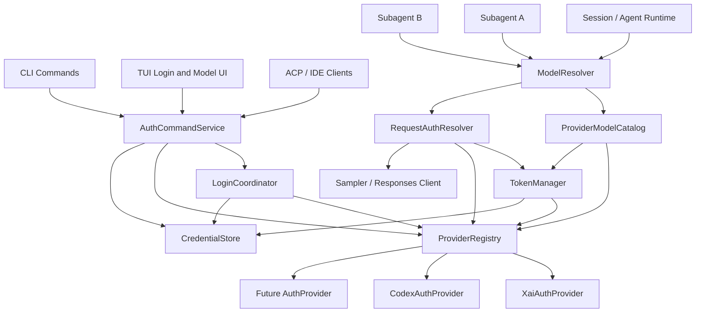
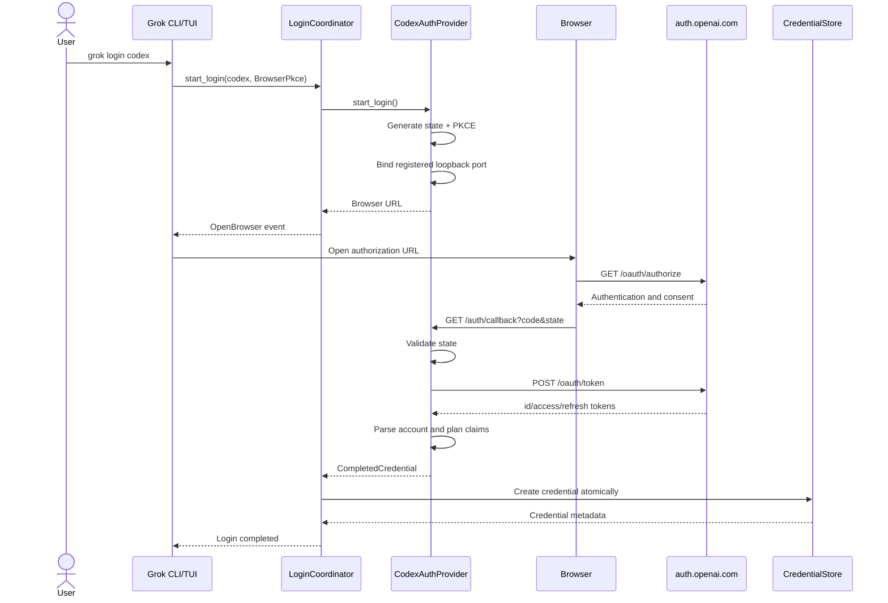
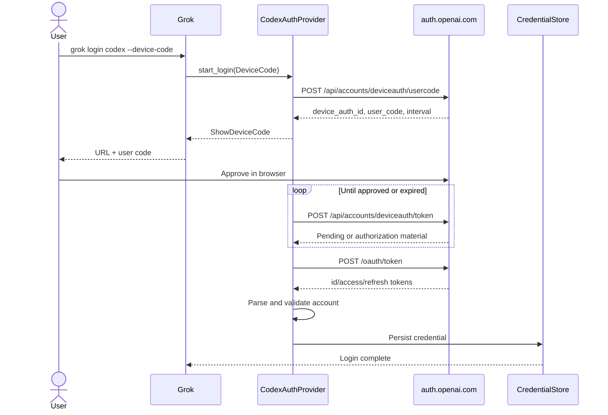
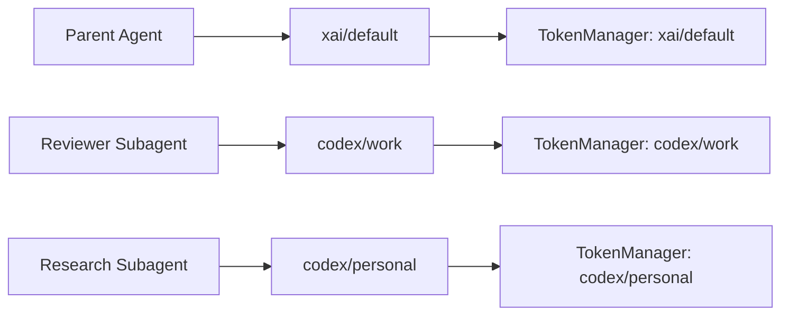
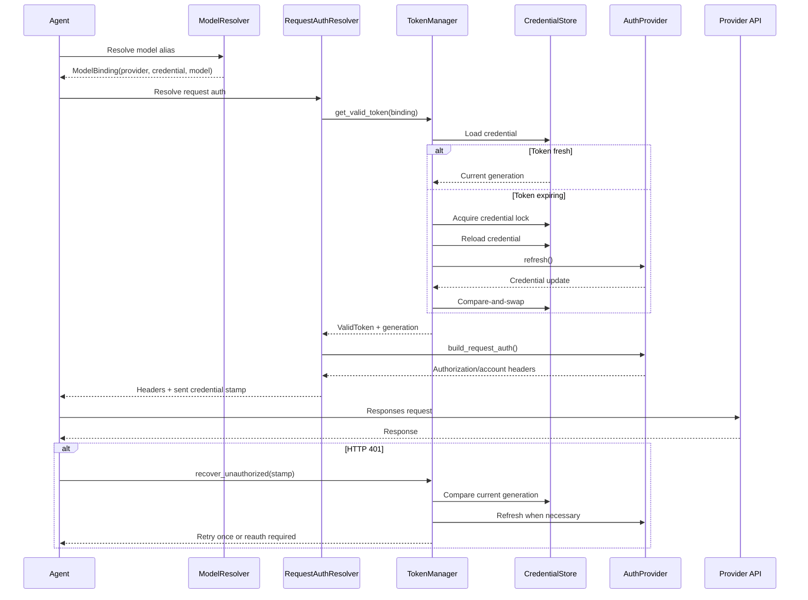
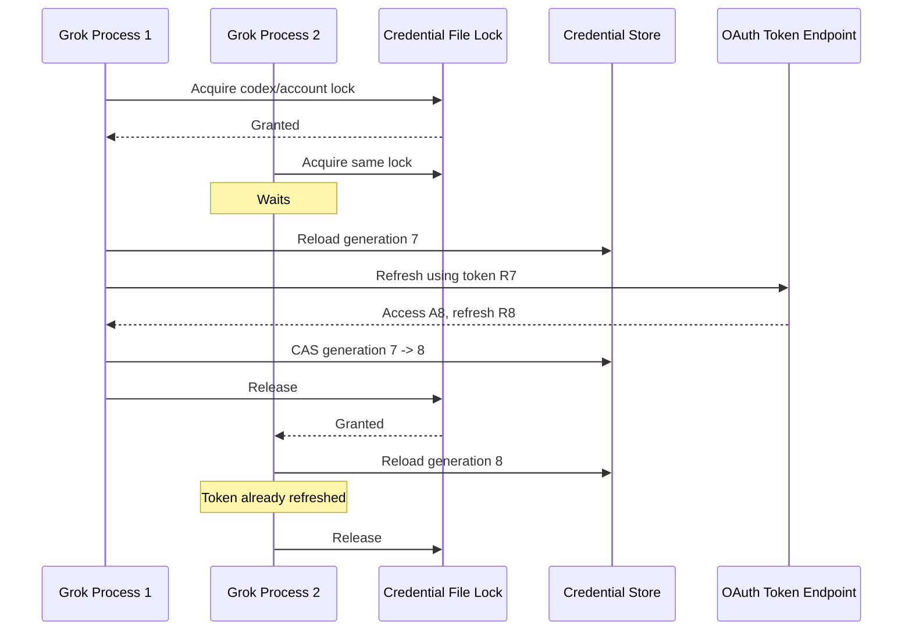

# Grok-build Native Multi-Provider Authentication

**Status:** Proposed production architecture
**Primary implementation target:** `xai-org/grok-build`
**First external provider:** Codex / ChatGPT OAuth
**Reference date:** July 2026

The terms **MUST**, **SHOULD**, and **MAY** are used normatively.

---

# 1. Executive Summary

Grok-build should evolve from a predominantly xAI-scoped authentication system into a provider-neutral authentication control plane.

The resulting system will support:

* Native xAI authentication.
* Native ChatGPT/Codex authentication.
* Browser PKCE and device-code login without the Codex CLI.
* Multiple simultaneous providers.
* Multiple accounts per provider.
* Provider and account selection at the model, session, agent, and subagent levels.
* Request-scoped token resolution and refresh.
* Future providers such as Anthropic, Google, Azure, enterprise OIDC, and custom OAuth services.

The central architectural decision is:

> Authentication is bound to a request through an immutable `(provider, account, model)` binding. It is not selected through a process-global “current provider.”

This prevents one agent, model switch, login, or token refresh from changing the credentials used by another concurrent agent.

## 1.1 Recommended architecture

Introduce five first-class components:

| Component          | Responsibility                                                                          |
| ------------------ | --------------------------------------------------------------------------------------- |
| `AuthProvider`     | Provider-specific login, refresh, logout, account, model, endpoint, and header behavior |
| `ProviderRegistry` | Runtime registry of enabled provider implementations                                    |
| `CredentialStore`  | Secure multi-provider and multi-account persistence                                     |
| `TokenManager`     | Token validity, refresh single-flight, 401 recovery, and cross-process synchronization  |
| `ModelResolver`    | Resolves a model to an immutable provider/account/model binding                         |

The current `xai_grok_auth::AuthCredentialProvider` remains useful as a low-level outbound HTTP seam, but it is not sufficient as the new provider abstraction. Today it exposes credential snapshots and 401 refresh behavior rather than login and account-management behavior.

The names must therefore remain distinct:

* `AuthProvider`: control-plane provider plugin.
* `AuthCredentialProvider`: existing low-level HTTP authentication adapter.
* `RequestAuthResolver`: new request-scoped adapter used by inference clients.

## 1.2 Critical implementation decisions

| ID  | Decision                                                                                                                      |
| --- | ----------------------------------------------------------------------------------------------------------------------------- |
| D1  | All login flows execute inside Grok-build. No shelling out to `codex login`.                                                  |
| D2  | The Codex CLI binary and `~/.codex` directory are never required.                                                             |
| D3  | Provider and account selection is immutable for the lifetime of an in-flight request.                                         |
| D4  | Refresh synchronization is per credential, not process-global.                                                                |
| D5  | Existing xAI credentials remain usable without mandatory migration.                                                           |
| D6  | Built-in providers are registered at compile time in version 1.                                                               |
| D7  | The Codex device flow is implemented as a provider-specific protocol, not incorrectly forced into generic RFC 8628 semantics. |
| D8  | Keyring storage is preferred; secure file storage remains available for headless systems.                                     |
| D9  | Codex model availability comes from its authenticated `/models` endpoint with a bundled/cache fallback.                       |
| D10 | The observed Codex OAuth client ID is documented but must not be treated as authorization for third-party production use.     |

## 1.3 Existing assets to preserve

Grok-build already contains substantial reusable infrastructure:

* A native OIDC/PKCE browser flow.
* A loopback HTTP callback.
* A device-code implementation.
* Refresh-token persistence.
* Proactive refresh.
* 401 recovery.
* Atomic credential-file writes.
* Cross-process locking designed to avoid refresh-token reuse.

The existing browser flow generates PKCE state and nonce values, binds a loopback listener, validates callback state, exchanges the authorization code, extracts principal information, and persists the credential.

The current storage layer already provides important durability behavior, including advisory locking and atomic owner-only writes.

The implementation should generalize this code rather than replace it wholesale.

---

# 2. Goals and Non-Goals

## 2.1 Goals

### G1. Native provider selection

Running:

```text
grok login
```

must present:

```text
Which provider do you want to log in with?

> Grok (xAI)
  Codex (ChatGPT)
  ...
```

### G2. Native Codex login

These commands must work without Codex installed:

```bash
grok login codex
grok login --provider codex
grok login codex --browser
grok login codex --device-code
```

### G3. Simultaneous credentials

The credential store must support states such as:

```text
xai/default       logged in
codex/personal    logged in
codex/work        logged in
```

All three credentials may remain active simultaneously.

### G4. Request-scoped provider binding

The following must be supported within one Grok process:

```text
Parent agent:        xai/default + grok-build
Reviewer subagent:   codex/work + model-a
Research subagent:   codex/personal + model-b
```

### G5. Automatic refresh

An expiring credential must refresh transparently, without changing the account identity bound to the session.

### G6. Future provider extensibility

Adding a provider should not require modifications throughout the CLI, TUI, sampler, or session code. A provider implementation should register itself through one cohesive interface.

### G7. Backward compatibility

These must continue working:

* Existing xAI browser login.
* Existing xAI device login.
* Existing `XAI_API_KEY`.
* Existing `api_key` and `env_key` model configuration.
* Existing custom OpenAI-compatible, Responses, and Anthropic models.

Grok already supports `chat_completions`, `responses`, and `messages` API backends, so Codex does not require introducing a fourth basic wire protocol.

## 2.2 Non-goals for the first release

The first release does not need to include:

* A stable third-party dynamic-library provider ABI.
* Downloadable provider plugins.
* Automatic import from `~/.codex/auth.json`.
* Codex agent-identity authentication.
* OpenAI API-key authentication as part of the Codex ChatGPT provider.
* Cross-machine credential synchronization.
* Automatic account failover when an account is rate-limited.
* Automatic provider failover during a request.
* Cookie-based scraping of ChatGPT.
* Storage of browser cookies.
* A guarantee that undocumented upstream endpoints will remain stable.

Credential import from Codex may be added later, but native Grok login remains the canonical path.

---

# 3. High-Level Architecture

## 3.1 Current architectural baseline

The Grok workspace already separates authentication interfaces into the `xai-grok-auth` crate and implementation logic into `xai-grok-shell`.

The current `GrokAuth` model remains xAI-centric, containing one bearer token, user/team metadata, optional refresh token, issuer, and OAuth client ID.

The current manager also primarily operates against one active authentication scope and one configured provider context.

The new architecture must move from:

```text
process -> one AuthManager -> one effective credential
```

to:

```text
request -> ModelBinding -> ProviderRegistry -> TokenManager -> CredentialKey
```

## 3.2 Component diagram



## 3.3 Core concepts

### `ProviderId`

A stable machine identifier:

```rust
ProviderId::new("xai")
ProviderId::new("codex")
ProviderId::new("anthropic")
```

Rules:

* Lowercase ASCII.
* Characters limited to `[a-z0-9._-]`.
* Stable across releases.
* Never derived from display names.

### `CredentialId`

An opaque local UUID that identifies one stored login.

```rust
CredentialId(Uuid)
```

This is preferable to keying records directly by email, because:

* Emails may change.
* One email may have multiple workspaces.
* Providers may not expose an email.
* Provider account IDs may be sensitive.
* A credential may be replaced without changing its human alias.

### `CredentialKey`

```rust
pub struct CredentialKey {
    pub provider: ProviderId,
    pub credential_id: CredentialId,
}
```

### `AccountAlias`

A user-controlled local name:

```text
personal
work
client-a
default
```

Aliases are unique only within one provider.

### `ModelBinding`

```rust
pub struct ModelBinding {
    pub provider: ProviderId,
    pub credential: Option<CredentialId>,
    pub model: String,
    pub endpoint_profile: Option<String>,
}
```

A `ModelBinding` is immutable after a request begins.

### `LoginFlow`

An ephemeral, cancellable state machine representing:

* Browser PKCE.
* Device code.
* API key entry.
* Enterprise OIDC.
* A future provider-specific flow.

Secrets such as PKCE verifiers and device authorization IDs must remain memory-only.

### `ProviderAccountInfo`

Normalized identity information:

```rust
pub struct ProviderAccountInfo {
    pub subject: Option<String>,
    pub provider_account_id: Option<String>,
    pub email: Option<String>,
    pub display_name: Option<String>,
    pub workspace_id: Option<String>,
    pub workspace_name: Option<String>,
    pub plan: Option<AccountPlan>,
    pub account_kind: AccountKind,
    pub metadata: BTreeMap<String, String>,
}
```

### `CredentialGeneration`

A monotonically increasing number changed whenever access or refresh tokens change.

It is used to determine whether a 401 response corresponds to the currently stored token or to a stale token already replaced by another process.

## 3.4 Architectural invariants

1. An account switch must never mutate an in-flight request.
2. A provider refresh must never change the provider account ID.
3. A workspace-bound session must never silently switch workspaces.
4. Refresh locks must be scoped by `CredentialKey`.
5. The raw refresh token must never be logged.
6. Login state and PKCE verifiers must never be persisted.
7. Model discovery failures must not delete credentials.
8. Logging out of one provider must not affect another provider.
9. Logging out of one account must not affect other accounts for that provider.
10. A 401 may trigger at most one forced refresh and one authenticated retry for the same request.
11. A model without an explicit provider must retain legacy resolution behavior.
12. Provider-specific headers must be produced by the provider implementation, not scattered through model-resolution code.

---

# 4. Extensibility Model

## 4.1 Provider registration

Built-in providers register during application construction:

```rust
let mut registry = ProviderRegistry::new();

registry.register(Arc::new(XaiAuthProvider::new(...)))?;
registry.register(Arc::new(CodexAuthProvider::new(...)))?;
```

Registration must fail for duplicate IDs.

```rust
impl ProviderRegistry {
    pub fn register(
        &mut self,
        provider: Arc<dyn AuthProvider>,
    ) -> Result<(), ProviderRegistrationError>;

    pub fn get(
        &self,
        id: &ProviderId,
    ) -> Result<Arc<dyn AuthProvider>, UnknownProviderError>;

    pub fn list(&self) -> Vec<ProviderDescriptor>;
}
```

## 4.2 Compile-time providers in version 1

Version 1 should use statically linked providers.

Reasons:

* Rust trait objects do not provide a stable binary ABI.
* Authentication plugins handle high-value secrets.
* Loading arbitrary provider binaries materially expands the attack surface.
* Built-in providers can be reviewed and distributed with Grok.
* The existing external auth command may remain for managed enterprise deployments, but it is not the implementation mechanism for Codex.

A future provider SDK may introduce subprocess-based providers over a versioned JSON protocol. That must be treated separately from native built-in providers.

## 4.3 Adding a provider

A new provider implementation must supply:

1. A stable `ProviderId`.
2. Display metadata.
3. Supported login transports.
4. Login start and completion behavior.
5. Credential normalization.
6. Refresh behavior.
7. Logout/revocation behavior.
8. Account-information extraction.
9. Model-discovery behavior.
10. Endpoint resolution.
11. Request-header construction.
12. Authentication-error classification.
13. Provider configuration validation.
14. Wire-level contract tests.

No changes should be necessary in:

* The generic login modal.
* `grok auth list`.
* Credential persistence.
* Token single-flight behavior.
* Agent/subagent account binding.
* The grouped model picker.

## 4.4 Provider capabilities

```rust
bitflags::bitflags! {
    pub struct ProviderCapabilities: u32 {
        const BROWSER_PKCE       = 1 << 0;
        const DEVICE_CODE        = 1 << 1;
        const REFRESH_TOKEN      = 1 << 2;
        const TOKEN_REVOCATION   = 1 << 3;
        const MULTI_ACCOUNT      = 1 << 4;
        const MODEL_DISCOVERY    = 1 << 5;
        const ACCOUNT_INFO       = 1 << 6;
        const WORKSPACE_ACCOUNTS = 1 << 7;
        const API_KEY_LOGIN      = 1 << 8;
        const ENTERPRISE_SSO     = 1 << 9;
    }
}
```

The UI must derive available actions from capabilities instead of hard-coded provider comparisons.

## 4.5 Configuration ownership

Configuration is divided into:

| Layer                                      | Owner                     |
| ------------------------------------------ | ------------------------- |
| Generic login behavior                     | `[auth]`                  |
| Provider enablement and endpoint overrides | `[providers.<id>]`        |
| Provider OAuth details                     | `[providers.<id>.oauth]`  |
| Provider device behavior                   | `[providers.<id>.device]` |
| Model-to-provider mapping                  | `[model.<alias>]`         |
| Agent default model                        | `[agents.<name>]`         |
| Subagent overrides                         | `[subagents.<name>]`      |

Provider implementations receive a typed configuration subtree.

Unknown provider fields should fail validation when the provider is enabled, preventing misspelled security-sensitive configuration from being silently ignored.

---

# 5. Core Components Detailed Specification

## 5.1 `AuthProvider`

### Responsibilities

`AuthProvider` owns provider-specific protocol semantics.

It does not own:

* Global CLI parsing.
* Global TUI state.
* File layout.
* Cross-provider defaults.
* Process-global model selection.
* Generic encryption.
* Generic cross-process locking.

### Required method surface

| Method                  | Purpose                                      |
| ----------------------- | -------------------------------------------- |
| `id`                    | Stable provider ID                           |
| `descriptor`            | Display name, icon key, capabilities         |
| `validate_config`       | Validate provider configuration              |
| `start_login`           | Start browser/device/provider login          |
| `complete_login`        | Advance or finish a login flow               |
| `cancel_login`          | Provider cleanup after cancellation          |
| `refresh`               | Refresh a stored credential                  |
| `get_valid_token`       | Return a valid token or a credential update  |
| `logout`                | Revoke provider credentials when supported   |
| `get_account_info`      | Normalize account and plan information       |
| `list_models`           | Fetch provider model catalog                 |
| `resolve_endpoint`      | Return inference/model/account endpoints     |
| `build_request_auth`    | Construct authorization and provider headers |
| `classify_auth_failure` | Classify a failed response                   |
| `redact_error`          | Remove provider-specific secrets from errors |
| `supports_credential`   | Validate stored credential schema version    |

### Layering rule

`get_valid_token` executes under a lock owned by `TokenManager`.

The provider may decide whether refresh is necessary, but it must return an update to the manager rather than writing the credential store directly.

This allows:

* Centralized compare-and-swap persistence.
* Uniform concurrency behavior.
* Auditable credential writes.
* Easier testing.

## 5.2 Credential model

### Public metadata record

```rust
pub struct CredentialMetadata {
    pub schema_version: u32,
    pub key: CredentialKey,
    pub alias: String,
    pub account: ProviderAccountInfo,
    pub created_at: DateTime<Utc>,
    pub updated_at: DateTime<Utc>,
    pub last_used_at: Option<DateTime<Utc>>,
    pub expires_at: Option<DateTime<Utc>>,
    pub status: CredentialStatus,
    pub generation: u64,
    pub secret_backend: SecretBackendKind,
}
```

### Secret record

```rust
pub struct CredentialSecret {
    pub access_token: SecretString,
    pub refresh_token: Option<SecretString>,
    pub id_token: Option<SecretString>,
    pub provider_fields: SecretMap,
}
```

### Provider fields

Provider-specific secret fields remain namespaced:

```json
{
  "codex": {
    "oauth_client_id": "...",
    "issuer": "...",
    "last_refresh": "...",
    "raw_account_id": "..."
  }
}
```

Provider-specific public metadata should be strictly filtered. Raw JWTs are always secrets.

## 5.3 `CredentialStore`

### Required behavior

The store must support:

* Multiple providers.
* Multiple credentials per provider.
* Default credential selection per provider.
* Atomic metadata updates.
* Secret backend abstraction.
* Compare-and-swap generations.
* Per-credential locking.
* Legacy xAI access.
* Secure deletion where supported.
* Storage-backend migration.

### Interface

```rust
#[async_trait]
pub trait CredentialStore: Debug + Send + Sync {
    async fn list_providers(&self) -> Result<Vec<ProviderId>, StoreError>;

    async fn list_accounts(
        &self,
        provider: &ProviderId,
    ) -> Result<Vec<CredentialMetadata>, StoreError>;

    async fn resolve_alias(
        &self,
        provider: &ProviderId,
        alias: &str,
    ) -> Result<Option<CredentialKey>, StoreError>;

    async fn default_account(
        &self,
        provider: &ProviderId,
    ) -> Result<Option<CredentialKey>, StoreError>;

    async fn set_default_account(
        &self,
        key: &CredentialKey,
    ) -> Result<(), StoreError>;

    async fn load_metadata(
        &self,
        key: &CredentialKey,
    ) -> Result<Option<CredentialMetadata>, StoreError>;

    async fn load_secret(
        &self,
        key: &CredentialKey,
    ) -> Result<Option<CredentialSecret>, StoreError>;

    async fn create(
        &self,
        record: NewCredentialRecord,
    ) -> Result<CredentialMetadata, StoreError>;

    async fn compare_and_swap(
        &self,
        expected_generation: u64,
        update: CredentialUpdate,
    ) -> Result<CredentialMetadata, CompareAndSwapError>;

    async fn delete(
        &self,
        key: &CredentialKey,
    ) -> Result<bool, StoreError>;

    async fn acquire_lock(
        &self,
        key: &CredentialKey,
        purpose: CredentialLockPurpose,
    ) -> Result<Box<dyn CredentialLockGuard>, StoreError>;
}
```

### Locking

A lock must be acquired for:

* Refresh.
* Credential replacement.
* Logout.
* Alias reassignment.
* Secret-backend migration.

Refresh locking must span:

1. Lock acquisition.
2. Reload from persistent storage.
3. Decision whether refresh is still necessary.
4. Network refresh request.
5. Atomic persistence.
6. In-memory cache update.
7. Lock release.

This mirrors Grok’s existing intent to prevent refresh-token reuse across processes. The current implementation explicitly holds an advisory lock across refresh to prevent multiple processes from spending a rotated token.

### Lock granularity

Use:

```text
(provider, credential_id)
```

not:

```text
all Grok authentication
```

Thus a Codex token refresh does not block xAI, and one Codex workspace does not block another.

## 5.4 `TokenManager`

### Public operations

```rust
impl TokenManager {
    pub async fn get_valid_token(
        &self,
        binding: &CredentialBinding,
        reason: TokenUseReason,
    ) -> Result<ValidToken, AuthError>;

    pub async fn recover_unauthorized(
        &self,
        binding: &CredentialBinding,
        sent: &SentCredentialStamp,
        response: &AuthFailureResponse,
    ) -> Result<UnauthorizedRecovery, AuthError>;

    pub async fn invalidate(
        &self,
        key: &CredentialKey,
        cause: InvalidationCause,
    ) -> Result<(), AuthError>;

    pub fn subscribe(
        &self,
        key: &CredentialKey,
    ) -> watch::Receiver<CredentialState>;
}
```

### `ValidToken`

```rust
pub struct ValidToken {
    pub access_token: SecretString,
    pub expires_at: Option<DateTime<Utc>>,
    pub generation: u64,
    pub account_fingerprint: AccountFingerprint,
}
```

### Refresh algorithm

```text
1. Load cached credential.
2. Verify provider and account identity.
3. If token is outside the early-refresh window, return it.
4. Acquire the per-credential in-process mutex.
5. Acquire the cross-process credential lock.
6. Reload credential from persistent storage.
7. If another process already refreshed it, adopt and return it.
8. Call AuthProvider::get_valid_token / refresh.
9. Verify account fingerprint did not change.
10. Compare-and-swap using the previous generation.
11. Update cache and notify subscribers.
12. Release locks.
13. Return the new token.
```

### Early refresh

Default policy:

```text
refresh_window = max(5 minutes, 10% of original access-token lifetime)
refresh_window <= 30 minutes
```

A provider may override this.

For Codex, use the observed five-minute access-token refresh window. The current Codex implementation also falls back to refreshing after eight days when an access-token expiration claim cannot be parsed.

### 401 recovery

When inference returns 401:

1. Compare the token generation sent with the currently cached generation.
2. When the cached generation is newer, retry once using the new token.
3. Otherwise acquire the refresh lock.
4. Reload persistent credentials.
5. Refresh once.
6. Retry the request once.
7. On a second 401, classify the credential as requiring reauthentication.
8. Do not automatically try another account or provider.

This prevents duplicate refreshes and retry loops.

### Permanent refresh failures

Provider errors must be classified:

```rust
pub enum RefreshFailureKind {
    Expired,
    Reused,
    Revoked,
    InvalidGrant,
    AccountMismatch,
    MissingEntitlement,
    Transient,
    Unknown,
}
```

Permanent failures should be cached against:

```text
CredentialKey + generation
```

When the generation changes, the cached failure is cleared.

Codex currently distinguishes expired, reused, and invalidated refresh tokens from transient errors.

## 5.5 `ProviderRegistry`

The registry is immutable after startup in production.

```rust
pub struct ProviderRegistry {
    providers: BTreeMap<ProviderId, Arc<dyn AuthProvider>>,
}
```

Provider listing order:

1. Configured `ui_order`.
2. Built-in default priority.
3. Alphabetical display name.

Disabled providers remain addressable only for configuration diagnostics, not login or model selection.

## 5.6 `LoginCoordinator`

The coordinator owns generic flow lifecycle:

* Generates a `LoginFlowId`.
* Selects transport.
* Creates a cancellation token.
* Enforces timeout.
* Relays UI updates.
* Invokes provider methods.
* Stores completed credentials.
* Ensures one completion.
* Redacts errors.

```rust
pub enum LoginUiEvent {
    OpenBrowser { url: Url },
    ShowDeviceCode {
        verification_uri: Url,
        verification_uri_complete: Option<Url>,
        user_code: String,
        expires_at: DateTime<Utc>,
    },
    WaitingForBrowser,
    WaitingForApproval,
    ExchangingToken,
    LoadingAccount,
    PersistingCredential,
    Completed { key: CredentialKey },
    Failed { error: UserFacingAuthError },
}
```

The existing Grok flow already exposes loopback, external-command, and device URL modes to its front ends.

The new event type should replace provider-specific assumptions while retaining an adapter for existing ACP clients.

## 5.7 `ModelResolver`

### Input

```rust
pub struct ModelSelection {
    pub alias_or_id: String,
    pub explicit_provider: Option<ProviderId>,
    pub explicit_account: Option<String>,
}
```

### Output

```rust
pub struct ResolvedModel {
    pub binding: ModelBinding,
    pub display_name: String,
    pub api_backend: ApiBackend,
    pub base_url: Url,
    pub context_window: u64,
    pub capabilities: ModelCapabilities,
    pub static_headers: HeaderMap,
}
```

### Resolution precedence

1. Explicit CLI provider/account.
2. Explicit provider/account in agent profile.
3. Explicit provider/account in model entry.
4. Session’s current binding.
5. Provider default account.
6. Global default provider.
7. Legacy xAI behavior.

### Legacy model behavior

Grok’s current credential order is:

1. Per-model `api_key`.
2. Configured environment variables.
3. Signed-in session token.
4. Global `XAI_API_KEY`.

This order must remain unchanged for models without a `provider` field.

### Provider-backed model behavior

For a model with:

```toml
provider = "codex"
```

the model must not fall back to:

* xAI’s session token.
* `XAI_API_KEY`.
* Another provider’s default account.

A missing Codex credential produces an actionable Codex login prompt.

## 5.8 Request authentication injection

The current sampler has a live bearer resolver but primarily treats extra headers as construction-time configuration.

Introduce:

```rust
#[async_trait]
pub trait RequestAuthResolver: Debug + Send + Sync {
    async fn resolve(
        &self,
        request: &RequestAuthContext,
    ) -> Result<ResolvedRequestAuth, AuthError>;

    async fn recover_unauthorized(
        &self,
        request: &RequestAuthContext,
        sent: &SentCredentialStamp,
        response: &AuthFailureResponse,
    ) -> Result<UnauthorizedRecovery, AuthError>;
}
```

```rust
pub struct ResolvedRequestAuth {
    pub headers: HeaderMap,
    pub stamp: SentCredentialStamp,
}
```

Compatibility:

* Existing `bearer_resolver` remains supported.
* A `BearerResolverAdapter` implements `RequestAuthResolver`.
* New provider-backed models use `RequestAuthResolver`.
* Static `extra_headers` are merged before provider headers.
* Provider-generated security headers override conflicting user headers unless an explicit unsafe development flag is enabled.

Merge order:

```text
global model headers
< per-model headers
< provider static headers
< provider security headers
< per-request protocol headers
```

Users must not be able to override:

* `Authorization`
* `ChatGPT-Account-ID`
* `X-OpenAI-Fedramp`
* PKCE/OAuth protocol fields

for a native provider-backed model.

---

# 6. Native Codex / ChatGPT Provider

## 6.1 Protocol baseline

The following values are observed in the referenced Codex source snapshot.

| Setting                   | Observed value                          |
| ------------------------- | --------------------------------------- |
| Issuer                    | `https://auth.openai.com`               |
| Authorization endpoint    | `/oauth/authorize`                      |
| Token endpoint            | `/oauth/token`                          |
| Revocation endpoint       | `/oauth/revoke`                         |
| ChatGPT Codex base URL    | `https://chatgpt.com/backend-api/codex` |
| Responses path            | `/responses`                            |
| Models path               | `/models?client_version=<version>`      |
| Browser callback path     | `/auth/callback`                        |
| Codex callback ports      | `1455`, fallback `1457`                 |
| Device user-code endpoint | `/api/accounts/deviceauth/usercode`     |
| Device polling endpoint   | `/api/accounts/deviceauth/token`        |
| Device verification path  | `/codex/device`                         |
| Device exchange redirect  | `/deviceauth/callback`                  |
| Observed OAuth client ID  | `app_EMoamEEZ73f0CkXaXp7hrann`          |

The ChatGPT Codex backend constant is defined as `https://chatgpt.com/backend-api/codex`, and Codex selects it for ChatGPT-backed authentication modes.

Codex sends Responses requests to `/responses`.

The current OAuth client ID is visible in the refresh implementation.

### Production requirement: client registration

The observed public client ID must be treated as a protocol reference, not as an authorization grant.

Before public production release, the project must obtain one of:

1. An OpenAI-approved client ID for Grok-build.
2. Written authorization to use the existing public Codex client identity.
3. A documented supported third-party integration mechanism.

The browser redirect URI must be allow-listed for that client. Codex uses fixed ports because its redirect list is registered accordingly.

Without this, a technically correct reimplementation may:

* Be rejected by the authorization server.
* Stop working without notice.
* Violate provider policy.
* Be unable to use a distinct Grok originator.
* Become coupled to Codex-specific redirect registrations.

The code must therefore support:

```rust
pub struct CodexOAuthConfig {
    pub issuer: Url,
    pub client_id: String,
    pub browser_redirect_ports: Vec<u16>,
    pub browser_callback_path: String,
}
```

Defaults may be compiled in only after the registration decision is complete.

## 6.2 Browser OAuth with PKCE

### Authorization request

The browser URL must contain:

```text
response_type=code
client_id=<configured-client-id>
redirect_uri=http://localhost:<port>/auth/callback
scope=openid profile email offline_access api.connectors.read api.connectors.invoke
code_challenge=<S256 challenge>
code_challenge_method=S256
id_token_add_organizations=true
codex_cli_simplified_flow=true
state=<cryptographically-random-state>
originator=<approved-grok-originator>
```

When an account or workspace policy is configured:

```text
allowed_workspace_id=<comma-separated-workspace-ids>
```

These fields match the current Codex authorization request.

### PKCE generation

Use:

* 32 bytes or more from the operating system CSPRNG.
* Base64 URL-safe encoding without padding.
* SHA-256 code challenge.
* No persistence of the verifier.
* One verifier per flow.
* Constant-time state comparison where practical.

### Loopback server

Requirements:

* Bind only to loopback.
* Prefer `127.0.0.1`.
* Do not bind `0.0.0.0`.
* Accept only the configured callback path.
* Enforce a maximum request-target length.
* Reject unexpected methods.
* Validate exact state.
* Reject duplicate completion.
* Shut down after success, cancellation, or timeout.
* Add `Connection: close`.
* Never include tokens in query strings.
* Redact `code`, `state`, and OAuth error descriptions from debug URLs.

Codex currently uses `http://localhost:<port>/auth/callback` and fixed registered ports.

### Browser-port selection

Recommended algorithm:

```text
for port in configured_browser_ports:
    try bind 127.0.0.1:port
    if success:
        use it
    if address in use:
        optionally cancel an abandoned Grok login server
        retry briefly
continue
return CallbackPortUnavailable
```

Do not choose a random port for Codex unless that redirect pattern has been registered.

The current Codex implementation prefers port 1455 and can fall back to a second registered port.

### Callback processing

The callback handler must:

1. Parse the URL.
2. Validate `state`.
3. Handle `error` and `error_description`.
4. Require `code`.
5. Exchange the authorization code.
6. Validate the returned token set.
7. Parse account information.
8. Enforce configured workspace policy.
9. Persist the credential.
10. Return a local success page.
11. Close the server.

### Authorization-code exchange

Request:

```http
POST https://auth.openai.com/oauth/token
Content-Type: application/x-www-form-urlencoded
```

Body:

```text
grant_type=authorization_code
code=<authorization-code>
redirect_uri=http://localhost:<port>/auth/callback
client_id=<configured-client-id>
code_verifier=<pkce-verifier>
```

The response must contain:

* `id_token`
* `access_token`
* `refresh_token`

Codex requires these values when completing browser login.

### Browser sequence



## 6.3 Device-code flow

### Important protocol distinction

Codex’s current device flow is not exposed through standard RFC 8628 endpoint names.

It uses:

```text
POST /api/accounts/deviceauth/usercode
POST /api/accounts/deviceauth/token
GET  /codex/device
```

The first request sends JSON containing the OAuth client ID. The polling response eventually returns:

* `authorization_code`
* `code_challenge`
* `code_verifier`

Grok must then perform a separate authorization-code exchange.

This provider-specific behavior is visible in the current Codex implementation.

### Step 1: request user code

```http
POST https://auth.openai.com/api/accounts/deviceauth/usercode
Content-Type: application/json
```

```json
{
  "client_id": "<configured-client-id>"
}
```

Expected response:

```json
{
  "device_auth_id": "...",
  "user_code": "...",
  "interval": "5"
}
```

Accept both `user_code` and the historical `usercode` alias if required for compatibility.

### Step 2: display approval instructions

Display:

```text
Open: https://auth.openai.com/codex/device
Enter code: ABCD-EFGH
```

When the provider later offers a complete verification URL, prefer it.

### Step 3: poll

```http
POST https://auth.openai.com/api/accounts/deviceauth/token
Content-Type: application/json
```

```json
{
  "device_auth_id": "...",
  "user_code": "ABCD-EFGH"
}
```

Polling rules:

* Sleep before the first poll.
* Respect the returned interval.
* Apply bounded jitter.
* Treat 403 and 404 as pending only when the response matches expected pending semantics.
* Stop on cancellation.
* Stop after 15 minutes unless the server supplies a shorter expiration.
* Do not log `device_auth_id`.
* Do not persist device flow state.

### Step 4: exchange authorization code

After approval, exchange:

```http
POST https://auth.openai.com/oauth/token
Content-Type: application/x-www-form-urlencoded
```

```text
grant_type=authorization_code
code=<authorization-code>
redirect_uri=https://auth.openai.com/deviceauth/callback
client_id=<configured-client-id>
code_verifier=<returned-code-verifier>
```

The device polling result supplies the PKCE verifier used for this exchange.

### Device sequence



## 6.4 Token storage format

### Normalized Grok record

```json
{
  "schema_version": 1,
  "provider": "codex",
  "credential_id": "0190...",
  "alias": "personal",
  "account": {
    "subject": "user-...",
    "provider_account_id": "account-...",
    "email": "user@example.com",
    "workspace_id": "account-...",
    "plan": {
      "raw": "plus",
      "display": "Plus"
    },
    "account_kind": "personal",
    "fedramp": false
  },
  "created_at": "2026-07-15T23:00:00Z",
  "updated_at": "2026-07-15T23:00:00Z",
  "expires_at": "2026-07-16T00:00:00Z",
  "generation": 1,
  "secret_ref": "keyring://grok-build/codex/0190..."
}
```

Secret payload:

```json
{
  "access_token": "...",
  "refresh_token": "...",
  "id_token": "...",
  "issuer": "https://auth.openai.com",
  "oauth_client_id": "...",
  "last_refresh": "2026-07-15T23:00:00Z"
}
```

### Compatibility with future Codex import

Codex currently stores:

* `auth_mode`
* optional `OPENAI_API_KEY`
* token data
* `last_refresh`
* additional newer authentication forms.

Its ChatGPT token data contains the raw ID token, access token, refresh token, and optional account ID.

The Grok provider should implement an internal conversion function:

```rust
fn import_codex_auth_json(
    source: CodexAuthJsonV1,
) -> Result<NewCredentialRecord, ImportError>;
```

This function need not be exposed initially.

Grok must not share or mutate Codex’s credential file directly.

## 6.5 Claim extraction

The ID token should be parsed for display and routing metadata.

Observed claims include:

```text
email
https://api.openai.com/profile.email
https://api.openai.com/auth.chatgpt_plan_type
https://api.openai.com/auth.chatgpt_user_id
https://api.openai.com/auth.user_id
https://api.openai.com/auth.chatgpt_account_id
https://api.openai.com/auth.chatgpt_account_is_fedramp
```

The current Codex parser extracts these claim names.

### Security rule

JWT payload parsing is not equivalent to signature validation.

Use parsed claims for:

* Display.
* Local identity fingerprinting.
* Routing headers.
* Expiration hints.

Do not use unverified claims to authorize local privileged operations.

Where OpenID metadata and JWKS validation are practical, ID-token signature, issuer, audience, nonce, and expiration should be validated.

### Account fingerprint

```rust
AccountFingerprint::sha256(
    provider_id
    || issuer
    || chatgpt_user_id
    || chatgpt_account_id
)
```

Refresh is rejected if the fingerprint changes unexpectedly.

## 6.6 Plan-type detection

Recognized raw plan values should include:

```text
free
go
plus
pro
prolite
team
self_serve_business_usage_based
business
enterprise_cbp_usage_based
enterprise
hc
education
edu
```

Unknown values must be preserved as:

```rust
AccountPlan::Unknown(String)
```

They must not cause login failure.

The current Codex implementation uses this forward-compatible approach.

Workspace-style plans currently include:

* Team.
* Self-serve business usage based.
* Business.
* Enterprise CBP usage based.
* Enterprise.
* Edu.

Plan type is informational and must not be the sole source of feature authorization.

## 6.7 Refresh-token handling

### Request

Codex refresh uses JSON:

```http
POST https://auth.openai.com/oauth/token
Content-Type: application/json
```

```json
{
  "client_id": "<configured-client-id>",
  "grant_type": "refresh_token",
  "refresh_token": "<refresh-token>"
}
```

The response may rotate any subset of:

```json
{
  "id_token": "...",
  "access_token": "...",
  "refresh_token": "..."
}
```

Missing fields mean “retain the previous value,” not “erase it.”

The current Codex refresh implementation follows this format.

### Rotation safety

Because refresh tokens may be rotated:

* Hold the credential lock across the request.
* Persist the new refresh token before releasing the lock.
* Fsync file-backed storage.
* Update generation.
* Never retry the same refresh token concurrently.
* On ambiguous transport failure, reload from disk before another attempt.
* Use bounded retries only for failures known to occur before request transmission.
* Treat `refresh_token_reused` as permanent for that credential generation.

### Error mapping

| Backend code                | Grok status        | User message                                      |
| --------------------------- | ------------------ | ------------------------------------------------- |
| `refresh_token_expired`     | `ReauthRequired`   | ChatGPT session expired                           |
| `refresh_token_reused`      | `ReauthRequired`   | Session token was already rotated                 |
| `refresh_token_invalidated` | `ReauthRequired`   | ChatGPT session was revoked                       |
| HTTP 401 unknown            | `ReauthRequired`   | ChatGPT rejected the saved session                |
| 429                         | `TransientFailure` | Authentication service is rate-limiting requests  |
| 5xx                         | `TransientFailure` | Authentication service is temporarily unavailable |
| Timeout                     | `TransientFailure` | Authentication refresh timed out                  |

## 6.8 Logout and revocation

Logout behavior:

1. Acquire credential lock.
2. Reload the credential.
3. Attempt revocation.
4. Remove local secret even when revocation fails, unless the user explicitly requested strict revocation.
5. Remove metadata.
6. Update provider default account.
7. Notify active sessions.

Revocation request:

```http
POST https://auth.openai.com/oauth/revoke
Content-Type: application/json
```

Prefer the refresh token:

```json
{
  "token": "<refresh-token>",
  "token_type_hint": "refresh_token",
  "client_id": "<configured-client-id>"
}
```

Fallback for credentials without a refresh token:

```json
{
  "token": "<access-token>",
  "token_type_hint": "access_token"
}
```

Codex currently performs best-effort revocation and still deletes local credentials when revocation fails.

## 6.9 ChatGPT Codex inference endpoint

### Base URL

```text
https://chatgpt.com/backend-api/codex
```

### Responses URL

```text
https://chatgpt.com/backend-api/codex/responses
```

### Required authentication headers

```http
Authorization: Bearer <access-token>
ChatGPT-Account-ID: <chatgpt-account-id>
```

When the account claims require FedRAMP routing:

```http
X-OpenAI-Fedramp: true
```

These headers match current Codex request authentication behavior.

### Protocol headers

The following may be generated by the session/protocol layer rather than the provider:

```text
User-Agent
OpenAI-Beta
x-codex-installation-id
x-codex-window-id
x-codex-parent-thread-id
x-codex-turn-state
x-codex-turn-metadata
x-openai-subagent
traceparent
```

Not every header is required for a minimal Responses request.

Responsibilities:

* `CodexAuthProvider` supplies identity and routing headers.
* Session code supplies thread/turn/subagent headers.
* Responses transport supplies content negotiation and streaming headers.
* Telemetry code supplies trace context.

### Header conflict policy

A user-supplied model configuration must not override:

```text
Authorization
ChatGPT-Account-ID
X-OpenAI-Fedramp
```

when using native Codex authentication.

## 6.10 Model listing

Request:

```http
GET https://chatgpt.com/backend-api/codex/models?client_version=<grok-compatible-version>
Authorization: Bearer <access-token>
ChatGPT-Account-ID: <account-id>
```

The current Codex model client appends `client_version` and parses an ETag from the response.

### Model cache

Recommended location:

```text
~/.grok/cache/models/codex/<credential-id>.json
```

Cache record:

```json
{
  "schema_version": 1,
  "provider": "codex",
  "credential_id": "...",
  "account_fingerprint": "...",
  "client_version": "0.1.0",
  "etag": "\"abc\"",
  "fetched_at": "...",
  "models": []
}
```

Policy:

* Fresh TTL: five minutes.
* Revalidate using ETag where supported.
* Separate cache per credential/account.
* Never reuse a workspace model catalog for another workspace.
* Use stale cache when offline.
* Use bundled fallback when no cache exists.
* Mark stale/bundled results in the UI.
* Do not delete a cache because of a transient 5xx.
* Invalidate after account identity changes.

Codex’s own model manager uses a five-minute model cache and filters models according to whether authentication can use the Codex backend.

## 6.11 Error handling

### Login errors

| Condition                  | Action                                                         |
| -------------------------- | -------------------------------------------------------------- |
| Browser cannot open        | Display copyable URL                                           |
| Callback port unavailable  | Offer device flow                                              |
| State mismatch             | Abort and discard flow                                         |
| Missing authorization code | Abort                                                          |
| User denied request        | Return `LoginDenied`                                           |
| Device code expired        | Offer restart                                                  |
| Workspace not allowed      | Do not persist tokens                                          |
| Missing Codex entitlement  | Explain that the selected ChatGPT account lacks access         |
| Token persistence failure  | Revoke best effort, return failure                             |
| Invalid JWT claims         | Persist only when required minimum identity can be established |
| Provider unavailable       | Preserve current credentials                                   |

### Runtime errors

| HTTP status     | Default behavior                                                                      |
| --------------- | ------------------------------------------------------------------------------------- |
| 401             | One guarded refresh and retry                                                         |
| 403             | Do not refresh automatically unless provider error explicitly indicates token failure |
| 404             | Treat as endpoint/model issue, not authentication                                     |
| 409             | Surface provider conflict                                                             |
| 429             | Apply inference retry policy; do not rotate accounts                                  |
| 5xx             | Transport retry policy                                                                |
| Network timeout | Retry according to request policy                                                     |

### Reauthentication prompt

A reauthentication notification must include the exact binding:

```text
Codex authentication expired for account “work”.

The running xAI agent is unaffected.
The Codex “personal” account is unaffected.

Run:
  grok login codex --account work
```

---

# 7. User Experience and CLI/TUI Flows

## 7.1 CLI command grammar

### Login

```text
grok login
grok login <provider>
grok login --provider <provider>

Options:
  --account <alias>
  --browser
  --oauth
  --device-code
  --device-auth
  --no-open
  --reauth
  --json
```

Aliases:

```text
--oauth       == --browser
--device-auth == --device-code
```

Mutual exclusion:

```text
--browser conflicts with --device-code
```

### Provider selection

When no provider is supplied:

```text
Which provider do you want to log in with?

> Grok (xAI)           Signed in as user@x.ai
  Codex (ChatGPT)      Not signed in
```

When a provider already has accounts:

```text
Codex accounts

> Add another account
  personal     user@example.com     Plus
  work         user@company.com     Business
```

### Logout

```text
grok logout
grok logout codex
grok logout codex --account work
grok logout --provider codex --account work
grok logout --all
grok logout codex --all-accounts
grok logout codex --account work --no-revoke
```

Behavior of bare `grok logout`:

* One total credential: confirm that credential.
* Multiple credentials: show provider/account selector.
* Noninteractive shell: require explicit target unless `--all`.

### Auth status

```text
grok auth status
grok auth list
grok auth whoami
grok auth whoami codex
grok auth whoami codex --account work
```

Example:

```text
PROVIDER  ACCOUNT   STATUS       IDENTITY              PLAN       EXPIRES
xai       default   ready        user@x.ai             Team       24m
codex     personal  ready        user@example.com      Plus       41m
codex     work      reauth       user@company.com      Business   expired
```

### Machine output

All auth inspection commands should support:

```bash
--json
```

Example:

```json
{
  "credentials": [
    {
      "provider": "codex",
      "account": "personal",
      "status": "ready",
      "email": "user@example.com",
      "plan": "plus",
      "expires_at": "2026-07-16T00:00:00Z"
    }
  ]
}
```

Never include tokens in machine output.

## 7.2 Login transport selection

Precedence:

```text
CLI override
> provider-specific config
> generic auth config
> environment
> terminal capability
> provider default
```

Recommended automatic behavior:

| Environment                             | Browser-capable provider                                |
| --------------------------------------- | ------------------------------------------------------- |
| Local interactive desktop               | Browser PKCE                                            |
| SSH with browser forwarding unavailable | Device code                                             |
| TUI                                     | Configured/default provider transport                   |
| Headless non-TTY                        | Fail with instructions unless explicitly device-enabled |
| Browser callback ports unavailable      | Offer device flow                                       |

The current Grok transport precedence already supports CLI, environment, config, remote flag, and a loopback default.

## 7.3 TUI login modal

### Provider page

```text
┌ Sign in ──────────────────────────────┐
│ Which provider do you want to use?    │
│                                      │
│ > Grok (xAI)          ● Signed in     │
│   Codex (ChatGPT)     ○ Not signed in │
│                                      │
│ Enter Select    Esc Cancel            │
└──────────────────────────────────────┘
```

### Transport page

```text
┌ Sign in to Codex ─────────────────────┐
│                                      │
│ > Open browser                        │
│   Use a device code                   │
│                                      │
│ Browser sign-in is recommended.       │
└──────────────────────────────────────┘
```

### Device page

```text
┌ Sign in to Codex ─────────────────────┐
│ Open this address:                    │
│ auth.openai.com/codex/device          │
│                                      │
│ Enter code: ABCD-EFGH                 │
│                                      │
│ Waiting for approval…                 │
│                                      │
│ C Copy URL   O Open browser   Esc     │
└──────────────────────────────────────┘
```

## 7.4 Model picker grouped by provider

```text
Grok (xAI) — default
  ● grok-build
    grok-...

Codex (ChatGPT) — personal · Plus
    model-a
    model-b

Codex (ChatGPT) — work · Business
    model-a
    model-enterprise
```

Each row should include compact badges:

```text
[xAI]
[Codex · personal]
[Codex · work]
[Reauth]
[Offline catalog]
```

## 7.5 Switch-provider action

Actions:

```text
/model
/provider
/account
/auth
```

Recommended modal actions:

* Switch model.
* Switch provider.
* Switch account.
* Sign in to another provider.
* Reauthenticate selected account.
* View account details.
* Log out selected account.

A switch changes the session binding for subsequent turns. It does not mutate requests already running.

## 7.6 Agent and subagent assignment

CLI:

```bash
grok -m codex-personal
grok -m codex-work-reviewer
grok agent --provider codex --account work --model model-a
```

Agent profile:

```toml
[agents.implementer]
model = "grok-primary"

[agents.reviewer]
model = "codex-work-reviewer"
```

Subagent request model:

```rust
pub struct SpawnSubagentRequest {
    pub task: String,
    pub model: Option<String>,
    pub provider: Option<ProviderId>,
    pub account: Option<String>,
}
```

Resolution:

```text
spawn override
> subagent profile
> parent’s subagent default
> parent model binding
```

Explicit provider/account overrides must not be inherited partially. For example, specifying `provider = "codex"` without an account resolves the Codex default account, not the parent xAI account.

---

# 8. Configuration Format

## 8.1 Global authentication configuration

```toml
[auth]
default_provider = "xai"
credential_store = "auto"
login_transport = "auto"
open_browser = true
early_refresh_seconds = 300
refresh_lock_timeout_seconds = 45
revoke_on_logout = true

[auth.default_accounts]
xai = "default"
codex = "personal"
```

Allowed `credential_store` values:

```text
auto
keyring
encrypted_file
file
ephemeral
```

Allowed `login_transport` values:

```text
auto
browser
device_code
```

## 8.2 xAI provider

```toml
[providers.xai]
enabled = true
display_name = "Grok (xAI)"

[providers.xai.oauth]
issuer = "https://auth.x.ai"
client_id = "<built-in-or-managed-client-id>"
scopes = [
  "openid",
  "profile",
  "email",
  "offline_access",
  "grok-cli:access",
  "api:access"
]
```

Existing enterprise OIDC and external provider settings remain supported through a compatibility adapter during migration.

## 8.3 Codex provider

```toml
[providers.codex]
enabled = true
display_name = "Codex (ChatGPT)"
base_url = "https://chatgpt.com/backend-api/codex"
model_cache_ttl_seconds = 300
request_timeout_seconds = 300
revoke_on_logout = true

[providers.codex.oauth]
issuer = "https://auth.openai.com"
client_id = "<approved-client-id>"
authorization_path = "/oauth/authorize"
token_path = "/oauth/token"
revoke_path = "/oauth/revoke"
callback_path = "/auth/callback"
callback_ports = [1455, 1457]
scopes = [
  "openid",
  "profile",
  "email",
  "offline_access",
  "api.connectors.read",
  "api.connectors.invoke"
]

[providers.codex.device]
user_code_path = "/api/accounts/deviceauth/usercode"
token_poll_path = "/api/accounts/deviceauth/token"
verification_path = "/codex/device"
exchange_redirect_path = "/deviceauth/callback"
timeout_seconds = 900
default_poll_interval_seconds = 5
```

Production builds should lock sensitive endpoint and client settings unless explicitly compiled with an unsafe development feature.

## 8.4 Workspace restrictions

```toml
[providers.codex.account_policy]
allowed_workspace_ids = [
  "account-workspace-a",
  "account-workspace-b"
]
require_workspace = false
```

When set, the provider must:

* Pass `allowed_workspace_id` during browser login.
* Validate the returned account ID before persistence.
* Refuse unexpected workspace changes after refresh.

## 8.5 Provider-backed models

```toml
[model.grok-primary]
provider = "xai"
account = "default"
model = "grok-build"
name = "Grok Build"
api_backend = "responses"

[model.codex-personal]
provider = "codex"
account = "personal"
model = "model-slug-from-codex-catalog"
name = "Codex Personal"
api_backend = "responses"

[model.codex-work-reviewer]
provider = "codex"
account = "work"
model = "model-slug-from-codex-catalog"
name = "Codex Work Reviewer"
api_backend = "responses"
```

For native providers, omit:

```text
api_key
env_key
Authorization in extra_headers
```

## 8.6 Dynamic default account

```toml
[model.codex-default]
provider = "codex"
model = "model-slug-from-codex-catalog"
api_backend = "responses"
```

With no model-level account, resolve:

```text
session account override
> auth.default_accounts.codex
> sole Codex account
> prompt user
```

Do not silently choose among multiple accounts when no default exists.

## 8.7 Existing API-key models

These remain valid:

```toml
[model.openai-api]
model = "gpt-api-model"
base_url = "https://api.openai.com/v1"
env_key = "OPENAI_API_KEY"
api_backend = "responses"

[model.anthropic-api]
model = "claude-model"
base_url = "https://api.anthropic.com/v1"
api_backend = "messages"
extra_headers = {
  "x-api-key" = "${ANTHROPIC_API_KEY}",
  "anthropic-version" = "2023-06-01"
}
```

No `provider` field means legacy model-credential resolution.

## 8.8 Agent profiles

```toml
[agents.default]
model = "grok-primary"

[agents.reviewer]
model = "codex-work-reviewer"

[agents.researcher]
model = "codex-personal"

[subagents.review]
agent_profile = "reviewer"

[subagents.research]
agent_profile = "researcher"
```

## 8.9 Full mixed-provider example

```toml
[auth]
default_provider = "xai"
credential_store = "auto"
login_transport = "auto"
open_browser = true

[auth.default_accounts]
xai = "default"
codex = "personal"

[providers.xai]
enabled = true
display_name = "Grok (xAI)"

[providers.codex]
enabled = true
display_name = "Codex (ChatGPT)"
base_url = "https://chatgpt.com/backend-api/codex"
model_cache_ttl_seconds = 300

[providers.codex.oauth]
issuer = "https://auth.openai.com"
client_id = "<approved-client-id>"
callback_ports = [1455, 1457]
callback_path = "/auth/callback"

[models]
default = "grok-primary"
web_search = "grok-primary"
session_summary = "codex-personal"

[model.grok-primary]
provider = "xai"
account = "default"
model = "grok-build"
api_backend = "responses"

[model.codex-personal]
provider = "codex"
account = "personal"
model = "model-slug-from-codex-catalog"
api_backend = "responses"
context_window = 200000

[model.codex-work-reviewer]
provider = "codex"
account = "work"
model = "model-slug-from-codex-catalog"
api_backend = "responses"
context_window = 200000

[agents.default]
model = "grok-primary"

[agents.reviewer]
model = "codex-work-reviewer"

[subagents.review]
agent_profile = "reviewer"
```

---

# 9. Simultaneous Multi-Provider Usage

## 9.1 Session binding

At session creation:

```rust
pub struct SessionAuthBinding {
    pub model: ModelBinding,
    pub account_fingerprint: Option<AccountFingerprint>,
}
```

The session stores the binding, not a token.

On every request:

```text
SessionAuthBinding
-> RequestAuthResolver
-> TokenManager
-> current credential generation
-> provider request headers
```

This ensures an access-token refresh becomes visible without rebuilding the session.

## 9.2 Multi-agent example



All token managers may share one process-wide service, but locking and state are keyed by credential.

## 9.3 Concurrency rules

* Different credentials refresh concurrently.
* Requests sharing one credential share refresh single-flight.
* A refreshing request may wait for refresh.
* Requests that started with an unexpired token may continue while another task proactively refreshes.
* Once a generation is declared invalid, new requests wait for recovery.
* A 401 for generation `N` does not invalidate generation `N+1`.
* Logging out marks the credential unavailable before deleting the secret.
* An active session receives a credential-state notification after logout.

## 9.4 Account switches

Switching from:

```text
codex/personal
```

to:

```text
codex/work
```

must rebuild:

* `ModelBinding`.
* Account fingerprint.
* Model catalog view.
* `ChatGPT-Account-ID`.
* Per-account cache key.
* Session telemetry identity.

It must not merely replace a bearer token in an existing account-scoped client.

Codex itself protects account-scoped clients from following refreshes into another account or workspace.

## 9.5 Provider switching during a turn

Provider switching is applied only to the next turn.

The UI should show:

```text
Provider will switch to Codex (work) after the current response completes.
```

Cancelling the current response may allow an immediate switch.

---

# 10. Storage and Security

## 10.1 Recommended layout

```text
~/.grok/
├── config.toml
├── auth.json                         # Existing xAI legacy store
├── auth/
│   ├── accounts.json                 # Non-secret metadata
│   ├── accounts.json.lock
│   ├── file-secrets.json             # Only file/encrypted-file backend
│   ├── file-secrets.json.lock
│   ├── migration.json
│   └── locks/
│       ├── xai/
│       │   └── <credential-id>.lock
│       └── codex/
│           └── <credential-id>.lock
└── cache/
    └── models/
        ├── xai/
        └── codex/
            └── <credential-id>.json
```

## 10.2 Keyring identifiers

Suggested service:

```text
Grok Build Auth
```

Suggested key:

```text
v1|<grok-home-hash>|<provider>|<credential-id>
```

The home hash prevents different portable Grok homes from unintentionally sharing credentials.

Codex currently derives a stable key from its home directory and supports file, keyring, automatic, and ephemeral stores.

## 10.3 Storage modes

### `auto`

1. Try OS keyring.
2. Fall back to encrypted file when a usable key source exists.
3. Fall back to owner-only plaintext file only when explicitly permitted.
4. Emit a warning when secrets are stored unencrypted.

### `keyring`

Fail login when the keyring cannot save the credential.

### `encrypted_file`

Use an authenticated-encryption envelope.

Recommended primitives:

```text
Argon2id for passphrase derivation
XChaCha20-Poly1305 for authenticated encryption
Random 192-bit nonce per write
Versioned envelope
```

The passphrase may come from:

* Interactive prompt.
* `GROK_AUTH_PASSPHRASE`.
* An OS keyring-protected randomly generated master key.

### `file`

* Permission `0600` on Unix.
* Owner-only ACL on Windows.
* Atomic temp file and rename.
* Parent directory owner-only where supported.
* Prominent configuration warning.

### `ephemeral`

* Process-memory only.
* Never writes credentials.
* Useful for CI and tests.
* Logout clears memory.

## 10.4 Metadata confidentiality

Even non-secret metadata may expose:

* User email.
* Organization/workspace names.
* Subscription type.

Support:

```toml
[auth]
store_identity_metadata = true
```

When false:

* Store only hashed fingerprints and aliases.
* Resolve full account information after login or token refresh.
* TUI may show the alias instead of email while offline.

## 10.5 Callback security

Requirements:

* Loopback-only listener.
* PKCE S256.
* Random state.
* Nonce validation where ID token supports it.
* Exact redirect URI.
* Short timeout.
* Single successful completion.
* Request-size limit.
* No external HTML or script dependencies.
* Strict Content Security Policy on success page.
* No token values in local success page.
* Reject Host headers not corresponding to loopback.
* Redact callback parameters in logs.

## 10.6 Token security

* Use `secrecy::SecretString` or equivalent.
* Avoid `Debug` implementations that expose secrets.
* Do not clone refresh tokens unnecessarily.
* Do not include tokens in anyhow context.
* Zeroize transient token buffers where practical.
* Do not include access tokens in telemetry.
* Hash only when diagnostic correlation is necessary.
* Use a process-random keyed hash for log correlation, not a stable SHA-256 token fingerprint.

## 10.7 HTTP security

* TLS certificate verification must remain enabled.
* No automatic redirect from HTTPS to HTTP.
* Authentication requests use a dedicated route class.
* Proxy configuration must be explicit.
* OAuth endpoint overrides must be restricted in production.
* Redirects from the token endpoint should be disabled or tightly limited.
* Enforce response body size limits.
* Set connection and total request timeouts.
* Parse structured errors before logging.
* Redact known sensitive JSON fields.

## 10.8 Threat model

| Threat                                      | Mitigation                                         |
| ------------------------------------------- | -------------------------------------------------- |
| Malicious local callback request            | State, PKCE, loopback bind, single completion      |
| Refresh-token theft from disk               | Keyring/encrypted storage                          |
| Two processes rotate one refresh token      | Per-credential cross-process lock                  |
| Stale 401 invalidates fresh token           | Credential generation stamp                        |
| Account silently changes during refresh     | Account fingerprint validation                     |
| User header overrides account routing       | Reserved-header enforcement                        |
| Provider error leaks token                  | Structured redaction                               |
| Malicious configuration changes issuer      | Production endpoint policy                         |
| One provider logout deletes all credentials | Provider/account-scoped deletion                   |
| Model cache crosses workspaces              | Credential/account-specific cache                  |
| OAuth endpoint changes unexpectedly         | Wire contract tests and feature gate               |
| Public client ID becomes invalid            | Configurable approved registration and kill switch |

## 10.9 Audit events

Emit structured events without secrets:

```text
auth.login.started
auth.login.completed
auth.login.failed
auth.refresh.started
auth.refresh.completed
auth.refresh.failed
auth.logout.completed
auth.credential.invalidated
auth.account.mismatch
auth.model_catalog.refreshed
```

Fields:

```text
provider
credential_id
account_kind
flow_type
failure_class
duration_ms
credential_generation
interactive_surface
```

Do not record:

```text
access_token
refresh_token
id_token
authorization_code
device_auth_id
PKCE verifier
raw OAuth callback URL
```

---

# 11. Migration and Backward Compatibility

## 11.1 Compatibility strategy

Do not force an immediate rewrite of xAI persistence.

Introduce a composite store:

```rust
pub struct CompositeCredentialStore {
    legacy_xai: LegacyXaiCredentialStore,
    native: NativeMultiProviderCredentialStore,
}
```

Initial routing:

| Credential                             | Backing store                |
| -------------------------------------- | ---------------------------- |
| Existing xAI default login             | Existing `~/.grok/auth.json` |
| New xAI login using compatibility path | Existing `~/.grok/auth.json` |
| Codex account                          | New multi-provider store     |
| Future providers                       | New multi-provider store     |

This satisfies “existing xAI login continues exactly as today.”

## 11.2 Legacy xAI adapter

```rust
pub struct LegacyXaiCredentialStore {
    auth_manager: Arc<ExistingAuthManager>,
}
```

It exposes the existing credential as:

```text
provider = xai
alias = default
credential_id = deterministic UUID derived from auth scope
```

The adapter converts existing `GrokAuth` into normalized metadata and secrets in memory without rewriting the file.

## 11.3 Optional later migration

A later command may provide:

```bash
grok auth migrate
grok auth migrate --dry-run
```

Migration procedure:

1. Read existing xAI credential.
2. Create normalized record.
3. Write and verify new secret backend.
4. Preserve backup.
5. Mark migration complete.
6. Leave compatibility rollback available.
7. Delete old credential only after an explicit release policy decision.

## 11.4 CLI compatibility

Current commands remain:

```bash
grok login
grok logout
```

Behavior changes only when multiple choices exist.

Compatibility:

```text
grok login --oauth
```

continues selecting the xAI browser flow unless a provider is supplied.

```text
grok login codex --oauth
```

selects the Codex browser flow.

The current CLI already models `Login` with browser/device transport flags, so provider selection can be added without replacing the command structure.

## 11.5 Config compatibility

Existing entries without `provider` are untouched.

Example:

```toml
[model.my-model]
model = "model-id"
base_url = "https://api.example.com/v1"
env_key = "MY_API_KEY"
```

remains a static custom model.

New provider behavior is opt-in through:

```toml
provider = "codex"
```

## 11.6 Session compatibility

Persisted sessions that contain only a model ID resolve through legacy behavior.

New sessions should persist:

```json
{
  "model": "alias",
  "provider": "codex",
  "credential_id": "...",
  "account_fingerprint": "..."
}
```

When reopening a session:

* Missing credential: prompt for the same provider.
* Missing account alias but matching credential ID: continue.
* Account fingerprint mismatch: require explicit confirmation.
* Provider disabled: open read-only and show an actionable error.
* Old session without provider: use legacy resolution.

---

# 12. Implementation Plan

## 12.1 Estimated effort

The estimates below are person-weeks, including implementation and tests but excluding organizational delay obtaining an approved OAuth client registration.

| Phase     | Deliverable                                                                  |              Estimate |
| --------- | ---------------------------------------------------------------------------- | --------------------: |
| 0         | Architecture spike, endpoint contract fixtures, client-registration decision |                   1.0 |
| 1         | Core provider traits, IDs, registry, normalized records                      |                   1.5 |
| 2         | Native multi-provider credential store and per-account locks                 |                   2.0 |
| 3         | TokenManager, refresh single-flight, generation-aware 401 recovery           |                   2.0 |
| 4         | xAI compatibility provider and legacy adapter                                |                   1.5 |
| 5         | Native Codex browser PKCE provider                                           |                   1.5 |
| 6         | Native Codex device flow, refresh, revoke, claims                            |                   1.5 |
| 7         | Model resolver and request authentication integration                        |                   2.0 |
| 8         | CLI commands and machine-readable output                                     |                   1.0 |
| 9         | TUI login/account/model UX                                                   |                   1.5 |
| 10        | Migration, security hardening, fault injection, real OAuth tests             |                   2.0 |
| 11        | Feature flags, documentation, release validation                             |                   1.0 |
| **Total** |                                                                              | **17.5 person-weeks** |

With two senior Rust engineers and one shared product/UI contributor, expected calendar duration is approximately 8–10 weeks, assuming OAuth registration is not blocking.

## 12.2 Recommended module structure

Avoid a large immediate crate split. Extend existing seams first.

```text
crates/codegen/xai-grok-auth/
└── src/
    ├── lib.rs
    ├── auth_provider.rs              # Existing HTTP seam
    ├── provider.rs                   # New control-plane AuthProvider
    ├── types.rs
    ├── login.rs
    ├── credential.rs
    ├── request_auth.rs
    └── errors.rs

crates/codegen/xai-grok-shell/src/auth/
├── mod.rs
├── registry.rs
├── command_service.rs
├── login_coordinator.rs
├── token_manager.rs
├── model_binding.rs
├── migration.rs
├── compatibility/
│   ├── mod.rs
│   └── legacy_xai.rs
├── store/
│   ├── mod.rs
│   ├── metadata.rs
│   ├── file.rs
│   ├── keyring.rs
│   ├── encrypted_file.rs
│   ├── lock.rs
│   └── composite.rs
└── providers/
    ├── mod.rs
    ├── xai.rs
    └── codex/
        ├── mod.rs
        ├── config.rs
        ├── browser.rs
        ├── callback.rs
        ├── device.rs
        ├── token.rs
        ├── claims.rs
        ├── models.rs
        ├── request_auth.rs
        ├── errors.rs
        └── fixtures/

crates/codegen/xai-grok-sampler/src/
├── config.rs
├── request_auth.rs
└── client.rs
```

After stabilization, provider implementations may be extracted into:

```text
xai-grok-auth-xai
xai-grok-auth-codex
```

## 12.3 Phase details

### Phase 0: protocol and authorization spike

Acceptance criteria:

* Freeze exact wire fixtures from current sources.
* Confirm approved client ID and redirect URIs.
* Decide approved `originator`.
* Verify browser and device flows with a test account.
* Confirm backend model-list and Responses behavior.
* Document provider terms and support expectations.
* Build a kill-switch configuration.

Deliverable:

```text
docs/architecture/multi-provider-auth/protocol-baseline.md
```

### Phase 1: interfaces and registry

Implement:

* `ProviderId`.
* `CredentialId`.
* `CredentialKey`.
* `ModelBinding`.
* `AuthProvider`.
* `ProviderRegistry`.
* Generic errors.
* Provider capabilities.
* Compile-time registration.

Tests:

* Duplicate provider rejection.
* Invalid provider ID.
* Disabled providers.
* Capability-driven login choices.
* Object-safety compilation test.

### Phase 2: credential store

Implement:

* Metadata schema.
* File secret backend.
* Keyring backend.
* Auto backend.
* Ephemeral backend.
* Per-credential file locks.
* Compare-and-swap generation.
* Atomic metadata writes.
* Corrupt-file recovery.

Reuse the durability principles of the current Grok storage implementation rather than Codex’s simpler truncating file write.

Tests:

* Crash during temp write.
* Crash after fsync before rename.
* Disk full.
* Corrupt JSON.
* Keyring unavailable.
* Two processes update different credentials.
* Two processes update the same generation.
* Stale lock recovery.
* Permissions.

### Phase 3: TokenManager

Implement:

* Memory cache.
* Per-key single-flight.
* Proactive refresh.
* Generation stamps.
* 401 recovery.
* Permanent-failure cache.
* Account fingerprint validation.
* Subscriber notifications.

Tests:

* 100 concurrent requests cause one refresh.
* Two processes cause one refresh.
* Stale 401 does not invalidate a newer token.
* Rotated refresh token persists.
* Account mismatch aborts.
* Permanent failure clears after re-login.
* Logout wakes waiting requests.

### Phase 4: xAI compatibility

Implement:

* `XaiAuthProvider`.
* Adapter around existing browser and device flows.
* Legacy store adapter.
* Existing ACP URL-mode adapter.
* Existing external-enterprise auth compatibility.

Acceptance criteria:

* Existing `grok login` behavior remains unchanged when only xAI is enabled.
* Existing auth file remains byte/schema compatible.
* Existing xAI refresh tests pass.
* Existing custom model tests pass.

### Phase 5: Codex browser

Implement:

* Provider config.
* Fixed-port callback coordinator.
* PKCE.
* Browser URL.
* Callback validation.
* Token exchange.
* Claim extraction.
* Credential persistence.
* Workspace policy.

Tests:

* Exact authorization query.
* State mismatch.
* Missing code.
* OAuth denial.
* Missing entitlement.
* Both ports occupied.
* Callback cancellation.
* Token exchange malformed.
* Persistence failure.

### Phase 6: Codex device, refresh, logout

Implement:

* User-code request.
* Device polling.
* Authorization-code exchange.
* Refresh.
* Error classification.
* Revocation.
* Plan mapping.
* FedRAMP metadata.

Tests:

* Pending polling.
* Poll expiration.
* Cancellation.
* 403/404 pending behavior.
* Refresh-token rotation.
* Reused-token failure.
* Revoked-token failure.
* Best-effort logout.

### Phase 7: inference and models

Implement:

* `RequestAuthResolver`.
* Sampler integration.
* Codex base URL.
* Reserved headers.
* Account-scoped model cache.
* Grouped provider catalogs.
* Session `ModelBinding`.

Tests:

* Correct bearer.
* Correct account header.
* FedRAMP header.
* Concurrent xAI and Codex requests.
* Concurrent Codex accounts.
* Model cache isolation.
* ETag behavior.
* 401 refresh and retry.

### Phase 8: CLI

Implement:

* Provider argument.
* Interactive provider picker.
* Account aliases.
* `grok auth` subcommands.
* Provider/account logout.
* JSON output.
* Noninteractive safety.

### Phase 9: TUI

Implement:

* Provider login modal.
* Device-code state.
* Provider/account badges.
* Grouped model picker.
* Reauthentication action.
* Provider switch after current turn.
* Account details.

### Phase 10: migration and hardening

Implement:

* Composite credential store.
* Session migration.
* Config validation.
* Secret redaction review.
* Callback hardening.
* Fuzz testing.
* Storage fault injection.
* Security documentation.

### Phase 11: rollout

Implement:

* Feature gates.
* Metrics.
* Documentation.
* Release notes.
* Kill switch.
* Beta cohort.
* Stable enablement.

## 12.4 Feature flags

Compile-time:

```text
native-multi-provider-auth
native-codex-auth
auth-keyring
auth-encrypted-file
```

Runtime:

```toml
[features]
multi_provider_auth = true
codex_provider = true
codex_browser_login = true
codex_device_login = true
```

Environment kill switches:

```text
GROK_DISABLE_CODEX_AUTH=1
GROK_DISABLE_CODEX_BROWSER_LOGIN=1
GROK_DISABLE_CODEX_DEVICE_LOGIN=1
```

The provider should disappear from login UI when fully disabled, while existing sessions should show a clear provider-disabled state.

## 12.5 Rollout plan

### Stage 0: development only

* Explicit compile feature.
* Endpoint overrides allowed.
* No stable migration.
* Wiremock and manual testing.

### Stage 1: internal alpha

* Approved test client.
* Keyring default.
* Codex login hidden behind runtime feature.
* Metrics enabled.
* No automatic provider prompt.

### Stage 2: opt-in beta

```toml
[features]
codex_provider = true
```

* Full CLI.
* TUI marked beta.
* Credential format frozen.
* Support diagnostic command.

### Stage 3: stable

* Codex shown in normal provider picker.
* Migration guarantees active.
* Endpoint overrides restricted.
* Compatibility policy documented.

## 12.6 Testing strategy

### Unit tests

* Provider configuration.
* URL construction.
* PKCE.
* Claim extraction.
* Plan mapping.
* Error classification.
* Header construction.
* Account fingerprint.
* Credential generation.

### Wire-level tests

Use `wiremock` or the project’s existing test server infrastructure.

Assert:

* HTTP method.
* Exact path.
* Content type.
* Query fields.
* Form or JSON encoding.
* Header presence.
* Retry count.
* Redaction.

### Integration tests

* Local loopback server.
* CLI interaction snapshots.
* TUI PTY snapshots.
* Multi-provider simultaneous inference.
* Cross-process refresh.
* Storage migrations.
* Session restore.

### Real OAuth tests

Two classes:

#### Manual developer test

```bash
GROK_REAL_CODEX_OAUTH_TEST=1 cargo test \
  -p xai-grok-shell codex_real_browser_login -- --ignored
```

#### Scheduled protected smoke test

* Dedicated test account.
* Protected runner.
* No token output.
* Short-lived credential home.
* Credential deleted and revoked after test.
* Not run on untrusted pull requests.
* Alert on protocol drift.

Device login is difficult to automate safely. A scheduled test may pause for an approved test harness only when OpenAI supplies a supported automation mechanism. Do not automate a human account through browser scraping.

### Fuzz tests

Targets:

* Callback URL parser.
* OAuth error parser.
* JWT payload parser.
* Device polling response parser.
* Credential metadata parser.
* Redaction.
* Model catalog parser.

### Concurrency tests

* Thread-level.
* Tokio-task-level.
* Process-level.
* Crash during refresh.
* Refresh response succeeds but persistence fails.
* Refresh request timeout after possible server acceptance.

---

# 13. Open Questions, Risks, Decision Log, and Security Considerations

## 13.1 Blocking open questions

| ID   | Question                                                             | Required resolution                                         |
| ---- | -------------------------------------------------------------------- | ----------------------------------------------------------- |
| OQ1  | Is Grok-build authorized to use the observed Codex OAuth client ID?  | Obtain written confirmation or provision a dedicated client |
| OQ2  | Which callback URIs will be registered?                              | Freeze browser ports and path                               |
| OQ3  | What `originator` value should Grok send?                            | Provider approval                                           |
| OQ4  | Are the ChatGPT backend endpoints supported for third-party clients? | Product/legal/technical confirmation                        |
| OQ5  | Are connector scopes necessary for Grok’s use case?                  | Confirm least-privilege scope set                           |
| OQ6  | How should users choose among several ChatGPT workspaces?            | Decide browser selection vs explicit policy                 |
| OQ7  | Is FedRAMP use supported in Grok?                                    | Compliance review                                           |
| OQ8  | Which provider-specific request metadata is mandatory?               | Wire-level testing                                          |
| OQ9  | How should model catalog compatibility be versioned against Grok?    | Define client-version strategy                              |
| OQ10 | Is automatic import from Codex permitted and desirable?              | Separate product/security decision                          |

## 13.2 Principal risks

### R1. Unsupported client usage

**Severity:** Critical

A copied public client ID may authenticate successfully but still be unsupported for another application.

Mitigation:

* Dedicated client registration.
* Provider agreement.
* Runtime kill switch.
* Clear beta status until resolved.

### R2. Upstream protocol drift

**Severity:** High

Device endpoints and backend paths are not standard OAuth discovery endpoints.

Mitigation:

* Centralize constants in one provider module.
* Wire contract tests.
* Scheduled smoke tests.
* Structured protocol-version telemetry.
* Graceful provider disablement.

### R3. Refresh-token race

**Severity:** High

A rotated refresh token can be consumed by only one process.

Mitigation:

* Per-credential cross-process lock.
* Reload after lock acquisition.
* Atomic write.
* Generation compare-and-swap.
* Permanent classification of reuse.

### R4. Workspace cross-contamination

**Severity:** High

A bearer from one workspace paired with another account ID may expose or misroute data.

Mitigation:

* Immutable account binding.
* Account fingerprint.
* Reserved headers.
* Account-specific model cache.
* Refresh identity checks.

### R5. Credential leakage

**Severity:** High

Mitigation:

* Keyring.
* Secret wrappers.
* Redaction.
* Restricted telemetry.
* Owner-only files.
* Security review of error contexts.

### R6. Process-global provider mutation

**Severity:** High

Mitigation:

* Never use a global current credential for inference.
* Bind provider/account to session and request.
* Keep defaults only for resolving new bindings.

### R7. Login UI confusion

**Severity:** Medium

Mitigation:

* Always show provider and account.
* Group models by provider.
* Display plan/workspace.
* Explicit reauthentication target.

### R8. Model feature mismatch

**Severity:** Medium

A model from one provider may not support Grok-specific tools or request extensions.

Mitigation:

* Model capabilities.
* Provider-aware tool filtering.
* Catalog metadata.
* Clear unsupported-feature errors.

## 13.3 Decision log

| Decision              | Outcome                                                               |
| --------------------- | --------------------------------------------------------------------- |
| Provider identity     | Stable `ProviderId`, not inferred from URL                            |
| Account identity      | Opaque local `CredentialId` plus normalized provider account metadata |
| Runtime selection     | Immutable `ModelBinding`                                              |
| Token freshness       | Shared `TokenManager` with provider callbacks                         |
| Refresh locking       | Per credential                                                        |
| Provider registration | Compile-time in v1                                                    |
| Codex dependency      | No binary or filesystem dependency                                    |
| Device architecture   | Provider-specific flow                                                |
| Model catalog         | Provider/account-scoped                                               |
| xAI migration         | Compatibility adapter first                                           |
| Key storage           | Keyring preferred                                                     |
| Plain file            | Explicit or warned fallback                                           |
| 401 behavior          | One refresh and one retry                                             |
| Account failover      | Not automatic                                                         |
| Endpoint overrides    | Development/managed builds only                                       |
| Unknown plan values   | Preserve, do not reject                                               |

## 13.4 Security release gate

Stable release must require:

* Threat-model review.
* Secret-redaction audit.
* Callback-server penetration test.
* Cross-process refresh test.
* Keyring behavior on macOS, Windows, and Linux.
* File-permission tests.
* Dependency vulnerability scan.
* OAuth client-registration confirmation.
* Provider policy review.
* Incident kill-switch test.
* Credential deletion and revocation test.
* Reproducible wire fixtures.

---

# 14. Appendix

## Appendix A: Full Rust Interfaces

```rust
use async_trait::async_trait;
use chrono::{DateTime, Utc};
use http::HeaderMap;
use secrecy::SecretString;
use serde::{Deserialize, Serialize};
use std::collections::{BTreeMap, BTreeSet};
use std::fmt::Debug;
use std::sync::Arc;
use url::Url;
use uuid::Uuid;

#[derive(
    Debug, Clone, PartialEq, Eq, PartialOrd, Ord, Hash, Serialize, Deserialize,
)]
#[serde(transparent)]
pub struct ProviderId(String);

impl ProviderId {
    pub fn new(value: impl Into<String>) -> Result<Self, InvalidProviderId> {
        let value = value.into();
        let valid = !value.is_empty()
            && value
                .chars()
                .all(|c| c.is_ascii_lowercase()
                    || c.is_ascii_digit()
                    || matches!(c, '.' | '_' | '-'));

        if !valid {
            return Err(InvalidProviderId(value));
        }

        Ok(Self(value))
    }

    pub fn as_str(&self) -> &str {
        &self.0
    }
}

#[derive(Debug, thiserror::Error)]
#[error("invalid provider id: {0}")]
pub struct InvalidProviderId(String);

#[derive(
    Debug, Clone, Copy, PartialEq, Eq, PartialOrd, Ord, Hash, Serialize, Deserialize,
)]
#[serde(transparent)]
pub struct CredentialId(Uuid);

impl CredentialId {
    pub fn new() -> Self {
        Self(Uuid::now_v7())
    }
}

#[derive(
    Debug, Clone, PartialEq, Eq, PartialOrd, Ord, Hash, Serialize, Deserialize,
)]
pub struct CredentialKey {
    pub provider: ProviderId,
    pub credential_id: CredentialId,
}

#[derive(Debug, Clone, PartialEq, Eq, Serialize, Deserialize)]
pub enum AccountKind {
    Personal,
    Workspace,
    Service,
    Unknown,
}

#[derive(Debug, Clone, PartialEq, Eq, Serialize, Deserialize)]
pub enum AccountPlan {
    Known {
        raw: String,
        display_name: String,
    },
    Unknown(String),
}

#[derive(Debug, Clone, PartialEq, Eq, Serialize, Deserialize)]
pub struct ProviderAccountInfo {
    pub subject: Option<String>,
    pub provider_account_id: Option<String>,
    pub email: Option<String>,
    pub display_name: Option<String>,
    pub workspace_id: Option<String>,
    pub workspace_name: Option<String>,
    pub plan: Option<AccountPlan>,
    pub account_kind: AccountKind,
    pub fedramp: bool,
    pub metadata: BTreeMap<String, String>,
}

#[derive(Debug, Clone, PartialEq, Eq, Serialize, Deserialize)]
pub enum CredentialStatus {
    Ready,
    Expiring,
    Refreshing,
    ReauthRequired,
    Disabled,
    Corrupt,
}

#[derive(Debug, Clone, Copy, PartialEq, Eq, Serialize, Deserialize)]
pub enum SecretBackendKind {
    Keyring,
    EncryptedFile,
    File,
    Ephemeral,
    Legacy,
}

#[derive(Debug, Clone, Serialize, Deserialize)]
pub struct CredentialMetadata {
    pub schema_version: u32,
    pub key: CredentialKey,
    pub alias: String,
    pub account: ProviderAccountInfo,
    pub created_at: DateTime<Utc>,
    pub updated_at: DateTime<Utc>,
    pub last_used_at: Option<DateTime<Utc>>,
    pub expires_at: Option<DateTime<Utc>>,
    pub status: CredentialStatus,
    pub generation: u64,
    pub secret_backend: SecretBackendKind,
}

#[derive(Clone)]
pub struct CredentialSecret {
    pub access_token: SecretString,
    pub refresh_token: Option<SecretString>,
    pub id_token: Option<SecretString>,
    pub fields: BTreeMap<String, SecretString>,
}

impl Debug for CredentialSecret {
    fn fmt(&self, f: &mut std::fmt::Formatter<'_>) -> std::fmt::Result {
        f.debug_struct("CredentialSecret")
            .field("access_token", &"<redacted>")
            .field(
                "refresh_token",
                &self.refresh_token.as_ref().map(|_| "<redacted>"),
            )
            .field(
                "id_token",
                &self.id_token.as_ref().map(|_| "<redacted>"),
            )
            .field("field_names", &self.fields.keys().collect::<Vec<_>>())
            .finish()
    }
}

#[derive(Debug, Clone)]
pub struct StoredCredential {
    pub metadata: CredentialMetadata,
    pub secret: CredentialSecret,
}

#[derive(Debug)]
pub struct NewCredentialRecord {
    pub provider: ProviderId,
    pub requested_alias: Option<String>,
    pub account: ProviderAccountInfo,
    pub secret: CredentialSecret,
    pub expires_at: Option<DateTime<Utc>>,
    pub backend: SecretBackendKind,
}

#[derive(Debug)]
pub struct CredentialUpdate {
    pub key: CredentialKey,
    pub account: Option<ProviderAccountInfo>,
    pub secret: Option<CredentialSecret>,
    pub expires_at: Option<Option<DateTime<Utc>>>,
    pub status: Option<CredentialStatus>,
    pub updated_at: DateTime<Utc>,
}

#[derive(Debug, Clone, Copy, PartialEq, Eq)]
pub enum CredentialLockPurpose {
    Refresh,
    Replace,
    Logout,
    Migrate,
}

pub trait CredentialLockGuard: Debug + Send + Sync {}

#[derive(Debug, thiserror::Error)]
pub enum StoreError {
    #[error("credential store is unavailable: {0}")]
    Unavailable(String),

    #[error("credential data is corrupt: {0}")]
    Corrupt(String),

    #[error("credential backend rejected the operation: {0}")]
    Backend(String),

    #[error("credential lock timed out")]
    LockTimeout,

    #[error("credential was not found")]
    NotFound,
}

#[derive(Debug, thiserror::Error)]
pub enum CompareAndSwapError {
    #[error("credential generation changed")]
    GenerationChanged,

    #[error(transparent)]
    Store(#[from] StoreError),
}

#[async_trait]
pub trait CredentialStore: Debug + Send + Sync {
    async fn list_providers(&self) -> Result<Vec<ProviderId>, StoreError>;

    async fn list_accounts(
        &self,
        provider: &ProviderId,
    ) -> Result<Vec<CredentialMetadata>, StoreError>;

    async fn resolve_alias(
        &self,
        provider: &ProviderId,
        alias: &str,
    ) -> Result<Option<CredentialKey>, StoreError>;

    async fn default_account(
        &self,
        provider: &ProviderId,
    ) -> Result<Option<CredentialKey>, StoreError>;

    async fn set_default_account(
        &self,
        key: &CredentialKey,
    ) -> Result<(), StoreError>;

    async fn load_metadata(
        &self,
        key: &CredentialKey,
    ) -> Result<Option<CredentialMetadata>, StoreError>;

    async fn load_secret(
        &self,
        key: &CredentialKey,
    ) -> Result<Option<CredentialSecret>, StoreError>;

    async fn load(
        &self,
        key: &CredentialKey,
    ) -> Result<Option<StoredCredential>, StoreError> {
        let Some(metadata) = self.load_metadata(key).await? else {
            return Ok(None);
        };

        let Some(secret) = self.load_secret(key).await? else {
            return Err(StoreError::Corrupt(format!(
                "metadata exists without secret for {:?}",
                key
            )));
        };

        Ok(Some(StoredCredential { metadata, secret }))
    }

    async fn create(
        &self,
        record: NewCredentialRecord,
    ) -> Result<CredentialMetadata, StoreError>;

    async fn compare_and_swap(
        &self,
        expected_generation: u64,
        update: CredentialUpdate,
    ) -> Result<CredentialMetadata, CompareAndSwapError>;

    async fn delete(
        &self,
        key: &CredentialKey,
    ) -> Result<bool, StoreError>;

    async fn acquire_lock(
        &self,
        key: &CredentialKey,
        purpose: CredentialLockPurpose,
    ) -> Result<Box<dyn CredentialLockGuard>, StoreError>;
}

bitflags::bitflags! {
    #[derive(Debug, Clone, Copy, PartialEq, Eq)]
    pub struct ProviderCapabilities: u32 {
        const BROWSER_PKCE       = 1 << 0;
        const DEVICE_CODE        = 1 << 1;
        const REFRESH_TOKEN      = 1 << 2;
        const TOKEN_REVOCATION   = 1 << 3;
        const MULTI_ACCOUNT      = 1 << 4;
        const MODEL_DISCOVERY    = 1 << 5;
        const ACCOUNT_INFO       = 1 << 6;
        const WORKSPACE_ACCOUNTS = 1 << 7;
        const API_KEY_LOGIN      = 1 << 8;
        const ENTERPRISE_SSO     = 1 << 9;
    }
}

#[derive(Debug, Clone)]
pub struct ProviderDescriptor {
    pub id: ProviderId,
    pub display_name: String,
    pub short_name: String,
    pub icon_key: Option<String>,
    pub capabilities: ProviderCapabilities,
    pub default_priority: i32,
}

#[derive(Debug, Clone, Copy, PartialEq, Eq)]
pub enum LoginTransport {
    BrowserPkce,
    DeviceCode,
    ApiKey,
}

#[derive(Debug, Clone)]
pub struct LoginRequest {
    pub transport: LoginTransport,
    pub requested_alias: Option<String>,
    pub force_reauthentication: bool,
    pub open_browser: bool,
    pub account_policy: AccountPolicy,
    pub client_surface: ClientSurface,
}

#[derive(Debug, Clone)]
pub enum ClientSurface {
    Cli,
    Tui,
    Ide,
    Headless,
}

#[derive(Debug, Clone, Default)]
pub struct AccountPolicy {
    pub allowed_provider_account_ids: BTreeSet<String>,
    pub require_workspace: bool,
}

#[derive(Debug, Clone, Copy, PartialEq, Eq, Hash)]
pub struct LoginFlowId(Uuid);

impl LoginFlowId {
    pub fn new() -> Self {
        Self(Uuid::new_v4())
    }
}

#[derive(Debug)]
pub enum LoginStart {
    Browser {
        flow_id: LoginFlowId,
        authorization_url: Url,
        expires_at: DateTime<Utc>,
    },
    Device {
        flow_id: LoginFlowId,
        verification_uri: Url,
        verification_uri_complete: Option<Url>,
        user_code: String,
        expires_at: DateTime<Utc>,
        interval: std::time::Duration,
    },
}

#[derive(Debug)]
pub enum LoginInput {
    BrowserCallback {
        url: Url,
    },
    Poll,
}

#[derive(Debug)]
pub enum LoginCompletion {
    Pending {
        retry_after: std::time::Duration,
    },
    Complete {
        credential: NewCredentialRecord,
    },
}

#[derive(Debug, Clone, Copy)]
pub enum TokenUseReason {
    Inference,
    ModelDiscovery,
    AccountInfo,
    ProactiveRefresh,
    UnauthorizedRecovery,
}

#[derive(Debug)]
pub struct TokenRequest<'a> {
    pub credential: &'a StoredCredential,
    pub reason: TokenUseReason,
    pub now: DateTime<Utc>,
    pub early_refresh_window: chrono::Duration,
}

#[derive(Debug)]
pub struct TokenResolution {
    pub token: SecretString,
    pub expires_at: Option<DateTime<Utc>>,
    pub update: Option<ProviderCredentialUpdate>,
}

#[derive(Debug)]
pub struct ProviderCredentialUpdate {
    pub account: Option<ProviderAccountInfo>,
    pub access_token: Option<SecretString>,
    pub refresh_token: Option<SecretString>,
    pub id_token: Option<SecretString>,
    pub fields: BTreeMap<String, SecretString>,
    pub expires_at: Option<DateTime<Utc>>,
}

#[derive(Debug)]
pub struct RefreshRequest<'a> {
    pub credential: &'a StoredCredential,
    pub reason: TokenUseReason,
}

#[derive(Debug)]
pub struct LogoutRequest<'a> {
    pub credential: &'a StoredCredential,
    pub revoke: bool,
}

#[derive(Debug)]
pub struct LogoutOutcome {
    pub remote_revoked: bool,
    pub warning: Option<String>,
}

#[derive(Debug, Clone)]
pub struct ModelListRequest<'a> {
    pub credential: Option<&'a StoredCredential>,
    pub client_version: &'a str,
    pub etag: Option<&'a str>,
}

#[derive(Debug, Clone, Serialize, Deserialize)]
pub struct ProviderModel {
    pub id: String,
    pub display_name: String,
    pub description: Option<String>,
    pub context_window: Option<u64>,
    pub priority: i32,
    pub capabilities: BTreeSet<String>,
    pub raw_metadata: serde_json::Value,
}

#[derive(Debug)]
pub struct ModelCatalog {
    pub models: Vec<ProviderModel>,
    pub etag: Option<String>,
    pub fetched_at: DateTime<Utc>,
}

#[derive(Debug, Clone)]
pub enum ProviderEndpointKind {
    Inference,
    Models,
    Account,
}

#[derive(Debug, Clone)]
pub struct ProviderEndpointRequest<'a> {
    pub kind: ProviderEndpointKind,
    pub credential: Option<&'a StoredCredential>,
}

#[derive(Debug, Clone)]
pub struct RequestAuthContext<'a> {
    pub endpoint: &'a Url,
    pub method: &'a http::Method,
    pub credential: Option<&'a StoredCredential>,
    pub request_kind: RequestKind,
}

#[derive(Debug, Clone, Copy)]
pub enum RequestKind {
    Inference,
    ModelList,
    AccountInfo,
}

#[derive(Debug)]
pub struct ProviderRequestAuth {
    pub headers: HeaderMap,
}

#[derive(Debug)]
pub struct AuthFailureResponse {
    pub status: http::StatusCode,
    pub headers: HeaderMap,
    pub provider_error_code: Option<String>,
    pub provider_error_message: Option<String>,
}

#[derive(Debug, Clone, Copy, PartialEq, Eq)]
pub enum AuthFailureClass {
    NotAuthentication,
    Refreshable,
    ReauthenticationRequired,
    PermissionDenied,
    AccountMismatch,
    Transient,
}

#[derive(Debug, thiserror::Error)]
pub enum ProviderError {
    #[error("provider is disabled")]
    Disabled,

    #[error("provider configuration is invalid: {0}")]
    InvalidConfig(String),

    #[error("login was denied")]
    LoginDenied,

    #[error("login flow expired")]
    LoginExpired,

    #[error("callback validation failed")]
    InvalidCallback,

    #[error("token exchange failed: {0}")]
    TokenExchange(String),

    #[error("refresh failed: {0}")]
    Refresh(String),

    #[error("account identity changed")]
    AccountMismatch,

    #[error("reauthentication required: {0}")]
    ReauthenticationRequired(String),

    #[error("model discovery failed: {0}")]
    ModelDiscovery(String),

    #[error("provider transport failed: {0}")]
    Transport(String),
}

#[async_trait]
pub trait AuthProvider: Debug + Send + Sync {
    fn id(&self) -> &ProviderId;

    fn descriptor(&self) -> ProviderDescriptor;

    fn validate_config(&self) -> Result<(), ProviderError>;

    async fn start_login(
        &self,
        request: LoginRequest,
    ) -> Result<LoginStart, ProviderError>;

    async fn complete_login(
        &self,
        flow_id: LoginFlowId,
        input: LoginInput,
    ) -> Result<LoginCompletion, ProviderError>;

    async fn cancel_login(
        &self,
        flow_id: LoginFlowId,
    ) -> Result<(), ProviderError>;

    async fn refresh(
        &self,
        request: RefreshRequest<'_>,
    ) -> Result<ProviderCredentialUpdate, ProviderError>;

    async fn get_valid_token(
        &self,
        request: TokenRequest<'_>,
    ) -> Result<TokenResolution, ProviderError>;

    async fn logout(
        &self,
        request: LogoutRequest<'_>,
    ) -> Result<LogoutOutcome, ProviderError>;

    async fn get_account_info(
        &self,
        credential: &StoredCredential,
    ) -> Result<ProviderAccountInfo, ProviderError>;

    async fn list_models(
        &self,
        request: ModelListRequest<'_>,
    ) -> Result<ModelCatalog, ProviderError>;

    fn resolve_endpoint(
        &self,
        request: ProviderEndpointRequest<'_>,
    ) -> Result<Url, ProviderError>;

    fn build_request_auth(
        &self,
        request: RequestAuthContext<'_>,
    ) -> Result<ProviderRequestAuth, ProviderError>;

    fn classify_auth_failure(
        &self,
        response: &AuthFailureResponse,
    ) -> AuthFailureClass;

    fn supports_credential(
        &self,
        metadata: &CredentialMetadata,
    ) -> bool;

    fn redact_error(
        &self,
        error: ProviderError,
    ) -> ProviderError {
        error
    }
}

#[derive(Debug, Clone)]
pub struct CredentialBinding {
    pub key: CredentialKey,
    pub expected_account: AccountFingerprint,
}

#[derive(Debug, Clone, PartialEq, Eq)]
pub struct AccountFingerprint([u8; 32]);

#[derive(Debug, Clone)]
pub struct ValidToken {
    pub access_token: SecretString,
    pub expires_at: Option<DateTime<Utc>>,
    pub generation: u64,
    pub account_fingerprint: AccountFingerprint,
}

#[derive(Debug, Clone)]
pub struct SentCredentialStamp {
    pub key: CredentialKey,
    pub generation: u64,
    pub account_fingerprint: AccountFingerprint,
}

#[derive(Debug)]
pub enum UnauthorizedRecovery {
    RetryWithCurrentCredential,
    RetryAfterRefresh,
    ReauthenticationRequired,
    NotAuthenticationFailure,
}

pub struct TokenManager {
    registry: Arc<ProviderRegistry>,
    store: Arc<dyn CredentialStore>,
    in_process_locks:
        dashmap::DashMap<CredentialKey, Arc<tokio::sync::Mutex<()>>>,
}

impl TokenManager {
    pub async fn get_valid_token(
        &self,
        binding: &CredentialBinding,
        reason: TokenUseReason,
    ) -> Result<ValidToken, ProviderError> {
        // Production implementation follows the algorithm in section 5.4.
        todo!()
    }

    pub async fn recover_unauthorized(
        &self,
        binding: &CredentialBinding,
        sent: &SentCredentialStamp,
        response: &AuthFailureResponse,
    ) -> Result<UnauthorizedRecovery, ProviderError> {
        // Compare generation, reload, refresh once, and never cross identity.
        todo!()
    }
}

pub struct ProviderRegistry {
    providers: BTreeMap<ProviderId, Arc<dyn AuthProvider>>,
}

impl ProviderRegistry {
    pub fn new() -> Self {
        Self {
            providers: BTreeMap::new(),
        }
    }

    pub fn register(
        &mut self,
        provider: Arc<dyn AuthProvider>,
    ) -> Result<(), ProviderRegistrationError> {
        let id = provider.id().clone();

        if self.providers.contains_key(&id) {
            return Err(ProviderRegistrationError::Duplicate(id));
        }

        provider
            .validate_config()
            .map_err(ProviderRegistrationError::Invalid)?;

        self.providers.insert(id, provider);
        Ok(())
    }

    pub fn get(
        &self,
        id: &ProviderId,
    ) -> Result<Arc<dyn AuthProvider>, ProviderRegistrationError> {
        self.providers
            .get(id)
            .cloned()
            .ok_or_else(|| ProviderRegistrationError::Unknown(id.clone()))
    }

    pub fn list(&self) -> Vec<ProviderDescriptor> {
        self.providers
            .values()
            .map(|provider| provider.descriptor())
            .collect()
    }
}

#[derive(Debug, thiserror::Error)]
pub enum ProviderRegistrationError {
    #[error("provider is already registered: {0:?}")]
    Duplicate(ProviderId),

    #[error("provider is not registered: {0:?}")]
    Unknown(ProviderId),

    #[error("provider configuration is invalid: {0}")]
    Invalid(ProviderError),
}
```

## Appendix B: Multi-provider request sequence



## Appendix C: Refresh sequence with two processes



## Appendix D: Known Codex quirks as of the reference snapshot

1. The browser callback uses fixed registered ports rather than an arbitrary port.
2. The device flow is not standard RFC 8628 at the HTTP endpoint level.
3. Device polling yields an authorization code and PKCE material, requiring another exchange.
4. Browser authorization requests include organization and simplified-flow parameters.
5. Refresh requests use JSON rather than URL-encoded form data.
6. Refresh responses may omit non-rotated token fields.
7. Plan values are open-ended and require an unknown variant.
8. Account/workspace identity is carried in custom OpenAI JWT claims.
9. Inference needs both bearer authentication and `ChatGPT-Account-ID`.
10. FedRAMP accounts require an additional routing header.
11. Model listing is account-authenticated and includes `client_version`.
12. Model catalogs can vary by account/workspace.
13. A public OAuth client ID and visible endpoints do not imply supported third-party use.
14. Missing Codex entitlement is distinct from generic OAuth denial.
15. Refresh-token reuse must be treated as a permanent failure for the old credential generation.
16. Account-scoped request clients must not follow a refreshed credential into another workspace.
17. Logout revocation is best effort; local credential removal still proceeds.
18. The ChatGPT-backed Responses base URL does not include `/v1`.

## Appendix E: Minimum acceptance criteria

The implementation is ready for stable release only when all of the following pass:

```text
[ ] grok login prompts for provider
[ ] grok login xai preserves existing flow
[ ] grok login codex works without Codex installed
[ ] Codex browser PKCE works
[ ] Codex device login works
[ ] Multiple Codex accounts can coexist
[ ] xAI and Codex can coexist
[ ] Parent and subagent can use different providers concurrently
[ ] Parent and subagent can use different accounts concurrently
[ ] Token refresh is single-flight per credential
[ ] Cross-process refresh cannot reuse a rotated token
[ ] 401 recovery retries at most once
[ ] Account identity cannot change during refresh
[ ] Model catalog is account-scoped
[ ] ChatGPT-Account-ID is injected correctly
[ ] FedRAMP routing header is injected when required
[ ] Existing API-key models are unchanged
[ ] Existing custom model configs are unchanged
[ ] Existing xAI auth file remains valid
[ ] Keyring storage works on supported desktop platforms
[ ] File storage has owner-only permissions
[ ] No secret appears in logs, telemetry, JSON status, or TUI errors
[ ] OAuth client registration has been approved
[ ] Runtime kill switch has been tested
```

